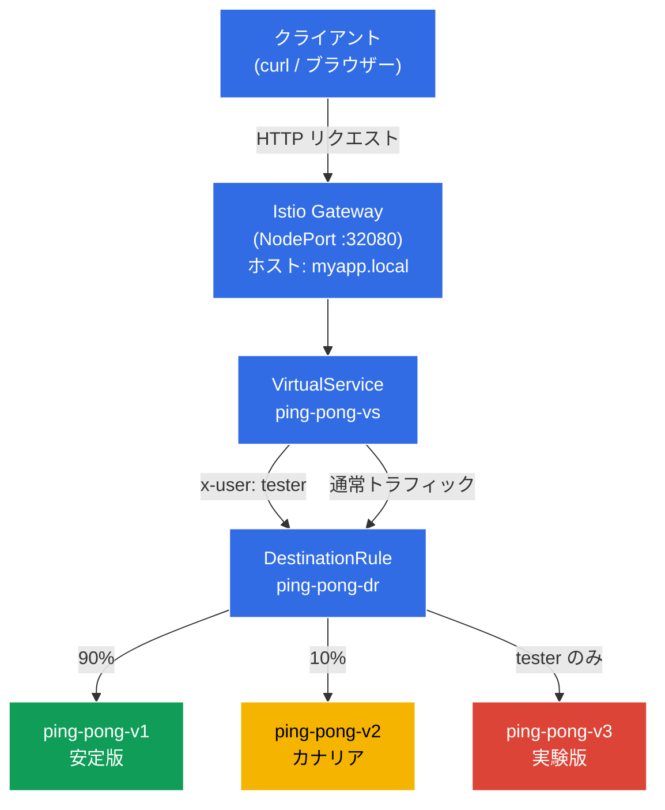

[Русская версия](README_RU.MD) · [Eng version](README.MD) · [Versión en español](README_ES.MD) · [Version française](README_FR.MD) · [Deutsche Version](README_DE.MD) · [ქართული ვერსია](README_GE.MD) · [繁體中文版](README_TW.MD)
# Dark Launch（ダークローンチ）

> [リファレンス解答](worker/files/solutions/1_JP.MD)

開発者は、まったく新しい実験的なアプリケーションのバージョン v3 をリリースしました。これはまだ未成熟であり、一般ユーザーに決して見せてはいけません（一般ユーザーは安定版 v1 を使い続ける必要があります）。ただし、実際の「本番」クラスター上で動作ロジックを確認できるよう、QA エンジニアにはアクセスを許可する必要があります。テスターは、専用の HTTP ヘッダー `x-user: tester` により識別されます。

## 目的

Istio のルール（`DestinationRule` および `VirtualService`）をゼロから設定し、Envoy プロキシがトラフィックをインターセプトして HTTP ヘッダーを読み取り、その内容に基づいてルーティングを実行するようにします。

Gateway が作成されています: http://myapp.local:32080

### 仕組み（全体図）



## インフラストラクチャ

環境は Terragrunt を使用して AWS（`eu-central-1`）にデプロイされ、次のコンポーネントで構成されます。

| コンポーネント | 説明 |
|------------|---------------------------------------------------|
| `vpc`      | パブリックサブネットを持つ VPC `10.10.0.0/16` |
| `ssh-keys` | ノードへのアクセス用 SSH キー |
| `k8s-1`    | Istio がインストールされた Kubernetes `1.35.2`（kubeadm） |
| `worker`   | `kubectl` とクラスターへのアクセスを備えた作業マシン |

インスタンス: `t3.medium`（master）、Ubuntu `22.04`

## デプロイ

```bash
TASK=02 make run_ica_task
```

## ステップ 1. sidecar インジェクションの有効化

Envoy sidecar プロキシを自動注入するため、namespace `default` にラベルを追加します。

```bash
kubectl label namespace default istio-injection=enabled
```

**この操作の内容:** Istio は sidecar パターンに基づいて動作します。namespace にラベル `istio-injection=enabled` が付いている場合、Istio は新しい各 Pod に追加コンテナである `istio-proxy`（Envoy）を自動的に追加します。このプロキシは Pod のすべての受信・送信ネットワークトラフィックをインターセプトし、アプリケーションコードを変更せずに Istio がルーティング、セキュリティ、オブザーバビリティを管理できるようにします。

このため、`READY` 列には `2/2` と表示されます。1 つはアプリケーションコンテナ、もう 1 つは Envoy プロキシです。

## ステップ 2. アプリケーションのインストール

アプリケーションを 3 つのバージョンでインストールします。`ping-pong` という共通の Kubernetes Service が作成されます。

```bash
kubectl apply -f https://raw.githubusercontent.com/ViktorUJ/cks/refs/heads/master/tasks/ica/labs/02/k8s-1/scripts/1.yaml
```

**デプロイされるもの:**
- **Service `ping-pong`** - セレクター `app: ping-pong` を持つ 1 つの共通サービスです。3 つすべてのバージョンの Pod をまとめます。Istio は `DestinationRule` を使用して、それらの間でトラフィックを分割します。
- **Deployment `ping-pong-v1`** - 安定版（ラベル `version: v1`）、環境変数 `SERVER_NAME: "Ping-Pong-V1 (Stable)"`。
- **Deployment `ping-pong-v2`** - カナリア版（ラベル `version: v2`）、`SERVER_NAME: "Ping-Pong-V2 (Canary)"`。
- **Deployment `ping-pong-v3`** - 実験版（ラベル `version: v3`）、`SERVER_NAME: "Ping-Pong-V3 (Experimental)"`。

3 つの Deployment はすべて同じ Docker イメージ `viktoruj/ping_pong:latest` を使用しますが、ラベル `version` と環境変数 `SERVER_NAME` が異なります。ラベル `version` は重要な要素であり、`DestinationRule` はこれに基づいて Pod を subsets にグループ化します。

Envoy プロキシとともに Pod が起動したことを確認します。

```bash
kubectl get pods
```

```
NAME                            READY   STATUS    RESTARTS   AGE
ping-pong-v1-77cfd77f88-jk6wq   2/2     Running   0          29m
ping-pong-v2-685bbbd94f-brptj   2/2     Running   0          29m
ping-pong-v3-8448447987-bn6s8   2/2     Running   0          29m
```

**確認するポイント:** `READY` 列が `2/2` と表示されます。これは各 Pod で 2 つのコンテナ、すなわちアプリケーション本体と sidecar の Envoy プロキシ（`istio-proxy`）が稼働していることを意味します。`1/1` と表示される場合は、インジェクションが機能していません。namespace にラベル `istio-injection=enabled` が設定されていること、およびその後に Pod が再作成されたことを確認してください。

## ステップ 3. DestinationRule の作成

```bash
vim dl-destination-rule.yaml
```

```yaml
apiVersion: networking.istio.io/v1
kind: DestinationRule
metadata:
  name: ping-pong-dr
spec:
  host: ping-pong # 共通の K8s Service を指定
  subsets:
  - name: v1
    labels:
      version: v1 # version=v1 ラベルの付いた Pod を探す
  - name: v2
    labels:
      version: v2
  - name: v3
    labels:
      version: v3
```

```bash
kubectl apply -f dl-destination-rule.yaml
```

**DestinationRule とは何か、なぜ必要か:**

`DestinationRule` は、特定のサービス（`host` フィールド）に向かうトラフィックのポリシーを記述する Istio リソースです。ここでの主な役割は、**subsets**（サブセット）を定義することです。

- **`host: ping-pong`** - Kubernetes Service `ping-pong` への紐付けです。この `DestinationRule` のすべてのルールは、このサービスに向かうトラフィックに適用されます。
- **`subsets`** - 1 つのサービス内にある Pod の論理グループです。各 subset は一連のラベルによって定義されます。たとえば、subset `v1` にはラベル `version: v1` を持つすべての Pod が含まれます。

`DestinationRule` がないと、Istio は 1 つのサービスの Pod をグループに分割する方法を認識できません。`VirtualService` はルーティング時にこれらの subsets を参照します。たとえば、「トラフィックの 90% を subset v1 に送る」という指定です。

## ステップ 4. ルーティングルールを持つ VirtualService の作成

```bash
vim vs-virtual-service.yaml
```

```yaml
apiVersion: networking.istio.io/v1
kind: VirtualService
metadata:
  name: ping-pong-vs
spec:
  hosts:
  - "ping-pong"       # 1. クラスタ内トラフィック用 (mesh)
  - "myapp.local"     # 2. 外部トラフィック用 (gateway)
  gateways:
  - ping-pong-gateway # myapp.local に対して動作
  - mesh              # ping-pong に対して動作
  http:
  # ルール №1: x-user: tester ヘッダーが存在する場合のみ発動
  - match:
    - headers:
        x-user:
          exact: tester
    route:
    - destination:
        host: ping-pong
        subset: v3

  # ルール №2: 残りすべてに対するデフォルトルール (カナリア 90/10)
  - route:
    - destination:
        host: ping-pong
        subset: v1
      weight: 90
    - destination:
        host: ping-pong
        subset: v2
      weight: 10
```

```bash
kubectl apply -f vs-virtual-service.yaml
```

**VirtualService の各部分の解説:**

`VirtualService` は Istio の中心的なルーティングリソースです。トラフィックを subsets 間でどのように配分するかを定義します。

- **`hosts`** - ルールを適用するホストのリストです。
  - `"ping-pong"` - Kubernetes Service の名前です。ルールはクラスター内部トラフィック（ある Pod が `http://ping-pong:8080` を介して別の Pod にアクセスする場合）に適用されます。
  - `"myapp.local"` - 外部ホストです。ルールは Gateway 経由で到着するトラフィックに適用されます。

- **`gateways`** - トラフィックの到着元を定義します。
  - `ping-pong-gateway` - Istio Ingress Gateway を経由する、クラスター外部からのトラフィックです。
  - `mesh` - Istio の特別な予約語です。すべてのクラスター内部トラフィック（Pod 間）を意味します。`mesh` を指定しない場合、ルールは Gateway 経由の外部トラフィックに対してのみ機能します。

- **`http` ルール** - 上から下へ処理され、最初に一致したものが適用されます。
  - **ルール #1（Dark Launch）:** HTTP リクエストに値 `tester` の `x-user` ヘッダーがある場合、すべてのトラフィックは subset `v3`（実験版）に送られます。これが「ダークローンチ」です。一般ユーザーは v3 の存在を知らず、テスターは本番クラスター上でこれを検証できます。
  - **ルール #2（Canary / カナリアデプロイ）:** それ以外のすべてのリクエスト（`x-user: tester` ヘッダーなし）は、`v1`（安定版）に 90%、`v2`（カナリア版）に 10% 配分されます。これにより、実トラフィックのごく一部で v2 を段階的に検証できます。

## ステップ 5. 外部アクセス用 Gateway の作成

```bash
vim gateway.yaml
```

```yaml
apiVersion: networking.istio.io/v1
kind: Gateway
metadata:
  name: ping-pong-gateway
spec:
  selector:
    istio: ingressgateway # これらの設定を Ingress ゲートウェイに適用するよう指示
  servers:
  - port:
      number: 80
      name: http
      protocol: HTTP
    hosts:
    - "myapp.local" # myapp.local へのリクエストを受け付ける。全ホストが必要なら hosts: ["*"]
```

**Gateway とは:**

`Gateway` は、クラスター外部からの受信トラフィックを受け入れるために、mesh ネットワークの境界にある Envoy プロキシ（Istio Ingress Gateway）を設定する Istio リソースです。

- **`selector: istio: ingressgateway`** - この設定を適用する Envoy Pod を指定します。クラスターでは、外部トラフィックのエントリーポイントである Pod `istio-ingressgateway`（namespace `istio-system`）が稼働しています。Selector はラベルによってこれを選択します。
- **`servers`** - リッスンするポートとプロトコル、およびリクエストを受け入れるホストを記述します。
  - `port: 80, protocol: HTTP` - HTTP トラフィックを受け入れます。
  - `hosts: ["myapp.local"]` - Gateway は、`Host: myapp.local` ヘッダーを持つリクエストのみを処理します。他のホストへのリクエストは拒否されます。すべてを受け入れる必要がある場合は、`hosts: ["*"]` を使用してください。

このラボでは、Istio Ingress Gateway はポート `32080` の `NodePort` として設定されているため、外部からは `http://myapp.local:32080` を介してアクセスします。

## ステップ 6. テスト

### カナリアデプロイの確認（一般ユーザー）

```bash
for i in {1..10}; do curl -s http://myapp.local:32080 | grep 'Server Name:' ; done
```

```
Server Name: Ping-Pong-V1 (Stable)
Server Name: Ping-Pong-V1 (Stable)
Server Name: Ping-Pong-V2 (Canary)  #  トラフィックの 10% が v2 に流れる
Server Name: Ping-Pong-V1 (Stable)
Server Name: Ping-Pong-V1 (Stable)
Server Name: Ping-Pong-V1 (Stable)
Server Name: Ping-Pong-V1 (Stable)
Server Name: Ping-Pong-V2 (Canary)
Server Name: Ping-Pong-V1 (Stable)
Server Name: Ping-Pong-V1 (Stable)
```

**確認できること:** 特別なヘッダーがない場合、VirtualService のルール #2 が適用されます。およそ 90% のリクエストは v1（Stable）に、10% は v2（Canary）に到達します。v3 は一度も表示されません。一般ユーザーから完全に隠されています。

### ダークローンチの確認（テスター）

ここで `x-user: tester` ヘッダーを追加し、常に v3 に到達することを確認します。

```bash
curl -s -H "x-user: tester" http://myapp.local:32080/ | grep 'Server Name:'
```

```
Server Name: Ping-Pong-V3 (Experimental)
```

**確認できること:** `x-user: tester` ヘッダーを付けると、ルール #1 が適用され、トラフィックの 100% が v3（Experimental）に送られます。これが Dark Launch です。テスターは本番クラスター上で実験版を扱え、一般ユーザーはその存在すら知りません。