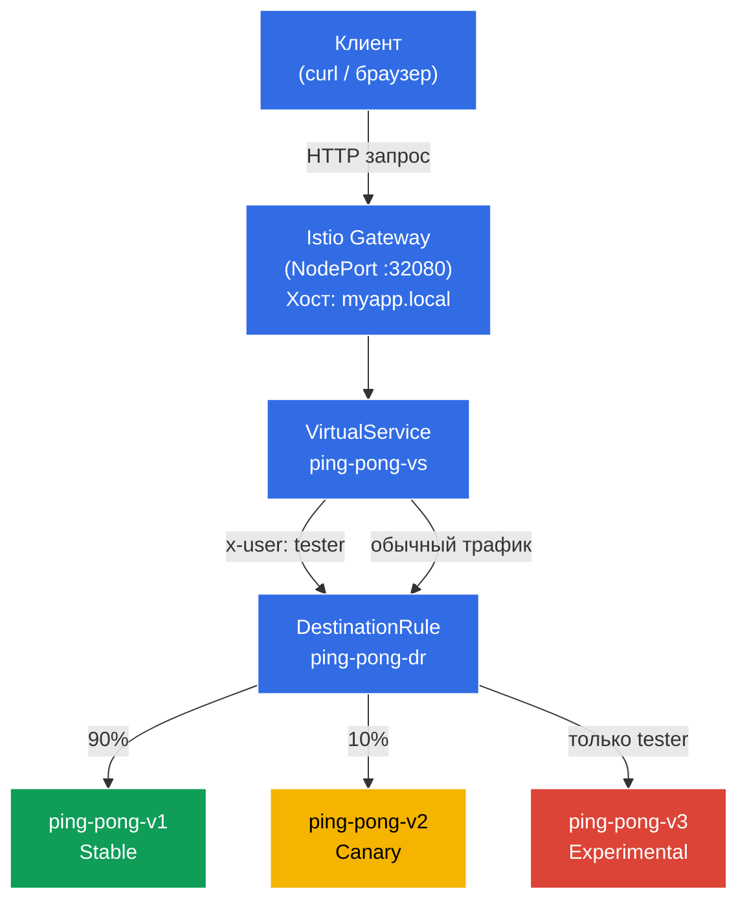

[Eng version](README.MD)
# Dark Launch (Теневой запуск)

Разработчики выкатили абсолютно новую, экспериментальную версию приложения — v3. Она еще сырая, и обычные пользователи ни в коем случае не должны ее увидеть (они должны оставаться на стабильной v1). Однако вам нужно пустить туда QA-инженеров, чтобы они проверили логику работы на реальном "боевом" кластере. Тестировщики будут идентифицироваться с помощью специального HTTP-заголовка: `x-user: tester`.

## Цель

С нуля настроить правила Istio (`DestinationRule` и `VirtualService`) таким образом, чтобы Envoy-прокси перехватывал трафик, читал HTTP-заголовки и выполнял маршрутизацию на основе их содержимого.

Создан Gateway: http://myapp.local:32080

### Как это работает (общая схема)



## Шаг 1. Включение sidecar-инъекции

Добавляем label на namespace `default` для автоматической инъекции sidecar-прокси Envoy:

```bash
kubectl label namespace default istio-injection=enabled
```

**Что это делает:** Istio работает по принципу sidecar-паттерна. Когда на namespace стоит лейбл `istio-injection=enabled`, Istio автоматически добавляет в каждый новый под дополнительный контейнер — `istio-proxy` (Envoy). Этот прокси перехватывает весь входящий и исходящий сетевой трафик пода, что позволяет Istio управлять маршрутизацией, безопасностью и наблюдаемостью без изменения кода приложения.

Именно поэтому в колонке `READY` мы увидим `2/2` — один контейнер с приложением и один с Envoy-прокси.

## Шаг 2. Установка приложения

Устанавливаем приложение в 3 версиях. Создан общий Kubernetes Service с именем `ping-pong`.

```bash
kubectl apply -f https://raw.githubusercontent.com/ViktorUJ/cks/refs/heads/master/tasks/ica/labs/02/k8s-1/scripts/1.yaml
```

**Что разворачивается:**
- **Service `ping-pong`** — один общий сервис с селектором `app: ping-pong`. Он объединяет все три версии подов. Istio будет использовать `DestinationRule` для разделения трафика между ними.
- **Deployment `ping-pong-v1`** — стабильная версия (лейбл `version: v1`), переменная окружения `SERVER_NAME: "Ping-Pong-V1 (Stable)"`.
- **Deployment `ping-pong-v2`** — канареечная версия (лейбл `version: v2`), `SERVER_NAME: "Ping-Pong-V2 (Canary)"`.
- **Deployment `ping-pong-v3`** — экспериментальная версия (лейбл `version: v3`), `SERVER_NAME: "Ping-Pong-V3 (Experimental)"`.

Все три Deployment используют один и тот же Docker-образ `viktoruj/ping_pong:latest`, но отличаются лейблом `version` и переменной окружения `SERVER_NAME`. Лейбл `version` — это ключевой элемент: именно по нему `DestinationRule` будет группировать поды в subsets.

Проверяем что поды поднялись с Envoy-прокси:

```bash
kubectl get pods
```

```
NAME                            READY   STATUS    RESTARTS   AGE
ping-pong-v1-77cfd77f88-jk6wq   2/2     Running   0          29m
ping-pong-v2-685bbbd94f-brptj   2/2     Running   0          29m
ping-pong-v3-8448447987-bn6s8   2/2     Running   0          29m
```

**На что обратить внимание:** колонка `READY` показывает `2/2`. Это значит, что в каждом поде работают 2 контейнера: само приложение и sidecar-прокси Envoy (`istio-proxy`). Если вы видите `1/1`, значит инъекция не сработала — проверьте, что лейбл `istio-injection=enabled` установлен на namespace и поды были пересозданы после этого.

## Шаг 3. Создание DestinationRule

```bash
vim dl-destination-rule.yaml
```

```yaml
apiVersion: networking.istio.io/v1
kind: DestinationRule
metadata:
  name: ping-pong-dr
spec:
  host: ping-pong # Указываем на общий K8s Service
  subsets:
  - name: v1
    labels:
      version: v1 # Ищет поды с лейблом version=v1
  - name: v2
    labels:
      version: v2
  - name: v3
    labels:
      version: v3
```

```bash
kubectl apply -f dl-destination-rule.yaml
```

**Что такое DestinationRule и зачем он нужен:**

`DestinationRule` — это ресурс Istio, который описывает политики для трафика, направленного к конкретному сервису (в поле `host`). Его главная задача здесь — определить **subsets** (подмножества).

- **`host: ping-pong`** — привязка к Kubernetes Service `ping-pong`. Все правила этого `DestinationRule` будут применяться к трафику, идущему на этот сервис.
- **`subsets`** — логические группы подов внутри одного сервиса. Каждый subset определяется набором лейблов. Например, subset `v1` включает все поды с лейблом `version: v1`.

Без `DestinationRule` Istio не знает, как разделить поды одного сервиса на группы. `VirtualService` ссылается на эти subsets при маршрутизации — например, "отправь 90% трафика на subset v1".

## Шаг 4. Создание VirtualService с правилами маршрутизации

```bash
vim vs-virtual-service.yaml
```

```yaml
apiVersion: networking.istio.io/v1
kind: VirtualService
metadata:
  name: ping-pong-vs
spec:
  hosts:
  - "ping-pong"       # 1. Для внутрикластерного трафика (mesh)
  - "myapp.local"     # 2. Для внешнего трафика (gateway)
  gateways:
  - ping-pong-gateway # Работает для myapp.local
  - mesh              # Работает для ping-pong
  http:
  # ПРАВИЛО №1: Срабатывает ТОЛЬКО если есть заголовок x-user: tester
  - match:
    - headers:
        x-user:
          exact: tester
    route:
    - destination:
        host: ping-pong
        subset: v3

  # ПРАВИЛО №2: Дефолтное правило для всех остальных (Канарейка 90/10)
  - route:
    - destination:
        host: ping-pong
        subset: v1
      weight: 90
    - destination:
        host: ping-pong
        subset: v2
      weight: 10
```

```bash
kubectl apply -f vs-virtual-service.yaml
```

**Разбор VirtualService по частям:**

`VirtualService` — это центральный ресурс маршрутизации в Istio. Он определяет, как именно трафик будет распределяться между subsets.

- **`hosts`** — список хостов, для которых применяются правила:
  - `"ping-pong"` — имя Kubernetes Service. Правила будут применяться к внутрикластерному трафику (когда один под обращается к другому через `http://ping-pong:8080`).
  - `"myapp.local"` — внешний хост. Правила будут применяться к трафику, приходящему через Gateway.

- **`gateways`** — определяет, откуда приходит трафик:
  - `ping-pong-gateway` — трафик извне кластера, через Istio Ingress Gateway.
  - `mesh` — специальное зарезервированное слово в Istio. Означает весь внутрикластерный трафик (pod-to-pod). Если не указать `mesh`, правила будут работать только для внешнего трафика через Gateway.

- **Правила `http`** — обрабатываются сверху вниз, срабатывает первое подходящее:
  - **Правило №1 (Dark Launch):** Если в HTTP-запросе есть заголовок `x-user` со значением `tester` — весь трафик уходит на subset `v3` (экспериментальная версия). Это и есть "теневой запуск" — обычные пользователи не знают о v3, а тестировщики могут проверять её на боевом кластере.
  - **Правило №2 (Canary / Канареечный деплой):** Все остальные запросы (без заголовка `x-user: tester`) распределяются: 90% на `v1` (стабильная) и 10% на `v2` (канареечная). Это позволяет постепенно проверять v2 на небольшой доле реального трафика.

## Шаг 5. Создание Gateway для доступа извне

```bash
vim gateway.yaml
```

```yaml
apiVersion: networking.istio.io/v1
kind: Gateway
metadata:
  name: ping-pong-gateway
spec:
  selector:
    istio: ingressgateway # Говорим применить эти настройки к нашему Ingress-шлюзу
  servers:
  - port:
      number: 80
      name: http
      protocol: HTTP
    hosts:
    - "myapp.local" # Принимаем запросы на myapp.local, если нужно на все хосты, то hosts: ["*"]
```

**Что такое Gateway:**

`Gateway` — это ресурс Istio, который настраивает Envoy-прокси на границе mesh-сети (Istio Ingress Gateway) для приёма входящего трафика извне кластера.

- **`selector: istio: ingressgateway`** — указывает, к какому поду Envoy применить эту конфигурацию. В кластере работает под `istio-ingressgateway` (в namespace `istio-system`) — это и есть входная точка для внешнего трафика. Selector выбирает его по лейблу.
- **`servers`** — описывает, на каком порту и протоколе слушать, и для каких хостов принимать запросы:
  - `port: 80, protocol: HTTP` — принимаем HTTP-трафик.
  - `hosts: ["myapp.local"]` — Gateway будет обрабатывать только запросы с заголовком `Host: myapp.local`. Запросы на другие хосты будут отклонены. Если нужно принимать все — используйте `hosts: ["*"]`.

В нашей лабораторной Istio Ingress Gateway настроен как `NodePort` на порту `32080`, поэтому доступ извне идёт через `http://myapp.local:32080`.

## Шаг 6. Тестирование

### Проверка канареечного деплоя (обычные пользователи)

```bash
for i in {1..10}; do curl -s http://myapp.local:32080 | grep 'Server Name:' ; done
```

```
Server Name: Ping-Pong-V1 (Stable)
Server Name: Ping-Pong-V1 (Stable)
Server Name: Ping-Pong-V2 (Canary)  #  10% трафика идет на v2
Server Name: Ping-Pong-V1 (Stable)
Server Name: Ping-Pong-V1 (Stable)
Server Name: Ping-Pong-V1 (Stable)
Server Name: Ping-Pong-V1 (Stable)
Server Name: Ping-Pong-V2 (Canary)
Server Name: Ping-Pong-V1 (Stable)
Server Name: Ping-Pong-V1 (Stable)
```

**Что мы видим:** Без специальных заголовков срабатывает Правило №2 из VirtualService. Примерно 90% запросов попадают на v1 (Stable), а 10% — на v2 (Canary). Версия v3 не появляется ни разу — она полностью скрыта от обычных пользователей.

### Проверка теневого запуска (тестировщики)

Теперь добавим заголовок `x-user: tester` и проверим, что мы всегда попадаем на v3:

```bash
curl -s -H "x-user: tester" http://myapp.local:32080/ | grep 'Server Name:'
```

```
Server Name: Ping-Pong-V3 (Experimental)
```

**Что мы видим:** С заголовком `x-user: tester` срабатывает Правило №1 — 100% трафика уходит на v3 (Experimental). Это и есть Dark Launch: тестировщики работают с экспериментальной версией на боевом кластере, а обычные пользователи даже не подозревают о её существовании.
