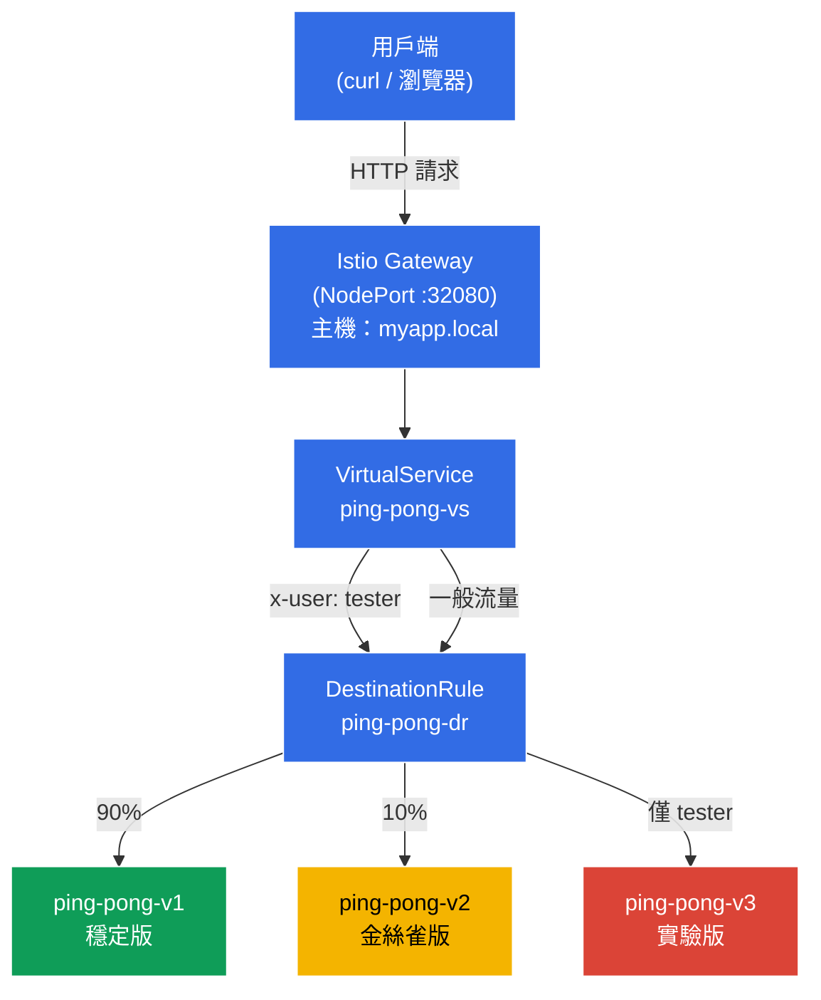

[Русская версия](README_RU.MD) · [Eng version](README.MD) · [Versión en español](README_ES.MD) · [Version française](README_FR.MD) · [Deutsche Version](README_DE.MD) · [ქართული ვერსია](README_GE.MD) · [日本語版](README_JP.MD)
# Dark Launch（暗中啟動）

> [參考解答](worker/files/solutions/1_TW.MD)

開發人員已推出全新、實驗性的應用程式版本 v3。它尚未成熟，絕對不能讓一般使用者看到（他們應繼續使用穩定的 v1）。不過，您需要讓 QA 工程師能夠存取它，以便他們在實際的「正式」叢集上驗證運作邏輯。測試人員將透過特殊 HTTP 標頭識別：`x-user: tester`。

## 目標

從零開始設定 Istio 規則（`DestinationRule` 與 `VirtualService`），讓 Envoy 代理程式攔截流量、讀取 HTTP 標頭，並依其內容執行路由。

已建立 Gateway：http://myapp.local:32080

### 運作方式（整體架構）



## 基礎設施

環境會透過 Terragrunt 在 AWS（`eu-central-1`）中部署，包含：

| 元件  | 說明                                          |
|------------|---------------------------------------------------|
| `vpc`      | 具公有子網路的 VPC `10.10.0.0/16`          |
| `ssh-keys` | 用於存取節點的 SSH 金鑰                      |
| `k8s-1`    | 已安裝 Istio 的 Kubernetes `1.35.2`（kubeadm） |
| `worker`   | 具備 `kubectl` 和叢集存取權的工作機器   |

執行個體：`t3.medium`（master）Ubuntu `22.04`

## 部署

```bash
TASK=02 make run_ica_task
```

## 步驟 1. 啟用 sidecar 注入

為 namespace `default` 加上 label，以自動注入 Envoy sidecar 代理程式：

```bash
kubectl label namespace default istio-injection=enabled
```

**這會執行什麼：** Istio 依循 sidecar 模式運作。當 namespace 具有 `istio-injection=enabled` label 時，Istio 會自動為每個新 pod 新增額外的容器──`istio-proxy`（Envoy）。此代理程式會攔截 pod 的所有入站和出站網路流量，使 Istio 無需修改應用程式碼，即可管理路由、安全性和可觀測性。

這也是為什麼我們會在 `READY` 欄位看到 `2/2`──一個應用程式容器和一個 Envoy 代理程式容器。

## 步驟 2. 安裝應用程式

以 3 個版本安裝應用程式。已建立名為 `ping-pong` 的共用 Kubernetes Service。

```bash
kubectl apply -f https://raw.githubusercontent.com/ViktorUJ/cks/refs/heads/master/tasks/ica/labs/02/k8s-1/scripts/1.yaml
```

**部署的項目：**
- **Service `ping-pong`** ── 一個使用選取器 `app: ping-pong` 的共用服務。它會將三個版本的所有 pod 集合在一起。Istio 將使用 `DestinationRule` 在它們之間分配流量。
- **Deployment `ping-pong-v1`** ── 穩定版（label `version: v1`），環境變數 `SERVER_NAME: "Ping-Pong-V1 (Stable)"`。
- **Deployment `ping-pong-v2`** ── 金絲雀版本（label `version: v2`），`SERVER_NAME: "Ping-Pong-V2 (Canary)"`。
- **Deployment `ping-pong-v3`** ── 實驗版（label `version: v3`），`SERVER_NAME: "Ping-Pong-V3 (Experimental)"`。

三個 Deployment 都使用相同的 Docker 映像 `viktoruj/ping_pong:latest`，但 `version` label 和 `SERVER_NAME` 環境變數不同。`version` label 是關鍵元素：`DestinationRule` 正是依此將 pod 分組為 subsets。

確認 pod 已連同 Envoy 代理程式啟動：

```bash
kubectl get pods
```

```
NAME                            READY   STATUS    RESTARTS   AGE
ping-pong-v1-77cfd77f88-jk6wq   2/2     Running   0          29m
ping-pong-v2-685bbbd94f-brptj   2/2     Running   0          29m
ping-pong-v3-8448447987-bn6s8   2/2     Running   0          29m
```

**請注意：** `READY` 欄位顯示 `2/2`。這表示每個 pod 中都有 2 個容器在執行：應用程式本身和 Envoy sidecar 代理程式（`istio-proxy`）。若您看到 `1/1`，代表注入未成功──請確認 namespace 已設定 `istio-injection=enabled` label，且 pod 在此之後已重新建立。

## 步驟 3. 建立 DestinationRule

```bash
vim dl-destination-rule.yaml
```

```yaml
apiVersion: networking.istio.io/v1
kind: DestinationRule
metadata:
  name: ping-pong-dr
spec:
  host: ping-pong # 指向共用的 K8s Service
  subsets:
  - name: v1
    labels:
      version: v1 # 尋找帶有標籤 version=v1 的 Pod
  - name: v2
    labels:
      version: v2
  - name: v3
    labels:
      version: v3
```

```bash
kubectl apply -f dl-destination-rule.yaml
```

**DestinationRule 是什麼，以及為何需要它：**

`DestinationRule` 是描述導向特定服務（位於 `host` 欄位）的流量政策的 Istio 資源。它在此的主要作用是定義 **subsets**（子集）。

- **`host: ping-pong`** ── 綁定 Kubernetes Service `ping-pong`。此 `DestinationRule` 的所有規則都會套用至流向該服務的流量。
- **`subsets`** ── 一個服務內 pod 的邏輯群組。每個 subset 由一組 label 定義。例如，subset `v1` 包含所有具有 `version: v1` label 的 pod。

如果沒有 `DestinationRule`，Istio 不知道如何把同一服務的 pod 劃分為群組。`VirtualService` 會在路由時參照這些 subsets──例如，「將 90% 的流量傳送到 subset v1」。

## 步驟 4. 建立具有路由規則的 VirtualService

```bash
vim vs-virtual-service.yaml
```

```yaml
apiVersion: networking.istio.io/v1
kind: VirtualService
metadata:
  name: ping-pong-vs
spec:
  hosts:
  - "ping-pong"       # 1. 用於叢集內部流量 (mesh)
  - "myapp.local"     # 2. 用於外部流量 (gateway)
  gateways:
  - ping-pong-gateway # 適用於 myapp.local
  - mesh              # 適用於 ping-pong
  http:
  # 規則 №1：僅當存在標頭 x-user: tester 時才觸發
  - match:
    - headers:
        x-user:
          exact: tester
    route:
    - destination:
        host: ping-pong
        subset: v3

  # 規則 №2：適用於其餘所有請求的預設規則 (金絲雀 90/10)
  - route:
    - destination:
        host: ping-pong
        subset: v1
      weight: 90
    - destination:
        host: ping-pong
        subset: v2
      weight: 10
```

```bash
kubectl apply -f vs-virtual-service.yaml
```

**VirtualService 分段說明：**

`VirtualService` 是 Istio 的核心路由資源。它定義流量將如何在 subsets 之間分配。

- **`hosts`** ── 規則套用的主機清單：
  - `"ping-pong"` ── Kubernetes Service 的名稱。規則將套用至叢集內流量（當一個 pod 透過 `http://ping-pong:8080` 存取另一個 pod 時）。
  - `"myapp.local"` ── 外部主機。規則將套用至經由 Gateway 傳入的流量。

- **`gateways`** ── 決定流量來源：
  - `ping-pong-gateway` ── 從叢集外部經由 Istio Ingress Gateway 傳入的流量。
  - `mesh` ── Istio 中特別保留的字詞。它表示所有叢集內流量（pod-to-pod）。若未指定 `mesh`，規則只會對經由 Gateway 的外部流量生效。

- **`http` 規則** ── 由上而下處理，第一個符合的規則會生效：
  - **規則 №1（Dark Launch）：** 若 HTTP 請求含有值為 `tester` 的 `x-user` 標頭，所有流量都會傳送至 subset `v3`（實驗版）。這就是「暗中啟動」──一般使用者不知道 v3 的存在，而測試人員可在正式叢集上測試它。
  - **規則 №2（Canary／金絲雀部署）：** 其他所有請求（沒有 `x-user: tester` 標頭）會按以下比例分配：90% 至 `v1`（穩定版），10% 至 `v2`（金絲雀版）。這使得您能在一小部分的實際流量中逐步驗證 v2。

## 步驟 5. 建立供外部存取的 Gateway

```bash
vim gateway.yaml
```

```yaml
apiVersion: networking.istio.io/v1
kind: Gateway
metadata:
  name: ping-pong-gateway
spec:
  selector:
    istio: ingressgateway # 指定將這些設定套用到我們的 Ingress 閘道
  servers:
  - port:
      number: 80
      name: http
      protocol: HTTP
    hosts:
    - "myapp.local" # 接受發往 myapp.local 的請求，若需接受所有主機則 hosts: ["*"]
```

**Gateway 是什麼：**

`Gateway` 是 Istio 資源，用於設定 mesh 網路邊界上的 Envoy 代理程式（Istio Ingress Gateway），以接收來自叢集外部的入站流量。

- **`selector: istio: ingressgateway`** ── 指定要將此設定套用至哪個 Envoy pod。叢集中有一個 `istio-ingressgateway` pod（位於 `istio-system` namespace）──它就是外部流量的進入點。Selector 依 label 選取它。
- **`servers`** ── 描述要在哪個連接埠、使用何種協定監聽，以及接受哪些主機的請求：
  - `port: 80, protocol: HTTP` ── 接受 HTTP 流量。
  - `hosts: ["myapp.local"]` ── Gateway 僅處理帶有 `Host: myapp.local` 標頭的請求。其他主機的請求會被拒絕。若需接受所有主機，請使用 `hosts: ["*"]`。

在本實驗中，Istio Ingress Gateway 設定為使用連接埠 `32080` 的 `NodePort`，因此外部存取會經由 `http://myapp.local:32080`。

## 步驟 6. 測試

### 驗證金絲雀部署（一般使用者）

```bash
for i in {1..10}; do curl -s http://myapp.local:32080 | grep 'Server Name:' ; done
```

```
Server Name: Ping-Pong-V1 (Stable)
Server Name: Ping-Pong-V1 (Stable)
Server Name: Ping-Pong-V2 (Canary)  #  10% 的流量導向 v2
Server Name: Ping-Pong-V1 (Stable)
Server Name: Ping-Pong-V1 (Stable)
Server Name: Ping-Pong-V1 (Stable)
Server Name: Ping-Pong-V1 (Stable)
Server Name: Ping-Pong-V2 (Canary)
Server Name: Ping-Pong-V1 (Stable)
Server Name: Ping-Pong-V1 (Stable)
```

**我們看到什麼：** 沒有特殊標頭時，VirtualService 的規則 №2 會生效。約 90% 的請求會到 v1（Stable），10% 會到 v2（Canary）。v3 從不會出現──它對一般使用者完全隱藏。

### 驗證暗中啟動（測試人員）

現在加入 `x-user: tester` 標頭，並確認我們總是會到 v3：

```bash
curl -s -H "x-user: tester" http://myapp.local:32080/ | grep 'Server Name:'
```

```
Server Name: Ping-Pong-V3 (Experimental)
```

**我們看到什麼：** 帶有 `x-user: tester` 標頭時，規則 №1 會生效──100% 的流量會傳送到 v3（Experimental）。這就是 Dark Launch：測試人員可在正式叢集上使用實驗版，而一般使用者甚至不知道它的存在。