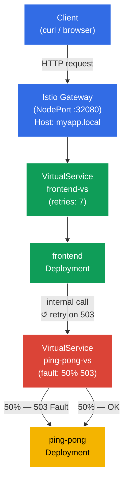

[RU version](README_RU.MD)

# Lab 03 — Fault Injection and Retry

Imagine your backend service is unstable — it occasionally returns HTTP 503. Instead of touching application code, you want to solve this at the infrastructure level. In this lab we first **break** the backend using Istio Fault Injection, confirm that the frontend receives errors, and then **fix** it by configuring automatic retries at the Envoy proxy layer — without a single line of code change.

## Objective

Understand two key Istio mechanisms for dealing with unreliable services:
- **Fault Injection** — deliberately introducing errors to test system resilience.
- **Retries** — automatic retry attempts at the proxy level, transparent to the application.

A Gateway has been created at: http://myapp.local:32080

### How It Works (High-Level Overview)



## Step 1. Enable Sidecar Injection

Label the `default` namespace so that Istio automatically injects the Envoy sidecar proxy into every new pod:

```bash
kubectl label namespace default istio-injection=enabled
```

**What this does:** Istio uses the sidecar pattern. When a namespace carries the `istio-injection=enabled` label, Istio's admission webhook automatically adds an extra container — `istio-proxy` (Envoy) — to every pod created in that namespace. This proxy intercepts all inbound and outbound network traffic for the pod, allowing Istio to manage routing, security, and observability without any changes to your application code.

## Step 2. Deploy the Application

Deploy two services: `frontend` (the entry point) and `ping-pong` (the backend). On every incoming request, frontend calls `http://ping-pong:8080/` and returns the result to the client.

```bash
kubectl apply -f https://raw.githubusercontent.com/ViktorUJ/cks/refs/heads/master/tasks/ica/labs/03/k8s-1/scripts/1.yaml
```

**What gets deployed:**
- **Service `ping-pong`** + **Deployment `ping-pong`** — the backend service, responds to HTTP requests.
- **Service `frontend`** + **Deployment `frontend`** — the frontend; on each incoming request it calls `http://ping-pong:8080/` and returns the result to the client.

Verify that the pods are up and running with the Envoy sidecar:

```bash
kubectl get pods
```

```
NAME                            READY   STATUS    RESTARTS   AGE
frontend-6d4b8c9f7d-xk2pq       2/2     Running   0          30s
ping-pong-77cfd77f88-jk6wq      2/2     Running   0          30s
```

**What to look for:** the `READY` column shows `2/2`. This means each pod is running two containers: the application itself and the Envoy sidecar (`istio-proxy`). If you see `1/1`, injection didn't work — check that the `istio-injection=enabled` label is set on the namespace.

## Step 3. Create the Gateway and Frontend VirtualService

Create the entry point: the Gateway accepts external traffic for `myapp.local`, the VirtualService routes it to the frontend.

```bash
vim gateway.yaml
```

```yaml
apiVersion: networking.istio.io/v1
kind: Gateway
metadata:
  name: main-gateway
spec:
  selector:
    istio: ingressgateway
  servers:
  - port:
      number: 80
      name: http
      protocol: HTTP
    hosts:
    - "myapp.local"
```

```bash
vim frontend-vs.yaml
```

```yaml
apiVersion: networking.istio.io/v1
kind: VirtualService
metadata:
  name: frontend-vs
spec:
  hosts:
  - "myapp.local"
  gateways:
  - main-gateway
  http:
  - route:
    - destination:
        host: frontend
        port:
          number: 8080
```

```bash
kubectl apply -f gateway.yaml
kubectl apply -f frontend-vs.yaml
```

**Breakdown:**
- `Gateway` configures the mesh-edge Envoy to accept HTTP traffic for the host `myapp.local` on port 80.
- `VirtualService` with `gateways: [main-gateway]` intercepts that traffic and routes it to the Kubernetes Service `frontend`. A rule without a `match` block is the default route — it fires for every request.

Verify everything works:

```bash
for i in {1..5}; do curl -s http://myapp.local:32080 | grep 'Backend Status'; done
```

```
Backend Status   : 200
Backend Status   : 200
Backend Status   : 200
Backend Status   : 200
Backend Status   : 200
```

All stable — 100% successful responses.

## Step 4. Fault Injection — Break the Backend

Now simulate an unstable backend: configure Istio to abort exactly 50% of requests to `ping-pong` with HTTP 503.

```bash
vim ping-pong-vs-fault.yaml
```

```yaml
apiVersion: networking.istio.io/v1
kind: VirtualService
metadata:
  name: ping-pong-vs
spec:
  hosts:
  - "ping-pong"   # Applies to in-cluster traffic targeting this service
  gateways:
  - mesh          # mesh = all pod-to-pod traffic inside the cluster
  http:
  - fault:
      abort:
        httpStatus: 503
        percentage:
          value: 50.0   # Break exactly half of all requests
    route:
    - destination:
        host: ping-pong
        # Note: no subsets — traffic goes straight to the service.
```

```bash
kubectl apply -f ping-pong-vs-fault.yaml
```

**What happens under the hood:**

When frontend calls `http://ping-pong:8080/`, the request is intercepted by the Envoy sidecar inside the frontend pod (outbound traffic). Envoy looks up the VirtualService for the host `ping-pong` and sees the `fault.abort` rule. For 50% of requests, Envoy **immediately returns HTTP 503 itself** — the request never reaches the ping-pong pod at all. This is the key property of Fault Injection: the error is generated at the proxy layer, not by the real service.

Verify the result:

```bash
for i in {1..10}; do curl -s http://myapp.local:32080 | grep 'Backend Status'; done | tee /dev/stderr | awk '{print $NF}' | sort | uniq -c | sort -rn
```

```
Backend Status   : 200
Backend Status   : 503
Backend Status   : 200
Backend Status   : 503
Backend Status   : 503
Backend Status   : 200
Backend Status   : 503
Backend Status   : 200
Backend Status   : 200
Backend Status   : 503
      5 200
      5 503
```

Roughly half of the requests return an error. The frontend receives 503 from the backend and passes it straight to the client — the application has no built-in resilience.

## Step 5. Retries — Fix It Without Changing Code

Now add automatic retries. Retries must be configured on the **calling** side — that is, in the VirtualService for `frontend`. It's the Envoy sidecar inside the frontend pod that makes the outbound call to ping-pong, so it's the one that should retry on failure.

Adding retries to the ping-pong VirtualService would be wrong: the fault injection lives there, and Envoy would just be retrying the error it generated itself — a pointless loop.

Update `frontend-vs`, adding a `retries` block:

```bash
vim frontend-vs-retry.yaml
```

```yaml
apiVersion: networking.istio.io/v1
kind: VirtualService
metadata:
  name: frontend-vs
spec:
  hosts:
  - "myapp.local"
  gateways:
  - main-gateway
  http:
  - retries:
      attempts: 7             # Up to 7 retry attempts
      perTryTimeout: 2s       # Timeout per individual attempt
      retryOn: 5xx            # Retry on any 5xx response from the backend
    route:
    - destination:
        host: frontend
        port:
          number: 8080
```

```bash
kubectl apply -f frontend-vs-retry.yaml
```

**Breaking down the `retries` block:**

- **`attempts: 7`** — the frontend's Envoy proxy will make up to 7 retry calls to ping-pong after the first failure. That's a maximum of 8 total attempts (1 original + 7 retries).
- **`perTryTimeout: 2s`** — each individual attempt is capped at 2 seconds. Without this, a slow service could consume all available time on a single attempt.
- **`retryOn: 5xx`** — the condition that triggers a retry. `5xx` means any HTTP response with a status code in the 500–599 range. You can also specify `gateway-error`, `connect-failure`, `retriable-4xx`, and others as a comma-separated list.

**How it works:** the client sends a request → Ingress Gateway → frontend pod. The frontend's Envoy proxy forwards the call to ping-pong. If ping-pong returns 503, Envoy retries the call to ping-pong (up to 7 times), and only if all attempts fail does it return an error to the client. The frontend application code has no knowledge of retries.

**Reliability math:** With a 50% failure rate and 7 retries, the probability that all 8 attempts fail = 0.5⁸ = 0.39%. The system now succeeds ~99.6% of the time instead of 50%.

Verify the result:

```bash
for i in {1..10}; do curl -s http://myapp.local:32080 | grep 'Backend Status'; done | tee /dev/stderr | awk '{print $NF}' | sort | uniq -c | sort -rn
```

```
Backend Status   : 200
Backend Status   : 200
Backend Status   : 200
Backend Status   : 200
Backend Status   : 200
Backend Status   : 200
Backend Status   : 200
Backend Status   : 200
Backend Status   : 200
Backend Status   : 200
     10 200
```

All 10 requests succeed. Fault Injection is still active — the backend is still "broken" — but Envoy silently retries and delivers a successful response to the client.

### Confirm That Retries Are Actually Happening

To verify retries are occurring rather than just "getting lucky", inspect the Envoy metrics inside the **frontend** pod — it's the one making outbound calls to ping-pong and retrying them:

```bash
kubectl exec -it $(kubectl get pod -l app=frontend -o jsonpath='{.items[0].metadata.name}') -c istio-proxy -- pilot-agent request GET stats | grep upstream_rq_retry
```

```
cluster.outbound|8080||ping-pong.default.svc.cluster.local.upstream_rq_retry: 47
cluster.outbound|8080||ping-pong.default.svc.cluster.local.upstream_rq_retry_success: 44
```

The `upstream_rq_retry` counter is growing — the frontend's Envoy is genuinely retrying outbound requests to ping-pong. `upstream_rq_retry_success` shows how many retries ended in a successful response.

## Summary

In this lab we completed the full cycle of dealing with an unreliable service:

| Step | What we did | Result |
|------|-------------|--------|
| Fault Injection | Configured 50% HTTP 503 on the backend | ~50% of client requests fail with an error |
| Retries | Added 3 retries on 5xx | ~94% of requests succeed, no application code changed |

**Key takeaway:** Istio lets you add failure resilience at the infrastructure level without touching application code. The frontend has no knowledge of retries — it's a completely transparent operation handled by the Envoy sidecar.
