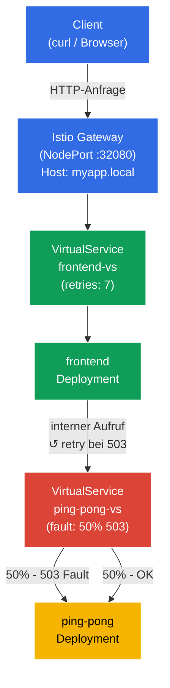

[RU version](README_RU.MD) · [Eng version](README.MD) · [Versión en español](README_ES.MD) · [Version française](README_FR.MD)

# Lab 03 - Fault Injection und Retry

Stellen Sie sich vor: Ein Backend-Service ist instabil - er liefert periodisch HTTP 503. Anstatt in den Anwendungscode einzugreifen, möchten Sie das Problem auf Infrastrukturebene lösen. In dieser Übung werden wir das Backend zunächst mit Istio Fault Injection **kaputt machen**, uns vergewissern, dass das Frontend Fehler erhält, und es dann **reparieren**, indem wir automatische Retries auf Ebene des Envoy-Proxys konfigurieren - ohne eine einzige Änderung am Code.

## Ziel

Zwei zentrale Istio-Mechanismen für den Umgang mit unzuverlässigen Services verstehen:
- **Fault Injection** - das absichtliche Einbringen von Fehlern zum Testen der Systemresilienz.
- **Retries** - automatische Wiederholungsversuche auf Proxy-Ebene, transparent für die Anwendung.

Erstelltes Gateway: http://myapp.local:32080

### Wie es funktioniert (Gesamtschema)



## Infrastruktur

Die Umgebung wird in AWS (`eu-central-1`) über Terragrunt bereitgestellt und besteht aus:

| Komponente  | Beschreibung                                      |
|------------|---------------------------------------------------|
| `vpc`      | VPC `10.10.0.0/16` mit öffentlichen Subnetzen          |
| `ssh-keys` | SSH-Schlüssel für den Zugriff auf die Nodes                      |
| `k8s-1`    | Kubernetes `1.35.2` (kubeadm) mit installiertem Istio |
| `worker`   | Arbeitsmaschine mit `kubectl` und Zugriff auf den Cluster   |

Instanzen: `t3.medium` (master) Ubuntu `22.04`

## Deployment

```bash
TASK=03 make run_ica_task
```

## Schritt 1. Aktivierung der Sidecar-Injektion

Wir fügen dem Namespace `default` ein Label hinzu, um die automatische Injektion des Sidecar-Proxys Envoy zu ermöglichen:

```bash
kubectl label namespace default istio-injection=enabled
```

**Was das bewirkt:** Istio arbeitet nach dem Prinzip des Sidecar-Patterns. Wenn am Namespace das Label `istio-injection=enabled` gesetzt ist, fügt Istio automatisch jedem neuen Pod einen zusätzlichen Container hinzu - `istio-proxy` (Envoy). Dieser Proxy fängt den gesamten ein- und ausgehenden Netzwerkverkehr des Pods ab, wodurch Istio Routing, Sicherheit und Observability ohne Änderung des Anwendungscodes verwalten kann.

## Schritt 2. Installation der Anwendung

Wir stellen zwei Services bereit: `frontend` (Eintrittspunkt) und `ping-pong` (Backend). Das Frontend erreicht bei jeder Anfrage ping-pong über die interne Adresse `http://ping-pong:8080/`.

```bash
kubectl apply -f https://raw.githubusercontent.com/ViktorUJ/cks/refs/heads/master/tasks/ica/labs/03/k8s-1/scripts/1.yaml
```

**Was bereitgestellt wird:**
- **Service `ping-pong`** + **Deployment `ping-pong`** - Backend-Service, beantwortet HTTP-Anfragen.
- **Service `frontend`** + **Deployment `frontend`** - Frontend, macht bei jeder eingehenden Anfrage einen Aufruf an `http://ping-pong:8080/` und gibt das Ergebnis an den Client zurück.

Wir überprüfen, dass die Pods mit dem Envoy-Proxy gestartet sind:

```bash
kubectl get pods
```

```
NAME                            READY   STATUS    RESTARTS   AGE
frontend-6d4b8c9f7d-xk2pq       2/2     Running   0          30s
ping-pong-77cfd77f88-jk6wq      2/2     Running   0          30s
```

**Worauf zu achten ist:** Die Spalte `READY` zeigt `2/2`. Das bedeutet, dass in jedem Pod 2 Container laufen: die Anwendung selbst und der Sidecar-Proxy Envoy (`istio-proxy`). Wenn Sie `1/1` sehen, hat die Injektion nicht funktioniert - überprüfen Sie das Label am Namespace.

## Schritt 3. Erstellung von Gateway und VirtualService für das Frontend

Wir erstellen einen Eintrittspunkt: Das Gateway nimmt externen Datenverkehr auf `myapp.local` an, der VirtualService leitet ihn an das Frontend weiter.

```bash
vim gateway.yaml
```

```yaml
apiVersion: networking.istio.io/v1
kind: Gateway
metadata:
  name: main-gateway
spec:
  selector:
    istio: ingressgateway
  servers:
  - port:
      number: 80
      name: http
      protocol: HTTP
    hosts:
    - "myapp.local"
```

```bash
vim frontend-vs.yaml
```

```yaml
apiVersion: networking.istio.io/v1
kind: VirtualService
metadata:
  name: frontend-vs
spec:
  hosts:
  - "myapp.local"
  gateways:
  - main-gateway
  http:
  - route:
    - destination:
        host: frontend
        port:
          number: 8080
```

```bash
kubectl apply -f gateway.yaml
kubectl apply -f frontend-vs.yaml
```

**Analyse:**
- Das `Gateway` konfiguriert Envoy am Rand des Mesh so, dass er HTTP-Datenverkehr für den Host `myapp.local` auf Port 80 annimmt.
- Der `VirtualService` mit `gateways: [main-gateway]` fängt diesen Datenverkehr ab und leitet ihn an den Kubernetes Service `frontend` weiter. Eine Regel ohne `match` ist die Standardroute, sie greift für alle Anfragen.

Wir überprüfen, dass alles funktioniert:

```bash
for i in {1..5}; do curl -s http://myapp.local:32080 | grep 'Backend Status'; done
```

```
Backend Status   : 200
Backend Status   : 200
Backend Status   : 200
Backend Status   : 200
Backend Status   : 200
```

Bis jetzt ist alles stabil - 100% erfolgreiche Antworten.

## Schritt 4. Fault Injection - wir machen das Backend kaputt

Jetzt simulieren wir ein instabiles Backend: Wir konfigurieren Istio so, dass genau 50% der Anfragen an `ping-pong` mit dem Fehler HTTP 503 enden.

```bash
vim ping-pong-vs-fault.yaml
```

```yaml
apiVersion: networking.istio.io/v1
kind: VirtualService
metadata:
  name: ping-pong-vs
spec:
  hosts:
  - "ping-pong"   # Gilt für den internen Cluster-Datenverkehr an diesen Service
  gateways:
  - mesh          # mesh = der gesamte Pod-zu-Pod-Datenverkehr innerhalb des Clusters
  http:
  - fault:
      abort:
        httpStatus: 503
        percentage:
          value: 50.0   # Wir machen genau die Hälfte der Anfragen kaputt
    route:
    - destination:
        host: ping-pong
        # Beachten Sie: kein subset! Der Datenverkehr geht einfach an den Service.
```

```bash
kubectl apply -f ping-pong-vs-fault.yaml
```

**Was unter der Haube passiert:**

Wenn das Frontend den Aufruf `http://ping-pong:8080/` macht, fängt der Envoy-Proxy im Frontend-Pod diese Anfrage ab (ausgehender Datenverkehr). Envoy betrachtet den VirtualService für den Host `ping-pong` und sieht die Regel `fault.abort`. Für 50% der Anfragen gibt Envoy **sofort selbst HTTP 503 zurück**, ohne die Anfrage weiterzuleiten - die Anfrage erreicht den ping-pong-Pod gar nicht. Das ist die zentrale Eigenschaft von Fault Injection: Der Fehler wird auf Proxy-Ebene erzeugt, nicht vom echten Service.

Wir überprüfen das Ergebnis:

```bash
for i in {1..10}; do curl -s http://myapp.local:32080 | grep 'Backend Status'; done | tee /dev/stderr | awk '{print $NF}' | sort | uniq -c | sort -rn
```

```
Backend Status   : 200
Backend Status   : 503
Backend Status   : 200
Backend Status   : 503
Backend Status   : 503
Backend Status   : 200
Backend Status   : 503
Backend Status   : 200
Backend Status   : 200
Backend Status   : 503
      5 200
      5 503
```

Etwa die Hälfte der Anfragen gibt einen Fehler zurück. Das Frontend erhält 503 vom Backend und gibt es an den Client weiter - die Anwendung kann selbst nicht mit der Instabilität umgehen.

## Schritt 5. Retries - reparieren ohne Codeänderung

Jetzt fügen wir automatische Retries hinzu. Retries müssen auf der Seite des **aufrufenden** Service konfiguriert werden - also im VirtualService für `frontend`. Genau der Envoy-Proxy im Frontend-Pod macht den ausgehenden Aufruf an ping-pong, und genau er soll die Anfrage bei Erhalt von 503 wiederholen.

Retries in den VirtualService für `ping-pong` einzufügen, wäre falsch: Dort lebt die Fault Injection, und Envoy würde einfach den von ihm selbst erzeugten Fehler erneut versuchen - eine sinnlose Schleife.

Wir aktualisieren `frontend-vs` und fügen den Block `retries` hinzu:

```bash
vim frontend-vs-retry.yaml
```

```yaml
apiVersion: networking.istio.io/v1
kind: VirtualService
metadata:
  name: frontend-vs
spec:
  hosts:
  - "myapp.local"
  gateways:
  - main-gateway
  http:
  - retries:
      attempts: 7             # Maximal 7 Wiederholungsversuche
      perTryTimeout: 2s       # Timeout pro Versuch
      retryOn: 5xx            # Bei jeder 5xx-Antwort des Backends wiederholen
    route:
    - destination:
        host: frontend
        port:
          number: 8080
```

```bash
kubectl apply -f frontend-vs-retry.yaml
```

**Analyse des Blocks `retries`:**

- **`attempts: 7`** - der Envoy-Proxy des Frontends macht nach dem ersten fehlgeschlagenen Aufruf bis zu 7 weitere Aufrufe an ping-pong. Insgesamt maximal 8 Versuche (1 Original + 7 Retries).
- **`perTryTimeout: 2s`** - jeder einzelne Versuch ist auf 2 Sekunden begrenzt. Ohne diesen Parameter kann ein langsamer Service die gesamte Zeit für einen einzigen Versuch "aufbrauchen".
- **`retryOn: 5xx`** - Bedingung für den Retry. `5xx` bedeutet jede HTTP-Antwort mit einem Code von 500–599. Man kann auch `gateway-error`, `connect-failure`, `retriable-4xx` und andere Bedingungen durch Kommas getrennt angeben.

**Wie es funktioniert:** Der Client stellt eine Anfrage → Ingress Gateway → Frontend-Pod. Der Envoy-Proxy des Frontends leitet den Aufruf an ping-pong weiter. Wenn ping-pong 503 zurückgibt - wiederholt Envoy den Aufruf an ping-pong (bis zu 7 Mal), und nur wenn alle Versuche fehlschlagen - gibt es einen Fehler an den Client zurück. Der Code des Frontends weiß dabei nichts von den Retries.

**Zuverlässigkeitsmathematik:** Bei einer Fehlerwahrscheinlichkeit von 50% und 7 Retries beträgt die Wahrscheinlichkeit, dass alle 8 Versuche fehlschlagen = 0.5⁸ = 0.39%. Das heißt, das System wird in ~99,6% der Fälle erfolgreich statt in 50%.

Wir überprüfen das Ergebnis:

```bash
for i in {1..10}; do curl -s http://myapp.local:32080 | grep 'Backend Status'; done | tee /dev/stderr | awk '{print $NF}' | sort | uniq -c | sort -rn
```

```
Backend Status   : 200
Backend Status   : 200
Backend Status   : 200
Backend Status   : 200
Backend Status   : 200
Backend Status   : 200
Backend Status   : 200
Backend Status   : 200
Backend Status   : 200
Backend Status   : 200
     10 200
```

Alle 10 Anfragen sind erfolgreich. Fault Injection ist nach wie vor aktiv - das Backend ist "kaputt" - aber Envoy wiederholt die Anfragen für den Client unbemerkt und erreicht eine erfolgreiche Antwort.

### Wir vergewissern uns, dass die Retries wirklich funktionieren

Um sicherzustellen, dass die Retries tatsächlich stattfinden und wir nicht einfach "Glück gehabt" haben, betrachten wir die Metriken des Envoy-Proxys im Pod **frontend** - genau er macht die ausgehenden Aufrufe an ping-pong und wiederholt sie:

```bash
kubectl exec -it $(kubectl get pod -l app=frontend -o jsonpath='{.items[0].metadata.name}') -c istio-proxy -- pilot-agent request GET stats | grep upstream_rq_retry
```

```
cluster.outbound|8080||ping-pong.default.svc.cluster.local.upstream_rq_retry: 47
cluster.outbound|8080||ping-pong.default.svc.cluster.local.upstream_rq_retry_success: 44
```

Der Zähler `upstream_rq_retry` wächst - der Envoy des Frontends wiederholt tatsächlich die ausgehenden Anfragen an ping-pong. `upstream_rq_retry_success` zeigt, wie viele Retries erfolgreich abgeschlossen wurden.

## Fazit

In dieser Übung haben wir den vollständigen Zyklus des Umgangs mit einem unzuverlässigen Service durchlaufen:

| Schritt | Was wir gemacht haben | Ergebnis |
|-----|-------------|-----------|
| Fault Injection | 50% HTTP 503 am Backend konfiguriert | ~50% der Client-Anfragen fallen mit einem Fehler aus |
| Retries | 3 Retries bei 5xx hinzugefügt | ~94% der Anfragen erfolgreich, Anwendungscode wurde nicht geändert |

**Zentrale Erkenntnis:** Istio erlaubt es, Ausfallresilienz auf Infrastrukturebene hinzuzufügen, ohne den Anwendungscode anzufassen. Das Frontend weiß nichts von den Retries - es ist eine vollständig transparente Operation des Envoy-Proxys.
