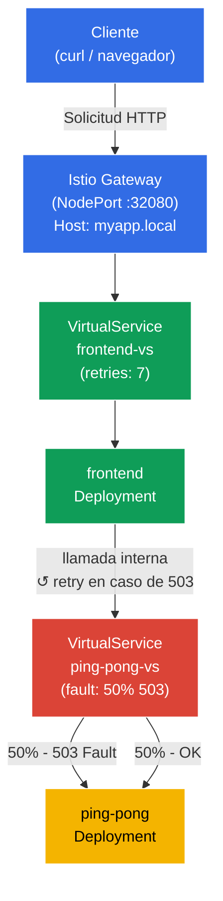

[RU version](README_RU.MD) · [Eng version](README.MD)

# Lab 03 - Fault Injection y Retry

Imagina: un servicio backend es inestable, periódicamente devuelve HTTP 503. En lugar de meterte en el código de la aplicación, quieres resolver el problema a nivel de infraestructura. En este laboratorio primero **romperemos** el backend con Istio Fault Injection, comprobaremos que el frontend recibe errores y luego lo **arreglaremos** configurando reintentos automáticos a nivel del proxy Envoy, sin un solo cambio en el código.

## Objetivo

Comprender dos mecanismos clave de Istio para trabajar con servicios poco fiables:
- **Fault Injection** - introducción intencionada de errores para probar la resiliencia del sistema.
- **Retries** - reintentos automáticos a nivel del proxy, transparentes para la aplicación.

Gateway creado: http://myapp.local:32080

### Cómo funciona (esquema general)



## Infraestructura

El entorno se despliega en AWS (`eu-central-1`) mediante Terragrunt y consta de:

| Componente  | Descripción                                       |
|------------|---------------------------------------------------|
| `vpc`      | VPC `10.10.0.0/16` con subredes públicas          |
| `ssh-keys` | Claves SSH para el acceso a los nodos             |
| `k8s-1`    | Kubernetes `1.35.2` (kubeadm) con Istio instalado |
| `worker`   | Máquina de trabajo con `kubectl` y acceso al clúster |

Instancias: `t3.medium` (master) Ubuntu `22.04`

## Despliegue

```bash
TASK=03 make run_ica_task
```

## Paso 1. Activación de la inyección de sidecar

Añadimos una label al namespace `default` para la inyección automática del sidecar proxy Envoy:

```bash
kubectl label namespace default istio-injection=enabled
```

**Qué hace esto:** Istio funciona según el patrón sidecar. Cuando el namespace tiene la label `istio-injection=enabled`, Istio añade automáticamente a cada nuevo pod un contenedor adicional: `istio-proxy` (Envoy). Este proxy intercepta todo el tráfico de red entrante y saliente del pod, lo que permite a Istio gestionar el enrutamiento, la seguridad y la observabilidad sin modificar el código de la aplicación.

## Paso 2. Instalación de la aplicación

Desplegamos dos servicios: `frontend` (punto de entrada) y `ping-pong` (backend). El frontend, en cada solicitud, se comunica con ping-pong por la dirección interna `http://ping-pong:8080/`.

```bash
kubectl apply -f https://raw.githubusercontent.com/ViktorUJ/cks/refs/heads/master/tasks/ica/labs/03/k8s-1/scripts/1.yaml
```

**Qué se despliega:**
- **Service `ping-pong`** + **Deployment `ping-pong`** - servicio backend, responde a las solicitudes HTTP.
- **Service `frontend`** + **Deployment `frontend`** - frontend, en cada solicitud entrante hace una llamada a `http://ping-pong:8080/` y devuelve el resultado al cliente.

Verificamos que los pods se hayan levantado con el proxy Envoy:

```bash
kubectl get pods
```

```
NAME                            READY   STATUS    RESTARTS   AGE
frontend-6d4b8c9f7d-xk2pq       2/2     Running   0          30s
ping-pong-77cfd77f88-jk6wq      2/2     Running   0          30s
```

**A qué prestar atención:** la columna `READY` muestra `2/2`. Esto significa que en cada pod funcionan 2 contenedores: la propia aplicación y el sidecar proxy Envoy (`istio-proxy`). Si ves `1/1`, la inyección no funcionó; comprueba la label en el namespace.

## Paso 3. Creación del Gateway y el VirtualService para el frontend

Creamos el punto de entrada: el Gateway acepta tráfico externo en `myapp.local`, el VirtualService lo dirige al frontend.

```bash
vim gateway.yaml
```

```yaml
apiVersion: networking.istio.io/v1
kind: Gateway
metadata:
  name: main-gateway
spec:
  selector:
    istio: ingressgateway
  servers:
  - port:
      number: 80
      name: http
      protocol: HTTP
    hosts:
    - "myapp.local"
```

```bash
vim frontend-vs.yaml
```

```yaml
apiVersion: networking.istio.io/v1
kind: VirtualService
metadata:
  name: frontend-vs
spec:
  hosts:
  - "myapp.local"
  gateways:
  - main-gateway
  http:
  - route:
    - destination:
        host: frontend
        port:
          number: 8080
```

```bash
kubectl apply -f gateway.yaml
kubectl apply -f frontend-vs.yaml
```

**Análisis:**
- El `Gateway` configura Envoy en el borde de la malla para aceptar tráfico HTTP para el host `myapp.local` en el puerto 80.
- El `VirtualService` con `gateways: [main-gateway]` intercepta ese tráfico y lo dirige al Service `frontend` de Kubernetes. La regla sin `match` es la ruta por defecto, se activa para todas las solicitudes.

Verificamos que todo funcione:

```bash
for i in {1..5}; do curl -s http://myapp.local:32080 | grep 'Backend Status'; done
```

```
Backend Status   : 200
Backend Status   : 200
Backend Status   : 200
Backend Status   : 200
Backend Status   : 200
```

Por ahora todo es estable: 100% de respuestas exitosas.

## Paso 4. Fault Injection - rompemos el backend

Ahora simulamos un backend inestable: configuramos Istio de modo que exactamente el 50% de las solicitudes a `ping-pong` terminen con un error HTTP 503.

```bash
vim ping-pong-vs-fault.yaml
```

```yaml
apiVersion: networking.istio.io/v1
kind: VirtualService
metadata:
  name: ping-pong-vs
spec:
  hosts:
  - "ping-pong"   # Se aplica al tráfico interno del clúster hacia este servicio
  gateways:
  - mesh          # mesh = todo el tráfico pod-to-pod dentro del clúster
  http:
  - fault:
      abort:
        httpStatus: 503
        percentage:
          value: 50.0   # Rompemos exactamente la mitad de las solicitudes
    route:
    - destination:
        host: ping-pong
        # Fíjate: ¡ningún subset! El tráfico va simplemente al servicio.
```

```bash
kubectl apply -f ping-pong-vs-fault.yaml
```

**Qué ocurre bajo el capó:**

Cuando el frontend hace la llamada `http://ping-pong:8080/`, esa solicitud la intercepta el proxy Envoy en el pod frontend (tráfico saliente). Envoy mira el VirtualService para el host `ping-pong` y ve la regla `fault.abort`. Para el 50% de las solicitudes, Envoy **devuelve inmediatamente HTTP 503 él mismo**, sin enviar la solicitud más allá: la solicitud ni siquiera llega al pod ping-pong. Esta es la propiedad clave de Fault Injection: el error se genera a nivel del proxy, no del servicio real.

Verificamos el resultado:

```bash
for i in {1..10}; do curl -s http://myapp.local:32080 | grep 'Backend Status'; done | tee /dev/stderr | awk '{print $NF}' | sort | uniq -c | sort -rn
```

```
Backend Status   : 200
Backend Status   : 503
Backend Status   : 200
Backend Status   : 503
Backend Status   : 503
Backend Status   : 200
Backend Status   : 503
Backend Status   : 200
Backend Status   : 200
Backend Status   : 503
      5 200
      5 503
```

Aproximadamente la mitad de las solicitudes devuelven error. El frontend recibe el 503 del backend y lo transmite al cliente: la aplicación no sabe gestionar por sí misma la inestabilidad.

## Paso 5. Retries - arreglamos sin cambiar el código

Ahora añadimos reintentos automáticos. Los reintentos hay que configurarlos en el lado del servicio **que llama**, es decir, en el VirtualService de `frontend`. Es precisamente el proxy Envoy dentro del pod frontend el que hace la llamada saliente a ping-pong, y es él quien debe repetir la solicitud al recibir un 503.

Añadir los reintentos al VirtualService de `ping-pong` sería incorrecto: allí vive el fault injection, y Envoy simplemente reintentaría el error generado por él mismo, un ciclo sin sentido.

Actualizamos `frontend-vs` añadiendo el bloque `retries`:

```bash
vim frontend-vs-retry.yaml
```

```yaml
apiVersion: networking.istio.io/v1
kind: VirtualService
metadata:
  name: frontend-vs
spec:
  hosts:
  - "myapp.local"
  gateways:
  - main-gateway
  http:
  - retries:
      attempts: 7             # Máximo 7 reintentos
      perTryTimeout: 2s       # Timeout para cada intento
      retryOn: 5xx            # Reintentar ante cualquier respuesta 5xx del backend
    route:
    - destination:
        host: frontend
        port:
          number: 8080
```

```bash
kubectl apply -f frontend-vs-retry.yaml
```

**Análisis del bloque `retries`:**

- **`attempts: 7`** - el proxy Envoy del frontend hará hasta 7 llamadas de reintento a ping-pong tras la primera fallida. En total, un máximo de 8 intentos (1 original + 7 reintentos).
- **`perTryTimeout: 2s`** - cada intento individual está limitado a 2 segundos. Sin este parámetro, un servicio lento podría "consumir" todo el tiempo en un solo intento.
- **`retryOn: 5xx`** - condición para el reintento. `5xx` significa cualquier respuesta HTTP con código 500–599. También se pueden indicar `gateway-error`, `connect-failure`, `retriable-4xx` y otras condiciones separadas por comas.

**Cómo funciona:** el cliente hace una solicitud → Ingress Gateway → frontend pod. El proxy Envoy del frontend hace de proxy de la llamada a ping-pong. Si ping-pong devolvió un 503, Envoy repite la llamada a ping-pong (hasta 7 veces), y solo si todos los intentos fallaron devuelve el error al cliente. El código del frontend, mientras tanto, no sabe nada de los reintentos.

**Matemática de la fiabilidad:** Con un 50% de probabilidad de error y 7 reintentos, la probabilidad de que los 8 intentos fallen = 0.5⁸ = 0.39%. Es decir, el sistema pasa a tener éxito en ~99.6% de los casos en lugar del 50%.

Verificamos el resultado:

```bash
for i in {1..10}; do curl -s http://myapp.local:32080 | grep 'Backend Status'; done | tee /dev/stderr | awk '{print $NF}' | sort | uniq -c | sort -rn
```

```
Backend Status   : 200
Backend Status   : 200
Backend Status   : 200
Backend Status   : 200
Backend Status   : 200
Backend Status   : 200
Backend Status   : 200
Backend Status   : 200
Backend Status   : 200
Backend Status   : 200
     10 200
```

Las 10 solicitudes tienen éxito. Fault Injection sigue activo, el backend está "roto", pero Envoy repite las solicitudes de forma imperceptible para el cliente y logra una respuesta exitosa.

### Nos aseguramos de que los reintentos realmente funcionan

Para asegurarnos de que los reintentos se producen y no es solo "suerte", miramos las métricas del proxy Envoy dentro del pod **frontend**: es él quien hace las llamadas salientes a ping-pong y las repite:

```bash
kubectl exec -it $(kubectl get pod -l app=frontend -o jsonpath='{.items[0].metadata.name}') -c istio-proxy -- pilot-agent request GET stats | grep upstream_rq_retry
```

```
cluster.outbound|8080||ping-pong.default.svc.cluster.local.upstream_rq_retry: 47
cluster.outbound|8080||ping-pong.default.svc.cluster.local.upstream_rq_retry_success: 44
```

El contador `upstream_rq_retry` crece: el Envoy del frontend realmente repite las solicitudes salientes a ping-pong. `upstream_rq_retry_success` muestra cuántos reintentos terminaron con éxito.

## Conclusión

En este laboratorio hemos recorrido el ciclo completo de trabajo con un servicio poco fiable:

| Paso | Qué hicimos | Resultado |
|-----|-------------|-----------|
| Fault Injection | Configuramos 50% de HTTP 503 en el backend | ~50% de las solicitudes del cliente fallan con error |
| Retries | Añadimos 3 reintentos ante 5xx | ~94% de las solicitudes tienen éxito, el código de la aplicación no cambió |

**Conclusión clave:** Istio permite añadir resiliencia ante fallos a nivel de infraestructura, sin tocar el código de la aplicación. El frontend no sabe nada de los reintentos: es una operación completamente transparente del proxy Envoy.
