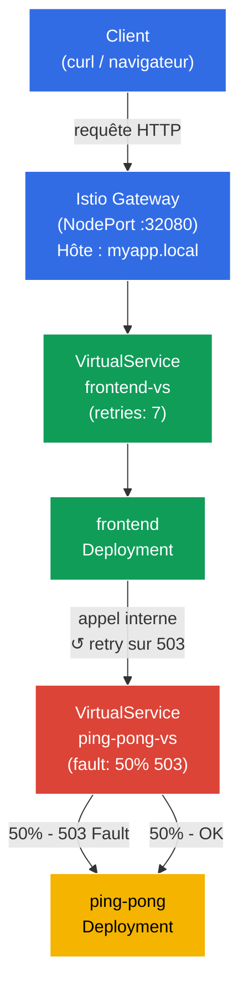

[RU version](README_RU.MD) · [Eng version](README.MD) · [Versión en español](README_ES.MD) · [Deutsche Version](README_DE.MD)

# Lab 03 - Fault Injection et Retry

Imaginez : un service backend est instable - il renvoie périodiquement un HTTP 503. Au lieu de plonger dans le code de l'application, vous voulez résoudre le problème au niveau de l'infrastructure. Dans ce travail pratique, nous allons d'abord **casser** le backend à l'aide de l'Istio Fault Injection, vérifier que le frontend reçoit des erreurs, puis **réparer** cela en configurant des tentatives automatiques au niveau du proxy Envoy - sans la moindre modification du code.

## Objectif

Comprendre deux mécanismes clés d'Istio pour travailler avec des services peu fiables :
- **Fault Injection** - introduction intentionnelle d'erreurs pour tester la résilience du système.
- **Retries** - tentatives automatiques répétées au niveau du proxy, transparentes pour l'application.

Gateway créé : http://myapp.local:32080

### Comment ça marche (schéma général)



## Infrastructure

L'environnement est déployé dans AWS (`eu-central-1`) via Terragrunt et se compose de :

| Composant  | Description                                          |
|------------|---------------------------------------------------|
| `vpc`      | VPC `10.10.0.0/16` avec des sous-réseaux publics          |
| `ssh-keys` | Clés SSH pour l'accès aux nœuds                      |
| `k8s-1`    | Kubernetes `1.35.2` (kubeadm) avec Istio installé |
| `worker`   | Machine de travail avec `kubectl` et accès au cluster   |

Instances : `t3.medium` (master) Ubuntu `22.04`

## Déploiement

```bash
TASK=03 make run_ica_task
```

## Étape 1. Activation de l'injection de sidecar

On ajoute un label sur le namespace `default` pour l'injection automatique du sidecar proxy Envoy :

```bash
kubectl label namespace default istio-injection=enabled
```

**Ce que cela fait :** Istio fonctionne selon le principe du pattern sidecar. Lorsque le namespace porte le label `istio-injection=enabled`, Istio ajoute automatiquement à chaque nouveau pod un conteneur supplémentaire - `istio-proxy` (Envoy). Ce proxy intercepte tout le trafic réseau entrant et sortant du pod, ce qui permet à Istio de gérer le routage, la sécurité et l'observabilité sans modifier le code de l'application.

## Étape 2. Installation de l'application

On déploie deux services : `frontend` (point d'entrée) et `ping-pong` (backend). Le frontend, à chaque requête, s'adresse à ping-pong via l'adresse interne `http://ping-pong:8080/`.

```bash
kubectl apply -f https://raw.githubusercontent.com/ViktorUJ/cks/refs/heads/master/tasks/ica/labs/03/k8s-1/scripts/1.yaml
```

**Ce qui est déployé :**
- **Service `ping-pong`** + **Deployment `ping-pong`** - service backend, répond aux requêtes HTTP.
- **Service `frontend`** + **Deployment `frontend`** - frontend, à chaque requête entrante fait un appel vers `http://ping-pong:8080/` et renvoie le résultat au client.

On vérifie que les pods sont démarrés avec le proxy Envoy :

```bash
kubectl get pods
```

```
NAME                            READY   STATUS    RESTARTS   AGE
frontend-6d4b8c9f7d-xk2pq       2/2     Running   0          30s
ping-pong-77cfd77f88-jk6wq      2/2     Running   0          30s
```

**À noter :** la colonne `READY` affiche `2/2`. Cela signifie que dans chaque pod tournent 2 conteneurs : l'application elle-même et le sidecar proxy Envoy (`istio-proxy`). Si vous voyez `1/1` - l'injection n'a pas fonctionné, vérifiez le label sur le namespace.

## Étape 3. Création du Gateway et du VirtualService pour le frontend

On crée le point d'entrée : le Gateway reçoit le trafic externe sur `myapp.local`, le VirtualService le dirige vers frontend.

```bash
vim gateway.yaml
```

```yaml
apiVersion: networking.istio.io/v1
kind: Gateway
metadata:
  name: main-gateway
spec:
  selector:
    istio: ingressgateway
  servers:
  - port:
      number: 80
      name: http
      protocol: HTTP
    hosts:
    - "myapp.local"
```

```bash
vim frontend-vs.yaml
```

```yaml
apiVersion: networking.istio.io/v1
kind: VirtualService
metadata:
  name: frontend-vs
spec:
  hosts:
  - "myapp.local"
  gateways:
  - main-gateway
  http:
  - route:
    - destination:
        host: frontend
        port:
          number: 8080
```

```bash
kubectl apply -f gateway.yaml
kubectl apply -f frontend-vs.yaml
```

**Analyse :**
- `Gateway` configure Envoy à la frontière du maillage pour recevoir le trafic HTTP de l'hôte `myapp.local` sur le port 80.
- `VirtualService` avec `gateways: [main-gateway]` intercepte ce trafic et le dirige vers le Service Kubernetes `frontend`. Une règle sans `match` est une route par défaut, elle se déclenche pour toutes les requêtes.

On vérifie que tout fonctionne :

```bash
for i in {1..5}; do curl -s http://myapp.local:32080 | grep 'Backend Status'; done
```

```
Backend Status   : 200
Backend Status   : 200
Backend Status   : 200
Backend Status   : 200
Backend Status   : 200
```

Pour l'instant tout est stable - 100% de réponses réussies.

## Étape 4. Fault Injection - on casse le backend

Maintenant, on simule un backend instable : on configure Istio de sorte qu'exactement 50% des requêtes vers `ping-pong` se terminent par une erreur HTTP 503.

```bash
vim ping-pong-vs-fault.yaml
```

```yaml
apiVersion: networking.istio.io/v1
kind: VirtualService
metadata:
  name: ping-pong-vs
spec:
  hosts:
  - "ping-pong"   # S'applique au trafic intra-cluster vers ce service
  gateways:
  - mesh          # mesh = tout le trafic pod-to-pod dans le cluster
  http:
  - fault:
      abort:
        httpStatus: 503
        percentage:
          value: 50.0   # On casse exactement la moitié des requêtes
    route:
    - destination:
        host: ping-pong
        # Remarque : pas de subset ! Le trafic va simplement vers le service.
```

```bash
kubectl apply -f ping-pong-vs-fault.yaml
```

**Ce qui se passe sous le capot :**

Lorsque le frontend fait l'appel `http://ping-pong:8080/`, cette requête est interceptée par le proxy Envoy dans le pod frontend (trafic sortant). Envoy regarde le VirtualService pour l'hôte `ping-pong` et voit la règle `fault.abort`. Pour 50% des requêtes, Envoy **renvoie immédiatement un HTTP 503 lui-même**, sans transmettre la requête plus loin - la requête n'atteint jamais le pod ping-pong. C'est la propriété clé du Fault Injection : l'erreur est générée au niveau du proxy, et non par le service réel.

On vérifie le résultat :

```bash
for i in {1..10}; do curl -s http://myapp.local:32080 | grep 'Backend Status'; done | tee /dev/stderr | awk '{print $NF}' | sort | uniq -c | sort -rn
```

```
Backend Status   : 200
Backend Status   : 503
Backend Status   : 200
Backend Status   : 503
Backend Status   : 503
Backend Status   : 200
Backend Status   : 503
Backend Status   : 200
Backend Status   : 200
Backend Status   : 503
      5 200
      5 503
```

Environ la moitié des requêtes renvoie une erreur. Le frontend reçoit le 503 du backend et le transmet au client - l'application ne sait pas gérer elle-même l'instabilité.

## Étape 5. Retries - on répare sans modifier le code

Ajoutons maintenant des tentatives automatiques. Les tentatives doivent être configurées du côté du service **appelant** - c'est-à-dire dans le VirtualService pour `frontend`. C'est justement le proxy Envoy à l'intérieur du pod frontend qui fait l'appel sortant vers ping-pong, et c'est lui qui doit répéter la requête lorsqu'il reçoit un 503.

Ajouter les tentatives dans le VirtualService pour `ping-pong` serait incorrect : c'est là que vit le fault injection, et Envoy ne ferait que retenter l'erreur qu'il a lui-même générée - une boucle sans intérêt.

On met à jour `frontend-vs` en ajoutant le bloc `retries` :

```bash
vim frontend-vs-retry.yaml
```

```yaml
apiVersion: networking.istio.io/v1
kind: VirtualService
metadata:
  name: frontend-vs
spec:
  hosts:
  - "myapp.local"
  gateways:
  - main-gateway
  http:
  - retries:
      attempts: 7             # Maximum 7 tentatives répétées
      perTryTimeout: 2s       # Timeout pour chaque tentative
      retryOn: 5xx            # Réessayer sur toute réponse 5xx du backend
    route:
    - destination:
        host: frontend
        port:
          number: 8080
```

```bash
kubectl apply -f frontend-vs-retry.yaml
```

**Analyse du bloc `retries` :**

- **`attempts: 7`** - le proxy Envoy du frontend fera jusqu'à 7 appels répétés vers ping-pong après le premier échec. Soit au maximum 8 tentatives (1 originale + 7 tentatives).
- **`perTryTimeout: 2s`** - chaque tentative individuelle est limitée à 2 secondes. Sans ce paramètre, un service lent pourrait « manger » tout le temps sur une seule tentative.
- **`retryOn: 5xx`** - condition pour retenter. `5xx` désigne toute réponse HTTP avec un code 500-599. On peut aussi indiquer `gateway-error`, `connect-failure`, `retriable-4xx` et d'autres conditions séparées par des virgules.

**Comment ça marche :** le client fait une requête → Ingress Gateway → pod frontend. Le proxy Envoy du frontend relaie l'appel vers ping-pong. Si ping-pong renvoie un 503 - Envoy répète l'appel vers ping-pong (jusqu'à 7 fois), et ce n'est que si toutes les tentatives échouent qu'il renvoie une erreur au client. Le code du frontend, lui, ne sait rien des tentatives.

**Les maths de la fiabilité :** Avec une probabilité d'erreur de 50% et 7 tentatives, la probabilité que les 8 tentatives échouent toutes = 0.5⁸ = 0,39%. Autrement dit le système devient un succès dans ~99,6% des cas au lieu de 50%.

On vérifie le résultat :

```bash
for i in {1..10}; do curl -s http://myapp.local:32080 | grep 'Backend Status'; done | tee /dev/stderr | awk '{print $NF}' | sort | uniq -c | sort -rn
```

```
Backend Status   : 200
Backend Status   : 200
Backend Status   : 200
Backend Status   : 200
Backend Status   : 200
Backend Status   : 200
Backend Status   : 200
Backend Status   : 200
Backend Status   : 200
Backend Status   : 200
     10 200
```

Les 10 requêtes réussissent. Le Fault Injection est toujours actif - le backend est « cassé » - mais Envoy répète les requêtes de façon invisible pour le client et obtient une réponse réussie.

### On s'assure que les tentatives fonctionnent vraiment

Pour s'assurer que les tentatives ont bien lieu, et non que l'on a simplement « eu de la chance », regardons les métriques du proxy Envoy à l'intérieur du pod **frontend** - c'est lui qui fait les appels sortants vers ping-pong et les répète :

```bash
kubectl exec -it $(kubectl get pod -l app=frontend -o jsonpath='{.items[0].metadata.name}') -c istio-proxy -- pilot-agent request GET stats | grep upstream_rq_retry
```

```
cluster.outbound|8080||ping-pong.default.svc.cluster.local.upstream_rq_retry: 47
cluster.outbound|8080||ping-pong.default.svc.cluster.local.upstream_rq_retry_success: 44
```

Le compteur `upstream_rq_retry` augmente - l'Envoy du frontend répète bien les requêtes sortantes vers ping-pong. `upstream_rq_retry_success` indique combien de tentatives se sont terminées avec succès.

## Bilan

Dans ce travail pratique, nous avons parcouru le cycle complet de travail avec un service peu fiable :

| Étape | Ce que l'on a fait | Résultat |
|-----|-------------|-----------|
| Fault Injection | Configuré 50% de HTTP 503 sur le backend | ~50% des requêtes client échouent avec une erreur |
| Retries | Ajouté 3 tentatives sur 5xx | ~94% des requêtes réussissent, le code de l'application n'a pas changé |

**Conclusion clé :** Istio permet d'ajouter de la résilience aux pannes au niveau de l'infrastructure, sans toucher au code de l'application. Le frontend ne sait rien des tentatives - c'est une opération totalement transparente du proxy Envoy.
