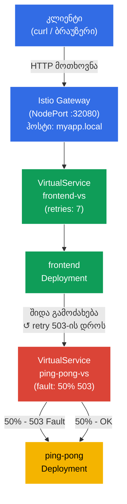

[Русская версия](README_RU.MD) · [Eng version](README.MD) · [Versión en español](README_ES.MD) · [Version française](README_FR.MD) · [Deutsche Version](README_DE.MD) · [繁體中文版](README_TW.MD) · [日本語版](README_JP.MD)

# Lab 03 - Fault Injection და Retry

> [საცნობარო გადაწყვეტა](worker/files/solutions/1_GE.MD)

წარმოიდგინეთ: ბექენდ-სერვისი არასტაბილურია - ის პერიოდულად აბრუნებს HTTP 503-ს. აპლიკაციის კოდში ჩარევის ნაცვლად, გსურთ პრობლემა ინფრასტრუქტურის დონეზე გადაჭრათ. ამ ლაბორატორიულ სამუშაოში ჯერ Istio Fault Injection-ის საშუალებით **გავაფუჭებთ** ბექენდს, დავრწმუნდებით, რომ ფრონტენდი შეცდომებს იღებს, შემდეგ კი Envoy-პროქსის დონეზე ავტომატური განმეორებითი მცდელობების (retries) კონფიგურაციით **გამოვასწორებთ** მას - კოდში არცერთი ცვლილების გარეშე.

## მიზანი

არასაიმედო სერვისებთან სამუშაოდ Istio-ს ორი საკვანძო მექანიზმის გაგება:
- **Fault Injection** - სისტემის მდგრადობის შესამოწმებლად შეცდომების განზრახ შეტანა.
- **Retries** - პროქსის დონეზე ავტომატური განმეორებითი მცდელობები, რომლებიც აპლიკაციისთვის გამჭვირვალეა.

შექმნილია Gateway: http://myapp.local:32080

### როგორ მუშაობს ეს (ზოგადი სქემა)



## ინფრასტრუქტურა

გარემო Terragrunt-ის საშუალებით AWS-ში (`eu-central-1`) ეწყობა და შედგება შემდეგი კომპონენტებისგან:

| კომპონენტი | აღწერა |
|------------|--------|
| `vpc`      | VPC `10.10.0.0/16` საჯარო ქვექსელებით |
| `ssh-keys` | SSH-გასაღებები ნოდებზე წვდომისთვის |
| `k8s-1`    | Kubernetes `1.35.2` (kubeadm) დაყენებული Istio-თი |
| `worker`   | სამუშაო მანქანა `kubectl`-ით და კლასტერზე წვდომით |

ინსტანსები: `t3.medium` (master) Ubuntu `22.04`

## გაშლა

```bash
TASK=03 make run_ica_task
```

## ნაბიჯი 1. sidecar-ინექციის ჩართვა

Envoy sidecar-პროქსის ავტომატური ინექციისთვის `default` namespace-ს ვამატებთ label-ს:

```bash
kubectl label namespace default istio-injection=enabled
```

**რას აკეთებს ეს:** Istio sidecar-პატერნის პრინციპით მუშაობს. როდესაც namespace-ს აქვს ლეიბლი `istio-injection=enabled`, Istio თითოეულ ახალ პოდს ავტომატურად უმატებს დამატებით კონტეინერს - `istio-proxy` (Envoy). ეს პროქსი პოდის მთელ შემომავალ და გამავალ ქსელურ ტრაფიკს იჭერს, რაც Istio-ს საშუალებას აძლევს, აპლიკაციის კოდის შეუცვლელად მართოს მარშრუტიზაცია, უსაფრთხოება და დაკვირვებადობა.

## ნაბიჯი 2. აპლიკაციის დაყენება

ვათავსებთ ორ სერვისს: `frontend` (შესვლის წერტილი) და `ping-pong` (ბექენდი). Frontend ყოველი მოთხოვნისას ping-pong-ს შიდა მისამართზე `http://ping-pong:8080/` მიმართავს.

```bash
kubectl apply -f https://raw.githubusercontent.com/ViktorUJ/cks/refs/heads/master/tasks/ica/labs/03/k8s-1/scripts/1.yaml
```

**რა განთავსდება:**
- **Service `ping-pong`** + **Deployment `ping-pong`** - ბექენდ-სერვისი, რომელიც HTTP-მოთხოვნებს პასუხობს.
- **Service `frontend`** + **Deployment `frontend`** - ფრონტენდი, რომელიც ყოველი შემომავალი მოთხოვნისას `http://ping-pong:8080/`-ზე გამოძახებას ასრულებს და შედეგს კლიენტს უბრუნებს.

ვამოწმებთ, რომ პოდები Envoy-პროქსით გაეშვა:

```bash
kubectl get pods
```

```
NAME                            READY   STATUS    RESTARTS   AGE
frontend-6d4b8c9f7d-xk2pq       2/2     Running   0          30s
ping-pong-77cfd77f88-jk6wq      2/2     Running   0          30s
```

**რას უნდა მიაქციოთ ყურადღება:** სვეტი `READY` აჩვენებს `2/2`-ს. ეს ნიშნავს, რომ თითოეულ პოდში 2 კონტეინერი მუშაობს: თავად აპლიკაცია და Envoy sidecar-პროქსი (`istio-proxy`). თუ ხედავთ `1/1`-ს - ინექცია არ შესრულდა; შეამოწმეთ namespace-ის ლეიბლი.

## ნაბიჯი 3. ფრონტენდისთვის Gateway-სა და VirtualService-ის შექმნა

ვქმნით შესვლის წერტილს: Gateway იღებს გარე ტრაფიკს `myapp.local`-ზე, ხოლო VirtualService მას frontend-ისკენ მიმართავს.

```bash
vim gateway.yaml
```

```yaml
apiVersion: networking.istio.io/v1
kind: Gateway
metadata:
  name: main-gateway
spec:
  selector:
    istio: ingressgateway
  servers:
  - port:
      number: 80
      name: http
      protocol: HTTP
    hosts:
    - "myapp.local"
```

```bash
vim frontend-vs.yaml
```

```yaml
apiVersion: networking.istio.io/v1
kind: VirtualService
metadata:
  name: frontend-vs
spec:
  hosts:
  - "myapp.local"
  gateways:
  - main-gateway
  http:
  - route:
    - destination:
        host: frontend
        port:
          number: 8080
```

```bash
kubectl apply -f gateway.yaml
kubectl apply -f frontend-vs.yaml
```

**განხილვა:**
- `Gateway` mesh-ის საზღვარზე Envoy-ს აკონფიგურირებს, რომ `myapp.local` ჰოსტისთვის HTTP-ტრაფიკი მე-80 პორტზე მიიღოს.
- `VirtualService` პარამეტრით `gateways: [main-gateway]` ამ ტრაფიკს იჭერს და Kubernetes Service `frontend`-ისკენ მიმართავს. წესი `match`-ის გარეშე ნაგულისხმევი მარშრუტია და ყველა მოთხოვნისთვის მოქმედებს.

ვამოწმებთ, რომ ყველაფერი მუშაობს:

```bash
for i in {1..5}; do curl -s http://myapp.local:32080 | grep 'Backend Status'; done
```

```
Backend Status   : 200
Backend Status   : 200
Backend Status   : 200
Backend Status   : 200
Backend Status   : 200
```

ჯერჯერობით ყველაფერი სტაბილურია - წარმატებული პასუხების მაჩვენებელი 100%-ია.

## ნაბიჯი 4. Fault Injection - ვაფუჭებთ ბექენდს

ახლა არასტაბილური ბექენდის სიმულაციას ვაკეთებთ: Istio-ს ისე ვაკონფიგურირებთ, რომ `ping-pong`-ისადმი მოთხოვნების ზუსტად 50% HTTP 503 შეცდომით დასრულდეს.

```bash
vim ping-pong-vs-fault.yaml
```

```yaml
apiVersion: networking.istio.io/v1
kind: VirtualService
metadata:
  name: ping-pong-vs
spec:
  hosts:
  - "ping-pong"   # გამოიყენება ამ სერვისისკენ მიმართულ კლასტერშიდა ტრაფიკზე
  gateways:
  - mesh          # mesh = მთელი pod-to-pod ტრაფიკი კლასტერის შიგნით
  http:
  - fault:
      abort:
        httpStatus: 503
        percentage:
          value: 50.0   # ვაფუჭებთ ზუსტად ნახევარ მოთხოვნას
    route:
    - destination:
        host: ping-pong
        # ყურადღება მიაქციეთ: არავითარი subset! ტრაფიკი უბრალოდ სერვისისკენ მიდის.
```

```bash
kubectl apply -f ping-pong-vs-fault.yaml
```

**რა ხდება შიდა დონეზე:**

როდესაც frontend ასრულებს გამოძახებას `http://ping-pong:8080/`, ამ მოთხოვნას frontend-ის პოდში არსებული Envoy-პროქსი (გამავალი ტრაფიკი) იჭერს. Envoy ათვალიერებს `ping-pong` ჰოსტის VirtualService-ს და ხედავს წესს `fault.abort`. მოთხოვნების 50%-ისთვის Envoy **დაუყოვნებლივ თავად აბრუნებს HTTP 503-ს**, მოთხოვნას შემდგომ არ აგზავნის და ის ping-pong-ის პოდამდე საერთოდ არ აღწევს. ეს Fault Injection-ის საკვანძო თვისებაა: შეცდომა რეალური სერვისის ნაცვლად პროქსის დონეზე გენერირდება.

ვამოწმებთ შედეგს:

```bash
for i in {1..10}; do curl -s http://myapp.local:32080 | grep 'Backend Status'; done | tee /dev/stderr | awk '{print $NF}' | sort | uniq -c | sort -rn
```

```
Backend Status   : 200
Backend Status   : 503
Backend Status   : 200
Backend Status   : 503
Backend Status   : 503
Backend Status   : 200
Backend Status   : 503
Backend Status   : 200
Backend Status   : 200
Backend Status   : 503
      5 200
      5 503
```

მოთხოვნების დაახლოებით ნახევარი შეცდომას აბრუნებს. Frontend ბექენდისგან 503-ს იღებს და მას კლიენტს გადასცემს - აპლიკაციას არასტაბილურობასთან დამოუკიდებლად გამკლავება არ შეუძლია.

## ნაბიჯი 5. Retries - ვასწორებთ კოდის შეუცვლელად

ახლა ავტომატურ განმეორებით მცდელობებს დავამატებთ. Retries უნდა დაკონფიგურირდეს **გამომძახებელი** სერვისის მხარეს - ანუ `frontend`-ის VirtualService-ში. სწორედ frontend-ის პოდში არსებული Envoy-პროქსი ასრულებს ping-pong-ისადმი გამავალ გამოძახებას და სწორედ მან უნდა გაიმეოროს მოთხოვნა 503-ის მიღებისას.

`ping-pong`-ის VirtualService-ში retries-ის დამატება არასწორი იქნებოდა: იქ fault injection მდებარეობს და Envoy უბრალოდ მის მიერ გენერირებულ შეცდომასვე გაიმეორებდა - ეს უაზრო ციკლია.

`frontend-vs`-ს `retries` ბლოკის დამატებით ვაახლებთ:

```bash
vim frontend-vs-retry.yaml
```

```yaml
apiVersion: networking.istio.io/v1
kind: VirtualService
metadata:
  name: frontend-vs
spec:
  hosts:
  - "myapp.local"
  gateways:
  - main-gateway
  http:
  - retries:
      attempts: 7             # მაქსიმუმ 7 განმეორებითი მცდელობა
      perTryTimeout: 2s       # თითოეული მცდელობის ტაიმაუტი
      retryOn: 5xx            # გამეორება ბექენდის ნებისმიერი 5xx-პასუხისას
    route:
    - destination:
        host: frontend
        port:
          number: 8080
```

```bash
kubectl apply -f frontend-vs-retry.yaml
```

**`retries` ბლოკის განხილვა:**

- **`attempts: 7`** - frontend-ის Envoy-პროქსი პირველი წარუმატებელი მცდელობის შემდეგ ping-pong-ს მაქსიმუმ 7-ჯერ ხელახლა გამოიძახებს. სულ მაქსიმუმ 8 მცდელობაა (1 საწყისი + 7 განმეორებითი).
- **`perTryTimeout: 2s`** - თითოეული ცალკეული მცდელობა 2 წამითაა შეზღუდული. ამ პარამეტრის გარეშე ნელმა სერვისმა შესაძლოა მთელი დრო ერთ მცდელობაზე „შეჭამოს“.
- **`retryOn: 5xx`** - განმეორებითი მცდელობის პირობა. `5xx` ნიშნავს ნებისმიერ HTTP-პასუხს 500–599 კოდით. მძიმეებით გამოყოფით ასევე შეიძლება მიეთითოს `gateway-error`, `connect-failure`, `retriable-4xx` და სხვა პირობები.

**როგორ მუშაობს ეს:** კლიენტი აგზავნის მოთხოვნას → Ingress Gateway → frontend pod. ფრონტენდის Envoy-პროქსი ping-pong-ისადმი გამოძახებას აპროქსირებს. თუ ping-pong-მა 503 დააბრუნა, Envoy ping-pong-ისადმი გამოძახებას იმეორებს (მაქსიმუმ 7-ჯერ) და შეცდომას კლიენტს მხოლოდ მაშინ უბრუნებს, თუ ყველა მცდელობა წარუმატებელი აღმოჩნდა. ამ დროს ფრონტენდის კოდმა retries-ის შესახებ არაფერი იცის.

**საიმედოობის მათემატიკა:** შეცდომის 50%-იანი ალბათობისა და 7 განმეორებითი მცდელობის შემთხვევაში ყველა 8 მცდელობის ჩავარდნის ალბათობაა = 0.5⁸ = 0.39%. ანუ 50%-ის ნაცვლად სისტემა შემთხვევების ~99.6%-ში წარმატებული ხდება.

ვამოწმებთ შედეგს:

```bash
for i in {1..10}; do curl -s http://myapp.local:32080 | grep 'Backend Status'; done | tee /dev/stderr | awk '{print $NF}' | sort | uniq -c | sort -rn
```

```
Backend Status   : 200
Backend Status   : 200
Backend Status   : 200
Backend Status   : 200
Backend Status   : 200
Backend Status   : 200
Backend Status   : 200
Backend Status   : 200
Backend Status   : 200
Backend Status   : 200
     10 200
```

ათივე მოთხოვნა წარმატებულია. Fault Injection კვლავ აქტიურია - ბექენდი „გაფუჭებულია“, თუმცა Envoy კლიენტისთვის შეუმჩნევლად იმეორებს მოთხოვნებს და წარმატებულ პასუხს იღებს.

### ვრწმუნდებით, რომ retries ნამდვილად მუშაობს

იმის დასადასტურებლად, რომ retries ნამდვილად სრულდება და უბრალოდ „არ გაგვიმართლა“, ვნახოთ **frontend** პოდში არსებული Envoy-პროქსის მეტრიკები - სწორედ ის ასრულებს ping-pong-ისადმი გამავალ გამოძახებებს და იმეორებს მათ:

```bash
kubectl exec -it $(kubectl get pod -l app=frontend -o jsonpath='{.items[0].metadata.name}') -c istio-proxy -- pilot-agent request GET stats | grep upstream_rq_retry
```

```
cluster.outbound|8080||ping-pong.default.svc.cluster.local.upstream_rq_retry: 47
cluster.outbound|8080||ping-pong.default.svc.cluster.local.upstream_rq_retry_success: 44
```

მრიცხველი `upstream_rq_retry` იზრდება - ფრონტენდის Envoy ნამდვილად იმეორებს ping-pong-ისადმი გამავალ მოთხოვნებს. `upstream_rq_retry_success` აჩვენებს, რამდენი განმეორებითი მცდელობა დასრულდა წარმატებით.

## შეჯამება

ამ ლაბორატორიულ სამუშაოში არასაიმედო სერვისთან მუშაობის სრული ციკლი გავიარეთ:

| ნაბიჯი | რა გავაკეთეთ | შედეგი |
|--------|---------------|--------|
| Fault Injection | ბექენდზე HTTP 503-ის 50% დავაკონფიგურირეთ | კლიენტის მოთხოვნების ~50% შეცდომით სრულდება |
| Retries | 5xx-ის დროს 3 განმეორებითი მცდელობა დავამატეთ | მოთხოვნების ~94% წარმატებულია, აპლიკაციის კოდი არ შეცვლილა |

**მთავარი დასკვნა:** Istio აპლიკაციის კოდში ჩარევის გარეშე, ინფრასტრუქტურის დონეზე, ხარვეზებისადმი მდგრადობის დამატების საშუალებას იძლევა. Frontend-მა retries-ის შესახებ არაფერი იცის - ეს Envoy-პროქსის სრულიად გამჭვირვალე ოპერაციაა.
