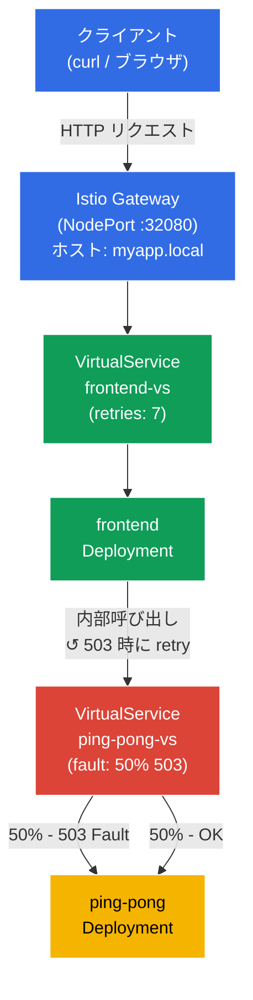

[Русская версия](README_RU.MD) · [Eng version](README.MD) · [Versión en español](README_ES.MD) · [Version française](README_FR.MD) · [Deutsche Version](README_DE.MD) · [ქართული ვერსია](README_GE.MD) · [繁體中文版](README_TW.MD)

# Lab 03 - Fault Injection と Retry

> [リファレンス解答](worker/files/solutions/1_JP.MD)

想像してください。バックエンドサービスが不安定で、定期的に HTTP 503 を返します。アプリケーションコードに手を入れる代わりに、インフラストラクチャレベルで問題を解決したいと考えています。このラボでは、まず Istio Fault Injection を使ってバックエンドを**壊し**、フロントエンドがエラーを受け取ることを確認した後、Envoy プロキシレベルで自動リトライを設定して**修正**します。コードは一切変更しません。

## 目的

信頼性の低いサービスを扱うための Istio の 2 つの主要な仕組みを理解します。
- **Fault Injection** - システムの耐障害性をテストするために、意図的にエラーを注入すること。
- **Retries** - アプリケーションから透過的に行われる、プロキシレベルの自動再試行。

作成された Gateway: http://myapp.local:32080

### 仕組み（全体図）



## インフラストラクチャ

環境は Terragrunt により AWS (`eu-central-1`) 上へデプロイされ、以下で構成されます。

| コンポーネント | 説明 |
|------------|---------------------------------------------------|
| `vpc`      | パブリックサブネットを持つ VPC `10.10.0.0/16` |
| `ssh-keys` | ノードへのアクセス用 SSH キー |
| `k8s-1`    | Istio をインストールした Kubernetes `1.35.2` (kubeadm) |
| `worker`   | `kubectl` とクラスターへのアクセスを備えた作業用マシン |

インスタンス: `t3.medium` (master) Ubuntu `22.04`

## デプロイ

```bash
TASK=03 make run_ica_task
```

## ステップ 1. sidecar インジェクションを有効化する

Envoy sidecar プロキシを自動注入するため、namespace `default` に label を追加します。

```bash
kubectl label namespace default istio-injection=enabled
```

**これにより何が起きるか:** Istio は sidecar パターンに基づいて動作します。namespace に `istio-injection=enabled` ラベルが付いている場合、Istio は新しい各 pod に追加コンテナ `istio-proxy` (Envoy) を自動で追加します。このプロキシは pod のすべてのインバウンドおよびアウトバウンドネットワークトラフィックを傍受するため、アプリケーションコードを変更せずに Istio がルーティング、セキュリティ、可観測性を管理できます。

## ステップ 2. アプリケーションをインストールする

エントリーポイントの `frontend` とバックエンドの `ping-pong` という 2 つのサービスをデプロイします。Frontend は各リクエストで内部アドレス `http://ping-pong:8080/` を通じて ping-pong を呼び出します。

```bash
kubectl apply -f https://raw.githubusercontent.com/ViktorUJ/cks/refs/heads/master/tasks/ica/labs/03/k8s-1/scripts/1.yaml
```

**デプロイされるもの:**
- **Service `ping-pong`** + **Deployment `ping-pong`** - HTTP リクエストに応答するバックエンドサービス。
- **Service `frontend`** + **Deployment `frontend`** - 各インバウンドリクエストで `http://ping-pong:8080/` を呼び出し、結果をクライアントへ返すフロントエンド。

pod が Envoy プロキシ付きで起動したことを確認します。

```bash
kubectl get pods
```

```
NAME                            READY   STATUS    RESTARTS   AGE
frontend-6d4b8c9f7d-xk2pq       2/2     Running   0          30s
ping-pong-77cfd77f88-jk6wq      2/2     Running   0          30s
```

**注目点:** `READY` 列が `2/2` を示しています。これは各 pod で、アプリケーション本体と Envoy sidecar プロキシ (`istio-proxy`) の 2 コンテナが稼働していることを意味します。`1/1` と表示される場合はインジェクションが機能していません。namespace のラベルを確認してください。

## ステップ 3. フロントエンド用 Gateway と VirtualService を作成する

エントリーポイントを作成します。Gateway は `myapp.local` 上の外部トラフィックを受け取り、VirtualService はそのトラフィックを frontend に送ります。

```bash
vim gateway.yaml
```

```yaml
apiVersion: networking.istio.io/v1
kind: Gateway
metadata:
  name: main-gateway
spec:
  selector:
    istio: ingressgateway
  servers:
  - port:
      number: 80
      name: http
      protocol: HTTP
    hosts:
    - "myapp.local"
```

```bash
vim frontend-vs.yaml
```

```yaml
apiVersion: networking.istio.io/v1
kind: VirtualService
metadata:
  name: frontend-vs
spec:
  hosts:
  - "myapp.local"
  gateways:
  - main-gateway
  http:
  - route:
    - destination:
        host: frontend
        port:
          number: 8080
```

```bash
kubectl apply -f gateway.yaml
kubectl apply -f frontend-vs.yaml
```

**解説:**
- `Gateway` は、mesh 境界の Envoy を設定し、ポート 80 でホスト `myapp.local` 向け HTTP トラフィックを受信させます。
- `gateways: [main-gateway]` を持つ `VirtualService` はこのトラフィックを傍受し、Kubernetes Service `frontend` に送ります。`match` のないルールはすべてのリクエストに適用されるデフォルトルートです。

すべて動作していることを確認します。

```bash
for i in {1..5}; do curl -s http://myapp.local:32080 | grep 'Backend Status'; done
```

```
Backend Status   : 200
Backend Status   : 200
Backend Status   : 200
Backend Status   : 200
Backend Status   : 200
```

現時点では安定しており、100% 成功応答です。

## ステップ 4. Fault Injection - バックエンドを壊す

ここで不安定なバックエンドをシミュレートします。`ping-pong` へのリクエストのちょうど 50% が HTTP 503 エラーで終了するよう Istio を設定します。

```bash
vim ping-pong-vs-fault.yaml
```

```yaml
apiVersion: networking.istio.io/v1
kind: VirtualService
metadata:
  name: ping-pong-vs
spec:
  hosts:
  - "ping-pong"   # このサービスへのクラスタ内トラフィックに適用
  gateways:
  - mesh          # mesh = クラスタ内のすべての pod-to-pod トラフィック
  http:
  - fault:
      abort:
        httpStatus: 503
        percentage:
          value: 50.0   # ちょうど半分のリクエストを壊す
    route:
    - destination:
        host: ping-pong
        # 注意: subset は一切なし! トラフィックは単にサービスへ流れる。
```

```bash
kubectl apply -f ping-pong-vs-fault.yaml
```

**内部で起きていること:**

frontend が `http://ping-pong:8080/` を呼び出すと、このリクエストは frontend pod 内の Envoy プロキシ（アウトバウンドトラフィック）によって傍受されます。Envoy はホスト `ping-pong` 用の VirtualService を確認し、`fault.abort` ルールを見つけます。リクエストの 50% では Envoy が**直ちに自身で HTTP 503 を返し**、リクエストを先へ送信しません。つまり ping-pong pod にはリクエストがまったく到達しません。これが Fault Injection の重要な特性です。エラーは実際のサービスではなく、プロキシレベルで生成されます。

結果を確認します。

```bash
for i in {1..10}; do curl -s http://myapp.local:32080 | grep 'Backend Status'; done | tee /dev/stderr | awk '{print $NF}' | sort | uniq -c | sort -rn
```

```
Backend Status   : 200
Backend Status   : 503
Backend Status   : 200
Backend Status   : 503
Backend Status   : 503
Backend Status   : 200
Backend Status   : 503
Backend Status   : 200
Backend Status   : 200
Backend Status   : 503
      5 200
      5 503
```

およそ半分のリクエストがエラーを返します。Frontend はバックエンドから 503 を受け取り、それをクライアントに渡します。アプリケーション自身には不安定性に対処する機能がありません。

## ステップ 5. Retries - コードを変更せずに修正する

ここで自動リトライを追加します。リトライは**呼び出し元**サービス側、つまり `frontend` 用 VirtualService で設定する必要があります。ping-pong へのアウトバウンド呼び出しを行うのは frontend pod 内の Envoy プロキシであり、503 を受け取ったときにリクエストを再試行すべきなのもこのプロキシです。

`ping-pong` 用 VirtualService にリトライを追加するのは誤りです。そこには fault injection が存在しており、Envoy は自分自身が生成したエラーを再試行するだけで、無意味なループになります。

`retries` ブロックを追加して `frontend-vs` を更新します。

```bash
vim frontend-vs-retry.yaml
```

```yaml
apiVersion: networking.istio.io/v1
kind: VirtualService
metadata:
  name: frontend-vs
spec:
  hosts:
  - "myapp.local"
  gateways:
  - main-gateway
  http:
  - retries:
      attempts: 7             # 最大 7 回のリトライ
      perTryTimeout: 2s       # 各試行のタイムアウト
      retryOn: 5xx            # バックエンドからの任意の 5xx 応答でリトライ
    route:
    - destination:
        host: frontend
        port:
          number: 8080
```

```bash
kubectl apply -f frontend-vs-retry.yaml
```

**`retries` ブロックの解説:**

- **`attempts: 7`** - 最初の失敗の後、フロントエンドの Envoy プロキシは ping-pong に対して最大 7 回の再呼び出しを行います。合計で最大 8 回（元の 1 回 + リトライ 7 回）試行されます。
- **`perTryTimeout: 2s`** - 個々の試行は 2 秒に制限されます。このパラメータがないと、遅いサービスが 1 回の試行ですべての時間を消費する可能性があります。
- **`retryOn: 5xx`** - リトライの条件です。`5xx` は 500～599 の任意の HTTP 応答コードを意味します。`gateway-error`、`connect-failure`、`retriable-4xx`、その他の条件もカンマ区切りで指定できます。

**仕組み:** クライアントがリクエストを送信 → Ingress Gateway → frontend pod。フロントエンドの Envoy プロキシが ping-pong への呼び出しをプロキシします。ping-pong が 503 を返すと、Envoy は ping-pong への呼び出しを（最大 7 回）再試行し、すべての試行が失敗した場合にのみクライアントへエラーを返します。フロントエンドのコードはリトライを認識しません。

**信頼性の数学:** エラー確率が 50%、リトライが 7 回の場合、8 回すべての試行が失敗する確率 = 0.5⁸ = 0.39% です。つまり、成功率は 50% から約 99.6% に向上します。

結果を確認します。

```bash
for i in {1..10}; do curl -s http://myapp.local:32080 | grep 'Backend Status'; done | tee /dev/stderr | awk '{print $NF}' | sort | uniq -c | sort -rn
```

```
Backend Status   : 200
Backend Status   : 200
Backend Status   : 200
Backend Status   : 200
Backend Status   : 200
Backend Status   : 200
Backend Status   : 200
Backend Status   : 200
Backend Status   : 200
Backend Status   : 200
     10 200
```

10 件すべてのリクエストが成功しています。Fault Injection は依然として有効、つまりバックエンドは「壊れた」ままですが、Envoy はクライアントに見えない形でリクエストを再試行し、成功応答を取得します。

### リトライが実際に動作していることを確認する

リトライが発生していること、単に「運が良かった」だけではないことを確認するため、**frontend** pod 内の Envoy プロキシのメトリクスを確認します。ping-pong へのアウトバウンド呼び出しとその再試行を行っているのは、このプロキシです。

```bash
kubectl exec -it $(kubectl get pod -l app=frontend -o jsonpath='{.items[0].metadata.name}') -c istio-proxy -- pilot-agent request GET stats | grep upstream_rq_retry
```

```
cluster.outbound|8080||ping-pong.default.svc.cluster.local.upstream_rq_retry: 47
cluster.outbound|8080||ping-pong.default.svc.cluster.local.upstream_rq_retry_success: 44
```

`upstream_rq_retry` カウンターが増加しています。つまりフロントエンドの Envoy は ping-pong へのアウトバウンドリクエストを実際に再試行しています。`upstream_rq_retry_success` は、成功したリトライの数を示します。

## まとめ

このラボでは、信頼性の低いサービスを扱う完全なサイクルを確認しました。

| ステップ | 実施内容 | 結果 |
|-----|-------------|-----------|
| Fault Injection | バックエンドに 50% の HTTP 503 を設定 | クライアントリクエストの約 50% がエラーで失敗 |
| Retries | 5xx に対するリトライを 3 回追加 | リクエストの約 94% が成功し、アプリケーションコードは変更なし |

**重要な結論:** Istio はアプリケーションコードに触れることなく、インフラストラクチャレベルで障害への耐性を追加できます。Frontend はリトライを認識しておらず、これは完全に透過的な Envoy プロキシ操作です。