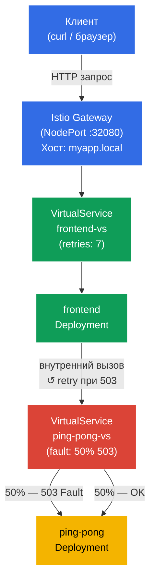

[Eng version](README.MD)

# Lab 03 — Fault Injection и Retry

Представьте: бэкенд-сервис нестабилен — он периодически отдаёт HTTP 503. Вместо того чтобы лезть в код приложения, вы хотите решить проблему на уровне инфраструктуры. В этой лабораторной мы сначала **сломаем** бэкенд с помощью Istio Fault Injection, убедимся что фронтенд получает ошибки, а затем **починим** это, настроив автоматические ретраи на уровне Envoy-прокси — без единого изменения в коде.

## Цель

Понять два ключевых механизма Istio для работы с ненадёжными сервисами:
- **Fault Injection** — намеренное внесение ошибок для тестирования устойчивости системы.
- **Retries** — автоматические повторные попытки на уровне прокси, прозрачные для приложения.

Создан Gateway: http://myapp.local:32080

### Как это работает (общая схема)



## Шаг 1. Включение sidecar-инъекции

Добавляем label на namespace `default` для автоматической инъекции sidecar-прокси Envoy:

```bash
kubectl label namespace default istio-injection=enabled
```

**Что это делает:** Istio работает по принципу sidecar-паттерна. Когда на namespace стоит лейбл `istio-injection=enabled`, Istio автоматически добавляет в каждый новый под дополнительный контейнер — `istio-proxy` (Envoy). Этот прокси перехватывает весь входящий и исходящий сетевой трафик пода, что позволяет Istio управлять маршрутизацией, безопасностью и наблюдаемостью без изменения кода приложения.

## Шаг 2. Установка приложения

Разворачиваем два сервиса: `frontend` (точка входа) и `ping-pong` (бэкенд). Frontend при каждом запросе обращается к ping-pong по внутреннему адресу `http://ping-pong:8080/`.

```bash
kubectl apply -f https://raw.githubusercontent.com/ViktorUJ/cks/refs/heads/master/tasks/ica/labs/03/k8s-1/scripts/1.yaml
```

**Что разворачивается:**
- **Service `ping-pong`** + **Deployment `ping-pong`** — бэкенд-сервис, отвечает на HTTP-запросы.
- **Service `frontend`** + **Deployment `frontend`** — фронтенд, при каждом входящем запросе делает вызов к `http://ping-pong:8080/` и возвращает результат клиенту.

Проверяем что поды поднялись с Envoy-прокси:

```bash
kubectl get pods
```

```
NAME                            READY   STATUS    RESTARTS   AGE
frontend-6d4b8c9f7d-xk2pq       2/2     Running   0          30s
ping-pong-77cfd77f88-jk6wq      2/2     Running   0          30s
```

**На что обратить внимание:** колонка `READY` показывает `2/2`. Это значит, что в каждом поде работают 2 контейнера: само приложение и sidecar-прокси Envoy (`istio-proxy`). Если вы видите `1/1` — инъекция не сработала, проверьте лейбл на namespace.

## Шаг 3. Создание Gateway и VirtualService для фронтенда

Создаём точку входа: Gateway принимает внешний трафик на `myapp.local`, VirtualService направляет его во frontend.

```bash
vim gateway.yaml
```

```yaml
apiVersion: networking.istio.io/v1
kind: Gateway
metadata:
  name: main-gateway
spec:
  selector:
    istio: ingressgateway
  servers:
  - port:
      number: 80
      name: http
      protocol: HTTP
    hosts:
    - "myapp.local"
```

```bash
vim frontend-vs.yaml
```

```yaml
apiVersion: networking.istio.io/v1
kind: VirtualService
metadata:
  name: frontend-vs
spec:
  hosts:
  - "myapp.local"
  gateways:
  - main-gateway
  http:
  - route:
    - destination:
        host: frontend
        port:
          number: 8080
```

```bash
kubectl apply -f gateway.yaml
kubectl apply -f frontend-vs.yaml
```

**Разбор:**
- `Gateway` настраивает Envoy на границе mesh принимать HTTP-трафик для хоста `myapp.local` на порту 80.
- `VirtualService` с `gateways: [main-gateway]` перехватывает этот трафик и направляет его на Kubernetes Service `frontend`. Правило без `match` — это дефолтный маршрут, срабатывает для всех запросов.

Проверяем что всё работает:

```bash
for i in {1..5}; do curl -s http://myapp.local:32080 | grep 'Backend Status'; done
```

```
Backend Status   : 200
Backend Status   : 200
Backend Status   : 200
Backend Status   : 200
Backend Status   : 200
```

Пока всё стабильно — 100% успешных ответов.

## Шаг 4. Fault Injection — ломаем бэкенд

Теперь симулируем нестабильный бэкенд: настраиваем Istio так, чтобы ровно 50% запросов к `ping-pong` завершались ошибкой HTTP 503.

```bash
vim ping-pong-vs-fault.yaml
```

```yaml
apiVersion: networking.istio.io/v1
kind: VirtualService
metadata:
  name: ping-pong-vs
spec:
  hosts:
  - "ping-pong"   # Применяется к внутрикластерному трафику на этот сервис
  gateways:
  - mesh          # mesh = весь pod-to-pod трафик внутри кластера
  http:
  - fault:
      abort:
        httpStatus: 503
        percentage:
          value: 50.0   # Ломаем ровно половину запросов
    route:
    - destination:
        host: ping-pong
        # Обратите внимание: никаких subset! Трафик идет просто на сервис.
```

```bash
kubectl apply -f ping-pong-vs-fault.yaml
```

**Что происходит под капотом:**

Когда frontend делает вызов `http://ping-pong:8080/`, этот запрос перехватывает Envoy-прокси в поде frontend (исходящий трафик). Envoy смотрит на VirtualService для хоста `ping-pong` и видит правило `fault.abort`. Для 50% запросов Envoy **немедленно возвращает HTTP 503 сам**, не отправляя запрос дальше — до пода ping-pong запрос вообще не доходит. Это ключевое свойство Fault Injection: ошибка генерируется на уровне прокси, а не реального сервиса.

Проверяем результат:

```bash
for i in {1..10}; do curl -s http://myapp.local:32080 | grep 'Backend Status'; done | tee /dev/stderr | awk '{print $NF}' | sort | uniq -c | sort -rn
```

```
Backend Status   : 200
Backend Status   : 503
Backend Status   : 200
Backend Status   : 503
Backend Status   : 503
Backend Status   : 200
Backend Status   : 503
Backend Status   : 200
Backend Status   : 200
Backend Status   : 503
      5 200
      5 503
```

Примерно половина запросов возвращает ошибку. Frontend получает 503 от бэкенда и передаёт её клиенту — приложение не умеет само справляться с нестабильностью.

## Шаг 5. Retries — чиним без изменения кода

Теперь добавим автоматические ретраи. Ретраи нужно настраивать на стороне **вызывающего** сервиса — то есть в VirtualService для `frontend`. Именно Envoy-прокси внутри пода frontend делает исходящий вызов к ping-pong, и именно он должен повторять запрос при получении 503.

Добавлять ретраи в VirtualService для `ping-pong` было бы неправильно: там живёт fault injection, и Envoy просто ретраил бы сгенерированную им же ошибку — бессмысленный цикл.

Обновляем `frontend-vs`, добавляя блок `retries`:

```bash
vim frontend-vs-retry.yaml
```

```yaml
apiVersion: networking.istio.io/v1
kind: VirtualService
metadata:
  name: frontend-vs
spec:
  hosts:
  - "myapp.local"
  gateways:
  - main-gateway
  http:
  - retries:
      attempts: 7             # Максимум 7 повторных попыток
      perTryTimeout: 2s       # Таймаут на каждую попытку
      retryOn: 5xx            # Повторять при любом 5xx-ответе от бэкенда
    route:
    - destination:
        host: frontend
        port:
          number: 8080
```

```bash
kubectl apply -f frontend-vs-retry.yaml
```

**Разбор блока `retries`:**

- **`attempts: 7`** — Envoy-прокси фронтенда сделает до 7 повторных вызовов к ping-pong после первого неудачного. Итого максимум 8 попыток (1 оригинальная + 7 ретраев).
- **`perTryTimeout: 2s`** — каждая отдельная попытка ограничена 2 секундами. Без этого параметра медленный сервис может "съесть" всё время на одну попытку.
- **`retryOn: 5xx`** — условие для ретрая. `5xx` означает любой HTTP-ответ с кодом 500–599. Можно также указать `gateway-error`, `connect-failure`, `retriable-4xx` и другие условия через запятую.

**Как это работает:** клиент делает запрос → Ingress Gateway → frontend pod. Envoy-прокси фронтенда проксирует вызов к ping-pong. Если ping-pong вернул 503 — Envoy повторяет вызов к ping-pong (до 7 раз), и только если все попытки провалились — возвращает ошибку клиенту. Код фронтенда при этом не знает о ретраях.

**Математика надёжности:** При 50% вероятности ошибки и 7 ретраях вероятность того, что все 8 попыток провалятся = 0.5⁸ = 0.39%. То есть система становится успешной в ~99.6% случаев вместо 50%.

Проверяем результат:

```bash
for i in {1..10}; do curl -s http://myapp.local:32080 | grep 'Backend Status'; done | tee /dev/stderr | awk '{print $NF}' | sort | uniq -c | sort -rn
```

```
Backend Status   : 200
Backend Status   : 200
Backend Status   : 200
Backend Status   : 200
Backend Status   : 200
Backend Status   : 200
Backend Status   : 200
Backend Status   : 200
Backend Status   : 200
Backend Status   : 200
     10 200
```

Все 10 запросов успешны. Fault Injection по-прежнему активен — бэкенд "сломан" — но Envoy незаметно для клиента повторяет запросы и добивается успешного ответа.

### Убеждаемся что ретраи действительно работают

Чтобы убедиться, что ретраи происходят, а не просто "повезло", посмотрим на метрики Envoy-прокси внутри пода **frontend** — именно он делает исходящие вызовы к ping-pong и повторяет их:

```bash
kubectl exec -it $(kubectl get pod -l app=frontend -o jsonpath='{.items[0].metadata.name}') -c istio-proxy -- pilot-agent request GET stats | grep upstream_rq_retry
```

```
cluster.outbound|8080||ping-pong.default.svc.cluster.local.upstream_rq_retry: 47
cluster.outbound|8080||ping-pong.default.svc.cluster.local.upstream_rq_retry_success: 44
```

Счётчик `upstream_rq_retry` растёт — Envoy фронтенда действительно повторяет исходящие запросы к ping-pong. `upstream_rq_retry_success` показывает, сколько ретраев завершились успехом.

## Итог

В этой лабораторной мы прошли полный цикл работы с ненадёжным сервисом:

| Шаг | Что сделали | Результат |
|-----|-------------|-----------|
| Fault Injection | Настроили 50% HTTP 503 на бэкенде | ~50% запросов клиента падают с ошибкой |
| Retries | Добавили 3 ретрая при 5xx | ~94% запросов успешны, код приложения не менялся |

**Ключевой вывод:** Istio позволяет добавлять устойчивость к сбоям на уровне инфраструктуры, не трогая код приложения. Frontend не знает о ретраях — это полностью прозрачная операция Envoy-прокси.
