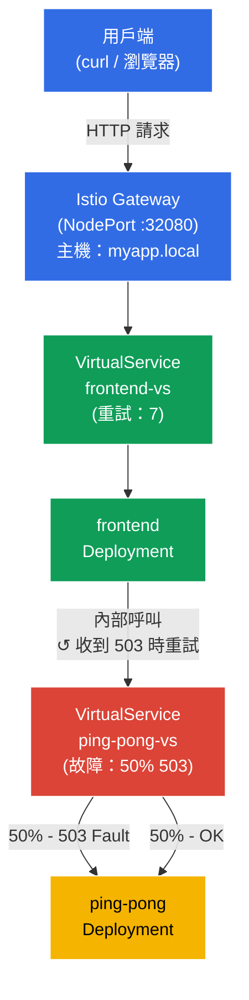

[Русская версия](README_RU.MD) · [Eng version](README.MD) · [Versión en español](README_ES.MD) · [Version française](README_FR.MD) · [Deutsche Version](README_DE.MD) · [ქართული ვერსია](README_GE.MD) · [日本語版](README_JP.MD)

# 實驗 03 - 故障注入與重試

> [參考解答](worker/files/solutions/1_TW.MD)

想像一下：後端服務並不穩定，會定期回傳 HTTP 503。與其修改應用程式碼，你想在基礎架構層級解決問題。在本實驗中，我們會先使用 Istio Fault Injection **破壞**後端，確認前端收到錯誤，接著透過設定 Envoy 代理層級的自動重試來**修復**問題--無須對程式碼做任何修改。

## 目標

了解 Istio 用來處理不可靠服務的兩項關鍵機制：
- **Fault Injection** - 有意注入錯誤，以測試系統的韌性。
- **Retries** - 代理層級的自動重試，對應用程式透明。

已建立 Gateway：http://myapp.local:32080

### 運作方式（整體架構）



## 基礎架構

環境透過 Terragrunt 在 AWS (`eu-central-1`) 中部署，包含：

| 元件  | 說明                                          |
|------------|---------------------------------------------------|
| `vpc`      | 具有公用子網路的 VPC `10.10.0.0/16`          |
| `ssh-keys` | 用於存取節點的 SSH 金鑰                      |
| `k8s-1`    | 已安裝 Istio 的 Kubernetes `1.35.2` (kubeadm) |
| `worker`   | 具備 `kubectl` 與叢集存取權的工作機器   |

執行個體：`t3.medium`（master）Ubuntu `22.04`

## 部署

```bash
TASK=03 make run_ica_task
```

## 步驟 1. 啟用 sidecar 注入

為 namespace `default` 加上 label，以自動注入 Envoy sidecar 代理：

```bash
kubectl label namespace default istio-injection=enabled
```

**此操作的作用：** Istio 採用 sidecar 模式運作。當 namespace 有 `istio-injection=enabled` label 時，Istio 會自動在每個新 Pod 中新增一個容器--`istio-proxy` (Envoy)。此代理會攔截 Pod 的所有傳入與傳出網路流量，讓 Istio 可以在不修改應用程式碼的情況下管理路由、安全性與可觀測性。

## 步驟 2. 安裝應用程式

部署兩個服務：`frontend`（入口點）與 `ping-pong`（後端）。Frontend 每次收到請求時，都會透過內部位址 `http://ping-pong:8080/` 呼叫 ping-pong。

```bash
kubectl apply -f https://raw.githubusercontent.com/ViktorUJ/cks/refs/heads/master/tasks/ica/labs/03/k8s-1/scripts/1.yaml
```

**會部署的內容：**
- **Service `ping-pong`** + **Deployment `ping-pong`** - 後端服務，回應 HTTP 請求。
- **Service `frontend`** + **Deployment `frontend`** - 前端，每次收到傳入請求時呼叫 `http://ping-pong:8080/`，並將結果回傳給用戶端。

確認 Pod 已與 Envoy 代理一同啟動：

```bash
kubectl get pods
```

```
NAME                            READY   STATUS    RESTARTS   AGE
frontend-6d4b8c9f7d-xk2pq       2/2     Running   0          30s
ping-pong-77cfd77f88-jk6wq      2/2     Running   0          30s
```

**注意事項：** `READY` 欄顯示 `2/2`。這表示每個 Pod 中執行 2 個容器：應用程式本身與 Envoy sidecar 代理（`istio-proxy`）。若看到 `1/1`，表示注入未成功；請檢查 namespace 的 label。

## 步驟 3. 為前端建立 Gateway 和 VirtualService

建立入口點：Gateway 在 `myapp.local` 接收外部流量，VirtualService 將其導向 frontend。

```bash
vim gateway.yaml
```

```yaml
apiVersion: networking.istio.io/v1
kind: Gateway
metadata:
  name: main-gateway
spec:
  selector:
    istio: ingressgateway
  servers:
  - port:
      number: 80
      name: http
      protocol: HTTP
    hosts:
    - "myapp.local"
```

```bash
vim frontend-vs.yaml
```

```yaml
apiVersion: networking.istio.io/v1
kind: VirtualService
metadata:
  name: frontend-vs
spec:
  hosts:
  - "myapp.local"
  gateways:
  - main-gateway
  http:
  - route:
    - destination:
        host: frontend
        port:
          number: 8080
```

```bash
kubectl apply -f gateway.yaml
kubectl apply -f frontend-vs.yaml
```

**說明：**
- `Gateway` 設定 mesh 邊界的 Envoy，在連接埠 80 為主機 `myapp.local` 接收 HTTP 流量。
- 帶有 `gateways: [main-gateway]` 的 `VirtualService` 攔截此流量，並將其導向 Kubernetes Service `frontend`。不含 `match` 的規則是預設路由，會套用至所有請求。

確認一切正常運作：

```bash
for i in {1..5}; do curl -s http://myapp.local:32080 | grep 'Backend Status'; done
```

```
Backend Status   : 200
Backend Status   : 200
Backend Status   : 200
Backend Status   : 200
Backend Status   : 200
```

目前一切穩定--100% 的回應都成功。

## 步驟 4. Fault Injection - 破壞後端

現在模擬不穩定的後端：設定 Istio，讓恰好 50% 對 `ping-pong` 的請求以 HTTP 503 錯誤結束。

```bash
vim ping-pong-vs-fault.yaml
```

```yaml
apiVersion: networking.istio.io/v1
kind: VirtualService
metadata:
  name: ping-pong-vs
spec:
  hosts:
  - "ping-pong"   # 套用於發往此服務的叢集內部流量
  gateways:
  - mesh          # mesh = 叢集內部所有 pod-to-pod 流量
  http:
  - fault:
      abort:
        httpStatus: 503
        percentage:
          value: 50.0   # 恰好破壞一半的請求
    route:
    - destination:
        host: ping-pong
        # 請注意：沒有任何 subset！流量直接導向服務。
```

```bash
kubectl apply -f ping-pong-vs-fault.yaml
```

**底層發生的情況：**

當 frontend 呼叫 `http://ping-pong:8080/` 時，該請求會被 frontend Pod 內的 Envoy 代理（傳出流量）攔截。Envoy 會查看主機 `ping-pong` 的 VirtualService，並找到 `fault.abort` 規則。針對 50% 的請求，Envoy **會立即自行回傳 HTTP 503**，不再繼續傳送請求--請求根本不會抵達 ping-pong Pod。這是 Fault Injection 的關鍵特性：錯誤是在代理層級產生，而不是由實際服務產生。

檢查結果：

```bash
for i in {1..10}; do curl -s http://myapp.local:32080 | grep 'Backend Status'; done | tee /dev/stderr | awk '{print $NF}' | sort | uniq -c | sort -rn
```

```
Backend Status   : 200
Backend Status   : 503
Backend Status   : 200
Backend Status   : 503
Backend Status   : 503
Backend Status   : 200
Backend Status   : 503
Backend Status   : 200
Backend Status   : 200
Backend Status   : 503
      5 200
      5 503
```

約有一半的請求回傳錯誤。Frontend 從後端收到 503 並將其傳遞給用戶端--應用程式本身無法處理這種不穩定性。

## 步驟 5. Retries - 不修改程式碼即可修復

現在新增自動重試。重試必須在**呼叫端**服務設定--也就是 `frontend` 的 VirtualService。frontend Pod 內的 Envoy 代理正是呼叫 ping-pong 的一方，因此它應在收到 503 時重送請求。

在 `ping-pong` 的 VirtualService 中新增重試並不正確：故障注入存在於那裡，Envoy 只會重試自己產生的錯誤--這是毫無意義的迴圈。

更新 `frontend-vs`，新增 `retries` 區塊：

```bash
vim frontend-vs-retry.yaml
```

```yaml
apiVersion: networking.istio.io/v1
kind: VirtualService
metadata:
  name: frontend-vs
spec:
  hosts:
  - "myapp.local"
  gateways:
  - main-gateway
  http:
  - retries:
      attempts: 7             # 最多 7 次重試
      perTryTimeout: 2s       # 每次嘗試的逾時時間
      retryOn: 5xx            # 當後端回傳任何 5xx 回應時重試
    route:
    - destination:
        host: frontend
        port:
          number: 8080
```

```bash
kubectl apply -f frontend-vs-retry.yaml
```

**`retries` 區塊說明：**

- **`attempts: 7`** - frontend 的 Envoy 代理會在第一次失敗後，最多對 ping-pong 進行 7 次重試呼叫。總計最多 8 次嘗試（1 次原始請求 + 7 次重試）。
- **`perTryTimeout: 2s`** - 每次個別嘗試限制為 2 秒。若沒有這個參數，緩慢的服務可能會「耗盡」單次嘗試的所有時間。
- **`retryOn: 5xx`** - 重試條件。`5xx` 代表任何狀態碼為 500–599 的 HTTP 回應。還可用逗號指定 `gateway-error`、`connect-failure`、`retriable-4xx` 等其他條件。

**運作方式：** 用戶端發出請求 → Ingress Gateway → frontend Pod。frontend 的 Envoy 代理會將對 ping-pong 的呼叫代理出去。若 ping-pong 回傳 503，Envoy 會重試對 ping-pong 的呼叫（最多 7 次）；只有在所有嘗試都失敗時，才會將錯誤回傳給用戶端。前端程式碼完全不知道重試的存在。

**可靠性數學：** 在錯誤機率為 50% 且有 7 次重試時，全部 8 次嘗試都失敗的機率 = 0.5⁸ = 0.39%。也就是說，相較於原本的 50%，系統成功率提高到約 99.6%。

檢查結果：

```bash
for i in {1..10}; do curl -s http://myapp.local:32080 | grep 'Backend Status'; done | tee /dev/stderr | awk '{print $NF}' | sort | uniq -c | sort -rn
```

```
Backend Status   : 200
Backend Status   : 200
Backend Status   : 200
Backend Status   : 200
Backend Status   : 200
Backend Status   : 200
Backend Status   : 200
Backend Status   : 200
Backend Status   : 200
Backend Status   : 200
     10 200
```

全部 10 個請求都成功。Fault Injection 仍在作用--後端「已損壞」--但 Envoy 在用戶端無感的情況下重送請求，並取得成功的回應。

### 確認重試確實有效

為確認重試確實發生，而不是單純「運氣好」，讓我們查看 **frontend** Pod 內 Envoy 代理的指標--它負責對 ping-pong 發出傳出呼叫並重試：

```bash
kubectl exec -it $(kubectl get pod -l app=frontend -o jsonpath='{.items[0].metadata.name}') -c istio-proxy -- pilot-agent request GET stats | grep upstream_rq_retry
```

```
cluster.outbound|8080||ping-pong.default.svc.cluster.local.upstream_rq_retry: 47
cluster.outbound|8080||ping-pong.default.svc.cluster.local.upstream_rq_retry_success: 44
```

計數器 `upstream_rq_retry` 持續增加--frontend 的 Envoy 確實會重試對 ping-pong 的傳出請求。`upstream_rq_retry_success` 顯示成功的重試數量。

## 總結

在本實驗中，我們走完了處理不可靠服務的完整流程：

| 步驟 | 執行的操作 | 結果 |
|-----|-------------|-----------|
| Fault Injection | 在後端設定 50% HTTP 503 | 約 50% 的用戶端請求因錯誤而失敗 |
| Retries | 在 5xx 時新增 3 次重試 | 約 94% 的請求成功，應用程式碼未變更 |

**關鍵結論：** Istio 讓您能在基礎架構層級增加故障韌性，而不必修改應用程式碼。Frontend 不知道重試的存在--這完全是 Envoy 代理透明執行的操作。
