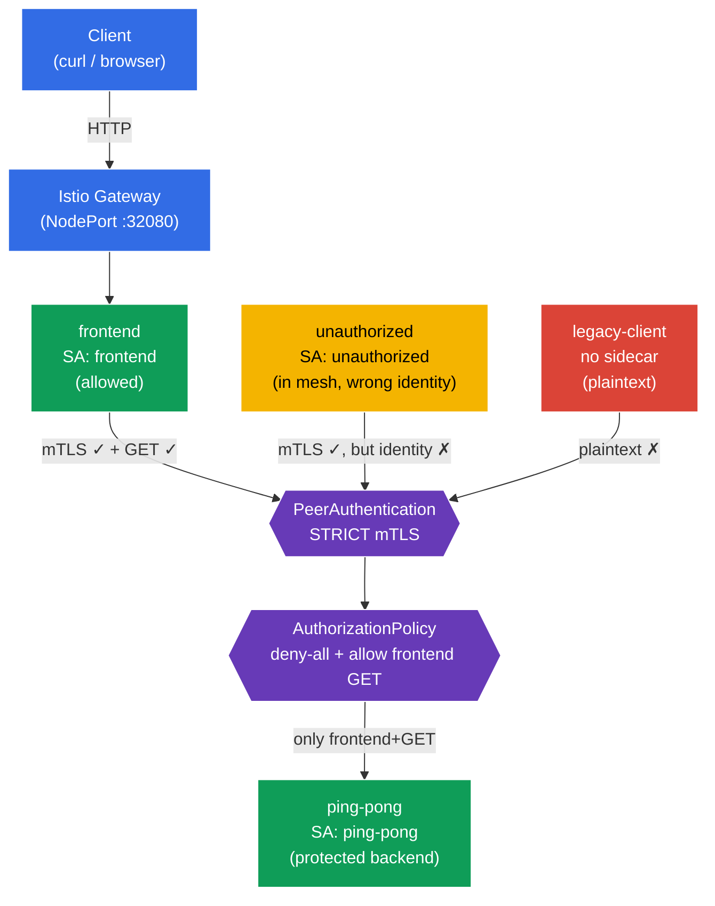

[RU version](README_RU.MD) · [Versión en español](README_ES.MD) · [Version française](README_FR.MD) · [Deutsche Version](README_DE.MD)

# Lab 04 - Zero Trust: mTLS (PeerAuthentication) + AuthorizationPolicy

Imagine you have a `ping-pong` backend holding sensitive data. By default, any pod inside the cluster can reach any service over the network - a flat, trusted network. We want to build a **Zero Trust** model ("never trust, always verify"): first, all service-to-service traffic must be encrypted and authenticated (mTLS); second, **only** the frontend may call the backend, and **only** with `GET`. Everything else is denied.

In this lab we do this at the infrastructure level, without touching application code: first we enable **STRICT mTLS** via `PeerAuthentication`, then we lock the backend down with a **deny-all** policy and selectively open access with an `AuthorizationPolicy`.

## Objective

Understand two key Istio security mechanisms:
- **PeerAuthentication (mTLS)** - mutual TLS authentication between services. Answers the question **"can the communication channel be trusted?"** (encryption + verifying the caller's identity).
- **AuthorizationPolicy** - request authorization. Answers the question **"is this client allowed to perform this specific action?"** (who, where, which method, which path).

A Gateway has been created at: http://myapp.local:32080

### How It Works (High-Level Overview)



## Infrastructure

The environment is provisioned in AWS (`eu-north-1`) using Terragrunt and includes:

| Component  | Description                                       |
|------------|---------------------------------------------------|
| `vpc`      | VPC `10.10.0.0/16` with public subnets            |
| `ssh-keys` | SSH keys for node access                          |
| `k8s-1`    | Kubernetes `1.35.2` (kubeadm) with Istio installed |
| `worker`   | Workstation with `kubectl` and cluster access     |

Instances: `t4g.medium` (master), Ubuntu `22.04`

## Provisioning

```bash
TASK=04 make run_ica_task
```

## Step 1. Enable Sidecar Injection

Label the `default` namespace so that Istio automatically injects the Envoy sidecar proxy into every pod:

```bash
kubectl label namespace default istio-injection=enabled --overwrite
```

**What this does:** Istio uses the sidecar pattern. When a namespace carries the `istio-injection=enabled` label, an `istio-proxy` (Envoy) container is added to every pod, intercepting all of the pod's network traffic. It's Envoy that performs mTLS encryption and enforces authorization rules - without any application code change.

**Important:** we deliberately do **not** label the `legacy` namespace. The pod there stays without a sidecar and communicates the old way, in plaintext. Later this lets us clearly show how STRICT mTLS rejects such connections.

## Step 2. Deploy the Application

```bash
kubectl apply -f https://raw.githubusercontent.com/ViktorUJ/cks/refs/heads/master/tasks/ica/labs/04/k8s-1/scripts/1.yaml
kubectl rollout restart deployment -n default
```

**What gets deployed:**
- **`ping-pong`** (namespace `default`, ServiceAccount `ping-pong`) - the protected backend.
- **`frontend`** (namespace `default`, ServiceAccount `frontend`) - the legitimate client. On each incoming request it calls `http://ping-pong:8080/`.
- **`unauthorized`** (namespace `default`, ServiceAccount `unauthorized`) - a client **inside the mesh** (it has a sidecar, mTLS works) but with the "wrong" identity. Used to demonstrate authorization denial.
- **`legacy-client`** (namespace `legacy`, **no** sidecar) - a legacy client that speaks plaintext. Used to demonstrate mTLS denial.

**Key concept - identity.** Each pod gets a cryptographic identity derived from its ServiceAccount, in SPIFFE format:
`spiffe://cluster.local/ns/<namespace>/sa/<serviceaccount>`.
Istio uses this identity both to encrypt traffic (mTLS) and to make authorization decisions. That's why every service in the manifest has an explicit `serviceAccountName` - it's not boilerplate, it's the foundation of the whole security model.

Verify the pods in `default` came up with the Envoy sidecar (`2/2`), and `legacy-client` without it (`1/1`):

```bash
kubectl get pods -n default
kubectl get pods -n legacy
```

```
# default
NAME                            READY   STATUS    RESTARTS   AGE
frontend-...                    2/2     Running   0          30s
ping-pong-...                   2/2     Running   0          30s
unauthorized-...                2/2     Running   0          30s
# legacy
legacy-client-...               1/1     Running   0          30s
```

## Step 3. Entry Point: Gateway and VirtualService

To observe behaviour from the outside, create an entry point: the Gateway accepts traffic for `myapp.local`, the VirtualService routes it to `frontend`.

```bash
vim gateway.yaml
```

```yaml
apiVersion: networking.istio.io/v1
kind: Gateway
metadata:
  name: main-gateway
  namespace: default
spec:
  selector:
    istio: ingressgateway
  servers:
  - port:
      number: 80
      name: http
      protocol: HTTP
    hosts:
    - "myapp.local"
```

```bash
vim frontend-vs.yaml
```

```yaml
apiVersion: networking.istio.io/v1
kind: VirtualService
metadata:
  name: frontend-vs
  namespace: default
spec:
  hosts:
  - "myapp.local"
  gateways:
  - main-gateway
  http:
  - route:
    - destination:
        host: frontend
        port:
          number: 8080
```

```bash
kubectl apply -f gateway.yaml
kubectl apply -f frontend-vs.yaml
```

On every request `frontend` calls `ping-pong` and prints a `Backend Status` line - this is our signal: `200` means the backend responded, `403` means authorization denied access.

## Step 4. Baseline Check (before security policies)

By default Istio runs in **PERMISSIVE** mode: the backend accepts both encrypted (mTLS) and plaintext traffic, and authorization is unrestricted. Let's confirm that right now **everyone** can reach the backend:

```bash
# 1) the legitimate frontend (via Gateway)
curl -s http://myapp.local:32080 | grep 'Backend Status'
```
```
Backend Status   : 200
```

```bash
# 2) a foreign client inside the mesh
kubectl exec -n default deploy/unauthorized -c curl -- \
  curl -s -o /dev/null -w "%{http_code}\n" http://ping-pong:8080/
```
```
200
```

```bash
# 3) a legacy client without a sidecar (plaintext)
kubectl exec -n legacy deploy/legacy-client -c curl -- \
  curl -s -o /dev/null -w "%{http_code}\n" http://ping-pong.default:8080/
```
```
200
```

All three get `200`. The network is flat - no protection at all. Time to tighten the screws.

## Step 5. STRICT mTLS - Encrypt and Authenticate the Channel

`PeerAuthentication` controls how services accept incoming connections. `STRICT` mode means: **accept mTLS traffic only**, reject any plaintext.

```bash
vim peer-auth.yaml
```

```yaml
apiVersion: security.istio.io/v1
kind: PeerAuthentication
metadata:
  name: default          # name "default" + no selector = namespace-wide policy
  namespace: default
spec:
  mtls:
    mode: STRICT
```

```bash
kubectl apply -f peer-auth.yaml
```

**Breakdown:**
- **`PeerAuthentication`** configures authentication at the transport (peer-to-peer) layer. It's about the **communication channel**, not a specific HTTP request.
- **`mode: STRICT`** - the backend's Envoy will accept only mutually authenticated TLS connections. Istio (via istiod) automatically issues and rotates the mTLS certificates for every pod with a sidecar.
- **Name `default` with no `selector`** - an Istio convention: such a policy applies to the whole namespace. Add `selector.matchLabels` and it applies only to the selected pods (as in the mock-exam task targeting `app=space`).

Check what changed:

```bash
# legacy without a sidecar -> the channel is no longer accepted
kubectl exec -n legacy deploy/legacy-client -c curl -- \
  curl -s -o /dev/null -w "%{http_code}\n" --max-time 5 http://ping-pong.default:8080/
```
```
000      # connection reset - plaintext rejected
```

```bash
# frontend and unauthorized still work: they have sidecars, mTLS is established
curl -s http://myapp.local:32080 | grep 'Backend Status'          # 200
kubectl exec -n default deploy/unauthorized -c curl -- \
  curl -s -o /dev/null -w "%{http_code}\n" http://ping-pong:8080/  # 200
```

**Takeaway:** STRICT mTLS cut off `legacy-client` - it couldn't even establish a connection. But `unauthorized` still gets through: it has a valid mTLS identity. mTLS verifies that the peer **can be trusted as a mesh member**, but it does not restrict **what** that peer is allowed to do. That's the job of authorization - the next step.

## Step 6. Default-deny - Lock the Backend Down for Everyone

The Zero Trust principle: deny everything first, then selectively allow what's needed. Create an `AuthorizationPolicy` that selects the `ping-pong` backend but contains **no `rules` at all**. In Istio this means "deny every request to the selected pods".

```bash
vim deny-all.yaml
```

```yaml
apiVersion: security.istio.io/v1
kind: AuthorizationPolicy
metadata:
  name: ping-pong-deny-all
  namespace: default
spec:
  selector:
    matchLabels:
      app: ping-pong   # the policy applies only to the backend pods
  action: ALLOW
  # no rules => nothing matches => everything is denied (403)
```

```bash
kubectl apply -f deny-all.yaml
```

**Why does `action: ALLOW` with no rules mean deny?** Istio's logic: as soon as at least one `ALLOW` policy applies to a pod, the principle becomes "only what is explicitly listed in `rules` is allowed". With no rules, nothing matches, and every request gets `403`.

> You could also use `action: DENY` with an empty rule, but the canonical "default-deny" pattern in Istio is exactly an empty `ALLOW` policy. It's often applied namespace-wide (`spec: {}`); here we scoped it to the backend only via `selector` so as not to affect the `Gateway -> frontend` traffic.

Verify - now everyone is blocked, even the legitimate frontend:

```bash
curl -s http://myapp.local:32080 | grep 'Backend Status'          # 403
kubectl exec -n default deploy/unauthorized -c curl -- \
  curl -s -o /dev/null -w "%{http_code}\n" http://ping-pong:8080/  # 403
```

The backend is fully isolated. All that's left is to open exactly the one path we need.

## Step 7. Allow - Only the Frontend, Only GET

Add a second `AuthorizationPolicy` that allows access to `ping-pong` **only** for requests:
- from the frontend's identity (principal) - `cluster.local/ns/default/sa/frontend`;
- using the `GET` method.

```bash
vim allow-frontend.yaml
```

```yaml
apiVersion: security.istio.io/v1
kind: AuthorizationPolicy
metadata:
  name: ping-pong-allow-frontend
  namespace: default
spec:
  selector:
    matchLabels:
      app: ping-pong
  action: ALLOW
  rules:
  - from:
    - source:
        principals: ["cluster.local/ns/default/sa/frontend"]  # WHO: the frontend identity
    to:
    - operation:
        methods: ["GET"]                                       # WHAT: GET only
```

```bash
kubectl apply -f allow-frontend.yaml
```

**Breaking down the rule:**
- **`from.source.principals`** - *who* the caller is. Here it's the frontend's SPIFFE identity. This identity is proven precisely by the mTLS from Step 5 - without mTLS, Istio wouldn't know who is really on the other end of the connection. That's why mTLS and AuthorizationPolicy work as a pair.
- **`to.operation.methods`** - *what* is allowed. Only the HTTP `GET` method is permitted. A `POST` from the same frontend would be rejected.
- The `allow` policy combines with the `deny-all` from Step 6 with OR semantics: a request passes if **at least one** `ALLOW` policy permits it. So for `ping-pong` exactly one combination is now "open": frontend + GET.

## Step 8. Final Verification

```bash
# Legitimate frontend (frontend SA, GET) -> allowed
curl -s http://myapp.local:32080 | grep 'Backend Status'
```
```
Backend Status   : 200
```

```bash
# Foreign client inside the mesh (unauthorized SA) -> denied by authorization
kubectl exec -n default deploy/unauthorized -c curl -- \
  curl -s -o /dev/null -w "%{http_code}\n" http://ping-pong:8080/
```
```
403      # RBAC: access denied
```

```bash
# Legacy without a sidecar -> cut off at the mTLS layer
kubectl exec -n legacy deploy/legacy-client -c curl -- \
  curl -s -o /dev/null -w "%{http_code}\n" --max-time 5 http://ping-pong.default:8080/
```
```
000      # connection reset
```

## Summary

| Layer | Resource | What we did | Result |
|-------|----------|-------------|--------|
| Transport | `PeerAuthentication` (STRICT) | Require mTLS for all incoming connections | plaintext client (`legacy`) cut off |
| Authorization | `AuthorizationPolicy` (deny-all) | Denied all requests to the backend | even the frontend gets 403 |
| Authorization | `AuthorizationPolicy` (allow) | Allowed only `frontend` + `GET` | only the legitimate path works |

**Key takeaway:** mTLS and AuthorizationPolicy are two distinct, complementary layers of defense:
- **PeerAuthentication (mTLS)** answers "**can the channel be trusted, and who is on the other end?**" - encryption and authentication.
- **AuthorizationPolicy** answers "**what exactly is this client allowed to do?**" - authorization by identity, path, and method.

Authorization is built on top of the identity that mTLS provides: without mutual authentication, a `principals: [.../sa/frontend]` rule couldn't be reliably verified. Together they deliver a Zero Trust model - all at the infrastructure level, without a single line of application code.
