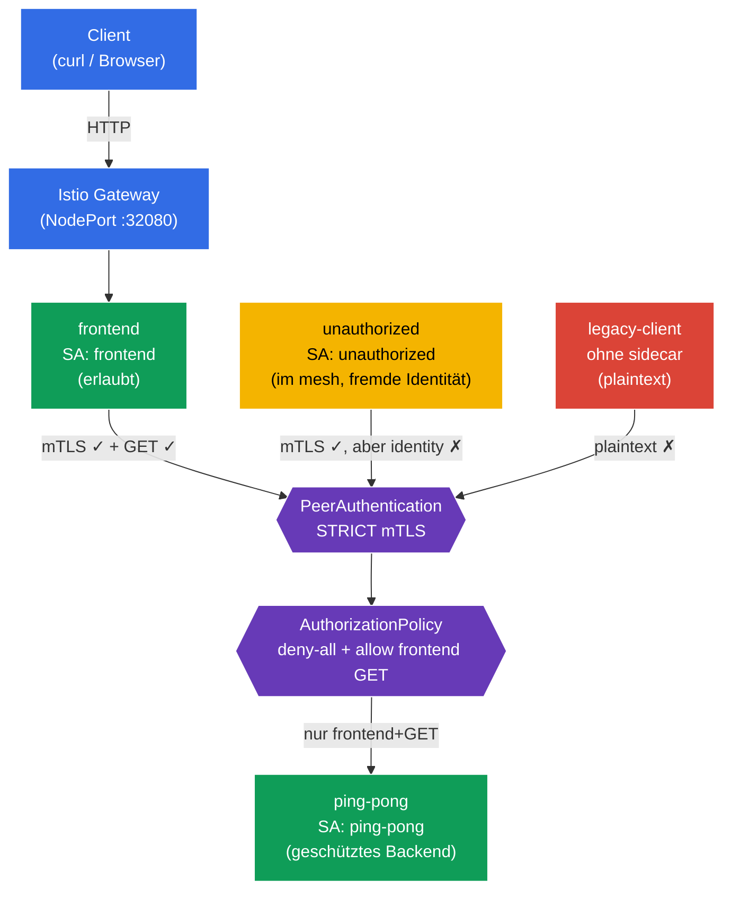

[RU version](README_RU.MD) · [Eng version](README.MD) · [Versión en español](README_ES.MD) · [Version française](README_FR.MD)

# Lab 04 - Zero Trust: mTLS (PeerAuthentication) + AuthorizationPolicy

Stellen Sie sich vor: Sie haben ein Backend `ping-pong`, in dem sensible Daten liegen. Standardmäßig kann innerhalb des Clusters jeder Pod jeden Service über das Netzwerk erreichen - das ist ein "flaches" vertrauenswürdiges Netzwerk. Wir müssen ein **Zero-Trust**-Modell aufbauen ("vertraue niemandem"): Erstens muss der gesamte Datenverkehr zwischen den Services verschlüsselt und authentifiziert sein (mTLS), und zweitens darf **nur** das Frontend und **nur** per `GET` auf das Backend zugreifen. Alles andere ist verboten.

In dieser Übung machen wir das auf Infrastrukturebene, ohne den Anwendungscode zu ändern: Zuerst aktivieren wir **STRICT mTLS** über `PeerAuthentication`, dann schließen wir das Backend mit einer **deny-all**-Policy und öffnen den Zugriff gezielt über `AuthorizationPolicy`.

## Ziel

Zwei zentrale Sicherheitsmechanismen von Istio verstehen:
- **PeerAuthentication (mTLS)** - gegenseitige TLS-Authentifizierung zwischen Services. Beantwortet die Frage **"Kann man dem Kommunikationskanal vertrauen?"** (Verschlüsselung + Überprüfung der Identität des Absenders).
- **AuthorizationPolicy** - Autorisierung von Anfragen. Beantwortet die Frage **"Hat dieser Client das Recht, genau diese Aktion auszuführen?"** (wer, wohin, mit welcher Methode, über welchen Pfad).

Erstelltes Gateway: http://myapp.local:32080

### Wie es funktioniert (Gesamtschema)



## Infrastruktur

Die Umgebung wird in AWS (`eu-north-1`) über Terragrunt bereitgestellt und besteht aus:

| Komponente  | Beschreibung                                      |
|------------|---------------------------------------------------|
| `vpc`      | VPC `10.10.0.0/16` mit öffentlichen Subnetzen          |
| `ssh-keys` | SSH-Schlüssel für den Zugriff auf die Nodes                      |
| `k8s-1`    | Kubernetes `1.35.2` (kubeadm) mit installiertem Istio |
| `worker`   | Arbeitsmaschine mit `kubectl` und Zugriff auf den Cluster   |

Instanzen: `t4g.medium` (master) Ubuntu `22.04`

## Deployment

```bash
TASK=04 make run_ica_task
```

## Schritt 1. Aktivierung der Sidecar-Injektion

Wir fügen dem Namespace `default` ein Label hinzu, um die automatische Injektion des Sidecar-Proxys Envoy zu ermöglichen:

```bash
kubectl label namespace default istio-injection=enabled --overwrite
```

**Was das bewirkt:** Istio arbeitet nach dem Prinzip des Sidecar-Patterns. Wenn am Namespace das Label `istio-injection=enabled` gesetzt ist, wird jedem Pod der Container `istio-proxy` (Envoy) hinzugefügt, der den gesamten Netzwerkverkehr des Pods abfängt. Genau Envoy führt die mTLS-Verschlüsselung durch und wendet die Autorisierungsregeln an - ohne Änderung des Anwendungscodes.

**Wichtig:** Den Namespace `legacy` versehen wir bewusst **nicht** mit dem Label. Ein Pod darin bleibt ohne Sidecar und kommuniziert "auf die alte Art", im Klartext (plaintext). Später hilft das anschaulich zu zeigen, wie STRICT mTLS solche Verbindungen abschneidet.

## Schritt 2. Installation der Anwendung

```bash
kubectl apply -f https://raw.githubusercontent.com/ViktorUJ/cks/refs/heads/master/tasks/ica/labs/04/k8s-1/scripts/1.yaml
kubectl rollout restart deployment -n default
```

**Was bereitgestellt wird:**
- **`ping-pong`** (Namespace `default`, ServiceAccount `ping-pong`) - das zu schützende Backend.
- **`frontend`** (Namespace `default`, ServiceAccount `frontend`) - legitimer Client. Ruft bei jeder eingehenden Anfrage `http://ping-pong:8080/` auf.
- **`unauthorized`** (Namespace `default`, ServiceAccount `unauthorized`) - ein Client **innerhalb des mesh** (mit Sidecar, mTLS funktioniert), aber mit "fremder" Identität. Wird benötigt, um die Ablehnung auf Autorisierungsebene zu zeigen.
- **`legacy-client`** (Namespace `legacy`, **ohne** Sidecar) - ein veralteter Client, der plaintext kommuniziert. Wird benötigt, um die Ablehnung auf mTLS-Ebene zu zeigen.

**Zentrale Idee - identity (Identität).** Jeder Pod erhält eine kryptografische Identität auf Basis seines ServiceAccounts im SPIFFE-Format:
`spiffe://cluster.local/ns/<namespace>/sa/<serviceaccount>`.
Genau anhand dieser Identität verschlüsselt Istio den Datenverkehr (mTLS) und trifft Autorisierungsentscheidungen. Deshalb ist im Manifest bei jedem Service ein eigener `serviceAccountName` eingetragen - das ist keine Formalität, sondern die Grundlage des gesamten Sicherheitsmodells.

Wir überprüfen, dass die Pods in `default` mit dem Envoy-Proxy gestartet sind (`2/2`) und `legacy-client` ohne (`1/1`):

```bash
kubectl get pods -n default
kubectl get pods -n legacy
```

```
# default
NAME                            READY   STATUS    RESTARTS   AGE
frontend-...                    2/2     Running   0          30s
ping-pong-...                   2/2     Running   0          30s
unauthorized-...                2/2     Running   0          30s
# legacy
legacy-client-...               1/1     Running   0          30s
```

## Schritt 3. Eintrittspunkt: Gateway und VirtualService

Um das Verhalten von außen zu beobachten, erstellen wir einen Eingang: Das Gateway nimmt Datenverkehr auf `myapp.local` an, der VirtualService leitet ihn an `frontend` weiter.

```bash
vim gateway.yaml
```

```yaml
apiVersion: networking.istio.io/v1
kind: Gateway
metadata:
  name: main-gateway
  namespace: default
spec:
  selector:
    istio: ingressgateway
  servers:
  - port:
      number: 80
      name: http
      protocol: HTTP
    hosts:
    - "myapp.local"
```

```bash
vim frontend-vs.yaml
```

```yaml
apiVersion: networking.istio.io/v1
kind: VirtualService
metadata:
  name: frontend-vs
  namespace: default
spec:
  hosts:
  - "myapp.local"
  gateways:
  - main-gateway
  http:
  - route:
    - destination:
        host: frontend
        port:
          number: 8080
```

```bash
kubectl apply -f gateway.yaml
kubectl apply -f frontend-vs.yaml
```

`frontend` erreicht bei jeder Anfrage `ping-pong` und gibt die Zeile `Backend Status` aus - das ist unser Indikator: `200` bedeutet, dass das Backend geantwortet hat, `403`, dass der Zugriff durch die Autorisierung verweigert wurde.

## Schritt 4. Basis-Überprüfung (vor den Sicherheitsrichtlinien)

Standardmäßig arbeitet Istio im Modus **PERMISSIVE**: Das Backend nimmt sowohl verschlüsselten (mTLS) als auch offenen (plaintext) Datenverkehr an, und die Autorisierung ist in keiner Weise eingeschränkt. Wir vergewissern uns, dass jetzt **alle** das Backend erreichen:

```bash
# 1) legitimes Frontend (über Gateway)
curl -s http://myapp.local:32080 | grep 'Backend Status'
```
```
Backend Status   : 200
```

```bash
# 2) fremder Client innerhalb des mesh
kubectl exec -n default deploy/unauthorized -c curl -- \
  curl -s -o /dev/null -w "%{http_code}\n" http://ping-pong:8080/
```
```
200
```

```bash
# 3) legacy-Client ohne sidecar (plaintext)
kubectl exec -n legacy deploy/legacy-client -c curl -- \
  curl -s -o /dev/null -w "%{http_code}\n" http://ping-pong.default:8080/
```
```
200
```

Alle drei erhalten `200`. Das Netzwerk ist "flach" - es gibt keinerlei Schutz. Jetzt ziehen wir die Schrauben an.

## Schritt 5. STRICT mTLS - wir verschlüsseln und authentifizieren den Kanal

`PeerAuthentication` steuert, wie Services eingehende Verbindungen annehmen. Der Modus `STRICT` bedeutet: **nur mTLS-Datenverkehr annehmen**, jeden plaintext ablehnen.

```bash
vim peer-auth.yaml
```

```yaml
apiVersion: security.istio.io/v1
kind: PeerAuthentication
metadata:
  name: default          # Name "default" + fehlender selector = Policy für den gesamten Namespace
  namespace: default
spec:
  mtls:
    mode: STRICT
```

```bash
kubectl apply -f peer-auth.yaml
```

**Analyse:**
- **`PeerAuthentication`** konfiguriert die Authentifizierung auf Transportebene (peer-to-peer). Es geht um den **Kommunikationskanal**, nicht um eine konkrete HTTP-Anfrage.
- **`mode: STRICT`** - der Envoy des Backends nimmt nur gegenseitig authentifizierte TLS-Verbindungen an. Die Zertifikate für mTLS stellt Istio automatisch aus und rotiert sie (über istiod) für jeden Pod mit Sidecar.
- **Name `default` ohne `selector`** - das ist eine Istio-Konvention: Eine solche Policy gilt für den gesamten Namespace. Wenn man `selector.matchLabels` hinzufügt, wirkt die Policy nur auf die ausgewählten Pods (wie in der Aufgabe der Mock-Prüfung mit `app=space`).

Wir überprüfen, was sich geändert hat:

```bash
# legacy ohne sidecar -> Kanal wird nicht mehr angenommen
kubectl exec -n legacy deploy/legacy-client -c curl -- \
  curl -s -o /dev/null -w "%{http_code}\n" --max-time 5 http://ping-pong.default:8080/
```
```
000      # Verbindung zurückgesetzt (connection reset) - plaintext abgelehnt
```

```bash
# Frontend und unauthorized funktionieren weiterhin: sie haben einen sidecar, mTLS wird aufgebaut
curl -s http://myapp.local:32080 | grep 'Backend Status'        # 200
kubectl exec -n default deploy/unauthorized -c curl -- \
  curl -s -o /dev/null -w "%{http_code}\n" http://ping-pong:8080/  # 200
```

**Schlussfolgerung:** STRICT mTLS hat `legacy-client` abgeschnitten - er konnte nicht einmal eine Verbindung aufbauen. Aber `unauthorized` kommt weiterhin durch: Er hat eine gültige mTLS-Identität. mTLS überprüft, dass dem Gegenüber **als Teilnehmer des mesh vertraut werden kann**, schränkt aber nicht ein, **was genau** ihm erlaubt ist. Dafür ist die Autorisierung zuständig - der nächste Schritt.

## Schritt 6. Default-deny - wir schließen das Backend für alle

Das Zero-Trust-Prinzip: zuerst alles verbieten, dann gezielt das Notwendige erlauben. Wir erstellen eine `AuthorizationPolicy`, die das Backend `ping-pong` auswählt, aber **keine einzige Regel** `rules` enthält. In Istio bedeutet das "alle Anfragen an die ausgewählten Pods verbieten".

```bash
vim deny-all.yaml
```

```yaml
apiVersion: security.istio.io/v1
kind: AuthorizationPolicy
metadata:
  name: ping-pong-deny-all
  namespace: default
spec:
  selector:
    matchLabels:
      app: ping-pong   # Policy wirkt nur auf die Backend-Pods
  action: ALLOW
  # rules fehlen => keine Anfrage passt => alles verboten (403)
```

```bash
kubectl apply -f deny-all.yaml
```

**Warum bedeutet `action: ALLOW` ohne Regeln ein Verbot?** Die Logik von Istio ist folgende: Sobald an einem Pod mindestens eine `ALLOW`-Policy hängt, gilt das Prinzip "erlaubt ist nur das, was explizit in `rules` aufgeführt ist". Wenn es keine Regeln gibt - passt nichts, und alle Anfragen erhalten `403`.

> Man könnte auch `action: DENY` mit einer leeren Regel verwenden, aber das kanonische "default-deny"-Pattern in Istio ist genau eine leere `ALLOW`-Policy. Oft wird sie für den gesamten Namespace erstellt (`spec: {}`); wir haben den Geltungsbereich jedoch über `selector` nur auf das Backend beschränkt, um den Datenverkehr `Gateway -> frontend` nicht zu beeinträchtigen.

Wir überprüfen - jetzt sind alle geschlossen, sogar das legitime Frontend:

```bash
curl -s http://myapp.local:32080 | grep 'Backend Status'        # 403
kubectl exec -n default deploy/unauthorized -c curl -- \
  curl -s -o /dev/null -w "%{http_code}\n" http://ping-pong:8080/  # 403
```

Das Backend ist vollständig isoliert. Es bleibt, genau einen benötigten Pfad zu öffnen.

## Schritt 7. Allow - wir lassen nur das Frontend und nur GET durch

Wir fügen eine zweite `AuthorizationPolicy` hinzu, die den Zugriff auf `ping-pong` **nur** für Anfragen erlaubt:
- von der Identität (principal) des Frontends - `cluster.local/ns/default/sa/frontend`;
- mit der Methode `GET`.

```bash
vim allow-frontend.yaml
```

```yaml
apiVersion: security.istio.io/v1
kind: AuthorizationPolicy
metadata:
  name: ping-pong-allow-frontend
  namespace: default
spec:
  selector:
    matchLabels:
      app: ping-pong
  action: ALLOW
  rules:
  - from:
    - source:
        principals: ["cluster.local/ns/default/sa/frontend"]  # WER: Identität des Frontends
    to:
    - operation:
        methods: ["GET"]                                       # WAS: nur GET
```

```bash
kubectl apply -f allow-frontend.yaml
```

**Analyse der Regel:**
- **`from.source.principals`** - *wer* der Absender ist. Hier ist die SPIFFE-Identität des Frontends angegeben. Diese Identität wird genau durch mTLS aus Schritt 5 bestätigt - ohne mTLS wüsste Istio nicht, wer tatsächlich auf der anderen Seite der Verbindung steht. Deshalb arbeiten mTLS und AuthorizationPolicy im Verbund.
- **`to.operation.methods`** - *was* erlaubt ist. Erlaubt ist nur die HTTP-Methode `GET`. Eine `POST`-Anfrage desselben Frontends kommt bereits nicht mehr durch.
- Die `allow`-Policy wird mit der `deny-all` aus Schritt 6 nach dem OR-Prinzip kombiniert: Eine Anfrage kommt durch, wenn sie von **mindestens einer** `ALLOW`-Policy erlaubt wird. Für `ping-pong` ist jetzt also genau eine Kombination "offen": Frontend + GET.

## Schritt 8. Abschließende Überprüfung

```bash
# Legitimes Frontend (frontend SA, GET) -> erlaubt
curl -s http://myapp.local:32080 | grep 'Backend Status'
```
```
Backend Status   : 200
```

```bash
# Fremder Client innerhalb des mesh (unauthorized SA) -> durch Autorisierung verboten
kubectl exec -n default deploy/unauthorized -c curl -- \
  curl -s -o /dev/null -w "%{http_code}\n" http://ping-pong:8080/
```
```
403      # RBAC: access denied
```

```bash
# Legacy ohne sidecar -> wird bereits auf mTLS-Ebene abgeschnitten
kubectl exec -n legacy deploy/legacy-client -c curl -- \
  curl -s -o /dev/null -w "%{http_code}\n" --max-time 5 http://ping-pong.default:8080/
```
```
000      # connection reset
```

## Fazit

| Schicht | Ressource | Was wir gemacht haben | Ergebnis |
|------|--------|-------------|-----------|
| Transport | `PeerAuthentication` (STRICT) | mTLS für alle eingehenden Verbindungen verlangt | plaintext-Client (`legacy`) abgeschnitten |
| Autorisierung | `AuthorizationPolicy` (deny-all) | Alle Anfragen an das Backend verboten | sogar das Frontend erhält 403 |
| Autorisierung | `AuthorizationPolicy` (allow) | Nur `frontend` + `GET` erlaubt | nur der legitime Pfad funktioniert |

**Zentrale Erkenntnis:** mTLS und AuthorizationPolicy sind zwei verschiedene Schutzebenen, die sich gegenseitig ergänzen:
- **PeerAuthentication (mTLS)** beantwortet die Frage "**Kann man dem Kanal vertrauen und wer ist am anderen Ende?**" - Verschlüsselung und Authentifizierung.
- **AuthorizationPolicy** beantwortet die Frage "**Was genau ist diesem Client erlaubt?**" - Autorisierung nach Identität, Pfad und Methode.

Die Autorisierung baut auf der Identität auf, die mTLS liefert: Ohne gegenseitige Authentifizierung ließe sich die Regel `principals: [.../sa/frontend]` nicht zuverlässig überprüfen. Zusammen ergeben sie ein Zero-Trust-Modell - und das alles auf Infrastrukturebene, ohne eine einzige Zeile im Anwendungscode.
