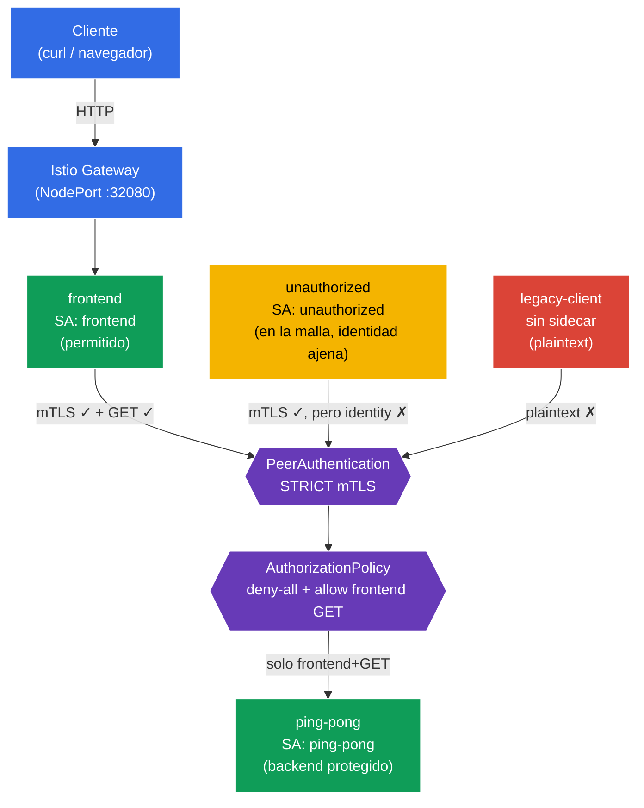

[RU version](README_RU.MD) · [Eng version](README.MD)

# Lab 04 - Zero Trust: mTLS (PeerAuthentication) + AuthorizationPolicy

Imagina: tienes un backend `ping-pong` en el que hay datos sensibles. Por defecto, dentro del clúster cualquier pod puede alcanzar cualquier servicio por la red: es una red de confianza "plana". Necesitamos construir un modelo **Zero Trust** ("no confíes en nadie"): en primer lugar, todo el tráfico entre servicios debe estar cifrado y autenticado (mTLS), y en segundo lugar, tiene derecho a comunicarse con el backend **solo** el frontend y **solo** mediante `GET`. Todo lo demás está prohibido.

En este laboratorio lo haremos a nivel de infraestructura, sin cambiar el código de la aplicación: primero activaremos **STRICT mTLS** mediante `PeerAuthentication`, luego cerraremos el backend con una política **deny-all** y abriremos el acceso de forma puntual mediante `AuthorizationPolicy`.

## Objetivo

Entender dos mecanismos de seguridad clave de Istio:
- **PeerAuthentication (mTLS)** - autenticación TLS mutua entre servicios. Responde a la pregunta **"¿se puede confiar en el canal de comunicación?"** (cifrado + verificación de la identidad del remitente).
- **AuthorizationPolicy** - autorización de solicitudes. Responde a la pregunta **"¿tiene este cliente derecho a realizar precisamente esta acción?"** (quién, hacia dónde, con qué método, por qué ruta).

Gateway creado: http://myapp.local:32080

### Cómo funciona (esquema general)



## Paso 1. Activación de la inyección de sidecar

Añadimos una label al namespace `default` para la inyección automática del sidecar proxy Envoy:

```bash
kubectl label namespace default istio-injection=enabled --overwrite
```

**Qué hace esto:** Istio funciona según el patrón sidecar. Cuando el namespace tiene la label `istio-injection=enabled`, en cada pod se añade el contenedor `istio-proxy` (Envoy), que intercepta todo el tráfico de red del pod. Es precisamente Envoy quien realiza el cifrado mTLS y aplica las reglas de autorización, sin modificar el código de la aplicación.

**Importante:** el namespace `legacy` intencionadamente **no** lo etiquetamos. El pod que hay en él quedará sin sidecar y se comunicará "a la antigua", en texto plano (plaintext). Más adelante esto ayudará a mostrar de forma clara cómo STRICT mTLS corta ese tipo de conexiones.

## Paso 2. Instalación de la aplicación

```bash
kubectl apply -f https://raw.githubusercontent.com/ViktorUJ/cks/refs/heads/master/tasks/ica/labs/04/k8s-1/scripts/1.yaml
kubectl rollout restart deployment -n default
```

**Qué se despliega:**
- **`ping-pong`** (namespace `default`, ServiceAccount `ping-pong`) - el backend a proteger.
- **`frontend`** (namespace `default`, ServiceAccount `frontend`) - cliente legítimo. En cada solicitud entrante llama a `http://ping-pong:8080/`.
- **`unauthorized`** (namespace `default`, ServiceAccount `unauthorized`) - cliente **dentro de la malla** (con sidecar, mTLS funciona), pero con una identidad "ajena". Sirve para mostrar el rechazo a nivel de autorización.
- **`legacy-client`** (namespace `legacy`, **sin** sidecar) - cliente obsoleto que se comunica en plaintext. Sirve para mostrar el rechazo a nivel de mTLS.

**Idea clave - identity (identidad).** Cada pod recibe una identidad criptográfica basada en su ServiceAccount en formato SPIFFE:
`spiffe://cluster.local/ns/<namespace>/sa/<serviceaccount>`.
Es precisamente por esta identidad que Istio cifrará el tráfico (mTLS) y tomará decisiones de autorización. Por eso en el manifiesto cada servicio tiene su propio `serviceAccountName`: no es una formalidad, sino la base de todo el modelo de seguridad.

Verificamos que los pods en `default` se hayan levantado con el proxy Envoy (`2/2`), y `legacy-client` sin él (`1/1`):

```bash
kubectl get pods -n default
kubectl get pods -n legacy
```

```
# default
NAME                            READY   STATUS    RESTARTS   AGE
frontend-...                    2/2     Running   0          30s
ping-pong-...                   2/2     Running   0          30s
unauthorized-...                2/2     Running   0          30s
# legacy
legacy-client-...               1/1     Running   0          30s
```

## Paso 3. Punto de entrada: Gateway y VirtualService

Para observar el comportamiento desde fuera, creamos la entrada: el Gateway acepta tráfico en `myapp.local`, el VirtualService lo dirige al `frontend`.

```bash
vim gateway.yaml
```

```yaml
apiVersion: networking.istio.io/v1
kind: Gateway
metadata:
  name: main-gateway
  namespace: default
spec:
  selector:
    istio: ingressgateway
  servers:
  - port:
      number: 80
      name: http
      protocol: HTTP
    hosts:
    - "myapp.local"
```

```bash
vim frontend-vs.yaml
```

```yaml
apiVersion: networking.istio.io/v1
kind: VirtualService
metadata:
  name: frontend-vs
  namespace: default
spec:
  hosts:
  - "myapp.local"
  gateways:
  - main-gateway
  http:
  - route:
    - destination:
        host: frontend
        port:
          number: 8080
```

```bash
kubectl apply -f gateway.yaml
kubectl apply -f frontend-vs.yaml
```

`frontend`, en cada solicitud, se comunica con `ping-pong` e imprime la línea `Backend Status`: es nuestro indicador: `200` significa que el backend respondió, `403` que la autorización denegó el acceso.

## Paso 4. Comprobación básica (antes de las políticas de seguridad)

Por defecto, Istio funciona en modo **PERMISSIVE**: el backend acepta tanto tráfico cifrado (mTLS) como abierto (plaintext), y la autorización no está restringida de ningún modo. Nos aseguramos de que ahora **todos** alcanzan el backend:

```bash
# 1) frontend legítimo (a través del Gateway)
curl -s http://myapp.local:32080 | grep 'Backend Status'
```
```
Backend Status   : 200
```

```bash
# 2) cliente ajeno dentro de la malla
kubectl exec -n default deploy/unauthorized -c curl -- \
  curl -s -o /dev/null -w "%{http_code}\n" http://ping-pong:8080/
```
```
200
```

```bash
# 3) cliente legacy sin sidecar (plaintext)
kubectl exec -n legacy deploy/legacy-client -c curl -- \
  curl -s -o /dev/null -w "%{http_code}\n" http://ping-pong.default:8080/
```
```
200
```

Los tres reciben `200`. La red es "plana", no hay ninguna protección. Empezamos a apretar las tuercas.

## Paso 5. STRICT mTLS - ciframos y autenticamos el canal

`PeerAuthentication` gestiona cómo los servicios aceptan las conexiones entrantes. El modo `STRICT` significa: **aceptar solo tráfico mTLS**, rechazar cualquier plaintext.

```bash
vim peer-auth.yaml
```

```yaml
apiVersion: security.istio.io/v1
kind: PeerAuthentication
metadata:
  name: default          # nombre "default" + ausencia de selector = política para todo el namespace
  namespace: default
spec:
  mtls:
    mode: STRICT
```

```bash
kubectl apply -f peer-auth.yaml
```

**Análisis:**
- **`PeerAuthentication`** configura la autenticación a nivel de transporte (peer-to-peer). Es sobre el **canal de comunicación**, no sobre una solicitud HTTP concreta.
- **`mode: STRICT`** - el Envoy del backend solo aceptará conexiones TLS mutuamente autenticadas. Los certificados para mTLS los emite y rota Istio automáticamente (a través de istiod) para cada pod con sidecar.
- **Nombre `default` sin `selector`** - es una convención de Istio: dicha política se aplica a todo el namespace. Si se añade `selector.matchLabels`, la política actuará solo sobre los pods seleccionados (como en la tarea del examen mock con `app=space`).

Verificamos qué ha cambiado:

```bash
# legacy sin sidecar -> el canal ya no se acepta
kubectl exec -n legacy deploy/legacy-client -c curl -- \
  curl -s -o /dev/null -w "%{http_code}\n" --max-time 5 http://ping-pong.default:8080/
```
```
000      # conexión reiniciada (connection reset) - plaintext rechazado
```

```bash
# frontend y unauthorized siguen funcionando: tienen sidecar, mTLS se establece
curl -s http://myapp.local:32080 | grep 'Backend Status'        # 200
kubectl exec -n default deploy/unauthorized -c curl -- \
  curl -s -o /dev/null -w "%{http_code}\n" http://ping-pong:8080/  # 200
```

**Conclusión:** STRICT mTLS cortó a `legacy-client`: ni siquiera pudo establecer la conexión. Pero `unauthorized` sigue pasando: tiene una identidad mTLS válida. mTLS comprueba que se puede **confiar en el interlocutor como participante de la malla**, pero no limita **qué exactamente** se le permite hacer. De eso se encarga la autorización, el siguiente paso.

## Paso 6. Default-deny - cerramos el backend para todos

Principio de Zero Trust: primero prohibimos todo, luego permitimos de forma puntual lo necesario. Creamos una `AuthorizationPolicy` que selecciona el backend `ping-pong`, pero **no contiene ni una sola regla** `rules`. En Istio esto significa "prohibir todas las solicitudes a los pods seleccionados".

```bash
vim deny-all.yaml
```

```yaml
apiVersion: security.istio.io/v1
kind: AuthorizationPolicy
metadata:
  name: ping-pong-deny-all
  namespace: default
spec:
  selector:
    matchLabels:
      app: ping-pong   # la política actúa solo sobre los pods del backend
  action: ALLOW
  # rules ausente => ninguna solicitud coincide => todo prohibido (403)
```

```bash
kubectl apply -f deny-all.yaml
```

**¿Por qué `action: ALLOW` sin reglas = prohibición?** La lógica de Istio es la siguiente: en cuanto se cuelga sobre un pod al menos una política `ALLOW`, actúa el principio "solo se permite lo que está explícitamente enumerado en `rules`". Si no hay reglas, no coincide nada, y todas las solicitudes reciben `403`.

> Se podría haber hecho también `action: DENY` con una regla vacía, pero el patrón canónico "default-deny" en Istio es precisamente una política `ALLOW` vacía. A menudo se hace para todo el namespace (`spec: {}`), pero nosotros limitamos el alcance solo al backend mediante `selector`, para no afectar al tráfico `Gateway -> frontend`.

Verificamos: ahora están cerrados todos, incluso el frontend legítimo:

```bash
curl -s http://myapp.local:32080 | grep 'Backend Status'        # 403
kubectl exec -n default deploy/unauthorized -c curl -- \
  curl -s -o /dev/null -w "%{http_code}\n" http://ping-pong:8080/  # 403
```

El backend está completamente aislado. Solo queda abrir exactamente la única ruta necesaria.

## Paso 7. Allow - dejamos pasar solo al frontend y solo GET

Añadimos una segunda `AuthorizationPolicy` que permite el acceso a `ping-pong` **solo** a las solicitudes:
- de la identidad (principal) del frontend - `cluster.local/ns/default/sa/frontend`;
- con el método `GET`.

```bash
vim allow-frontend.yaml
```

```yaml
apiVersion: security.istio.io/v1
kind: AuthorizationPolicy
metadata:
  name: ping-pong-allow-frontend
  namespace: default
spec:
  selector:
    matchLabels:
      app: ping-pong
  action: ALLOW
  rules:
  - from:
    - source:
        principals: ["cluster.local/ns/default/sa/frontend"]  # QUIÉN: la identidad del frontend
    to:
    - operation:
        methods: ["GET"]                                       # QUÉ: solo GET
```

```bash
kubectl apply -f allow-frontend.yaml
```

**Análisis de la regla:**
- **`from.source.principals`** - *quién* es el remitente. Aquí se indica la identidad SPIFFE del frontend. Esta identidad se confirma precisamente gracias al mTLS del paso 5: sin mTLS, Istio no sabría quién está realmente al otro lado de la conexión. Por eso mTLS y AuthorizationPolicy funcionan en conjunto.
- **`to.operation.methods`** - *qué* se puede hacer. Solo se permite el método HTTP `GET`. Una solicitud `POST` del mismo frontend ya no pasará.
- La política `allow` se combina con `deny-all` del paso 6 según el principio OR: la solicitud pasa si la permite **al menos una** política `ALLOW`. Es decir, para `ping-pong` ahora está "abierta" exactamente una combinación: frontend + GET.

## Paso 8. Comprobación final

```bash
# Frontend legítimo (SA frontend, GET) -> permitido
curl -s http://myapp.local:32080 | grep 'Backend Status'
```
```
Backend Status   : 200
```

```bash
# Cliente ajeno dentro de la malla (SA unauthorized) -> denegado por la autorización
kubectl exec -n default deploy/unauthorized -c curl -- \
  curl -s -o /dev/null -w "%{http_code}\n" http://ping-pong:8080/
```
```
403      # RBAC: access denied
```

```bash
# Legacy sin sidecar -> cortado ya a nivel de mTLS
kubectl exec -n legacy deploy/legacy-client -c curl -- \
  curl -s -o /dev/null -w "%{http_code}\n" --max-time 5 http://ping-pong.default:8080/
```
```
000      # connection reset
```

## Conclusión

| Capa | Recurso | Qué hicimos | Resultado |
|------|--------|-------------|-----------|
| Transporte | `PeerAuthentication` (STRICT) | Exigimos mTLS para todas las conexiones entrantes | el cliente plaintext (`legacy`) queda cortado |
| Autorización | `AuthorizationPolicy` (deny-all) | Prohibimos todas las solicitudes al backend | incluso el frontend recibe 403 |
| Autorización | `AuthorizationPolicy` (allow) | Permitimos solo `frontend` + `GET` | funciona únicamente la ruta legítima |

**Conclusión clave:** mTLS y AuthorizationPolicy son dos niveles de protección distintos que se complementan entre sí:
- **PeerAuthentication (mTLS)** responde a la pregunta "**¿se puede confiar en el canal y quién está al otro extremo?**" - cifrado y autenticación.
- **AuthorizationPolicy** responde a la pregunta "**¿qué exactamente se le permite a este cliente?**" - autorización por identidad, ruta y método.

La autorización se construye sobre la identity que proporciona mTLS: sin autenticación mutua, la regla `principals: [.../sa/frontend]` no podría verificarse de forma fiable. Juntos dan el modelo Zero Trust, y todo ello a nivel de infraestructura, sin una sola línea en el código de la aplicación.
