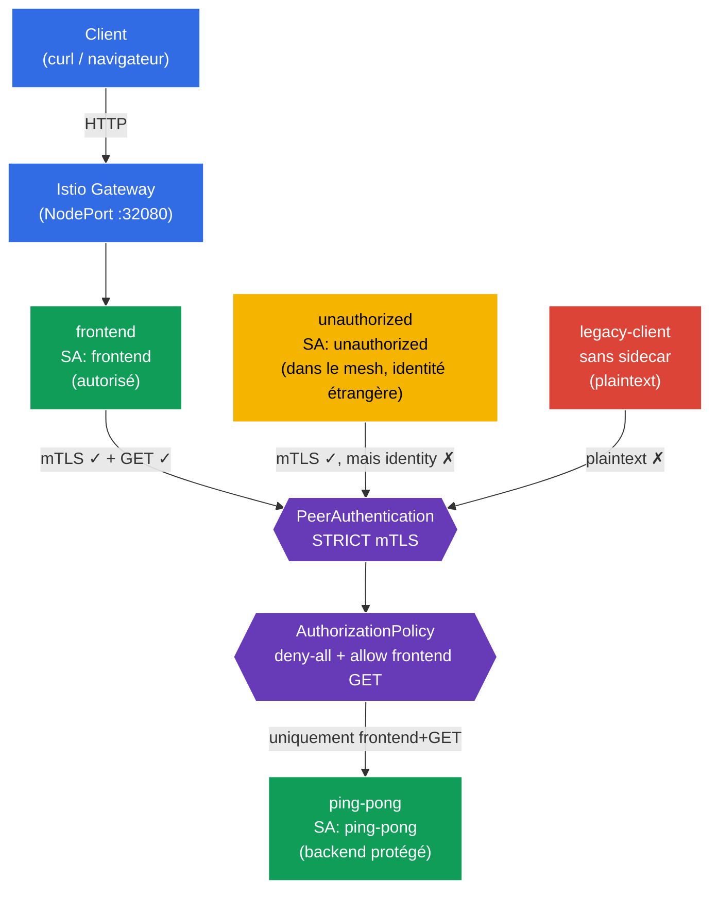

[RU version](README_RU.MD) · [Eng version](README.MD) · [Versión en español](README_ES.MD) · [Deutsche Version](README_DE.MD)

# Lab 04 - Zero Trust : mTLS (PeerAuthentication) + AuthorizationPolicy

Imaginez : vous avez un backend `ping-pong` qui contient des données sensibles. Par défaut, à l'intérieur du cluster, n'importe quel pod peut atteindre n'importe quel service par le réseau - c'est un réseau « plat » de confiance. Nous devons construire un modèle **Zero Trust** (« ne fais confiance à personne ») : d'une part, tout le trafic entre les services doit être chiffré et authentifié (mTLS), et d'autre part, seul le frontend a le droit de s'adresser au backend et **uniquement** via `GET`. Tout le reste est interdit.

Dans ce travail pratique, nous ferons cela au niveau de l'infrastructure, sans modifier le code de l'application : d'abord nous activerons le **STRICT mTLS** via `PeerAuthentication`, puis nous fermerons le backend avec une politique **deny-all** et ouvrirons l'accès de façon ciblée via `AuthorizationPolicy`.

## Objectif

Comprendre deux mécanismes clés de sécurité d'Istio :
- **PeerAuthentication (mTLS)** - authentification TLS mutuelle entre services. Répond à la question **« peut-on faire confiance au canal de communication ? »** (chiffrement + vérification de l'identité de l'émetteur).
- **AuthorizationPolicy** - autorisation des requêtes. Répond à la question **« ce client a-t-il le droit d'effectuer précisément cette action ? »** (qui, vers où, par quelle méthode, sur quel chemin).

Gateway créé : http://myapp.local:32080

### Comment ça marche (schéma général)



## Étape 1. Activation de l'injection de sidecar

On ajoute un label sur le namespace `default` pour l'injection automatique du sidecar proxy Envoy :

```bash
kubectl label namespace default istio-injection=enabled --overwrite
```

**Ce que cela fait :** Istio fonctionne selon le principe du pattern sidecar. Lorsque le namespace porte le label `istio-injection=enabled`, un conteneur `istio-proxy` (Envoy) est ajouté à chaque pod, qui intercepte tout le trafic réseau du pod. C'est justement Envoy qui réalise le chiffrement mTLS et applique les règles d'autorisation - sans modifier le code de l'application.

**Important :** nous ne marquons volontairement **pas** le namespace `legacy`. Le pod qu'il contient restera sans sidecar et communiquera « à l'ancienne », en texte clair (plaintext). Plus tard, cela aidera à montrer concrètement comment le STRICT mTLS coupe de telles connexions.

## Étape 2. Installation de l'application

```bash
kubectl apply -f https://raw.githubusercontent.com/ViktorUJ/cks/refs/heads/master/tasks/ica/labs/04/k8s-1/scripts/1.yaml
kubectl rollout restart deployment -n default
```

**Ce qui est déployé :**
- **`ping-pong`** (namespace `default`, ServiceAccount `ping-pong`) - backend à protéger.
- **`frontend`** (namespace `default`, ServiceAccount `frontend`) - client légitime. À chaque requête entrante, il appelle `http://ping-pong:8080/`.
- **`unauthorized`** (namespace `default`, ServiceAccount `unauthorized`) - client **à l'intérieur du mesh** (avec sidecar, mTLS fonctionne), mais avec une identité « étrangère ». Nécessaire pour montrer le refus au niveau de l'autorisation.
- **`legacy-client`** (namespace `legacy`, **sans** sidecar) - client obsolète qui communique en plaintext. Nécessaire pour montrer le refus au niveau du mTLS.

**Idée clé - identity (identité).** Chaque pod reçoit une identité cryptographique basée sur son ServiceAccount au format SPIFFE :
`spiffe://cluster.local/ns/<namespace>/sa/<serviceaccount>`.
C'est sur cette identité qu'Istio chiffrera le trafic (mTLS) et prendra les décisions d'autorisation. C'est pourquoi, dans le manifeste, chaque service a son propre `serviceAccountName` - ce n'est pas une formalité, mais la base de tout le modèle de sécurité.

On vérifie que les pods dans `default` sont démarrés avec le proxy Envoy (`2/2`), tandis que `legacy-client` est sans (`1/1`) :

```bash
kubectl get pods -n default
kubectl get pods -n legacy
```

```
# default
NAME                            READY   STATUS    RESTARTS   AGE
frontend-...                    2/2     Running   0          30s
ping-pong-...                   2/2     Running   0          30s
unauthorized-...                2/2     Running   0          30s
# legacy
legacy-client-...               1/1     Running   0          30s
```

## Étape 3. Point d'entrée : Gateway et VirtualService

Pour observer le comportement depuis l'extérieur, on crée une entrée : le Gateway reçoit le trafic sur `myapp.local`, le VirtualService le dirige vers `frontend`.

```bash
vim gateway.yaml
```

```yaml
apiVersion: networking.istio.io/v1
kind: Gateway
metadata:
  name: main-gateway
  namespace: default
spec:
  selector:
    istio: ingressgateway
  servers:
  - port:
      number: 80
      name: http
      protocol: HTTP
    hosts:
    - "myapp.local"
```

```bash
vim frontend-vs.yaml
```

```yaml
apiVersion: networking.istio.io/v1
kind: VirtualService
metadata:
  name: frontend-vs
  namespace: default
spec:
  hosts:
  - "myapp.local"
  gateways:
  - main-gateway
  http:
  - route:
    - destination:
        host: frontend
        port:
          number: 8080
```

```bash
kubectl apply -f gateway.yaml
kubectl apply -f frontend-vs.yaml
```

`frontend`, à chaque requête, s'adresse à `ping-pong` et affiche la ligne `Backend Status` - c'est notre indicateur : `200` signifie que le backend a répondu, `403` que l'accès est interdit par l'autorisation.

## Étape 4. Vérification de base (avant les politiques de sécurité)

Par défaut, Istio fonctionne en mode **PERMISSIVE** : le backend accepte le trafic chiffré (mTLS) comme le trafic ouvert (plaintext), et l'autorisation n'est en rien restreinte. Vérifions que pour l'instant **tous** atteignent le backend :

```bash
# 1) frontend légitime (via le Gateway)
curl -s http://myapp.local:32080 | grep 'Backend Status'
```
```
Backend Status   : 200
```

```bash
# 2) client étranger à l'intérieur du mesh
kubectl exec -n default deploy/unauthorized -c curl -- \
  curl -s -o /dev/null -w "%{http_code}\n" http://ping-pong:8080/
```
```
200
```

```bash
# 3) client legacy sans sidecar (plaintext)
kubectl exec -n legacy deploy/legacy-client -c curl -- \
  curl -s -o /dev/null -w "%{http_code}\n" http://ping-pong.default:8080/
```
```
200
```

Les trois obtiennent `200`. Le réseau est « plat » - aucune protection. On commence à serrer les boulons.

## Étape 5. STRICT mTLS - on chiffre et on authentifie le canal

`PeerAuthentication` gère la façon dont les services acceptent les connexions entrantes. Le mode `STRICT` signifie : **n'accepter que le trafic mTLS**, rejeter tout plaintext.

```bash
vim peer-auth.yaml
```

```yaml
apiVersion: security.istio.io/v1
kind: PeerAuthentication
metadata:
  name: default          # nom "default" + absence de selector = politique sur tout le namespace
  namespace: default
spec:
  mtls:
    mode: STRICT
```

```bash
kubectl apply -f peer-auth.yaml
```

**Analyse :**
- **`PeerAuthentication`** configure l'authentification au niveau du transport (peer-to-peer). Cela concerne le **canal de communication**, et non une requête HTTP précise.
- **`mode: STRICT`** - l'Envoy du backend n'acceptera que les connexions TLS mutuellement authentifiées. Les certificats pour le mTLS sont émis et renouvelés automatiquement par Istio (via istiod) pour chaque pod avec sidecar.
- **Nom `default` sans `selector`** - c'est une convention d'Istio : une telle politique s'applique à tout le namespace. Si l'on ajoute `selector.matchLabels`, la politique n'agira que sur les pods sélectionnés (comme dans la tâche de l'examen blanc avec `app=space`).

On vérifie ce qui a changé :

```bash
# legacy sans sidecar -> le canal n'est plus accepté
kubectl exec -n legacy deploy/legacy-client -c curl -- \
  curl -s -o /dev/null -w "%{http_code}\n" --max-time 5 http://ping-pong.default:8080/
```
```
000      # connexion réinitialisée (connection reset) - plaintext rejeté
```

```bash
# frontend et unauthorized fonctionnent toujours : ils ont un sidecar, le mTLS s'établit
curl -s http://myapp.local:32080 | grep 'Backend Status'        # 200
kubectl exec -n default deploy/unauthorized -c curl -- \
  curl -s -o /dev/null -w "%{http_code}\n" http://ping-pong:8080/  # 200
```

**Conclusion :** le STRICT mTLS a coupé `legacy-client` - il n'a même pas pu établir de connexion. Mais `unauthorized` passe toujours : il a une identité mTLS valide. Le mTLS vérifie qu'on **peut faire confiance à l'interlocuteur en tant que participant du mesh**, mais ne restreint pas **ce qui** lui est permis de faire. C'est l'autorisation qui s'en charge - étape suivante.

## Étape 6. Default-deny - on ferme le backend pour tous

Principe du Zero Trust : d'abord on interdit tout, puis on autorise de façon ciblée ce qui est nécessaire. On crée une `AuthorizationPolicy` qui sélectionne le backend `ping-pong`, mais **ne contient aucune règle** `rules`. Dans Istio, cela signifie « interdire toutes les requêtes vers les pods sélectionnés ».

```bash
vim deny-all.yaml
```

```yaml
apiVersion: security.istio.io/v1
kind: AuthorizationPolicy
metadata:
  name: ping-pong-deny-all
  namespace: default
spec:
  selector:
    matchLabels:
      app: ping-pong   # la politique n'agit que sur les pods du backend
  action: ALLOW
  # rules absentes => aucune requête ne correspond => tout est interdit (403)
```

```bash
kubectl apply -f deny-all.yaml
```

**Pourquoi `action: ALLOW` sans règles = interdiction ?** La logique d'Istio est la suivante : dès qu'au moins une politique `ALLOW` est attachée à un pod, le principe « n'est autorisé que ce qui est explicitement énuméré dans `rules` » s'applique. S'il n'y a pas de règles - rien ne correspond, et toutes les requêtes obtiennent un `403`.

> On aurait aussi pu faire un `action: DENY` avec une règle vide, mais le pattern canonique « default-deny » dans Istio est justement une politique `ALLOW` vide. On la fait souvent sur tout le namespace (`spec: {}`), tandis que nous avons limité la portée au seul backend via `selector`, pour ne pas affecter le trafic `Gateway -> frontend`.

On vérifie - maintenant tous sont fermés, même le frontend légitime :

```bash
curl -s http://myapp.local:32080 | grep 'Backend Status'        # 403
kubectl exec -n default deploy/unauthorized -c curl -- \
  curl -s -o /dev/null -w "%{http_code}\n" http://ping-pong:8080/  # 403
```

Le backend est complètement isolé. Il reste à ouvrir exactement le seul chemin nécessaire.

## Étape 7. Allow - on laisse passer uniquement le frontend et uniquement GET

On ajoute une deuxième `AuthorizationPolicy` qui autorise l'accès à `ping-pong` **uniquement** aux requêtes :
- provenant de l'identité (principal) du frontend - `cluster.local/ns/default/sa/frontend` ;
- avec la méthode `GET`.

```bash
vim allow-frontend.yaml
```

```yaml
apiVersion: security.istio.io/v1
kind: AuthorizationPolicy
metadata:
  name: ping-pong-allow-frontend
  namespace: default
spec:
  selector:
    matchLabels:
      app: ping-pong
  action: ALLOW
  rules:
  - from:
    - source:
        principals: ["cluster.local/ns/default/sa/frontend"]  # QUI : identité du frontend
    to:
    - operation:
        methods: ["GET"]                                       # QUOI : uniquement GET
```

```bash
kubectl apply -f allow-frontend.yaml
```

**Analyse de la règle :**
- **`from.source.principals`** - *qui* est l'émetteur. Ici est indiquée l'identité SPIFFE du frontend. Cette identité est confirmée précisément grâce au mTLS de l'étape 5 - sans mTLS, Istio ne saurait pas qui se trouve réellement de l'autre côté de la connexion. Voilà pourquoi le mTLS et l'AuthorizationPolicy fonctionnent en tandem.
- **`to.operation.methods`** - *ce que* l'on peut faire. Seule la méthode HTTP `GET` est autorisée. Une requête `POST` du même frontend ne passera pas.
- La politique `allow` se combine avec le `deny-all` de l'étape 6 selon le principe OU : la requête passe si **au moins une** politique `ALLOW` l'autorise. Autrement dit, pour `ping-pong`, une seule combinaison est désormais « ouverte » : frontend + GET.

## Étape 8. Vérification finale

```bash
# Frontend légitime (frontend SA, GET) -> autorisé
curl -s http://myapp.local:32080 | grep 'Backend Status'
```
```
Backend Status   : 200
```

```bash
# Client étranger dans le mesh (unauthorized SA) -> interdit par l'autorisation
kubectl exec -n default deploy/unauthorized -c curl -- \
  curl -s -o /dev/null -w "%{http_code}\n" http://ping-pong:8080/
```
```
403      # RBAC: access denied
```

```bash
# Legacy sans sidecar -> coupé dès le niveau mTLS
kubectl exec -n legacy deploy/legacy-client -c curl -- \
  curl -s -o /dev/null -w "%{http_code}\n" --max-time 5 http://ping-pong.default:8080/
```
```
000      # connection reset
```

## Bilan

| Couche | Ressource | Ce que l'on a fait | Résultat |
|------|--------|-------------|-----------|
| Transport | `PeerAuthentication` (STRICT) | Exigé le mTLS pour toutes les connexions entrantes | client plaintext (`legacy`) coupé |
| Autorisation | `AuthorizationPolicy` (deny-all) | Interdit toutes les requêtes vers le backend | même le frontend obtient 403 |
| Autorisation | `AuthorizationPolicy` (allow) | Autorisé uniquement `frontend` + `GET` | seul le chemin légitime fonctionne |

**Conclusion clé :** le mTLS et l'AuthorizationPolicy sont deux niveaux de protection différents qui se complètent :
- **PeerAuthentication (mTLS)** répond à la question « **peut-on faire confiance au canal et qui se trouve à l'autre bout ?** » - chiffrement et authentification.
- **AuthorizationPolicy** répond à la question « **qu'est-ce qui est exactement permis à ce client ?** » - autorisation par identité, chemin et méthode.

L'autorisation est construite par-dessus l'identity que fournit le mTLS : sans authentification mutuelle, la règle `principals: [.../sa/frontend]` ne pourrait pas être vérifiée de façon fiable. Ensemble, ils donnent un modèle Zero Trust - et tout cela au niveau de l'infrastructure, sans une seule ligne dans le code de l'application.
