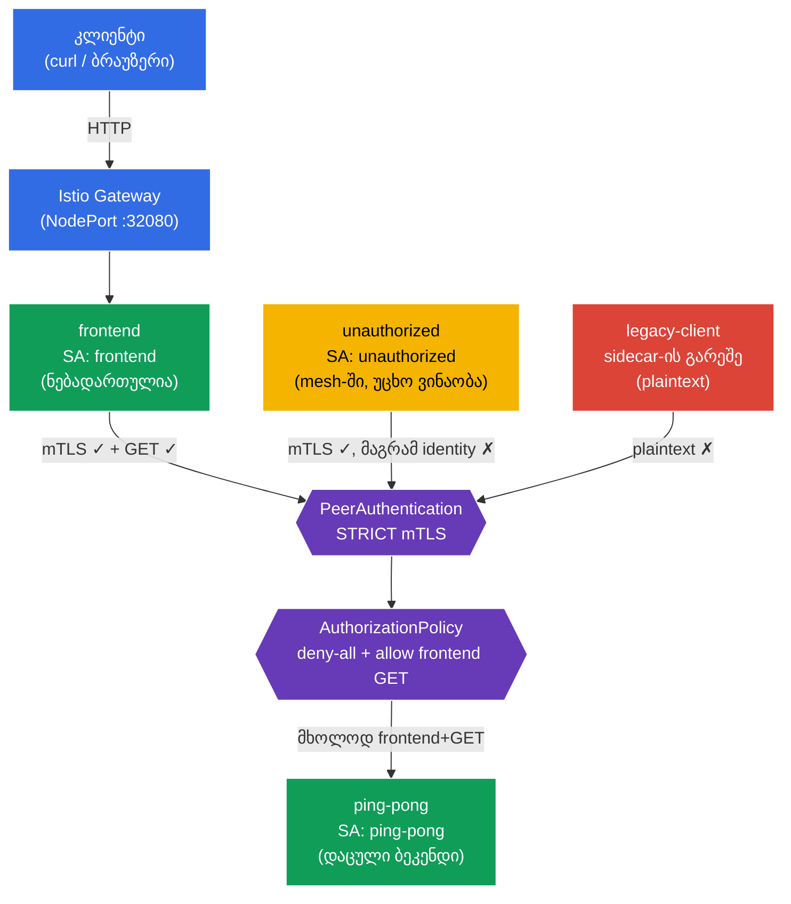

[Русская версия](README_RU.MD) · [Eng version](README.MD) · [Versión en español](README_ES.MD) · [Version française](README_FR.MD) · [Deutsche Version](README_DE.MD) · [繁體中文版](README_TW.MD) · [日本語版](README_JP.MD)

# Lab 04 - Zero Trust: mTLS (PeerAuthentication) + AuthorizationPolicy

> [საცნობარო გადაწყვეტა](worker/files/solutions/1_GE.MD)

წარმოიდგინეთ: გაქვთ ბეკენდი `ping-pong`, რომელშიც სენსიტიური მონაცემებია შენახული. ნაგულისხმევად, კლასტერის შიგნით ნებისმიერ პოდს შეუძლია ქსელის საშუალებით ნებისმიერ სერვისს დაუკავშირდეს - ეს „ბრტყელი“ სანდო ქსელია. ჩვენ უნდა ავაგოთ **Zero Trust** („არავის ენდო“) მოდელი: პირველ რიგში, სერვისებს შორის მთელი ტრაფიკი უნდა იყოს დაშიფრული და ავთენტიფიცირებული (mTLS), ხოლო მეორე მხრივ, ბეკენდთან მიმართვის უფლება უნდა ჰქონდეს **მხოლოდ** ფრონტენდს და **მხოლოდ** `GET`-ის საშუალებით. ყველაფერი დანარჩენი აკრძალულია.

ამ ლაბორატორიულ სამუშაოში ამას ინფრასტრუქტურის დონეზე, აპლიკაციის კოდის შეცვლის გარეშე გავაკეთებთ: ჯერ `PeerAuthentication`-ის საშუალებით ჩავრთავთ **STRICT mTLS**-ს, შემდეგ **deny-all** პოლიტიკით დავხურავთ ბეკენდს და `AuthorizationPolicy`-ის საშუალებით ზუსტად განსაზღვრულ წვდომას გავხსნით.

## მიზანი

Istio-ს უსაფრთხოების ორი საკვანძო მექანიზმის გაცნობა:
- **PeerAuthentication (mTLS)** - სერვისებს შორის ორმხრივი TLS-ავთენტიფიკაცია. პასუხობს კითხვას: **„შეიძლება თუ არა საკომუნიკაციო არხის ნდობა?“** (დაშიფვრა + გამომგზავნის ვინაობის შემოწმება).
- **AuthorizationPolicy** - მოთხოვნების ავტორიზაცია. პასუხობს კითხვას: **„აქვს თუ არა ამ კლიენტს ზუსტად ამ მოქმედების შესრულების უფლება?“** (ვინ, სად, რომელი მეთოდით, რომელ გზაზე).

შექმნილია Gateway: http://myapp.local:32080

### როგორ მუშაობს ეს (ზოგადი სქემა)



## ინფრასტრუქტურა

გარემო Terragrunt-ის საშუალებით AWS-ში (`eu-north-1`) იშლება და შედგება შემდეგი კომპონენტებისგან:

| კომპონენტი | აღწერა |
|------------|--------|
| `vpc`      | VPC `10.10.0.0/16` საჯარო ქვექსელებით |
| `ssh-keys` | ნოდებთან წვდომისთვის საჭირო SSH-გასაღებები |
| `k8s-1`    | Kubernetes `1.35.2` (kubeadm) დაყენებული Istio-თი |
| `worker`   | სამუშაო მანქანა `kubectl`-ითა და კლასტერზე წვდომით |

ინსტანსები: `t4g.medium` (master) Ubuntu `22.04`

## გაშლა

```bash
TASK=04 make run_ica_task
```

## ნაბიჯი 1. sidecar-ინექციის ჩართვა

Envoy sidecar-პროქსის ავტომატური ინექციისთვის `default` namespace-ს ვუმატებთ label-ს:

```bash
kubectl label namespace default istio-injection=enabled --overwrite
```

**რას აკეთებს ეს:** Istio sidecar-პატერნით მუშაობს. როდესაც namespace-ს აქვს ლეიბლი `istio-injection=enabled`, თითოეულ პოდს ემატება კონტეინერი `istio-proxy` (Envoy), რომელიც პოდის მთელ ქსელურ ტრაფიკს იჭერს. სწორედ Envoy ასრულებს mTLS-დაშიფვრას და იყენებს ავტორიზაციის წესებს - აპლიკაციის კოდის შეცვლის გარეშე.

**მნიშვნელოვანია:** namespace `legacy`-ს განზრახ **არ** ვნიშნავთ. მასში არსებული პოდი sidecar-ის გარეშე დარჩება და „ძველი მეთოდით“, ღია ტექსტით (plaintext) იმუშავებს. მოგვიანებით ეს თვალსაჩინოდ დაგვანახებს, როგორ ბლოკავს STRICT mTLS ასეთ კავშირებს.

## ნაბიჯი 2. აპლიკაციის დაყენება

```bash
kubectl apply -f https://raw.githubusercontent.com/ViktorUJ/cks/refs/heads/master/tasks/ica/labs/04/k8s-1/scripts/1.yaml
kubectl rollout restart deployment -n default
```

**რა იშლება:**
- **`ping-pong`** (namespace `default`, ServiceAccount `ping-pong`) - დასაცავი ბეკენდი.
- **`frontend`** (namespace `default`, ServiceAccount `frontend`) - ლეგიტიმური კლიენტი. ყოველ შემომავალ მოთხოვნაზე იძახებს `http://ping-pong:8080/`-ს.
- **`unauthorized`** (namespace `default`, ServiceAccount `unauthorized`) - კლიენტი **mesh-ის შიგნით** (sidecar-ით, mTLS მუშაობს), თუმცა „უცხო“ ვინაობით. საჭიროა ავტორიზაციის დონეზე უარის საჩვენებლად.
- **`legacy-client`** (namespace `legacy`, sidecar-ის **გარეშე**) - მოძველებული კლიენტი, რომელიც plaintext-ით უკავშირდება. საჭიროა mTLS-ის დონეზე უარის საჩვენებლად.

**საკვანძო იდეა - identity (ვინაობა).** თითოეული პოდი საკუთარი ServiceAccount-ის საფუძველზე იღებს კრიპტოგრაფიულ ვინაობას SPIFFE ფორმატში:
`spiffe://cluster.local/ns/<namespace>/sa/<serviceaccount>`.
სწორედ ამ ვინაობის საფუძველზე დაშიფრავს Istio ტრაფიკს (mTLS) და მიიღებს ავტორიზაციის გადაწყვეტილებებს. ამიტომ მანიფესტში თითოეულ სერვისს თავისი `serviceAccountName` აქვს მითითებული - ეს ფორმალობა კი არა, უსაფრთხოების მთელი მოდელის საფუძველია.

ვამოწმებთ, რომ `default`-ში პოდები Envoy-პროქსით (`2/2`) გაეშვა, ხოლო `legacy-client` - მის გარეშე (`1/1`):

```bash
kubectl get pods -n default
kubectl get pods -n legacy
```

```
# default
NAME                            READY   STATUS    RESTARTS   AGE
frontend-...                    2/2     Running   0          30s
ping-pong-...                   2/2     Running   0          30s
unauthorized-...                2/2     Running   0          30s
# legacy
legacy-client-...               1/1     Running   0          30s
```

## ნაბიჯი 3. შესასვლელი წერტილი: Gateway და VirtualService

გარედან ქცევაზე დასაკვირვებლად ვქმნით შესასვლელს: Gateway იღებს ტრაფიკს `myapp.local`-ზე, VirtualService კი მას `frontend`-ისკენ მიმართავს.

```bash
vim gateway.yaml
```

```yaml
apiVersion: networking.istio.io/v1
kind: Gateway
metadata:
  name: main-gateway
  namespace: default
spec:
  selector:
    istio: ingressgateway
  servers:
  - port:
      number: 80
      name: http
      protocol: HTTP
    hosts:
    - "myapp.local"
```

```bash
vim frontend-vs.yaml
```

```yaml
apiVersion: networking.istio.io/v1
kind: VirtualService
metadata:
  name: frontend-vs
  namespace: default
spec:
  hosts:
  - "myapp.local"
  gateways:
  - main-gateway
  http:
  - route:
    - destination:
        host: frontend
        port:
          number: 8080
```

```bash
kubectl apply -f gateway.yaml
kubectl apply -f frontend-vs.yaml
```

ყოველი მოთხოვნისას `frontend` უკავშირდება `ping-pong`-ს და ბეჭდავს სტრიქონს `Backend Status` - ეს ჩვენი ინდიკატორია: `200` ნიშნავს, რომ ბეკენდმა უპასუხა, ხოლო `403` - რომ წვდომა ავტორიზაციამ აკრძალა.

## ნაბიჯი 4. საბაზისო შემოწმება (უსაფრთხოების პოლიტიკებამდე)

ნაგულისხმევად Istio **PERMISSIVE** რეჟიმში მუშაობს: ბეკენდი იღებს როგორც დაშიფრულ (mTLS), ისე ღია (plaintext) ტრაფიკს, ავტორიზაცია კი არაფერს ზღუდავს. დავრწმუნდეთ, რომ ამჟამად ბეკენდამდე **ყველა** აღწევს:

```bash
# 1) ლეგიტიმური ფრონტენდი (Gateway-ის გავლით)
curl -s http://myapp.local:32080 | grep 'Backend Status'
```
```
Backend Status   : 200
```

```bash
# 2) უცხო კლიენტი mesh-ის შიგნით
kubectl exec -n default deploy/unauthorized -c curl -- \
  curl -s -o /dev/null -w "%{http_code}\n" http://ping-pong:8080/
```
```
200
```

```bash
# 3) legacy-კლიენტი sidecar-ის გარეშე (plaintext)
kubectl exec -n legacy deploy/legacy-client -c curl -- \
  curl -s -o /dev/null -w "%{http_code}\n" http://ping-pong.default:8080/
```
```
200
```

სამივე იღებს `200`-ს. ქსელი „ბრტყელია“ - არანაირი დაცვა არ არსებობს. ვიწყებთ შეზღუდვების გამკაცრებას.

## ნაბიჯი 5. STRICT mTLS - არხის დაშიფვრა და ავთენტიფიკაცია

`PeerAuthentication` მართავს, როგორ იღებენ სერვისები შემომავალ კავშირებს. რეჟიმი `STRICT` ნიშნავს: **მხოლოდ mTLS-ტრაფიკის მიღებას**, ნებისმიერი plaintext უარყოფილი იქნება.

```bash
vim peer-auth.yaml
```

```yaml
apiVersion: security.istio.io/v1
kind: PeerAuthentication
metadata:
  name: default          # სახელი "default" + selector-ის არარსებობა = პოლიტიკა მთელ namespace-ზე
  namespace: default
spec:
  mtls:
    mode: STRICT
```

```bash
kubectl apply -f peer-auth.yaml
```

**განხილვა:**
- **`PeerAuthentication`** სატრანსპორტო დონეზე (peer-to-peer) ავთენტიფიკაციას აწყობს. ეს ეხება **საკომუნიკაციო არხს** და არა კონკრეტულ HTTP-მოთხოვნას.
- **`mode: STRICT`** - ბეკენდის Envoy მხოლოდ ორმხრივად ავთენტიფიცირებულ TLS-კავშირებს მიიღებს. mTLS-ის სერტიფიკატებს Istio sidecar-ის მქონე თითოეულ პოდს ავტომატურად გასცემს და უცვლის (istiod-ის საშუალებით).
- **სახელი `default` `selector`-ის გარეშე** - ეს Istio-ს შეთანხმებაა: ასეთი პოლიტიკა მთელ namespace-ზე ვრცელდება. `selector.matchLabels`-ის დამატების შემთხვევაში პოლიტიკა მხოლოდ არჩეულ პოდებზე იმოქმედებს (როგორც mock-გამოცდის დავალებაში `app=space`).

ვამოწმებთ, რა შეიცვალა:

```bash
# legacy sidecar-ის გარეშე -> არხი აღარ მიიღება
kubectl exec -n legacy deploy/legacy-client -c curl -- \
  curl -s -o /dev/null -w "%{http_code}\n" --max-time 5 http://ping-pong.default:8080/
```
```
000      # კავშირი გაწყდა (connection reset) - plaintext უარყოფილია
```

```bash
# ფრონტენდი და unauthorized კვლავ მუშაობენ: მათ აქვთ sidecar, mTLS მყარდება
curl -s http://myapp.local:32080 | grep 'Backend Status'        # 200
kubectl exec -n default deploy/unauthorized -c curl -- \
  curl -s -o /dev/null -w "%{http_code}\n" http://ping-pong:8080/  # 200
```

**დასკვნა:** STRICT mTLS-მა `legacy-client` დაბლოკა - მან კავშირის დამყარებაც კი ვერ შეძლო. მაგრამ `unauthorized` ჯერ კიდევ გადის: მას მოქმედი mTLS-ვინაობა აქვს. mTLS ამოწმებს, რომ თანამოსაუბრეს **შეიძლება ენდო, როგორც mesh-ის მონაწილეს**, მაგრამ არ ზღუდავს, **კონკრეტულად რის** გაკეთება შეუძლია მას. ამაზე ავტორიზაცია აგებს პასუხს - ეს შემდეგი ნაბიჯია.

## ნაბიჯი 6. Default-deny - ბეკენდის ყველასთვის დახურვა

Zero Trust-ის პრინციპია: ჯერ ყველაფერი ავკრძალოთ, შემდეგ კი საჭირო რამ ზუსტად განვსაზღვროთ და დავუშვათ. ვქმნით `AuthorizationPolicy`-ს, რომელიც ირჩევს ბეკენდ `ping-pong`-ს, თუმცა `rules`-ის **არცერთ წესს არ შეიცავს**. Istio-ში ეს ნიშნავს „არჩეული პოდებისკენ ყველა მოთხოვნის აკრძალვას“.

```bash
vim deny-all.yaml
```

```yaml
apiVersion: security.istio.io/v1
kind: AuthorizationPolicy
metadata:
  name: ping-pong-deny-all
  namespace: default
spec:
  selector:
    matchLabels:
      app: ping-pong   # პოლიტიკა მოქმედებს მხოლოდ ბექენდის პოდებზე
  action: ALLOW
  # rules არ არსებობს => არცერთი მოთხოვნა არ ერგება => ყველაფერი აკრძალულია (403)
```

```bash
kubectl apply -f deny-all.yaml
```

**რატომ ნიშნავს `action: ALLOW` წესების გარეშე აკრძალვას?** Istio-ს ლოგიკა ასეთია: როგორც კი პოდზე ერთი `ALLOW`-პოლიტიკა მაინც არის მიბმული, მოქმედებს პრინციპი „ნებადართულია მხოლოდ ის, რაც `rules`-ში ცხადადაა ჩამოთვლილი“. თუ წესები არ არსებობს, არცერთი მოთხოვნა არ ემთხვევა და ყველა მათგანი `403`-ს იღებს.

> შესაძლებელი იქნებოდა `action: DENY`-ისა და ცარიელი წესის გამოყენებაც, მაგრამ Istio-ში „default-deny“-ის კანონიკური პატერნი სწორედ ცარიელი `ALLOW`-პოლიტიკაა. ხშირად მას მთელ namespace-ზე ქმნიან (`spec: {}`), ჩვენ კი მოქმედების არე `selector`-ის საშუალებით მხოლოდ ბეკენდით შევზღუდეთ, რათა `Gateway -> frontend` ტრაფიკს არ შევხებოდით.

ვამოწმებთ - ახლა ყველა დაბლოკილია, ლეგიტიმური ფრონტენდის ჩათვლით:

```bash
curl -s http://myapp.local:32080 | grep 'Backend Status'        # 403
kubectl exec -n default deploy/unauthorized -c curl -- \
  curl -s -o /dev/null -w "%{http_code}\n" http://ping-pong:8080/  # 403
```

ბეკენდი სრულად იზოლირებულია. დარჩა ზუსტად ერთი საჭირო გზის გახსნა.

## ნაბიჯი 7. Allow - მხოლოდ ფრონტენდისა და მხოლოდ GET-ის დაშვება

ვამატებთ მეორე `AuthorizationPolicy`-ს, რომელიც `ping-pong`-ზე წვდომას **მხოლოდ** შემდეგ მოთხოვნებს აძლევს:
- ფრონტენდის ვინაობიდან (principal) - `cluster.local/ns/default/sa/frontend`;
- `GET` მეთოდით.

```bash
vim allow-frontend.yaml
```

```yaml
apiVersion: security.istio.io/v1
kind: AuthorizationPolicy
metadata:
  name: ping-pong-allow-frontend
  namespace: default
spec:
  selector:
    matchLabels:
      app: ping-pong
  action: ALLOW
  rules:
  - from:
    - source:
        principals: ["cluster.local/ns/default/sa/frontend"]  # ვინ: ფრონტენდის ვინაობა
    to:
    - operation:
        methods: ["GET"]                                       # რა: მხოლოდ GET
```

```bash
kubectl apply -f allow-frontend.yaml
```

**წესის განხილვა:**
- **`from.source.principals`** - *ვინ არის* გამომგზავნი. აქ ფრონტენდის SPIFFE-ვინაობაა მითითებული. ეს ვინაობა სწორედ მე-5 ნაბიჯის mTLS-ის საშუალებით დასტურდება - mTLS-ის გარეშე Istio ვერ გაიგებდა, სინამდვილეში ვინ იმყოფება კავშირის მეორე მხარეს. სწორედ ამიტომ მუშაობს mTLS და AuthorizationPolicy ერთობლივად.
- **`to.operation.methods`** - *რისი გაკეთებაა* შესაძლებელი. ნებადართულია მხოლოდ HTTP-მეთოდი `GET`. იმავე ფრონტენდის `POST` მოთხოვნა უკვე ვეღარ გაივლის.
- `allow` პოლიტიკა მე-6 ნაბიჯის `deny-all`-თან OR პრინციპით ერთიანდება: მოთხოვნა გაივლის, თუ მას **ერთი** `ALLOW`-პოლიტიკა მაინც უშვებს. ანუ `ping-pong`-ისთვის ახლა ზუსტად ერთი კომბინაციაა „გახსნილი“: ფრონტენდი + GET.

## ნაბიჯი 8. საბოლოო შემოწმება

```bash
# ლეგიტიმური ფრონტენდი (frontend SA, GET) -> ნებადართულია
curl -s http://myapp.local:32080 | grep 'Backend Status'
```
```
Backend Status   : 200
```

```bash
# უცხო კლიენტი mesh-ის შიგნით (unauthorized SA) -> აკრძალულია ავტორიზაციით
kubectl exec -n default deploy/unauthorized -c curl -- \
  curl -s -o /dev/null -w "%{http_code}\n" http://ping-pong:8080/
```
```
403      # RBAC: access denied
```

```bash
# Legacy sidecar-ის გარეშე -> იჭრება ჯერ კიდევ mTLS-ის დონეზე
kubectl exec -n legacy deploy/legacy-client -c curl -- \
  curl -s -o /dev/null -w "%{http_code}\n" --max-time 5 http://ping-pong.default:8080/
```
```
000      # connection reset
```

## შედეგი

| დონე | რესურსი | რა გავაკეთეთ | შედეგი |
|------|---------|--------------|---------|
| ტრანსპორტი | `PeerAuthentication` (STRICT) | ყველა შემომავალი კავშირისთვის mTLS მოვითხოვეთ | plaintext-კლიენტი (`legacy`) დაბლოკილია |
| ავტორიზაცია | `AuthorizationPolicy` (deny-all) | ბეკენდისკენ ყველა მოთხოვნა ავკრძალეთ | ფრონტენდიც კი იღებს 403-ს |
| ავტორიზაცია | `AuthorizationPolicy` (allow) | მხოლოდ `frontend` + `GET` დავუშვით | მხოლოდ ლეგიტიმური გზა მუშაობს |

**საკვანძო დასკვნა:** mTLS და AuthorizationPolicy დაცვის ორი განსხვავებული დონეა, რომლებიც ერთმანეთს ავსებს:
- **PeerAuthentication (mTLS)** პასუხობს კითხვას: „**შეიძლება თუ არა არხის ნდობა და ვინ არის მეორე მხარეს?**“ - დაშიფვრა და ავთენტიფიკაცია.
- **AuthorizationPolicy** პასუხობს კითხვას: „**კონკრეტულად რის გაკეთება აქვს ამ კლიენტს ნებადართული?**“ - ავტორიზაცია ვინაობის, გზისა და მეთოდის მიხედვით.

Authorization აგებულია identity-ზე, რომელსაც mTLS გვაძლევს: ორმხრივი ავთენტიფიკაციის გარეშე შეუძლებელი იქნებოდა წესის `principals: [.../sa/frontend]` საიმედოდ შემოწმება. ერთად ისინი Zero Trust მოდელს ქმნის - და ეს ყველაფერი ინფრასტრუქტურის დონეზე, აპლიკაციის კოდში ერთი სტრიქონის შეცვლის გარეშეც კი.
