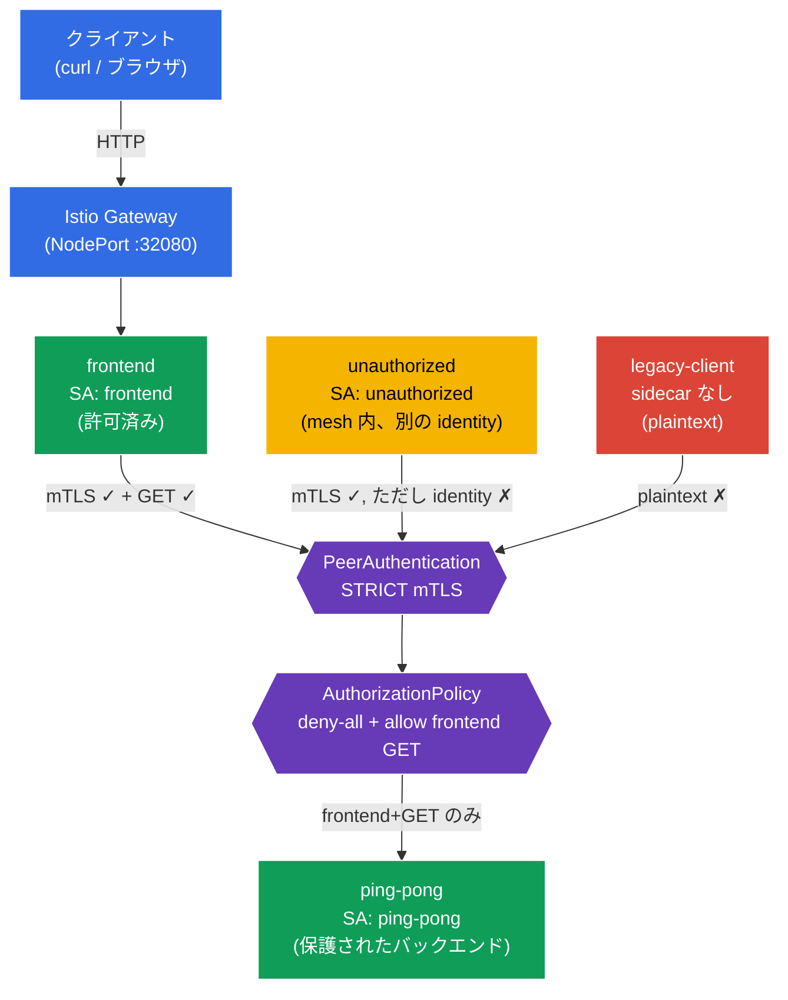

[Русская версия](README_RU.MD) · [Eng version](README.MD) · [Versión en español](README_ES.MD) · [Version française](README_FR.MD) · [Deutsche Version](README_DE.MD) · [ქართული ვერსია](README_GE.MD) · [繁體中文版](README_TW.MD)

# Lab 04 - Zero Trust: mTLS (PeerAuthentication) + AuthorizationPolicy

> [リファレンス解答](worker/files/solutions/1_JP.MD)

想像してみてください。機密データを保持する `ping-pong` バックエンドがあります。デフォルトでは、クラスター内の任意の Pod がネットワーク経由で任意のサービスへ到達できます。これは「フラット」な信頼ネットワークです。ここで **Zero Trust**（「誰も信頼しない」）モデルを構築します。まず、サービス間のすべてのトラフィックを暗号化して認証（mTLS）し、次にバックエンドへアクセスできるのをフロントエンドからの `GET` のみに制限します。それ以外はすべて禁止です。

このラボでは、アプリケーションコードを変更せず、インフラストラクチャ層でこれを実現します。最初に `PeerAuthentication` を使用して **STRICT mTLS** を有効化し、続いて **deny-all** ポリシーでバックエンドを閉じ、`AuthorizationPolicy` で必要なアクセスだけを許可します。

## 目的

Istio の主要な2つのセキュリティ機構を理解します。
- **PeerAuthentication (mTLS)** - サービス間の相互 TLS 認証。**「通信チャネルを信頼できるか？」**（暗号化 + 送信者の本人確認）という問いに答えます。
- **AuthorizationPolicy** - リクエストの認可。**「このクライアントに、この操作を実行する権限があるか？」**（誰が、どこへ、どのメソッドで、どのパスに）という問いに答えます。

作成される Gateway: http://myapp.local:32080

### 仕組み（全体図）



## インフラストラクチャ

環境は AWS（`eu-north-1`）上で Terragrunt によりデプロイされ、次の要素で構成されます。

| コンポーネント | 説明 |
|------------|---------------------------------------------------|
| `vpc`      | パブリックサブネットを持つ VPC `10.10.0.0/16` |
| `ssh-keys` | ノードへアクセスするための SSH キー |
| `k8s-1`    | Istio をインストール済みの Kubernetes `1.35.2`（kubeadm） |
| `worker`   | `kubectl` とクラスターへのアクセスを備えた作業マシン |

インスタンス: `t4g.medium`（master）Ubuntu `22.04`

## デプロイ

```bash
TASK=04 make run_ica_task
```

## ステップ1. sidecar インジェクションを有効化する

Envoy sidecar プロキシを自動インジェクションするため、namespace `default` にラベルを追加します。

```bash
kubectl label namespace default istio-injection=enabled --overwrite
```

**これは何をするのか:** Istio は sidecar パターンで動作します。namespace に `istio-injection=enabled` ラベルがある場合、各 Pod にすべてのネットワークトラフィックを捕捉する `istio-proxy`（Envoy）コンテナが追加されます。アプリケーションコードを変更することなく、mTLS 暗号化と認可ルールの適用を行うのは Envoy です。

**重要:** namespace `legacy` には意図的にラベルを付け**ません**。そこにある Pod は sidecar なしのままで、従来どおり平文（plaintext）で通信します。後で、STRICT mTLS がそのような接続をどのように遮断するかを明確に示すためです。

## ステップ2. アプリケーションをインストールする

```bash
kubectl apply -f https://raw.githubusercontent.com/ViktorUJ/cks/refs/heads/master/tasks/ica/labs/04/k8s-1/scripts/1.yaml
kubectl rollout restart deployment -n default
```

**デプロイされるもの:**
- **`ping-pong`**（namespace `default`、ServiceAccount `ping-pong`）- 保護対象のバックエンドです。
- **`frontend`**（namespace `default`、ServiceAccount `frontend`）- 正規のクライアントです。受信した各リクエストで `http://ping-pong:8080/` を呼び出します。
- **`unauthorized`**（namespace `default`、ServiceAccount `unauthorized`）- **mesh 内**のクライアントです（sidecar あり、mTLS は機能する）が、identity は「別人」です。認可レベルでの拒否を示すために使用します。
- **`legacy-client`**（namespace `legacy`、sidecar **なし**）- plaintext で通信する旧式クライアントです。mTLS レベルでの拒否を示すために使用します。

**重要な考え方 - identity（ID）**。各 Pod は、次の SPIFFE 形式で ServiceAccount に基づく暗号学的 identity を取得します。
`spiffe://cluster.local/ns/<namespace>/sa/<serviceaccount>`。
Istio はこの identity に基づいてトラフィックを暗号化（mTLS）し、認可判断を行います。そのため、マニフェストの各サービスには固有の `serviceAccountName` が指定されています。これは形式的なものではなく、セキュリティモデル全体の基礎です。

`default` の Pod が Envoy プロキシ付き（`2/2`）で起動し、`legacy-client` がプロキシなし（`1/1`）で起動したことを確認します。

```bash
kubectl get pods -n default
kubectl get pods -n legacy
```

```
# default
NAME                            READY   STATUS    RESTARTS   AGE
frontend-...                    2/2     Running   0          30s
ping-pong-...                   2/2     Running   0          30s
unauthorized-...                2/2     Running   0          30s
# legacy
legacy-client-...               1/1     Running   0          30s
```

## ステップ3. エントリポイント: Gateway と VirtualService

外部から動作を確認できるように、エントリポイントを作成します。Gateway は `myapp.local` のトラフィックを受信し、VirtualService はそれを `frontend` へルーティングします。

```bash
vim gateway.yaml
```

```yaml
apiVersion: networking.istio.io/v1
kind: Gateway
metadata:
  name: main-gateway
  namespace: default
spec:
  selector:
    istio: ingressgateway
  servers:
  - port:
      number: 80
      name: http
      protocol: HTTP
    hosts:
    - "myapp.local"
```

```bash
vim frontend-vs.yaml
```

```yaml
apiVersion: networking.istio.io/v1
kind: VirtualService
metadata:
  name: frontend-vs
  namespace: default
spec:
  hosts:
  - "myapp.local"
  gateways:
  - main-gateway
  http:
  - route:
    - destination:
        host: frontend
        port:
          number: 8080
```

```bash
kubectl apply -f gateway.yaml
kubectl apply -f frontend-vs.yaml
```

`frontend` は各リクエストで `ping-pong` にアクセスし、`Backend Status` という文字列を出力します。これはインジケーターです。`200` はバックエンドが応答したことを、`403` は認可によってアクセスが禁止されたことを意味します。

## ステップ4. ベースライン確認（セキュリティポリシーの前）

デフォルトでは Istio は **PERMISSIVE** モードで動作します。バックエンドは暗号化済み（mTLS）トラフィックと平文（plaintext）トラフィックの両方を受け入れ、認可には制限がありません。現時点では**全員**がバックエンドへ到達できることを確認しましょう。

```bash
# 1) 正規のフロントエンド (Gateway 経由)
curl -s http://myapp.local:32080 | grep 'Backend Status'
```
```
Backend Status   : 200
```

```bash
# 2) mesh 内の別のクライアント
kubectl exec -n default deploy/unauthorized -c curl -- \
  curl -s -o /dev/null -w "%{http_code}\n" http://ping-pong:8080/
```
```
200
```

```bash
# 3) sidecar なしの legacy クライアント (plaintext)
kubectl exec -n legacy deploy/legacy-client -c curl -- \
  curl -s -o /dev/null -w "%{http_code}\n" http://ping-pong.default:8080/
```
```
200
```

3者とも `200` を受け取ります。ネットワークは「フラット」で、保護は一切ありません。ここから制限を強化していきます。

## ステップ5. STRICT mTLS - チャネルを暗号化・認証する

`PeerAuthentication` は、サービスが受信接続を受け入れる方法を制御します。`STRICT` モードは、**mTLS トラフィックのみを受け入れ**、すべての plaintext を拒否することを意味します。

```bash
vim peer-auth.yaml
```

```yaml
apiVersion: security.istio.io/v1
kind: PeerAuthentication
metadata:
  name: default          # 名前 "default" + selector なし = namespace 全体に対するポリシー
  namespace: default
spec:
  mtls:
    mode: STRICT
```

```bash
kubectl apply -f peer-auth.yaml
```

**詳細:**
- **`PeerAuthentication`** はトランスポート（peer-to-peer）レベルで認証を設定します。これは特定の HTTP リクエストではなく、**通信チャネル**に関するものです。
- **`mode: STRICT`** - バックエンドの Envoy は、相互認証済み TLS 接続のみを受け入れます。mTLS 用の証明書は Istio が sidecar を持つ各 Pod に対して自動的に発行・ローテーションします（istiod 経由）。
- **`selector` なしの名前 `default`** - これは Istio の規約です。このようなポリシーは namespace 全体に適用されます。`selector.matchLabels` を追加すれば、ポリシーは選択された Pod にのみ適用されます（`app=space` を使用した模擬試験の課題と同様です）。

変更点を確認します。

```bash
# sidecar なしの legacy -> チャネルはもはや受け付けられない
kubectl exec -n legacy deploy/legacy-client -c curl -- \
  curl -s -o /dev/null -w "%{http_code}\n" --max-time 5 http://ping-pong.default:8080/
```
```
000      # 接続がリセットされた (connection reset) - plaintext は拒否された
```

```bash
# フロントエンドと unauthorized は引き続き動作する: sidecar があり mTLS が確立される
curl -s http://myapp.local:32080 | grep 'Backend Status'        # 200
kubectl exec -n default deploy/unauthorized -c curl -- \
  curl -s -o /dev/null -w "%{http_code}\n" http://ping-pong:8080/  # 200
```

**結論:** STRICT mTLS は `legacy-client` を遮断しました。これは接続すら確立できませんでした。一方、`unauthorized` は依然として通過します。有効な mTLS identity を持っているためです。mTLS は、相手を**mesh の参加者として信頼できるか**を検証しますが、相手に**具体的に何を許可するか**は制限しません。これを担うのが認可であり、次のステップで扱います。

## ステップ6. Default-deny - 全員に対してバックエンドを閉じる

Zero Trust の原則は、まずすべてを禁止し、必要なものだけを明示的に許可することです。バックエンド `ping-pong` を選択するものの、`rules` を1つも含まない `AuthorizationPolicy` を作成します。Istio では、これは「選択された Pod へのすべてのリクエストを禁止する」ことを意味します。

```bash
vim deny-all.yaml
```

```yaml
apiVersion: security.istio.io/v1
kind: AuthorizationPolicy
metadata:
  name: ping-pong-deny-all
  namespace: default
spec:
  selector:
    matchLabels:
      app: ping-pong   # ポリシーはバックエンドの Pod にのみ適用される
  action: ALLOW
  # rules なし => どのリクエストもマッチしない => すべて拒否 (403)
```

```bash
kubectl apply -f deny-all.yaml
```

**なぜルールなしの `action: ALLOW` = 禁止なのか？** Istio のロジックは次のとおりです。1つでも `ALLOW` ポリシーが Pod に適用されると、「`rules` に明示的に列挙されたものだけが許可される」という原則が有効になります。ルールがなければ何も一致せず、すべてのリクエストが `403` を受け取ります。

> 空のルールによる `action: DENY` も可能ですが、Istio における「default-deny」の標準パターンは空の `ALLOW` ポリシーです。多くの場合は namespace 全体（`spec: {}`）に対して作成されますが、ここでは `Gateway -> frontend` トラフィックに影響を与えないよう、`selector` で対象をバックエンドだけに限定しています。

確認します。これで正規のフロントエンドを含め、すべてが遮断されます。

```bash
curl -s http://myapp.local:32080 | grep 'Backend Status'        # 403
kubectl exec -n default deploy/unauthorized -c curl -- \
  curl -s -o /dev/null -w "%{http_code}\n" http://ping-pong:8080/  # 403
```

バックエンドは完全に分離されました。残るのは、必要な1つの経路だけを開くことです。

## ステップ7. Allow - フロントエンドからの GET のみを許可する

`ping-pong` へのアクセスを、次のリクエスト**だけ**に許可する2つ目の `AuthorizationPolicy` を追加します。
- フロントエンドの identity（principal） - `cluster.local/ns/default/sa/frontend`。
- `GET` メソッド。

```bash
vim allow-frontend.yaml
```

```yaml
apiVersion: security.istio.io/v1
kind: AuthorizationPolicy
metadata:
  name: ping-pong-allow-frontend
  namespace: default
spec:
  selector:
    matchLabels:
      app: ping-pong
  action: ALLOW
  rules:
  - from:
    - source:
        principals: ["cluster.local/ns/default/sa/frontend"]  # 誰が: フロントエンドの ID
    to:
    - operation:
        methods: ["GET"]                                       # 何を: GET のみ
```

```bash
kubectl apply -f allow-frontend.yaml
```

**ルールの詳細:**
- **`from.source.principals`** - 送信者は*誰か*。ここではフロントエンドの SPIFFE identity を指定しています。この identity はステップ5の mTLS によって確認されます。mTLS がなければ、Istio は接続相手が実際に誰なのかを知ることができません。これが mTLS と AuthorizationPolicy が連携して機能する理由です。
- **`to.operation.methods`** - *何を*実行できるか。許可されるのは HTTP メソッド `GET` のみです。同じフロントエンドからの `POST` リクエストも通過しません。
- allow ポリシーは、ステップ6の `deny-all` と OR 原則で組み合わされます。少なくとも1つの `ALLOW` ポリシーが許可すれば、リクエストは通過します。つまり `ping-pong` に対して「開かれている」のは、フロントエンド + GET という1つの組み合わせだけです。

## ステップ8. 最終確認

```bash
# 正規のフロントエンド (frontend SA, GET) -> 許可
curl -s http://myapp.local:32080 | grep 'Backend Status'
```
```
Backend Status   : 200
```

```bash
# mesh 内の別のクライアント (unauthorized SA) -> 認可により拒否
kubectl exec -n default deploy/unauthorized -c curl -- \
  curl -s -o /dev/null -w "%{http_code}\n" http://ping-pong:8080/
```
```
403      # RBAC: access denied
```

```bash
# sidecar なしの Legacy -> mTLS のレベルで既に遮断される
kubectl exec -n legacy deploy/legacy-client -c curl -- \
  curl -s -o /dev/null -w "%{http_code}\n" --max-time 5 http://ping-pong.default:8080/
```
```
000      # connection reset
```

## まとめ

| 層 | リソース | 実施内容 | 結果 |
|------|--------|-------------|-----------|
| トランスポート | `PeerAuthentication` (STRICT) | すべての受信接続に mTLS を要求 | plaintext クライアント（`legacy`）を遮断 |
| 認可 | `AuthorizationPolicy` (deny-all) | バックエンドへのすべてのリクエストを禁止 | フロントエンドも 403 を受け取る |
| 認可 | `AuthorizationPolicy` (allow) | `frontend` + `GET` のみを許可 | 正規の経路だけが機能する |

**重要な結論:** mTLS と AuthorizationPolicy は、相互に補完し合う2つの異なる保護レイヤーです。
- **PeerAuthentication (mTLS)** は「**通信チャネルを信頼でき、相手は誰か？**」という問いに答えます。暗号化と認証です。
- **AuthorizationPolicy** は「**このクライアントに具体的に何が許可されるか？**」という問いに答えます。identity、パス、メソッドに基づく認可です。

Authorization は mTLS が提供する identity の上に構築されます。相互認証がなければ、`principals: [.../sa/frontend]` というルールを信頼性高く検証することは不可能です。両者を組み合わせることで Zero Trust モデルが得られ、しかもすべてはアプリケーションコードを1行も変更せずにインフラストラクチャ層で実現されます。
