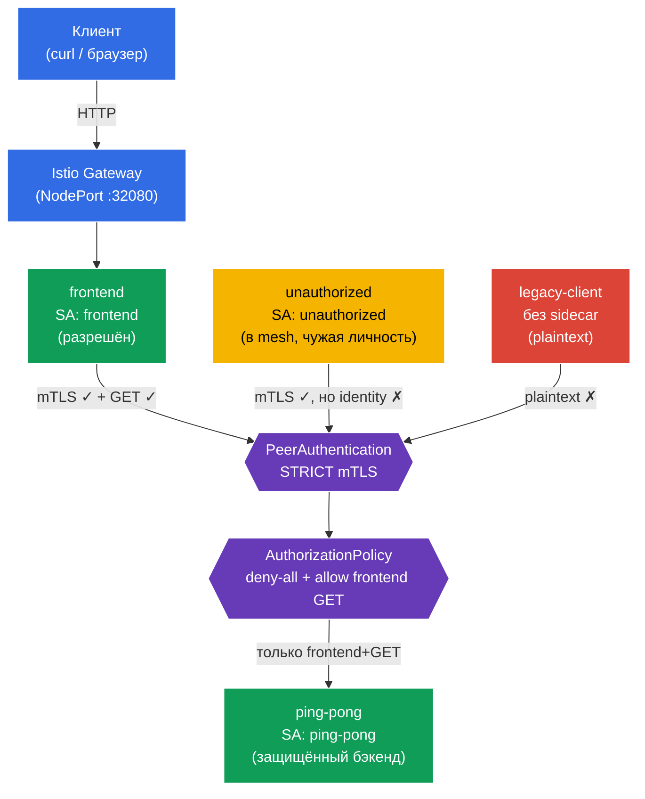

[Eng version](README.MD) · [Versión en español](README_ES.MD) · [Version française](README_FR.MD) · [Deutsche Version](README_DE.MD)

# Lab 04 - Zero Trust: mTLS (PeerAuthentication) + AuthorizationPolicy

Представьте: у вас есть бэкенд `ping-pong`, в котором лежат чувствительные данные. По умолчанию внутри кластера любой под может достучаться до любого сервиса по сети - это «плоская» доверенная сеть. Нам нужно построить модель **Zero Trust** («не доверяй никому»): во-первых, весь трафик между сервисами должен быть зашифрован и аутентифицирован (mTLS), а во-вторых, обращаться к бэкенду имеет право **только** фронтенд и **только** через `GET`. Всё остальное - запрещено.

В этой лабораторной мы сделаем это на уровне инфраструктуры, не меняя код приложения: сначала включим **STRICT mTLS** через `PeerAuthentication`, затем закроем бэкенд политикой **deny-all** и точечно откроем доступ через `AuthorizationPolicy`.

## Цель

Разобраться с двумя ключевыми механизмами безопасности Istio:
- **PeerAuthentication (mTLS)** - взаимная TLS-аутентификация между сервисами. Отвечает на вопрос **«можно ли доверять каналу связи?»** (шифрование + проверка личности отправителя).
- **AuthorizationPolicy** - авторизация запросов. Отвечает на вопрос **«имеет ли этот клиент право выполнить именно это действие?»** (кто, куда, каким методом, по какому пути).

Создан Gateway: http://myapp.local:32080

### Как это работает (общая схема)



## Шаг 1. Включение sidecar-инъекции

Добавляем label на namespace `default` для автоматической инъекции sidecar-прокси Envoy:

```bash
kubectl label namespace default istio-injection=enabled --overwrite
```

**Что это делает:** Istio работает по принципу sidecar-паттерна. Когда на namespace стоит лейбл `istio-injection=enabled`, в каждый под добавляется контейнер `istio-proxy` (Envoy), который перехватывает весь сетевой трафик пода. Именно Envoy выполняет mTLS-шифрование и применяет правила авторизации - без изменения кода приложения.

**Важно:** namespace `legacy` мы намеренно **не** размечаем. Под в нём останется без sidecar и будет ходить «по-старинке», открытым текстом (plaintext). Позже это поможет наглядно показать, как STRICT mTLS отсекает такие соединения.

## Шаг 2. Установка приложения

```bash
kubectl apply -f https://raw.githubusercontent.com/ViktorUJ/cks/refs/heads/master/tasks/ica/labs/04/k8s-1/scripts/1.yaml
kubectl rollout restart deployment -n default
```

**Что разворачивается:**
- **`ping-pong`** (namespace `default`, ServiceAccount `ping-pong`) - защищаемый бэкенд.
- **`frontend`** (namespace `default`, ServiceAccount `frontend`) - легитимный клиент. На каждый входящий запрос вызывает `http://ping-pong:8080/`.
- **`unauthorized`** (namespace `default`, ServiceAccount `unauthorized`) - клиент **внутри mesh** (с sidecar, mTLS работает), но с «чужой» личностью. Нужен, чтобы показать отказ на уровне авторизации.
- **`legacy-client`** (namespace `legacy`, **без** sidecar) - устаревший клиент, который ходит plaintext. Нужен, чтобы показать отказ на уровне mTLS.

**Ключевая идея - identity (личность).** Каждый под получает криптографическую личность на основе своего ServiceAccount в формате SPIFFE:
`spiffe://cluster.local/ns/<namespace>/sa/<serviceaccount>`.
Именно по этой личности Istio будет шифровать трафик (mTLS) и принимать решения об авторизации. Поэтому в манифесте у каждого сервиса прописан свой `serviceAccountName` - это не формальность, а основа всей модели безопасности.

Проверяем, что поды в `default` поднялись с Envoy-прокси (`2/2`), а `legacy-client` - без (`1/1`):

```bash
kubectl get pods -n default
kubectl get pods -n legacy
```

```
# default
NAME                            READY   STATUS    RESTARTS   AGE
frontend-...                    2/2     Running   0          30s
ping-pong-...                   2/2     Running   0          30s
unauthorized-...                2/2     Running   0          30s
# legacy
legacy-client-...               1/1     Running   0          30s
```

## Шаг 3. Точка входа: Gateway и VirtualService

Чтобы наблюдать за поведением снаружи, создаём вход: Gateway принимает трафик на `myapp.local`, VirtualService направляет его во `frontend`.

```bash
vim gateway.yaml
```

```yaml
apiVersion: networking.istio.io/v1
kind: Gateway
metadata:
  name: main-gateway
  namespace: default
spec:
  selector:
    istio: ingressgateway
  servers:
  - port:
      number: 80
      name: http
      protocol: HTTP
    hosts:
    - "myapp.local"
```

```bash
vim frontend-vs.yaml
```

```yaml
apiVersion: networking.istio.io/v1
kind: VirtualService
metadata:
  name: frontend-vs
  namespace: default
spec:
  hosts:
  - "myapp.local"
  gateways:
  - main-gateway
  http:
  - route:
    - destination:
        host: frontend
        port:
          number: 8080
```

```bash
kubectl apply -f gateway.yaml
kubectl apply -f frontend-vs.yaml
```

`frontend` при каждом запросе обращается к `ping-pong` и печатает строку `Backend Status` - это наш индикатор: `200` означает, что бэкенд ответил, `403` - что доступ запрещён авторизацией.

## Шаг 4. Базовая проверка (до политик безопасности)

По умолчанию Istio работает в режиме **PERMISSIVE**: бэкенд принимает и зашифрованный (mTLS), и открытый (plaintext) трафик, а авторизация никак не ограничена. Убедимся, что сейчас до бэкенда дотягиваются **все**:

```bash
# 1) легитимный фронтенд (через Gateway)
curl -s http://myapp.local:32080 | grep 'Backend Status'
```
```
Backend Status   : 200
```

```bash
# 2) чужой клиент внутри mesh
kubectl exec -n default deploy/unauthorized -c curl -- \
  curl -s -o /dev/null -w "%{http_code}\n" http://ping-pong:8080/
```
```
200
```

```bash
# 3) legacy-клиент без sidecar (plaintext)
kubectl exec -n legacy deploy/legacy-client -c curl -- \
  curl -s -o /dev/null -w "%{http_code}\n" http://ping-pong.default:8080/
```
```
200
```

Все трое получают `200`. Сеть «плоская» - никакой защиты нет. Начинаем закручивать гайки.

## Шаг 5. STRICT mTLS - шифруем и аутентифицируем канал

`PeerAuthentication` управляет тем, как сервисы принимают входящие соединения. Режим `STRICT` означает: **принимать только mTLS-трафик**, любой plaintext отвергать.

```bash
vim peer-auth.yaml
```

```yaml
apiVersion: security.istio.io/v1
kind: PeerAuthentication
metadata:
  name: default          # имя "default" + отсутствие selector = политика на весь namespace
  namespace: default
spec:
  mtls:
    mode: STRICT
```

```bash
kubectl apply -f peer-auth.yaml
```

**Разбор:**
- **`PeerAuthentication`** настраивает аутентификацию на уровне транспорта (peer-to-peer). Это про **канал связи**, а не про конкретный HTTP-запрос.
- **`mode: STRICT`** - Envoy бэкенда будет принимать только взаимно-аутентифицированные TLS-соединения. Сертификаты для mTLS Istio выдаёт и ротирует автоматически (через istiod) каждому поду с sidecar.
- **Имя `default` без `selector`** - это соглашение Istio: такая политика применяется ко всему namespace. Если добавить `selector.matchLabels`, политика будет действовать только на выбранные поды (как в задаче mock-экзамена с `app=space`).

Проверяем, что изменилось:

```bash
# legacy без sidecar -> канал больше не принимается
kubectl exec -n legacy deploy/legacy-client -c curl -- \
  curl -s -o /dev/null -w "%{http_code}\n" --max-time 5 http://ping-pong.default:8080/
```
```
000      # соединение сброшено (connection reset) - plaintext отвергнут
```

```bash
# фронтенд и unauthorized по-прежнему работают: у них есть sidecar, mTLS устанавливается
curl -s http://myapp.local:32080 | grep 'Backend Status'        # 200
kubectl exec -n default deploy/unauthorized -c curl -- \
  curl -s -o /dev/null -w "%{http_code}\n" http://ping-pong:8080/  # 200
```

**Вывод:** STRICT mTLS отсёк `legacy-client` - он не смог даже установить соединение. Но `unauthorized` всё ещё проходит: у него есть валидная mTLS-личность. mTLS проверяет, что собеседнику **можно доверять как участнику mesh**, но не ограничивает, **что именно** ему позволено делать. За это отвечает авторизация - следующий шаг.

## Шаг 6. Default-deny - закрываем бэкенд для всех

Принцип Zero Trust: сначала запрещаем всё, потом точечно разрешаем нужное. Создаём `AuthorizationPolicy`, которая выбирает бэкенд `ping-pong`, но **не содержит ни одного правила** `rules`. В Istio это означает «запретить все запросы к выбранным подам».

```bash
vim deny-all.yaml
```

```yaml
apiVersion: security.istio.io/v1
kind: AuthorizationPolicy
metadata:
  name: ping-pong-deny-all
  namespace: default
spec:
  selector:
    matchLabels:
      app: ping-pong   # политика действует только на поды бэкенда
  action: ALLOW
  # rules отсутствуют => ни один запрос не подходит => всё запрещено (403)
```

```bash
kubectl apply -f deny-all.yaml
```

**Почему `action: ALLOW` без правил = запрет?** Логика Istio такая: как только на под навешена хотя бы одна `ALLOW`-политика, действует принцип «разрешено только то, что явно перечислено в `rules`». Если правил нет - не подходит ничего, и все запросы получают `403`.

> Можно было бы сделать и `action: DENY` с пустым правилом, но канонический паттерн «default-deny» в Istio - это именно пустая `ALLOW`-политика. Часто её делают на весь namespace (`spec: {}`), мы же ограничили область только бэкендом через `selector`, чтобы не задеть трафик `Gateway -> frontend`.

Проверяем - теперь закрыты все, даже легитимный фронтенд:

```bash
curl -s http://myapp.local:32080 | grep 'Backend Status'        # 403
kubectl exec -n default deploy/unauthorized -c curl -- \
  curl -s -o /dev/null -w "%{http_code}\n" http://ping-pong:8080/  # 403
```

Бэкенд полностью изолирован. Осталось открыть ровно один нужный путь.

## Шаг 7. Allow - пускаем только фронтенд и только GET

Добавляем вторую `AuthorizationPolicy`, которая разрешает доступ к `ping-pong` **только** запросам:
- от личности (principal) фронтенда - `cluster.local/ns/default/sa/frontend`;
- методом `GET`.

```bash
vim allow-frontend.yaml
```

```yaml
apiVersion: security.istio.io/v1
kind: AuthorizationPolicy
metadata:
  name: ping-pong-allow-frontend
  namespace: default
spec:
  selector:
    matchLabels:
      app: ping-pong
  action: ALLOW
  rules:
  - from:
    - source:
        principals: ["cluster.local/ns/default/sa/frontend"]  # КТО: личность фронтенда
    to:
    - operation:
        methods: ["GET"]                                       # ЧТО: только GET
```

```bash
kubectl apply -f allow-frontend.yaml
```

**Разбор правила:**
- **`from.source.principals`** - *кто* отправитель. Здесь указана SPIFFE-личность фронтенда. Эта личность подтверждается именно за счёт mTLS из шага 5 - без mTLS Istio не знал бы, кто реально стоит на той стороне соединения. Вот почему mTLS и AuthorizationPolicy работают в связке.
- **`to.operation.methods`** - *что* можно делать. Разрешён только HTTP-метод `GET`. Запрос `POST` от того же фронтенда уже не пройдёт.
- Политика `allow` объединяется с `deny-all` из шага 6 по принципу OR: запрос проходит, если его разрешает **хотя бы одна** `ALLOW`-политика. То есть для `ping-pong` теперь «открыта» ровно одна комбинация: фронтенд + GET.

## Шаг 8. Финальная проверка

```bash
# Легитимный фронтенд (frontend SA, GET) -> разрешено
curl -s http://myapp.local:32080 | grep 'Backend Status'
```
```
Backend Status   : 200
```

```bash
# Чужой клиент внутри mesh (unauthorized SA) -> запрещено авторизацией
kubectl exec -n default deploy/unauthorized -c curl -- \
  curl -s -o /dev/null -w "%{http_code}\n" http://ping-pong:8080/
```
```
403      # RBAC: access denied
```

```bash
# Legacy без sidecar -> отсекается ещё на уровне mTLS
kubectl exec -n legacy deploy/legacy-client -c curl -- \
  curl -s -o /dev/null -w "%{http_code}\n" --max-time 5 http://ping-pong.default:8080/
```
```
000      # connection reset
```

## Итог

| Слой | Ресурс | Что сделали | Результат |
|------|--------|-------------|-----------|
| Транспорт | `PeerAuthentication` (STRICT) | Требуем mTLS для всех входящих соединений | plaintext-клиент (`legacy`) отсечён |
| Авторизация | `AuthorizationPolicy` (deny-all) | Запретили все запросы к бэкенду | даже фронтенд получает 403 |
| Авторизация | `AuthorizationPolicy` (allow) | Разрешили только `frontend` + `GET` | работает только легитимный путь |

**Ключевой вывод:** mTLS и AuthorizationPolicy - это два разных уровня защиты, которые дополняют друг друга:
- **PeerAuthentication (mTLS)** отвечает на вопрос «**можно ли доверять каналу и кто на том конце?**» - шифрование и аутентификация.
- **AuthorizationPolicy** отвечает на вопрос «**что именно этому клиенту разрешено?**» - авторизация по личности, пути и методу.

Authorization построена поверх identity, которую даёт mTLS: без взаимной аутентификации правило `principals: [.../sa/frontend]` было бы невозможно надёжно проверить. Вместе они дают модель Zero Trust - и всё это на уровне инфраструктуры, без единой строчки в коде приложения.
