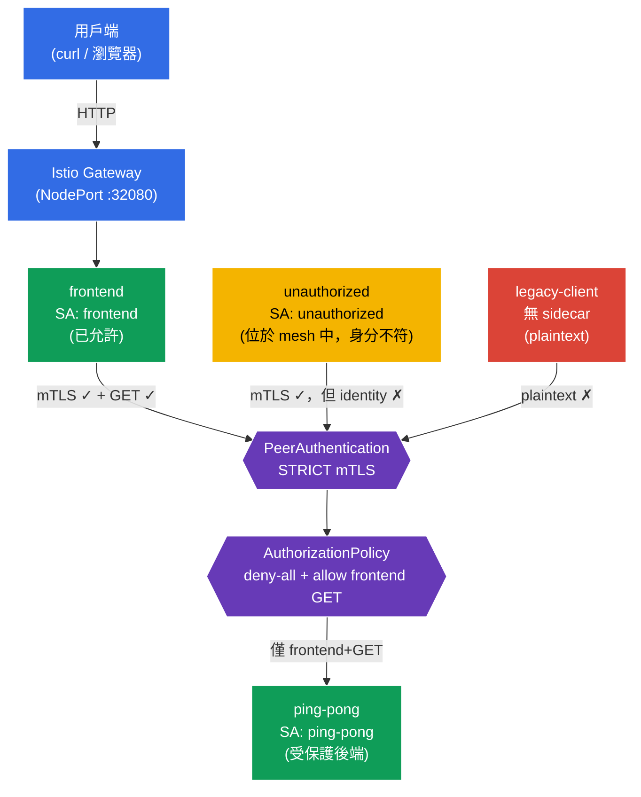

[Русская версия](README_RU.MD) · [Eng version](README.MD) · [Versión en español](README_ES.MD) · [Version française](README_FR.MD) · [Deutsche Version](README_DE.MD) · [ქართული ვერსია](README_GE.MD) · [日本語版](README_JP.MD)

# Lab 04 - Zero Trust：mTLS (PeerAuthentication) + AuthorizationPolicy

> [參考解答](worker/files/solutions/1_TW.MD)

想像一下：您有一個包含敏感資料的後端 `ping-pong`。預設情況下，叢集內的任何 Pod 都能透過網路連線至任何服務--這是一個「扁平」的信任網路。我們需要建立 **Zero Trust**（「永不信任」）模型：首先，服務之間的所有流量都必須加密並經過驗證（mTLS）；其次，只有前端能存取後端，且只能使用 `GET`。其他一切均予以禁止。

在本實驗中，我們將於基礎架構層級實作，無須修改應用程式碼：先透過 `PeerAuthentication` 啟用 **STRICT mTLS**，接著以 **deny-all** 政策封鎖後端，並透過 `AuthorizationPolicy` 精確開放存取。

## 目標

理解 Istio 的兩項關鍵安全機制：
- **PeerAuthentication (mTLS)**：服務之間的雙向 TLS 驗證。它回答 **「能否信任通訊通道？」** 這個問題（加密 + 驗證傳送者身分）。
- **AuthorizationPolicy**：請求授權。它回答 **「此用戶端是否有權執行此特定操作？」** 這個問題（誰、至何處、使用何種方法、透過哪個路徑）。

已建立 Gateway：http://myapp.local:32080

### 運作方式（整體架構）



## 基礎架構

環境透過 Terragrunt 部署於 AWS (`eu-north-1`)，包含：

| 元件 | 說明 |
|------------|---------------------------------------------------|
| `vpc` | VPC `10.10.0.0/16`，包含公有子網路 |
| `ssh-keys` | 用於存取節點的 SSH 金鑰 |
| `k8s-1` | Kubernetes `1.35.2` (kubeadm)，已安裝 Istio |
| `worker` | 具備 `kubectl` 與叢集存取權的工作機器 |

執行個體：`t4g.medium`（master），Ubuntu `22.04`

## 部署

```bash
TASK=04 make run_ica_task
```

## 步驟 1：啟用 sidecar 注入

為 namespace `default` 新增 label，以自動注入 Envoy sidecar proxy：

```bash
kubectl label namespace default istio-injection=enabled --overwrite
```

**這會做什麼：**Istio 採用 sidecar 模式運作。當 namespace 設有 `istio-injection=enabled` label 時，每個 Pod 都會加入 `istio-proxy`（Envoy）容器，攔截 Pod 的所有網路流量。正是 Envoy 執行 mTLS 加密並套用授權規則--無須修改應用程式碼。

**重要：**我們刻意**不**標記 namespace `legacy`。其中的 Pod 將維持沒有 sidecar，並以「舊方式」使用明文（plaintext）通訊。稍後這能清楚展示 STRICT mTLS 如何阻擋這類連線。

## 步驟 2：安裝應用程式

```bash
kubectl apply -f https://raw.githubusercontent.com/ViktorUJ/cks/refs/heads/master/tasks/ica/labs/04/k8s-1/scripts/1.yaml
kubectl rollout restart deployment -n default
```

**部署的內容：**
- **`ping-pong`**（namespace `default`，ServiceAccount `ping-pong`）：要保護的後端。
- **`frontend`**（namespace `default`，ServiceAccount `frontend`）：合法用戶端。每次收到請求時呼叫 `http://ping-pong:8080/`。
- **`unauthorized`**（namespace `default`，ServiceAccount `unauthorized`）：**位於 mesh 內**的用戶端（有 sidecar，mTLS 正常運作），但具有「不屬於它的」身分。用來展示授權層級的拒絕。
- **`legacy-client`**（namespace `legacy`，**沒有** sidecar）：使用 plaintext 通訊的舊版用戶端。用來展示 mTLS 層級的拒絕。

**核心概念--identity（身分）。**每個 Pod 都會依其 ServiceAccount 取得加密身分，格式為 SPIFFE：
`spiffe://cluster.local/ns/<namespace>/sa/<serviceaccount>`。
Istio 正是依此身分加密流量（mTLS）並作出授權決策。因此，manifest 中每個服務都有各自的 `serviceAccountName`--這不只是形式，而是整個安全模型的基礎。

確認 `default` 中的 Pod 已與 Envoy proxy 一起啟動（`2/2`），而 `legacy-client` 沒有（`1/1`）：

```bash
kubectl get pods -n default
kubectl get pods -n legacy
```

```
# default
NAME                            READY   STATUS    RESTARTS   AGE
frontend-...                    2/2     Running   0          30s
ping-pong-...                   2/2     Running   0          30s
unauthorized-...                2/2     Running   0          30s
# legacy
legacy-client-...               1/1     Running   0          30s
```

## 步驟 3：進入點：Gateway 與 VirtualService

為了從外部觀察行為，建立一個進入點：Gateway 在 `myapp.local` 接收流量，VirtualService 將其導向 `frontend`。

```bash
vim gateway.yaml
```

```yaml
apiVersion: networking.istio.io/v1
kind: Gateway
metadata:
  name: main-gateway
  namespace: default
spec:
  selector:
    istio: ingressgateway
  servers:
  - port:
      number: 80
      name: http
      protocol: HTTP
    hosts:
    - "myapp.local"
```

```bash
vim frontend-vs.yaml
```

```yaml
apiVersion: networking.istio.io/v1
kind: VirtualService
metadata:
  name: frontend-vs
  namespace: default
spec:
  hosts:
  - "myapp.local"
  gateways:
  - main-gateway
  http:
  - route:
    - destination:
        host: frontend
        port:
          number: 8080
```

```bash
kubectl apply -f gateway.yaml
kubectl apply -f frontend-vs.yaml
```

`frontend` 會在每次請求時存取 `ping-pong`，並輸出 `Backend Status` 字串--這是我們的指標：`200` 表示後端已回應，`403` 表示存取遭授權機制拒絕。

## 步驟 4：基準檢查（套用安全政策前）

預設情況下，Istio 以 **PERMISSIVE** 模式運作：後端同時接受加密（mTLS）與明文（plaintext）流量，且授權完全不受限制。確認目前**所有人**都能連線至後端：

```bash
# 1) 合法的前端 (透過 Gateway)
curl -s http://myapp.local:32080 | grep 'Backend Status'
```
```
Backend Status   : 200
```

```bash
# 2) mesh 內部的外來用戶端
kubectl exec -n default deploy/unauthorized -c curl -- \
  curl -s -o /dev/null -w "%{http_code}\n" http://ping-pong:8080/
```
```
200
```

```bash
# 3) 沒有 sidecar 的 legacy 用戶端 (plaintext)
kubectl exec -n legacy deploy/legacy-client -c curl -- \
  curl -s -o /dev/null -w "%{http_code}\n" http://ping-pong.default:8080/
```
```
200
```

三者都取得 `200`。網路是「扁平的」--完全沒有保護。現在開始逐步收緊控制。

## 步驟 5：STRICT mTLS--加密並驗證通道

`PeerAuthentication` 控制服務如何接受傳入連線。`STRICT` 模式表示：**僅接受 mTLS 流量**，拒絕任何 plaintext。

```bash
vim peer-auth.yaml
```

```yaml
apiVersion: security.istio.io/v1
kind: PeerAuthentication
metadata:
  name: default          # 名稱 "default" + 沒有 selector = 對整個 namespace 生效的政策
  namespace: default
spec:
  mtls:
    mode: STRICT
```

```bash
kubectl apply -f peer-auth.yaml
```

**說明：**
- **`PeerAuthentication`** 在傳輸層（peer-to-peer）設定驗證。它關於的是**通訊通道**，而不是某個特定 HTTP 請求。
- **`mode: STRICT`**：後端的 Envoy 僅接受相互驗證的 TLS 連線。Istio 會透過 istiod，為每個含 sidecar 的 Pod 自動簽發並輪替 mTLS 憑證。
- **沒有 `selector` 的 `default` 名稱**：這是 Istio 的慣例；這類政策會套用至整個 namespace。若加入 `selector.matchLabels`，該政策僅影響選定的 Pod（如 mock exam 任務中的 `app=space`）。

確認變更：

```bash
# legacy 沒有 sidecar -> 通道不再被接受
kubectl exec -n legacy deploy/legacy-client -c curl -- \
  curl -s -o /dev/null -w "%{http_code}\n" --max-time 5 http://ping-pong.default:8080/
```
```
000      # 連線被重設 (connection reset) - plaintext 遭拒
```

```bash
# 前端與 unauthorized 仍然可運作：它們有 sidecar，會建立 mTLS
curl -s http://myapp.local:32080 | grep 'Backend Status'        # 200
kubectl exec -n default deploy/unauthorized -c curl -- \
  curl -s -o /dev/null -w "%{http_code}\n" http://ping-pong:8080/  # 200
```

**結論：**STRICT mTLS 阻擋了 `legacy-client`--它甚至無法建立連線。但 `unauthorized` 仍能通過：它具有有效的 mTLS 身分。mTLS 會驗證對方**是否可作為 mesh 參與者被信任**，但不會限制其**具體可執行的操作**。這是授權的職責--下一個步驟。

## 步驟 6：Default-deny--對所有人封鎖後端

Zero Trust 原則：先拒絕一切，再精確允許所需項目。建立一個選取 `ping-pong` 後端、但**不含任何** `rules` 規則的 `AuthorizationPolicy`。這在 Istio 中意指「拒絕所有對選定 Pod 的請求」。

```bash
vim deny-all.yaml
```

```yaml
apiVersion: security.istio.io/v1
kind: AuthorizationPolicy
metadata:
  name: ping-pong-deny-all
  namespace: default
spec:
  selector:
    matchLabels:
      app: ping-pong   # 政策僅對後端的 Pod 生效
  action: ALLOW
  # 沒有 rules => 沒有任何請求符合 => 全部拒絕 (403)
```

```bash
kubectl apply -f deny-all.yaml
```

**為什麼沒有規則的 `action: ALLOW` = 拒絕？**Istio 的邏輯如下：一旦 Pod 至少附加一項 `ALLOW` 政策，便遵循「僅允許 `rules` 中明確列出的項目」原則。沒有規則時，沒有任何請求符合條件，因此所有請求都會得到 `403`。

> 也可以建立包含空規則的 `action: DENY`，但 Istio 中標準的「default-deny」模式正是空的 `ALLOW` 政策。這通常會套用至整個 namespace（`spec: {}`）；此處我們透過 `selector` 將範圍限制為後端，以避免影響 `Gateway -> frontend` 流量。

確認結果：現在所有人都被封鎖，包括合法前端：

```bash
curl -s http://myapp.local:32080 | grep 'Backend Status'        # 403
kubectl exec -n default deploy/unauthorized -c curl -- \
  curl -s -o /dev/null -w "%{http_code}\n" http://ping-pong:8080/  # 403
```

後端已完全隔離。只剩開放唯一所需的路徑。

## 步驟 7：Allow--僅允許前端和 GET

新增第二個 `AuthorizationPolicy`，僅允許下列請求存取 `ping-pong`：
- 來自前端身分（principal）`cluster.local/ns/default/sa/frontend`；
- 使用 `GET` 方法。

```bash
vim allow-frontend.yaml
```

```yaml
apiVersion: security.istio.io/v1
kind: AuthorizationPolicy
metadata:
  name: ping-pong-allow-frontend
  namespace: default
spec:
  selector:
    matchLabels:
      app: ping-pong
  action: ALLOW
  rules:
  - from:
    - source:
        principals: ["cluster.local/ns/default/sa/frontend"]  # 誰：前端的身分
    to:
    - operation:
        methods: ["GET"]                                       # 什麼：僅限 GET
```

```bash
kubectl apply -f allow-frontend.yaml
```

**規則說明：**
- **`from.source.principals`**：傳送者是*誰*。此處指定前端的 SPIFFE 身分。這個身分正是透過步驟 5 的 mTLS 來驗證--沒有 mTLS，Istio 便無法得知連線另一端實際是誰。這就是 mTLS 與 AuthorizationPolicy 必須搭配運作的原因。
- **`to.operation.methods`**：可執行*什麼*操作。僅允許 HTTP `GET` 方法。同一個前端發出的 `POST` 請求也不會通過。
- allow 政策與步驟 6 的 deny-all 會依 OR 原則合併：只要請求被**至少一項** `ALLOW` 政策允許，即可通過。因此，`ping-pong` 現在只「開放」一種組合：前端 + GET。

## 步驟 8：最終檢查

```bash
# 合法的前端 (frontend SA, GET) -> 允許
curl -s http://myapp.local:32080 | grep 'Backend Status'
```
```
Backend Status   : 200
```

```bash
# mesh 內部的外來用戶端 (unauthorized SA) -> 被授權機制拒絕
kubectl exec -n default deploy/unauthorized -c curl -- \
  curl -s -o /dev/null -w "%{http_code}\n" http://ping-pong:8080/
```
```
403      # RBAC: access denied
```

```bash
# Legacy 沒有 sidecar -> 在 mTLS 層級就被攔截
kubectl exec -n legacy deploy/legacy-client -c curl -- \
  curl -s -o /dev/null -w "%{http_code}\n" --max-time 5 http://ping-pong.default:8080/
```
```
000      # connection reset
```

## 總結

| 層級 | 資源 | 所做的事 | 結果 |
|------|--------|-------------|-----------|
| 傳輸 | `PeerAuthentication` (STRICT) | 為所有傳入連線要求 mTLS | plaintext 用戶端（`legacy`）被阻擋 |
| 授權 | `AuthorizationPolicy` (deny-all) | 拒絕對後端的所有請求 | 即使前端也會得到 403 |
| 授權 | `AuthorizationPolicy` (allow) | 僅允許 `frontend` + `GET` | 僅合法路徑可運作 |

**關鍵結論：**mTLS 與 AuthorizationPolicy 是兩個相互補充的不同防護層：
- **PeerAuthentication (mTLS)** 回答「**能否信任通道，以及另一端是誰？**」--加密與驗證。
- **AuthorizationPolicy** 回答「**允許此用戶端具體執行什麼？**」--依身分、路徑與方法授權。

Authorization 建立於 mTLS 所提供的 identity 之上：沒有雙向驗證，便無法可靠驗證 `principals: [.../sa/frontend]` 規則。兩者結合，便能提供 Zero Trust 模型--而這一切都在基礎架構層級完成，無須在應用程式碼中撰寫任何一行。