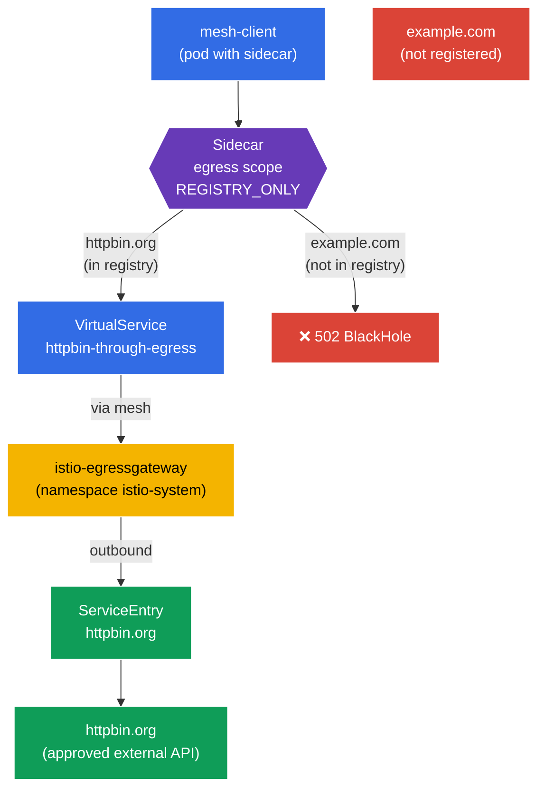

[RU version](README_RU.MD)

# Lab 05 - Controlled Egress: ServiceEntry + Egress Gateway + Sidecar scope

Imagine a service inside the cluster that needs to call an external API (`httpbin.org`). By default Istio runs in `ALLOW_ANY` mode - any pod can reach anything on the internet. From a security standpoint that's bad: a compromised pod could exfiltrate data to any external address. We want **controlled egress**: allow only an approved external service, send its traffic through a single point (the egress gateway), and block everything else.

In this lab we cover three Istio mechanisms for handling outbound traffic:
- **ServiceEntry** - registers an external service in the mesh registry so Istio "knows" about it and can apply policy to it.
- **Egress Gateway** - a dedicated exit point: all external traffic flows through a separate Envoy gateway (handy for auditing, monitoring, and filtering).
- **Sidecar (egress scope)** - the `Sidecar` resource, which limits which hosts and namespaces a sidecar may reach and switches the namespace into `REGISTRY_ONLY` mode.

### How It Works (High-Level Overview)



## Objective

Understand how Istio controls **outbound** traffic and assemble the full egress-control chain:
1. register an external service (`ServiceEntry`);
2. route its traffic through an `Egress Gateway`;
3. lock the namespace down against everything else via `Sidecar` + `REGISTRY_ONLY`.

## Step 1. Enable Sidecar Injection

```bash
kubectl label namespace default istio-injection=enabled --overwrite
```

**What this does:** the namespace gets the label, and an `istio-proxy` (Envoy) sidecar is added to every pod. It's Envoy that intercepts the pod's **outbound** traffic - without it, neither ServiceEntry, nor the egress gateway, nor Sidecar policies would have any effect.

## Step 2. Deploy the Application

Deploy `mesh-client` - a plain pod with `curl` inside the mesh. We'll make external requests from it.

```bash
kubectl apply -f https://raw.githubusercontent.com/ViktorUJ/cks/refs/heads/master/tasks/ica/labs/05/k8s-1/scripts/1.yaml
kubectl rollout restart deployment -n default
```

Verify the pod came up with a sidecar (`2/2`):

```bash
kubectl get pods -n default
```

```
NAME                           READY   STATUS    RESTARTS   AGE
mesh-client-7d9c8b6f4d-xy12z   2/2     Running   0          20s
```

## Step 3. Baseline Check (ALLOW_ANY mode)

By default Istio has `outboundTrafficPolicy.mode = ALLOW_ANY` - you can reach anything outbound. Let's confirm:

```bash
# approved host
kubectl exec -n default deploy/mesh-client -c curl -- \
  curl -s -o /dev/null -w "%{http_code}\n" http://httpbin.org/status/200
```
```
200
```

```bash
# any other host - also reachable
kubectl exec -n default deploy/mesh-client -c curl -- \
  curl -s -o /dev/null -w "%{http_code}\n" http://example.com/
```
```
200
```

Both requests succeed. There is no egress control at all - that's the problem we're about to fix.

## Step 4. ServiceEntry - Register the External Service

`ServiceEntry` adds an external host to Istio's internal service registry. This is needed for two things: so the external service can be routed (through the egress gateway), and so it counts as "known" once `REGISTRY_ONLY` is enabled.

```bash
vim service-entry.yaml
```

```yaml
apiVersion: networking.istio.io/v1
kind: ServiceEntry
metadata:
  name: httpbin-ext
  namespace: default
spec:
  hosts:
  - httpbin.org
  ports:
  - number: 80
    name: http
    protocol: HTTP
  resolution: DNS          # resolve the name via DNS
  location: MESH_EXTERNAL  # the service lives OUTSIDE the mesh
```

```bash
kubectl apply -f service-entry.yaml
```

**Breakdown:**
- **`hosts`** - the external DNS name we're registering.
- **`ports`** - port and protocol. We declare `HTTP/80` so Istio understands the L7 protocol and can route on it.
- **`resolution: DNS`** - Envoy resolves `httpbin.org` itself via DNS. Alternatives are `STATIC` (fixed IPs) or `NONE`.
- **`location: MESH_EXTERNAL`** - the service is outside the mesh (it has no sidecar, no mTLS is applied to it).

## Step 5. Egress Gateway - a Single Exit Point

Right now traffic to `httpbin.org` leaves directly from the pod's sidecar. We want it to flow through the dedicated `istio-egressgateway` (already deployed in the `istio-system` namespace by the `demo` profile). This gives a single point to log and control outbound traffic.

Three resources are needed: a `Gateway` (egress gateway config), a `DestinationRule` (the gateway subset), and a `VirtualService` (a two-step route: mesh → gateway → external host).

```bash
vim egress-gateway.yaml
```

```yaml
apiVersion: networking.istio.io/v1
kind: Gateway
metadata:
  name: istio-egressgateway
  namespace: default
spec:
  selector:
    istio: egressgateway   # apply to the egress gateway pod
  servers:
  - port:
      number: 80
      name: http
      protocol: HTTP
    hosts:
    - httpbin.org
---
apiVersion: networking.istio.io/v1
kind: DestinationRule
metadata:
  name: egressgateway-for-httpbin
  namespace: default
spec:
  host: istio-egressgateway.istio-system.svc.cluster.local
  subsets:
  - name: httpbin
---
apiVersion: networking.istio.io/v1
kind: VirtualService
metadata:
  name: httpbin-through-egress
  namespace: default
spec:
  hosts:
  - httpbin.org
  gateways:
  - mesh                  # traffic inside the mesh (from pods)
  - istio-egressgateway   # traffic that has arrived at the egress gateway
  http:
  # STAGE 1: from the mesh -> send to the egress gateway
  - match:
    - gateways:
      - mesh
      port: 80
    route:
    - destination:
        host: istio-egressgateway.istio-system.svc.cluster.local
        subset: httpbin
        port:
          number: 80
      weight: 100
  # STAGE 2: from the egress gateway -> out to the real host
  - match:
    - gateways:
      - istio-egressgateway
      port: 80
    route:
    - destination:
        host: httpbin.org
        port:
          number: 80
      weight: 100
```

```bash
kubectl apply -f egress-gateway.yaml
```

**How to read the `VirtualService`:** it describes two "hops" of the same request:
- **Stage 1** - the request originates inside the mesh (`gateways: [mesh]`). Instead of going straight to the internet, it is routed to the `istio-egressgateway` service in `istio-system`.
- **Stage 2** - the same request now arrives at the egress gateway (`gateways: [istio-egressgateway]`), and the gateway sends it out to `httpbin.org`.

Verify the traffic really flows through the gateway:

```bash
kubectl exec -n default deploy/mesh-client -c curl -- \
  curl -s -o /dev/null -w "%{http_code}\n" http://httpbin.org/status/200   # 200

kubectl logs -n istio-system -l istio=egressgateway --tail=20 | grep httpbin.org
```

The egress gateway log should show an entry for the request to `httpbin.org` - proof that the traffic passed through it.

## Step 6. Sidecar - Scope the Namespace's Egress

The final step is to lock down the `default` namespace so that only registered services may be reached from it. We use a `Sidecar` resource: it both limits the list of visible hosts (`egress.hosts`) and enables `REGISTRY_ONLY` mode.

```bash
vim sidecar.yaml
```

```yaml
apiVersion: networking.istio.io/v1
kind: Sidecar
metadata:
  name: default            # name default + no workloadSelector = whole namespace
  namespace: default
spec:
  egress:
  - hosts:
    - "istio-system/*"     # access to the egress gateway (it lives in istio-system)
    - "./*"                # access to services in the own namespace (includes the ServiceEntry)
  outboundTrafficPolicy:
    mode: REGISTRY_ONLY    # outbound only to what is in the registry
```

```bash
kubectl apply -f sidecar.yaml
```

**Breakdown:**
- **`egress.hosts`** - the list of what the sidecar "sees". Format `namespace/dnsName`:
  - `"istio-system/*"` - needed because traffic goes through the egress gateway in `istio-system`;
  - `"./*"` - services in the current namespace, including our `ServiceEntry` for `httpbin.org`.
  By limiting this list, we reduce the amount of config Istio pushes into every sidecar and narrow the pod's visibility.
- **`outboundTrafficPolicy.mode: REGISTRY_ONLY`** - the key switch. Now Envoy only allows outbound traffic to hosts in the registry (i.e., those with a `ServiceEntry` or an in-cluster service). Everything else is blocked and returns `502`.

## Step 7. Final Verification

```bash
# Approved host (registered + via the egress gateway) -> 200
kubectl exec -n default deploy/mesh-client -c curl -- \
  curl -s -o /dev/null -w "%{http_code}\n" http://httpbin.org/status/200
```
```
200
```

```bash
# Unregistered host -> blocked by REGISTRY_ONLY
kubectl exec -n default deploy/mesh-client -c curl -- \
  curl -s -o /dev/null -w "%{http_code}\n" http://example.com/
```
```
502      # BlackHoleCluster - egress denied
```

## Summary

| Step | Resource | What we did | Result |
|------|----------|-------------|--------|
| Registration | `ServiceEntry` | Added `httpbin.org` to the mesh registry | the external service became "known" |
| Routing | `Gateway` + `DestinationRule` + `VirtualService` | Funneled traffic through `istio-egressgateway` | single exit point + auditing |
| Restriction | `Sidecar` (`REGISTRY_ONLY`) | Closed the namespace to everything else | `httpbin.org` reachable, `example.com` not |

**Key takeaway:** egress control in Istio is built from three complementary building blocks:
- **ServiceEntry** makes an external service "visible" to the mesh - without it the service can neither be routed nor allowed under `REGISTRY_ONLY`.
- **Egress Gateway** provides a single, managed exit point: all external traffic flows through one gateway where it's easy to log and filter.
- **Sidecar + REGISTRY_ONLY** implements "deny everything not explicitly allowed" for outbound traffic - the egress counterpart of the default-deny pattern from the security lab.

Together they turn a flat, uncontrolled path to the internet into a strictly limited and observable channel - all at the infrastructure level, without changing application code.
