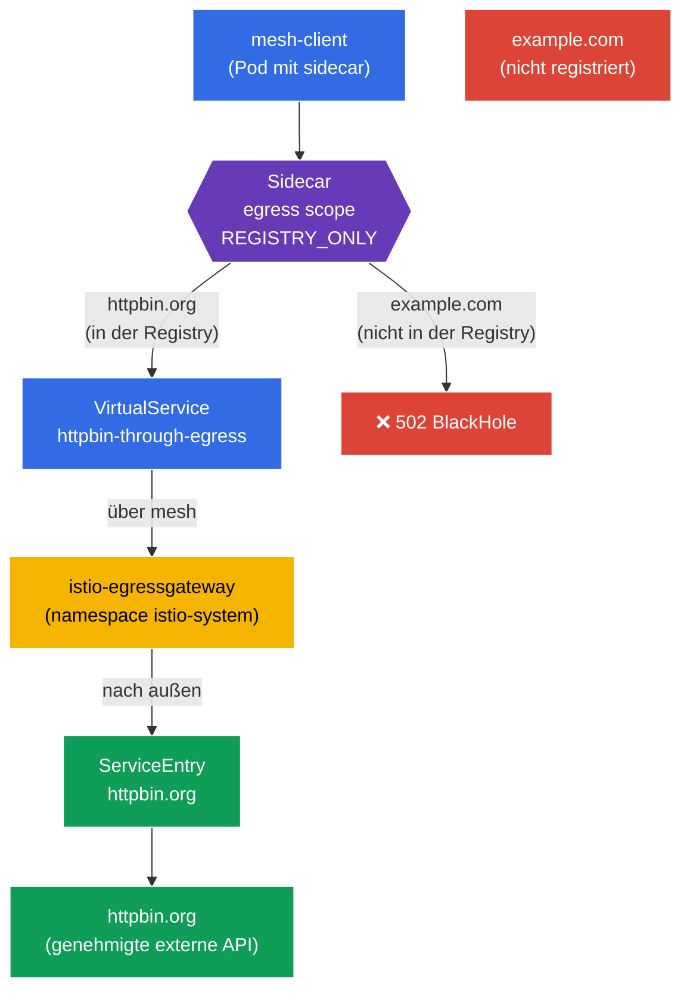

[RU version](README_RU.MD) · [Eng version](README.MD) · [Versión en español](README_ES.MD) · [Version française](README_FR.MD)

# Lab 05 - Kontrollierter Egress: ServiceEntry + Egress Gateway + Sidecar-Scope

Stellen Sie sich vor: Innerhalb des Clusters lebt ein Service, der eine externe API (`httpbin.org`) erreichen muss. Standardmäßig arbeitet Istio im Modus `ALLOW_ANY` - jeder Pod kann überallhin ins Internet zugreifen. Aus Sicherheitssicht ist das schlecht: Ein kompromittierter Pod könnte Daten an eine beliebige externe Adresse "abfließen" lassen. Wir brauchen einen **kontrollierten Ausgang** nach außen: nur den genehmigten externen Service erlauben, seinen Datenverkehr durch einen einzigen Punkt (Egress Gateway) leiten und alles andere verbieten.

In dieser Übung behandeln wir drei Istio-Mechanismen für den Umgang mit ausgehendem Datenverkehr:
- **ServiceEntry** - Registrierung eines externen Service in der Registry des mesh, damit Istio von ihm "weiß" und Richtlinien auf ihn anwenden kann.
- **Egress Gateway** - dedizierter Ausgangspunkt: Der gesamte externe Datenverkehr läuft über ein separates Envoy-Gateway (praktisch für Audit, Monitoring und Filterung).
- **Sidecar (egress scope)** - die Ressource `Sidecar`, die einschränkt, welche Hosts und Namespaces der Sidecar erreichen kann, und den Namespace in den Modus `REGISTRY_ONLY` versetzt.

### Wie es funktioniert (Gesamtschema)



## Ziel

Verstehen, wie Istio den **ausgehenden** Datenverkehr steuert, und die vollständige Egress-Kontrollkette aufbauen:
1. einen externen Service registrieren (`ServiceEntry`);
2. seinen Datenverkehr über das `Egress Gateway` leiten;
3. den Namespace für alles Überflüssige über `Sidecar` + `REGISTRY_ONLY` schließen.

## Schritt 1. Aktivierung der Sidecar-Injektion

```bash
kubectl label namespace default istio-injection=enabled --overwrite
```

**Was das bewirkt:** Dem Namespace wird ein Label angehängt, und jedem Pod wird der Sidecar `istio-proxy` (Envoy) hinzugefügt. Genau Envoy fängt den **ausgehenden** Datenverkehr des Pods ab - ohne ihn würden weder ServiceEntry noch Egress Gateway noch Sidecar-Policies funktionieren.

## Schritt 2. Installation der Anwendung

Wir stellen `mesh-client` bereit - einen gewöhnlichen Pod mit `curl` innerhalb des mesh. Von ihm aus stellen wir externe Anfragen.

```bash
kubectl apply -f https://raw.githubusercontent.com/ViktorUJ/cks/refs/heads/master/tasks/ica/labs/05/k8s-1/scripts/1.yaml
kubectl rollout restart deployment -n default
```

Wir überprüfen, dass der Pod mit Sidecar gestartet ist (`2/2`):

```bash
kubectl get pods -n default
```

```
NAME                           READY   STATUS    RESTARTS   AGE
mesh-client-7d9c8b6f4d-xy12z   2/2     Running   0          20s
```

## Schritt 3. Basis-Überprüfung (Modus ALLOW_ANY)

Standardmäßig hat Istio `outboundTrafficPolicy.mode = ALLOW_ANY` - nach außen kann man überallhin gehen. Wir vergewissern uns davon:

```bash
# genehmigter Host
kubectl exec -n default deploy/mesh-client -c curl -- \
  curl -s -o /dev/null -w "%{http_code}\n" http://httpbin.org/status/200
```
```
200
```

```bash
# jeder andere Host - ebenfalls erreichbar
kubectl exec -n default deploy/mesh-client -c curl -- \
  curl -s -o /dev/null -w "%{http_code}\n" http://example.com/
```
```
200
```

Beide Anfragen kommen durch. Es gibt keinerlei Egress-Kontrolle - genau das ist das Problem, das wir lösen werden.

## Schritt 4. ServiceEntry - wir registrieren den externen Service

`ServiceEntry` fügt einen externen Host der internen Service-Registry von Istio hinzu. Das ist für zwei Dinge nötig: damit der externe Service geroutet werden kann (über das Egress Gateway) und damit er beim Aktivieren von `REGISTRY_ONLY` als "bekannt" gilt.

```bash
vim service-entry.yaml
```

```yaml
apiVersion: networking.istio.io/v1
kind: ServiceEntry
metadata:
  name: httpbin-ext
  namespace: default
spec:
  hosts:
  - httpbin.org
  ports:
  - number: 80
    name: http
    protocol: HTTP
  resolution: DNS          # Namen über DNS auflösen
  location: MESH_EXTERNAL  # Service befindet sich AUSSERHALB des mesh
```

```bash
kubectl apply -f service-entry.yaml
```

**Analyse:**
- **`hosts`** - der externe DNS-Name, den wir registrieren.
- **`ports`** - Port und Protokoll. Wir geben `HTTP/80` an, damit Istio das L7-Protokoll versteht und danach routen kann.
- **`resolution: DNS`** - Envoy löst den Namen `httpbin.org` selbst über DNS auf. Alternativen sind `STATIC` (feste IPs) oder `NONE`.
- **`location: MESH_EXTERNAL`** - der Service ist außerhalb des mesh (er hat keinen Sidecar, mTLS wird auf ihn nicht angewendet).

## Schritt 5. Egress Gateway - ein einziger Ausgangspunkt

Aktuell geht der Datenverkehr zu `httpbin.org` direkt aus dem Sidecar des Pods hinaus. Wir möchten, dass er über das dedizierte Gateway `istio-egressgateway` läuft (es ist bereits durch das Profil `demo` im Namespace `istio-system` bereitgestellt). Das ergibt einen einzigen Punkt zum Logging und zur Kontrolle des ausgehenden Datenverkehrs.

Es sind drei Ressourcen nötig: `Gateway` (Konfiguration des Egress-Gateways), `DestinationRule` (Subset des Gateways) und `VirtualService` (zweistufiges Routing: mesh → Gateway → externer Host).

```bash
vim egress-gateway.yaml
```

```yaml
apiVersion: networking.istio.io/v1
kind: Gateway
metadata:
  name: istio-egressgateway
  namespace: default
spec:
  selector:
    istio: egressgateway   # wir wenden es auf den Pod des egress-Gateways an
  servers:
  - port:
      number: 80
      name: http
      protocol: HTTP
    hosts:
    - httpbin.org
---
apiVersion: networking.istio.io/v1
kind: DestinationRule
metadata:
  name: egressgateway-for-httpbin
  namespace: default
spec:
  host: istio-egressgateway.istio-system.svc.cluster.local
  subsets:
  - name: httpbin
---
apiVersion: networking.istio.io/v1
kind: VirtualService
metadata:
  name: httpbin-through-egress
  namespace: default
spec:
  hosts:
  - httpbin.org
  gateways:
  - mesh                  # Datenverkehr innerhalb des mesh (von den Pods)
  - istio-egressgateway   # Datenverkehr, der am egress-Gateway ankommt
  http:
  # ETAPPE 1: aus dem mesh -> zum egress gateway leiten
  - match:
    - gateways:
      - mesh
      port: 80
    route:
    - destination:
        host: istio-egressgateway.istio-system.svc.cluster.local
        subset: httpbin
        port:
          number: 80
      weight: 100
  # ETAPPE 2: vom egress gateway -> nach außen, zum echten Host
  - match:
    - gateways:
      - istio-egressgateway
      port: 80
    route:
    - destination:
        host: httpbin.org
        port:
          number: 80
      weight: 100
```

```bash
kubectl apply -f egress-gateway.yaml
```

**Wie man den `VirtualService` liest:** Er beschreibt zwei "Sprünge" ein und derselben Anfrage:
- **Etappe 1** - die Anfrage entsteht innerhalb des mesh (`gateways: [mesh]`). Anstatt direkt ins Internet zu gehen, wird sie an den Service `istio-egressgateway` in `istio-system` geleitet.
- **Etappe 2** - dieselbe Anfrage kommt nun am Egress-Gateway an (`gateways: [istio-egressgateway]`), und das Gateway schickt sie nach außen an `httpbin.org`.

Wir überprüfen, dass der Datenverkehr tatsächlich über das Gateway läuft:

```bash
kubectl exec -n default deploy/mesh-client -c curl -- \
  curl -s -o /dev/null -w "%{http_code}\n" http://httpbin.org/status/200   # 200

kubectl logs -n istio-system -l istio=egressgateway --tail=20 | grep httpbin.org
```

In den Logs des Egress-Gateways sollte ein Eintrag über die Anfrage an `httpbin.org` erscheinen - das bedeutet, der Datenverkehr ist genau durch dieses gelaufen.

## Schritt 6. Sidecar - wir beschränken den Egress des Namespace

Der letzte Schritt - den Namespace `default` so zu schließen, dass aus ihm der Ausgang **nur** zu den registrierten Services erlaubt ist. Dafür verwenden wir die Ressource `Sidecar`: Sie beschränkt sowohl die Liste der sichtbaren Hosts (`egress.hosts`) als auch aktiviert den Modus `REGISTRY_ONLY`.

```bash
vim sidecar.yaml
```

```yaml
apiVersion: networking.istio.io/v1
kind: Sidecar
metadata:
  name: default            # Name default + fehlender workloadSelector = für den gesamten Namespace
  namespace: default
spec:
  egress:
  - hosts:
    - "istio-system/*"     # Zugriff auf das egress-Gateway (es ist in istio-system)
    - "./*"                # Zugriff auf die Services des eigenen Namespace (inklusive ServiceEntry)
  outboundTrafficPolicy:
    mode: REGISTRY_ONLY    # nach außen nur zu dem, was in der Registry ist
```

```bash
kubectl apply -f sidecar.yaml
```

**Analyse:**
- **`egress.hosts`** - Liste dessen, was der Sidecar "sieht". Format `namespace/dnsName`:
  - `"istio-system/*"` - wird benötigt, weil der Datenverkehr über das Egress-Gateway in `istio-system` läuft;
  - `"./*"` - Services des aktuellen Namespace, inklusive unserer `ServiceEntry` für `httpbin.org`.
  Indem wir diese Liste einschränken, verringern wir die Menge an Konfiguration, die Istio in jeden Sidecar verteilt, und verengen den Sichtbarkeitsbereich des Pods.
- **`outboundTrafficPolicy.mode: REGISTRY_ONLY`** - der zentrale Schalter. Jetzt lässt Envoy nur Datenverkehr zu Hosts aus der Registry nach außen (also zu denen, für die es eine `ServiceEntry` oder einen clusterinternen Service gibt). Alles andere wird blockiert und gibt `502` zurück.

## Schritt 7. Abschließende Überprüfung

```bash
# Genehmigter Host (registriert + läuft über egress gateway) -> 200
kubectl exec -n default deploy/mesh-client -c curl -- \
  curl -s -o /dev/null -w "%{http_code}\n" http://httpbin.org/status/200
```
```
200
```

```bash
# Nicht registrierter Host -> durch den Modus REGISTRY_ONLY blockiert
kubectl exec -n default deploy/mesh-client -c curl -- \
  curl -s -o /dev/null -w "%{http_code}\n" http://example.com/
```
```
502      # BlackHoleCluster - Ausgang verboten
```

## Fazit

| Schritt | Ressource | Was wir gemacht haben | Ergebnis |
|-----|--------|-------------|-----------|
| Registrierung | `ServiceEntry` | `httpbin.org` in die Registry des mesh aufgenommen | externer Service wurde "bekannt" |
| Routing | `Gateway` + `DestinationRule` + `VirtualService` | Datenverkehr über `istio-egressgateway` geleitet | einziger Ausgangspunkt + Audit |
| Einschränkung | `Sidecar` (`REGISTRY_ONLY`) | Namespace für alles Überflüssige geschlossen | `httpbin.org` erreichbar, `example.com` - nicht |

**Zentrale Erkenntnis:** Die Egress-Kontrolle in Istio setzt sich aus drei einander ergänzenden Bausteinen zusammen:
- **ServiceEntry** macht den externen Service für das mesh "sichtbar" - ohne ihn kann er weder geroutet noch im Modus `REGISTRY_ONLY` erlaubt werden.
- **Egress Gateway** ergibt einen einzigen, steuerbaren Ausgangspunkt: Der gesamte externe Datenverkehr läuft über ein Gateway, wo er sich bequem loggen und filtern lässt.
- **Sidecar + REGISTRY_ONLY** setzt das Prinzip "verboten ist alles, was nicht explizit erlaubt ist" für den ausgehenden Datenverkehr um - das ist das Egress-Pendant zum default-deny aus der Sicherheits-Lab.

Zusammen verwandeln sie den "flachen", unkontrollierten Ausgang ins Internet in einen streng begrenzten und beobachtbaren Kanal - und das alles auf Infrastrukturebene, ohne Änderung des Anwendungscodes.
