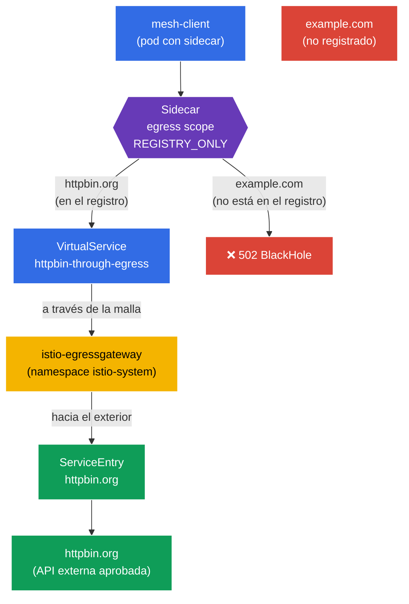

[RU version](README_RU.MD) · [Eng version](README.MD) · [Version française](README_FR.MD) · [Deutsche Version](README_DE.MD)

# Lab 05 - Egress controlado: ServiceEntry + Egress Gateway + Sidecar scope

Imagina: dentro del clúster vive un servicio que necesita comunicarse con una API externa (`httpbin.org`). Por defecto, Istio funciona en modo `ALLOW_ANY` - cualquier pod puede conectarse a donde quiera en internet. Desde el punto de vista de la seguridad esto es malo: un pod comprometido podría «filtrar» datos hacia cualquier dirección externa. Necesitamos una **salida controlada** hacia el exterior: permitir solo el servicio externo aprobado, hacer pasar su tráfico por un único punto (egress gateway) y bloquear todo lo demás.

En este laboratorio veremos tres mecanismos de Istio para trabajar con el tráfico saliente:
- **ServiceEntry** - registro de un servicio externo en el registro de la malla, para que Istio «sepa» de él y pueda aplicarle políticas.
- **Egress Gateway** - punto de salida dedicado: todo el tráfico externo pasa por un gateway Envoy independiente (cómodo para auditoría, monitorización y filtrado).
- **Sidecar (egress scope)** - recurso `Sidecar` que restringe a qué hosts y namespace puede acceder el sidecar, y cambia el namespace al modo `REGISTRY_ONLY`.

### Cómo funciona (esquema general)



## Infraestructura

El entorno se despliega en AWS (`eu-north-1`) mediante Terragrunt y consta de:

| Componente  | Descripción                                       |
|------------|---------------------------------------------------|
| `vpc`      | VPC `10.10.0.0/16` con subredes públicas          |
| `ssh-keys` | Claves SSH para el acceso a los nodos             |
| `k8s-1`    | Kubernetes `1.35.2` (kubeadm) con Istio instalado |
| `worker`   | Máquina de trabajo con `kubectl` y acceso al clúster |

Instancias: `t4g.medium` (master) Ubuntu `22.04`

## Despliegue

```bash
TASK=05 make run_ica_task
```

## Objetivo

Entender cómo Istio gestiona el tráfico **saliente** y montar la cadena completa de control de egress:
1. registrar el servicio externo (`ServiceEntry`);
2. dirigir su tráfico a través del `Egress Gateway`;
3. cerrar el namespace para todo lo superfluo mediante `Sidecar` + `REGISTRY_ONLY`.

## Paso 1. Habilitar la inyección de sidecar

```bash
kubectl label namespace default istio-injection=enabled --overwrite
```

**Qué hace:** se aplica una etiqueta al namespace y a cada pod se le añade el sidecar `istio-proxy` (Envoy). Es precisamente Envoy quien intercepta el tráfico **saliente** del pod - sin esto no funcionarán ni ServiceEntry, ni egress gateway, ni las políticas de Sidecar.

## Paso 2. Instalación de la aplicación

Desplegamos `mesh-client` - un pod normal con `curl` dentro de la malla. Desde él haremos las peticiones externas.

```bash
kubectl apply -f https://raw.githubusercontent.com/ViktorUJ/cks/refs/heads/master/tasks/ica/labs/05/k8s-1/scripts/1.yaml
kubectl rollout restart deployment -n default
```

Comprobamos que el pod arrancó con el sidecar (`2/2`):

```bash
kubectl get pods -n default
```

```
NAME                           READY   STATUS    RESTARTS   AGE
mesh-client-7d9c8b6f4d-xy12z   2/2     Running   0          20s
```

## Paso 3. Comprobación básica (modo ALLOW_ANY)

Por defecto, Istio tiene `outboundTrafficPolicy.mode = ALLOW_ANY` - se puede salir hacia donde sea. Vamos a confirmarlo:

```bash
# host aprobado
kubectl exec -n default deploy/mesh-client -c curl -- \
  curl -s -o /dev/null -w "%{http_code}\n" http://httpbin.org/status/200
```
```
200
```

```bash
# cualquier otro host - también accesible
kubectl exec -n default deploy/mesh-client -c curl -- \
  curl -s -o /dev/null -w "%{http_code}\n" http://example.com/
```
```
200
```

Ambas peticiones pasan. No hay ningún control de egress - ese es justamente el problema que vamos a resolver.

## Paso 4. ServiceEntry - registramos el servicio externo

`ServiceEntry` añade un host externo al registro interno de servicios de Istio. Esto es necesario para dos cosas: para que el servicio externo se pueda enrutar (a través del egress gateway) y para que se considere «conocido» al activar `REGISTRY_ONLY`.

```bash
vim service-entry.yaml
```

```yaml
apiVersion: networking.istio.io/v1
kind: ServiceEntry
metadata:
  name: httpbin-ext
  namespace: default
spec:
  hosts:
  - httpbin.org
  ports:
  - number: 80
    name: http
    protocol: HTTP
  resolution: DNS          # resolver el nombre mediante DNS
  location: MESH_EXTERNAL  # el servicio está FUERA de la malla
```

```bash
kubectl apply -f service-entry.yaml
```

**Desglose:**
- **`hosts`** - el nombre DNS externo que registramos.
- **`ports`** - puerto y protocolo. Indicamos `HTTP/80` para que Istio entienda el protocolo L7 y pueda enrutar según él.
- **`resolution: DNS`** - Envoy resuelve por sí mismo el nombre `httpbin.org` mediante DNS. La alternativa es `STATIC` (IPs fijas) o `NONE`.
- **`location: MESH_EXTERNAL`** - el servicio está fuera de la malla (no tiene sidecar, no se le aplica mTLS).

## Paso 5. Egress Gateway - punto único de salida

Ahora el tráfico hacia `httpbin.org` sale directamente desde el sidecar del pod. Queremos que pase a través del gateway dedicado `istio-egressgateway` (que ya está desplegado en el namespace `istio-system` por el perfil `demo`). Esto proporciona un punto único para el registro (logging) y el control del tráfico saliente.

Se necesitan tres recursos: `Gateway` (configuración del egress gateway), `DestinationRule` (subset del gateway) y `VirtualService` (enrutamiento en dos etapas: malla → gateway → host externo).

```bash
vim egress-gateway.yaml
```

```yaml
apiVersion: networking.istio.io/v1
kind: Gateway
metadata:
  name: istio-egressgateway
  namespace: default
spec:
  selector:
    istio: egressgateway   # lo aplicamos al pod del egress gateway
  servers:
  - port:
      number: 80
      name: http
      protocol: HTTP
    hosts:
    - httpbin.org
---
apiVersion: networking.istio.io/v1
kind: DestinationRule
metadata:
  name: egressgateway-for-httpbin
  namespace: default
spec:
  host: istio-egressgateway.istio-system.svc.cluster.local
  subsets:
  - name: httpbin
---
apiVersion: networking.istio.io/v1
kind: VirtualService
metadata:
  name: httpbin-through-egress
  namespace: default
spec:
  hosts:
  - httpbin.org
  gateways:
  - mesh                  # tráfico dentro de la malla (desde los pods)
  - istio-egressgateway   # tráfico que llegó al egress gateway
  http:
  # ETAPA 1: desde la malla -> lo dirigimos al egress gateway
  - match:
    - gateways:
      - mesh
      port: 80
    route:
    - destination:
        host: istio-egressgateway.istio-system.svc.cluster.local
        subset: httpbin
        port:
          number: 80
      weight: 100
  # ETAPA 2: desde el egress gateway -> hacia el exterior, al host real
  - match:
    - gateways:
      - istio-egressgateway
      port: 80
    route:
    - destination:
        host: httpbin.org
        port:
          number: 80
      weight: 100
```

```bash
kubectl apply -f egress-gateway.yaml
```

**Cómo leer el `VirtualService`:** describe dos «saltos» de una misma petición:
- **Etapa 1** - la petición nace dentro de la malla (`gateways: [mesh]`). En lugar de salir directamente a internet, se dirige al servicio `istio-egressgateway` en `istio-system`.
- **Etapa 2** - la misma petición llega ya al egress gateway (`gateways: [istio-egressgateway]`), y el gateway la envía hacia el exterior, a `httpbin.org`.

Comprobamos que el tráfico realmente pasa por el gateway:

```bash
kubectl exec -n default deploy/mesh-client -c curl -- \
  curl -s -o /dev/null -w "%{http_code}\n" http://httpbin.org/status/200   # 200

kubectl logs -n istio-system -l istio=egressgateway --tail=20 | grep httpbin.org
```

En los logs del egress gateway debería aparecer una entrada sobre la petición a `httpbin.org` - lo que significa que el tráfico pasó justamente por él.

## Paso 6. Sidecar - restringimos el egress del namespace

El paso final es cerrar el namespace `default` de forma que desde él solo se permita la salida **únicamente** hacia los servicios registrados. Para ello usamos el recurso `Sidecar`: restringe la lista de hosts visibles (`egress.hosts`) y activa el modo `REGISTRY_ONLY`.

```bash
vim sidecar.yaml
```

```yaml
apiVersion: networking.istio.io/v1
kind: Sidecar
metadata:
  name: default            # nombre default + ausencia de workloadSelector = a todo el namespace
  namespace: default
spec:
  egress:
  - hosts:
    - "istio-system/*"     # acceso al egress gateway (está en istio-system)
    - "./*"                # acceso a los servicios de su propio namespace (incluido el ServiceEntry)
  outboundTrafficPolicy:
    mode: REGISTRY_ONLY    # hacia el exterior solo se puede a lo que está en el registro
```

```bash
kubectl apply -f sidecar.yaml
```

**Desglose:**
- **`egress.hosts`** - lista de lo que «ve» el sidecar. Formato `namespace/dnsName`:
  - `"istio-system/*"` - necesario porque el tráfico pasa por el egress gateway en `istio-system`;
  - `"./*"` - los servicios del namespace actual, incluido nuestro `ServiceEntry` para `httpbin.org`.
  Al restringir esta lista, reducimos el volumen de configuración que Istio envía a cada sidecar y acotamos la zona de visibilidad del pod.
- **`outboundTrafficPolicy.mode: REGISTRY_ONLY`** - el interruptor clave. Ahora Envoy deja salir hacia el exterior solo el tráfico hacia hosts del registro (es decir, hacia aquellos para los que existe un `ServiceEntry` o un servicio interno del clúster). Todo lo demás se bloquea y devuelve `502`.

## Paso 7. Comprobación final

```bash
# Host aprobado (registrado + pasa por el egress gateway) -> 200
kubectl exec -n default deploy/mesh-client -c curl -- \
  curl -s -o /dev/null -w "%{http_code}\n" http://httpbin.org/status/200
```
```
200
```

```bash
# Host no registrado -> bloqueado por el modo REGISTRY_ONLY
kubectl exec -n default deploy/mesh-client -c curl -- \
  curl -s -o /dev/null -w "%{http_code}\n" http://example.com/
```
```
502      # BlackHoleCluster - salida denegada
```

## Resumen

| Paso | Recurso | Qué hicimos | Resultado |
|-----|--------|-------------|-----------|
| Registro | `ServiceEntry` | Añadimos `httpbin.org` al registro de la malla | el servicio externo pasó a ser «conocido» |
| Enrutamiento | `Gateway` + `DestinationRule` + `VirtualService` | Encaminamos el tráfico a través de `istio-egressgateway` | punto único de salida + auditoría |
| Restricción | `Sidecar` (`REGISTRY_ONLY`) | Cerramos el namespace para todo lo superfluo | `httpbin.org` accesible, `example.com` - no |

**Conclusión clave:** el control de egress en Istio se construye a partir de tres piezas que se complementan entre sí:
- **ServiceEntry** hace que el servicio externo sea «visible» para la malla - sin esto no se puede ni enrutar ni permitir en modo `REGISTRY_ONLY`.
- **Egress Gateway** proporciona un punto de salida único y gestionable: todo el tráfico externo pasa por un solo gateway, donde es cómodo registrarlo y filtrarlo.
- **Sidecar + REGISTRY_ONLY** implementa el principio de «está prohibido todo lo que no está permitido explícitamente» para el tráfico saliente - es el equivalente egress del default-deny del laboratorio sobre seguridad.

Juntos convierten una salida a internet «plana» e incontrolada en un canal estrictamente limitado y observable - y todo ello a nivel de infraestructura, sin cambiar el código de la aplicación.
