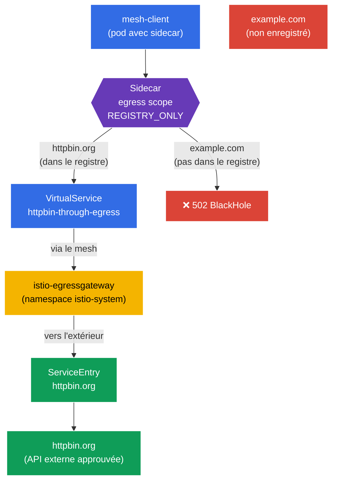

[RU version](README_RU.MD) · [Eng version](README.MD) · [Versión en español](README_ES.MD) · [Deutsche Version](README_DE.MD)

# Lab 05 - Egress contrôlé : ServiceEntry + Egress Gateway + Sidecar scope

Imaginez : à l'intérieur du cluster vit un service qui a besoin de s'adresser à une API externe (`httpbin.org`). Par défaut, Istio fonctionne en mode `ALLOW_ANY` - n'importe quel pod peut se connecter n'importe où sur Internet. Du point de vue de la sécurité, c'est mauvais : un pod compromis pourra « exfiltrer » des données vers n'importe quelle adresse externe. Il nous faut une **sortie contrôlée** vers l'extérieur : n'autoriser que le service externe approuvé, faire passer son trafic par un point unique (egress gateway) et interdire tout le reste.

Dans ce travail pratique, nous examinerons trois mécanismes d'Istio pour gérer le trafic sortant :
- **ServiceEntry** - enregistrement d'un service externe dans le registre du maillage, afin qu'Istio « connaisse » ce service et puisse lui appliquer des politiques.
- **Egress Gateway** - point de sortie dédié : tout le trafic externe passe par une gateway Envoy séparée (pratique pour l'audit, le monitoring et le filtrage).
- **Sidecar (egress scope)** - ressource `Sidecar` qui restreint les hôtes et namespaces auxquels le sidecar peut s'adresser, et bascule le namespace en mode `REGISTRY_ONLY`.

### Comment ça marche (schéma général)



## Objectif

Comprendre comment Istio gère le trafic **sortant**, et assembler la chaîne complète de contrôle de l'egress :
1. enregistrer un service externe (`ServiceEntry`) ;
2. diriger son trafic à travers l'`Egress Gateway` ;
3. fermer le namespace à tout ce qui est superflu via `Sidecar` + `REGISTRY_ONLY`.

## Étape 1. Activation de l'injection de sidecar

```bash
kubectl label namespace default istio-injection=enabled --overwrite
```

**Ce que cela fait :** un label est apposé sur le namespace, et un sidecar `istio-proxy` (Envoy) est ajouté à chaque pod. C'est justement Envoy qui intercepte le trafic **sortant** du pod - sans lui, ni le ServiceEntry, ni l'egress gateway, ni les politiques Sidecar ne fonctionneront.

## Étape 2. Installation de l'application

On déploie `mesh-client` - un pod ordinaire avec `curl` à l'intérieur du mesh. C'est depuis lui que nous ferons des requêtes externes.

```bash
kubectl apply -f https://raw.githubusercontent.com/ViktorUJ/cks/refs/heads/master/tasks/ica/labs/05/k8s-1/scripts/1.yaml
kubectl rollout restart deployment -n default
```

On vérifie que le pod est démarré avec le sidecar (`2/2`) :

```bash
kubectl get pods -n default
```

```
NAME                           READY   STATUS    RESTARTS   AGE
mesh-client-7d9c8b6f4d-xy12z   2/2     Running   0          20s
```

## Étape 3. Vérification de base (mode ALLOW_ANY)

Par défaut, Istio a `outboundTrafficPolicy.mode = ALLOW_ANY` - on peut sortir vers l'extérieur n'importe où. Vérifions-le :

```bash
# hôte approuvé
kubectl exec -n default deploy/mesh-client -c curl -- \
  curl -s -o /dev/null -w "%{http_code}\n" http://httpbin.org/status/200
```
```
200
```

```bash
# n'importe quel autre hôte - également accessible
kubectl exec -n default deploy/mesh-client -c curl -- \
  curl -s -o /dev/null -w "%{http_code}\n" http://example.com/
```
```
200
```

Les deux requêtes passent. Aucun contrôle de l'egress - c'est justement le problème que nous allons résoudre.

## Étape 4. ServiceEntry - on enregistre le service externe

`ServiceEntry` ajoute un hôte externe au registre interne des services d'Istio. C'est nécessaire pour deux choses : pour que le service externe puisse être routé (via l'egress gateway), et pour qu'il soit considéré comme « connu » lors de l'activation de `REGISTRY_ONLY`.

```bash
vim service-entry.yaml
```

```yaml
apiVersion: networking.istio.io/v1
kind: ServiceEntry
metadata:
  name: httpbin-ext
  namespace: default
spec:
  hosts:
  - httpbin.org
  ports:
  - number: 80
    name: http
    protocol: HTTP
  resolution: DNS          # résoudre le nom via DNS
  location: MESH_EXTERNAL  # le service se trouve EN DEHORS du mesh
```

```bash
kubectl apply -f service-entry.yaml
```

**Analyse :**
- **`hosts`** - nom DNS externe que nous enregistrons.
- **`ports`** - port et protocole. On indique `HTTP/80`, pour qu'Istio comprenne le protocole L7 et puisse router en fonction de lui.
- **`resolution: DNS`** - Envoy résout lui-même le nom `httpbin.org` via DNS. Alternatives - `STATIC` (IP fixes) ou `NONE`.
- **`location: MESH_EXTERNAL`** - le service est en dehors du mesh (il n'a pas de sidecar, le mTLS ne lui est pas appliqué).

## Étape 5. Egress Gateway - point de sortie unique

Pour l'instant, le trafic vers `httpbin.org` part directement du sidecar du pod. Nous voulons qu'il passe par la gateway dédiée `istio-egressgateway` (déjà déployée dans le namespace `istio-system` par le profil `demo`). Cela offre un point unique pour le logging et le contrôle du trafic sortant.

Il faut trois ressources : `Gateway` (configuration de l'egress gateway), `DestinationRule` (subset de la gateway) et `VirtualService` (routage en deux étapes : mesh → gateway → hôte externe).

```bash
vim egress-gateway.yaml
```

```yaml
apiVersion: networking.istio.io/v1
kind: Gateway
metadata:
  name: istio-egressgateway
  namespace: default
spec:
  selector:
    istio: egressgateway   # on applique au pod de l'egress gateway
  servers:
  - port:
      number: 80
      name: http
      protocol: HTTP
    hosts:
    - httpbin.org
---
apiVersion: networking.istio.io/v1
kind: DestinationRule
metadata:
  name: egressgateway-for-httpbin
  namespace: default
spec:
  host: istio-egressgateway.istio-system.svc.cluster.local
  subsets:
  - name: httpbin
---
apiVersion: networking.istio.io/v1
kind: VirtualService
metadata:
  name: httpbin-through-egress
  namespace: default
spec:
  hosts:
  - httpbin.org
  gateways:
  - mesh                  # trafic à l'intérieur du mesh (depuis les pods)
  - istio-egressgateway   # trafic arrivé sur l'egress gateway
  http:
  # ÉTAPE 1 : depuis le mesh -> on dirige vers l'egress gateway
  - match:
    - gateways:
      - mesh
      port: 80
    route:
    - destination:
        host: istio-egressgateway.istio-system.svc.cluster.local
        subset: httpbin
        port:
          number: 80
      weight: 100
  # ÉTAPE 2 : depuis l'egress gateway -> vers l'extérieur, sur l'hôte réel
  - match:
    - gateways:
      - istio-egressgateway
      port: 80
    route:
    - destination:
        host: httpbin.org
        port:
          number: 80
      weight: 100
```

```bash
kubectl apply -f egress-gateway.yaml
```

**Comment lire le `VirtualService` :** il décrit deux « sauts » d'une même requête :
- **Étape 1** - la requête naît à l'intérieur du mesh (`gateways: [mesh]`). Au lieu de partir directement sur Internet, elle est dirigée vers le service `istio-egressgateway` dans `istio-system`.
- **Étape 2** - la même requête arrive maintenant sur l'egress gateway (`gateways: [istio-egressgateway]`), et la gateway l'envoie vers l'extérieur sur `httpbin.org`.

On vérifie que le trafic passe réellement par la gateway :

```bash
kubectl exec -n default deploy/mesh-client -c curl -- \
  curl -s -o /dev/null -w "%{http_code}\n" http://httpbin.org/status/200   # 200

kubectl logs -n istio-system -l istio=egressgateway --tail=20 | grep httpbin.org
```

Dans les logs de l'egress gateway doit apparaître une entrée concernant la requête vers `httpbin.org` - cela signifie que le trafic est bien passé par elle.

## Étape 6. Sidecar - on restreint l'egress du namespace

Étape finale - fermer le namespace `default` de sorte que la sortie n'y soit autorisée **que** vers les services enregistrés. Pour cela, on utilise la ressource `Sidecar` : elle restreint à la fois la liste des hôtes visibles (`egress.hosts`) et active le mode `REGISTRY_ONLY`.

```bash
vim sidecar.yaml
```

```yaml
apiVersion: networking.istio.io/v1
kind: Sidecar
metadata:
  name: default            # nom default + absence de workloadSelector = sur tout le namespace
  namespace: default
spec:
  egress:
  - hosts:
    - "istio-system/*"     # accès à l'egress gateway (elle est dans istio-system)
    - "./*"                # accès aux services de son propre namespace (y compris ServiceEntry)
  outboundTrafficPolicy:
    mode: REGISTRY_ONLY    # vers l'extérieur, uniquement ce qui est dans le registre
```

```bash
kubectl apply -f sidecar.yaml
```

**Analyse :**
- **`egress.hosts`** - liste de ce que « voit » le sidecar. Format `namespace/dnsName` :
  - `"istio-system/*"` - nécessaire car le trafic passe par l'egress gateway dans `istio-system` ;
  - `"./*"` - services du namespace courant, y compris notre `ServiceEntry` pour `httpbin.org`.
  En restreignant cette liste, on réduit le volume de configuration qu'Istio diffuse vers chaque sidecar, et on réduit la zone de visibilité du pod.
- **`outboundTrafficPolicy.mode: REGISTRY_ONLY`** - le commutateur clé. Désormais, Envoy ne laisse sortir vers l'extérieur que le trafic vers les hôtes du registre (c'est-à-dire ceux pour lesquels il existe un `ServiceEntry` ou un service intra-cluster). Tout le reste est bloqué et renvoie un `502`.

## Étape 7. Vérification finale

```bash
# Hôte approuvé (enregistré + passe par l'egress gateway) -> 200
kubectl exec -n default deploy/mesh-client -c curl -- \
  curl -s -o /dev/null -w "%{http_code}\n" http://httpbin.org/status/200
```
```
200
```

```bash
# Hôte non enregistré -> bloqué par le mode REGISTRY_ONLY
kubectl exec -n default deploy/mesh-client -c curl -- \
  curl -s -o /dev/null -w "%{http_code}\n" http://example.com/
```
```
502      # BlackHoleCluster - sortie interdite
```

## Bilan

| Étape | Ressource | Ce que l'on a fait | Résultat |
|-----|--------|-------------|-----------|
| Enregistrement | `ServiceEntry` | Ajouté `httpbin.org` au registre du mesh | le service externe est devenu « connu » |
| Routage | `Gateway` + `DestinationRule` + `VirtualService` | Fait passer le trafic par `istio-egressgateway` | point de sortie unique + audit |
| Restriction | `Sidecar` (`REGISTRY_ONLY`) | Fermé le namespace à tout ce qui est superflu | `httpbin.org` accessible, `example.com` - non |

**Conclusion clé :** le contrôle de l'egress dans Istio s'assemble à partir de trois briques complémentaires :
- **ServiceEntry** rend le service externe « visible » pour le mesh - sans cela, il ne peut être ni routé, ni autorisé en mode `REGISTRY_ONLY`.
- **Egress Gateway** offre un point de sortie unique et gérable : tout le trafic externe passe par une seule gateway, où il est pratique de le logger et de le filtrer.
- **Sidecar + REGISTRY_ONLY** met en œuvre le principe « tout est interdit, sauf ce qui est explicitement autorisé » pour le trafic sortant - c'est l'équivalent egress du default-deny du lab sur la sécurité.

Ensemble, ils transforment une sortie « plate » et non contrôlée vers Internet en un canal strictement limité et observable - et tout cela au niveau de l'infrastructure, sans modifier le code de l'application.
