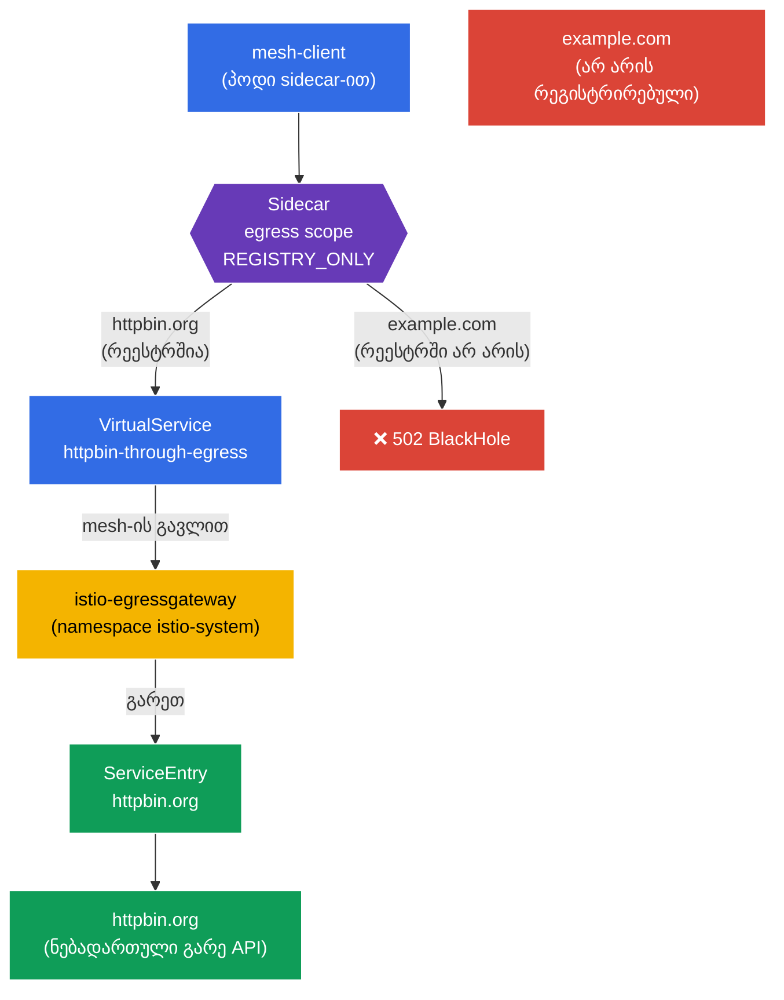

[Русская версия](README_RU.MD) · [Eng version](README.MD) · [Versión en español](README_ES.MD) · [Version française](README_FR.MD) · [Deutsche Version](README_DE.MD) · [繁體中文版](README_TW.MD) · [日本語版](README_JP.MD)

# Lab 05 - კონტროლირებადი egress: ServiceEntry + Egress Gateway + Sidecar scope

> [საცნობარო გადაწყვეტა](worker/files/solutions/1_GE.MD)

წარმოიდგინეთ: კლასტერში არის სერვისი, რომელსაც გარე API-სთან (`httpbin.org`) მიმართვა სჭირდება. ნაგულისხმევად Istio მუშაობს `ALLOW_ANY` რეჟიმში - ნებისმიერ პოდს შეუძლია ინტერნეტში ნებისმიერ მისამართს მიმართოს. უსაფრთხოების თვალსაზრისით ეს ცუდია: კომპრომეტირებულ პოდს შეეძლება მონაცემების ნებისმიერ გარე მისამართზე „გაჟონვა“. ჩვენ გვჭირდება გარეთ გასვლის **კონტროლირებადი გზა**: დავუშვათ მხოლოდ ნებადართული გარე სერვისი, მისი ტრაფიკი გავატაროთ ერთი წერტილის (egress gateway) გავლით და ყველაფერი დანარჩენი ავკრძალოთ.

ამ ლაბორატორიულ სამუშაოში Istio-ს გამავალი ტრაფიკის მართვის სამ მექანიზმს განვიხილავთ:
- **ServiceEntry** - გარე სერვისის რეგისტრაცია mesh-ის რეესტრში, რათა Istio-მ მის შესახებ „იცოდეს“ და მასზე პოლიტიკების გამოყენება შეძლოს.
- **Egress Gateway** - გამოყოფილი გასასვლელი წერტილი: მთელი გარე ტრაფიკი ცალკე Envoy-შლუზის გავლით გადის (მოსახერხებელია აუდიტის, მონიტორინგისა და ფილტრაციისთვის).
- **Sidecar (egress scope)** - `Sidecar` რესურსი, რომელიც ზღუდავს, რომელ ჰოსტებსა და namespace-ებს შეიძლება მიმართოს sidecar-მა, და namespace-ს `REGISTRY_ONLY` რეჟიმში გადაჰყავს.

### როგორ მუშაობს ეს (ზოგადი სქემა)



## ინფრასტრუქტურა

გარემო Terragrunt-ის საშუალებით AWS-ში (`eu-north-1`) იშლება და შედგება შემდეგი კომპონენტებისგან:

| კომპონენტი | აღწერა |
|------------|--------|
| `vpc`      | VPC `10.10.0.0/16` საჯარო subnet-ებით |
| `ssh-keys` | SSH გასაღებები node-ებზე წვდომისთვის |
| `k8s-1`    | Kubernetes `1.35.2` (kubeadm) დაყენებული Istio-თი |
| `worker`   | სამუშაო მანქანა `kubectl`-ითა და კლასტერზე წვდომით |

ინსტანსები: `t4g.medium` (master) Ubuntu `22.04`

## გაშლა

```bash
TASK=05 make run_ica_task
```

## მიზანი

გავიგოთ, როგორ მართავს Istio **გამავალ** ტრაფიკს, და ავაწყოთ egress-ის კონტროლის სრული ჯაჭვი:
1. გარე სერვისის რეგისტრაცია (`ServiceEntry`);
2. მისი ტრაფიკის `Egress Gateway`-ის გავლით მიმართვა;
3. `Sidecar` + `REGISTRY_ONLY`-ის საშუალებით namespace-ის დახურვა ყველა არასაჭირო მიმართულებისთვის.

## ნაბიჯი 1. Sidecar-ის ინექციის ჩართვა

```bash
kubectl label namespace default istio-injection=enabled --overwrite
```

**რას აკეთებს ეს:** namespace-ს ენიჭება label და თითოეულ პოდს ემატება sidecar `istio-proxy` (Envoy). სწორედ Envoy იჭერს პოდის **გამავალ** ტრაფიკს - ამის გარეშე არც ServiceEntry, არც egress gateway და არც Sidecar-ის პოლიტიკები არ იმუშავებს.

## ნაბიჯი 2. აპლიკაციის დაყენება

ვუშვებთ `mesh-client`-ს - ჩვეულებრივ პოდს `curl`-ით mesh-ის შიგნით. გარე მოთხოვნებს სწორედ მისგან გავაგზავნით.

```bash
kubectl apply -f https://raw.githubusercontent.com/ViktorUJ/cks/refs/heads/master/tasks/ica/labs/05/k8s-1/scripts/1.yaml
kubectl rollout restart deployment -n default
```

ვამოწმებთ, რომ პოდი sidecar-თან ერთად გაეშვა (`2/2`):

```bash
kubectl get pods -n default
```

```
NAME                           READY   STATUS    RESTARTS   AGE
mesh-client-7d9c8b6f4d-xy12z   2/2     Running   0          20s
```

## ნაბიჯი 3. საწყისი შემოწმება (ALLOW_ANY რეჟიმი)

ნაგულისხმევად Istio-ში `outboundTrafficPolicy.mode = ALLOW_ANY` - გარეთ ნებისმიერ მისამართზე მიმართვაა შესაძლებელი. დავრწმუნდეთ ამაში:

```bash
# დამტკიცებული ჰოსტი
kubectl exec -n default deploy/mesh-client -c curl -- \
  curl -s -o /dev/null -w "%{http_code}\n" http://httpbin.org/status/200
```
```
200
```

```bash
# ნებისმიერი სხვა ჰოსტი - ასევე ხელმისაწვდომია
kubectl exec -n default deploy/mesh-client -c curl -- \
  curl -s -o /dev/null -w "%{http_code}\n" http://example.com/
```
```
200
```

ორივე მოთხოვნა სრულდება. egress-ის კონტროლი საერთოდ არ არსებობს - სწორედ ამ პრობლემას გადავჭრით.

## ნაბიჯი 4. ServiceEntry - გარე სერვისის რეგისტრაცია

`ServiceEntry` გარე ჰოსტს Istio-ს სერვისების შიდა რეესტრში ამატებს. ეს ორი რამისთვისაა საჭირო: გარე სერვისის მარშრუტიზაციისთვის (egress gateway-ის გავლით) და იმისთვის, რომ `REGISTRY_ONLY`-ის ჩართვისას იგი „ცნობილად“ ჩაითვალოს.

```bash
vim service-entry.yaml
```

```yaml
apiVersion: networking.istio.io/v1
kind: ServiceEntry
metadata:
  name: httpbin-ext
  namespace: default
spec:
  hosts:
  - httpbin.org
  ports:
  - number: 80
    name: http
    protocol: HTTP
  resolution: DNS          # სახელის resolve DNS-ის საშუალებით
  location: MESH_EXTERNAL  # სერვისი მდებარეობს mesh-ის გარეთ
```

```bash
kubectl apply -f service-entry.yaml
```

**განხილვა:**
- **`hosts`** - გარე DNS სახელი, რომელსაც ვარეგისტრირებთ.
- **`ports`** - პორტი და პროტოკოლი. ვუთითებთ `HTTP/80`-ს, რათა Istio-მ L7 პროტოკოლი ამოიცნოს და მისი მარშრუტიზაცია შეძლოს.
- **`resolution: DNS`** - Envoy თავად ასრულებს `httpbin.org` სახელის DNS-ით resolve-ს. ალტერნატივებია `STATIC` (ფიქსირებული IP მისამართები) ან `NONE`.
- **`location: MESH_EXTERNAL`** - სერვისი mesh-ის გარეთაა (მას sidecar არ აქვს და მის მიმართ mTLS არ გამოიყენება).

## ნაბიჯი 5. Egress Gateway - ერთიანი გასასვლელი წერტილი

ამჟამად `httpbin.org`-ისკენ ტრაფიკი პირდაპირ პოდის sidecar-იდან გადის. გვინდა, რომ მან გამოყოფილი `istio-egressgateway` შლუზის გავლით გაიაროს (იგი უკვე გაშლილია `istio-system` namespace-ში `demo` პროფილით). ეს გვაძლევს გამავალი ტრაფიკის ლოგირებისა და კონტროლის ერთიან წერტილს.

საჭიროა სამი რესურსი: `Gateway` (egress შლუზის კონფიგურაცია), `DestinationRule` (შლუზის subset) და `VirtualService` (ორეტაპიანი მარშრუტიზაცია: mesh → შლუზი → გარე ჰოსტი).

```bash
vim egress-gateway.yaml
```

```yaml
apiVersion: networking.istio.io/v1
kind: Gateway
metadata:
  name: istio-egressgateway
  namespace: default
spec:
  selector:
    istio: egressgateway   # ვიყენებთ egress-შლუზის პოდზე
  servers:
  - port:
      number: 80
      name: http
      protocol: HTTP
    hosts:
    - httpbin.org
---
apiVersion: networking.istio.io/v1
kind: DestinationRule
metadata:
  name: egressgateway-for-httpbin
  namespace: default
spec:
  host: istio-egressgateway.istio-system.svc.cluster.local
  subsets:
  - name: httpbin
---
apiVersion: networking.istio.io/v1
kind: VirtualService
metadata:
  name: httpbin-through-egress
  namespace: default
spec:
  hosts:
  - httpbin.org
  gateways:
  - mesh                  # ტრაფიკი mesh-ის შიგნით (პოდებიდან)
  - istio-egressgateway   # ტრაფიკი, რომელიც egress-შლუზზე მოვიდა
  http:
  # ეტაპი 1: mesh-იდან -> ვამისამართებთ egress gateway-ზე
  - match:
    - gateways:
      - mesh
      port: 80
    route:
    - destination:
        host: istio-egressgateway.istio-system.svc.cluster.local
        subset: httpbin
        port:
          number: 80
      weight: 100
  # ეტაპი 2: egress gateway-იდან -> გარეთ, რეალურ ჰოსტზე
  - match:
    - gateways:
      - istio-egressgateway
      port: 80
    route:
    - destination:
        host: httpbin.org
        port:
          number: 80
      weight: 100
```

```bash
kubectl apply -f egress-gateway.yaml
```

**როგორ წავიკითხოთ `VirtualService`:** ის ერთი და იმავე მოთხოვნის ორ „ნახტომს“ აღწერს:
- **ეტაპი 1** - მოთხოვნა mesh-ის შიგნით წარმოიქმნება (`gateways: [mesh]`). ინტერნეტში პირდაპირ გასვლის ნაცვლად, იგი `istio-system`-ში არსებულ `istio-egressgateway` სერვისზე მიემართება.
- **ეტაპი 2** - იგივე მოთხოვნა უკვე egress შლუზზე მიდის (`gateways: [istio-egressgateway]`) და შლუზი მას გარეთ, `httpbin.org`-ისკენ აგზავნის.

ვამოწმებთ, რომ ტრაფიკი ნამდვილად შლუზის გავლით მიდის:

```bash
kubectl exec -n default deploy/mesh-client -c curl -- \
  curl -s -o /dev/null -w "%{http_code}\n" http://httpbin.org/status/200   # 200

kubectl logs -n istio-system -l istio=egressgateway --tail=20 | grep httpbin.org
```

egress შლუზის ლოგებში `httpbin.org`-ისადმი მოთხოვნის ჩანაწერი უნდა გამოჩნდეს - ეს ნიშნავს, რომ ტრაფიკმა სწორედ მისი გავლით გაიარა.

## ნაბიჯი 6. Sidecar - namespace-ის egress-ის შეზღუდვა

საბოლოო ნაბიჯია `default` namespace-ის ისე დახურვა, რომ მისგან გასვლა **მხოლოდ** რეგისტრირებული სერვისებისკენ იყოს ნებადართული. ამისთვის ვიყენებთ `Sidecar` რესურსს: ის ხილული ჰოსტების სიასაც (`egress.hosts`) ზღუდავს და `REGISTRY_ONLY` რეჟიმსაც რთავს.

```bash
vim sidecar.yaml
```

```yaml
apiVersion: networking.istio.io/v1
kind: Sidecar
metadata:
  name: default            # სახელი default + workloadSelector-ის არარსებობა = მთელ namespace-ზე
  namespace: default
spec:
  egress:
  - hosts:
    - "istio-system/*"     # წვდომა egress-შლუზთან (ის istio-system-შია)
    - "./*"                # წვდომა საკუთარი namespace-ის სერვისებთან (ServiceEntry-ის ჩათვლით)
  outboundTrafficPolicy:
    mode: REGISTRY_ONLY    # გარეთ შესაძლებელია მხოლოდ იმასთან, რაც რეესტრშია
```

```bash
kubectl apply -f sidecar.yaml
```

**განხილვა:**
- **`egress.hosts`** - სია, რომელსაც sidecar „ხედავს“. ფორმატია `namespace/dnsName`:
  - `"istio-system/*"` - საჭიროა, რადგან ტრაფიკი `istio-system`-ში მდებარე egress შლუზის გავლით მიდის;
  - `"./*"` - მიმდინარე namespace-ის სერვისები, მათ შორის ჩვენი `ServiceEntry` `httpbin.org`-ისთვის.
  ამ სიის შეზღუდვით ვამცირებთ კონფიგურაციის მოცულობას, რომელსაც Istio თითოეულ sidecar-ს უგზავნის, და ვავიწროებთ პოდის ხილვადობის არეალს.
- **`outboundTrafficPolicy.mode: REGISTRY_ONLY`** - მთავარი გადამრთველი. ახლა Envoy გარეთ უშვებს მხოლოდ რეესტრში არსებული ჰოსტებისკენ მიმართულ ტრაფიკს (ანუ მათკენ, ვისთვისაც არსებობს `ServiceEntry` ან შიდაკლასტერული სერვისი). ყველაფერი დანარჩენი იბლოკება და აბრუნებს `502`-ს.

## ნაბიჯი 7. საბოლოო შემოწმება

```bash
# დამტკიცებული ჰოსტი (რეგისტრირებულია + მიდის egress gateway-ის გავლით) -> 200
kubectl exec -n default deploy/mesh-client -c curl -- \
  curl -s -o /dev/null -w "%{http_code}\n" http://httpbin.org/status/200
```
```
200
```

```bash
# არარეგისტრირებული ჰოსტი -> დაბლოკილია REGISTRY_ONLY რეჟიმით
kubectl exec -n default deploy/mesh-client -c curl -- \
  curl -s -o /dev/null -w "%{http_code}\n" http://example.com/
```
```
502      # BlackHoleCluster - გასვლა აკრძალულია
```

## შედეგი

| ეტაპი | რესურსი | რა გავაკეთეთ | შედეგი |
|-------|---------|--------------|---------|
| რეგისტრაცია | `ServiceEntry` | `httpbin.org` mesh-ის რეესტრში დავამატეთ | გარე სერვისი „ცნობილი“ გახდა |
| მარშრუტიზაცია | `Gateway` + `DestinationRule` + `VirtualService` | ტრაფიკი `istio-egressgateway`-ის გავლით მივმართეთ | გასვლის ერთიანი წერტილი + აუდიტი |
| შეზღუდვა | `Sidecar` (`REGISTRY_ONLY`) | namespace ყველა არასაჭირო მიმართულებისთვის დავხურეთ | `httpbin.org` ხელმისაწვდომია, `example.com` - არა |

**მთავარი დასკვნა:** Istio-ში egress-ის კონტროლი სამი ურთიერთშემავსებელი აგურისგან შედგება:
- **ServiceEntry** გარე სერვისს mesh-ისთვის „ხილულს“ ხდის - ამის გარეშე ვერც მის მარშრუტიზაციას შევძლებთ და ვერც `REGISTRY_ONLY` რეჟიმში დავუშვებთ.
- **Egress Gateway** გასვლის ერთიან მართვად წერტილს გვაძლევს: მთელი გარე ტრაფიკი ერთ შლუზზე გადის, სადაც მისი ლოგირება და ფილტრაცია მოსახერხებელია.
- **Sidecar + REGISTRY_ONLY** გამავალი ტრაფიკისთვის ახორციელებს პრინციპს „აკრძალულია ყველაფერი, რაც ცხადად არ არის ნებადართული“ - ეს უსაფრთხოების ლაბორატორიული სამუშაოდან default-deny-ის egress ანალოგია.

ერთად ისინი ინტერნეტში „ბრტყელ“, უკონტროლო გასვლას მკაცრად შეზღუდულ და დაკვირვებად არხად გარდაქმნიან - და ეს ყველაფერი ინფრასტრუქტურის დონეზე, აპლიკაციის კოდის შეცვლის გარეშე ხდება.
