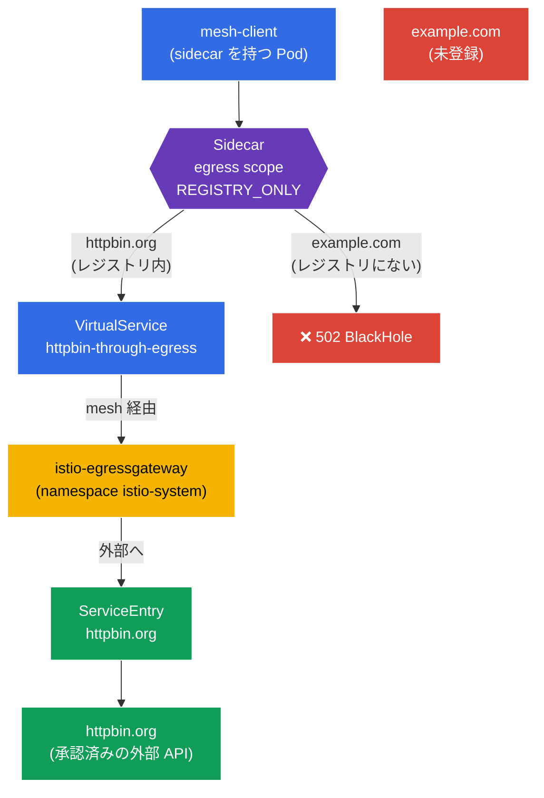

[Русская версия](README_RU.MD) · [Eng version](README.MD) · [Versión en español](README_ES.MD) · [Version française](README_FR.MD) · [Deutsche Version](README_DE.MD) · [ქართული ვერსია](README_GE.MD) · [繁體中文版](README_TW.MD)

# Lab 05 - 制御された egress: ServiceEntry + Egress Gateway + Sidecar scope

> [リファレンス解答](worker/files/solutions/1_JP.MD)

想像してみてください。クラスター内には、外部 API（`httpbin.org`）へアクセスする必要があるサービスがあります。デフォルトでは Istio は `ALLOW_ANY` モードで動作するため、どの Pod もインターネット上の任意の場所へ接続できます。セキュリティの観点ではこれは望ましくありません。侵害された Pod が任意の外部アドレスにデータを流出させられるためです。必要なのは**制御された外部への出口**です。承認済みの外部サービスのみを許可し、そのトラフィックを単一のポイント（egress gateway）経由にし、それ以外をすべて拒否します。

このラボでは、送信トラフィックを扱う Istio の3つのメカニズムを確認します。
- **ServiceEntry** - 外部サービスを mesh のレジストリに登録し、Istio がそれを「認識」してポリシーを適用できるようにします。
- **Egress Gateway** - 専用の出口ポイントです。すべての外部トラフィックが個別の Envoy ゲートウェイを通過します（監査、監視、フィルタリングに便利です）。
- **Sidecar (egress scope)** - sidecar がアクセスできるホストと namespace を制限し、namespace を `REGISTRY_ONLY` モードに切り替える `Sidecar` リソースです。

### 仕組み（全体図）



## インフラストラクチャ

環境は AWS（`eu-north-1`）上で Terragrunt によりデプロイされ、次の要素で構成されます。

| コンポーネント  | 説明                                          |
|------------|---------------------------------------------------|
| `vpc`      | パブリックサブネットを持つ VPC `10.10.0.0/16`          |
| `ssh-keys` | ノードへアクセスするための SSH キー                      |
| `k8s-1`    | Istio をインストール済みの Kubernetes `1.35.2`（kubeadm） |
| `worker`   | `kubectl` とクラスターへのアクセスを備えた作業マシン   |

インスタンス: `t4g.medium`（master）Ubuntu `22.04`

## デプロイ

```bash
TASK=05 make run_ica_task
```

## 目的

Istio が**送信**トラフィックをどのように制御するかを理解し、egress 制御の完全なチェーンを構築します。
1. 外部サービスを登録する（`ServiceEntry`）。
2. そのトラフィックを `Egress Gateway` 経由にする。
3. `Sidecar` + `REGISTRY_ONLY` によって、不要なものすべてに対して namespace を閉じる。

## ステップ1. sidecar インジェクションを有効化する

```bash
kubectl label namespace default istio-injection=enabled --overwrite
```

**これは何をするのか:** namespace にラベルを付与し、各 Pod に sidecar `istio-proxy`（Envoy）を追加します。Pod の**送信**トラフィックを捕捉するのは Envoy です。これがなければ、ServiceEntry、egress gateway、Sidecar ポリシーはいずれも機能しません。

## ステップ2. アプリケーションをインストールする

mesh 内に `curl` を持つ通常の Pod、`mesh-client` をデプロイします。外部リクエストはここから実行します。

```bash
kubectl apply -f https://raw.githubusercontent.com/ViktorUJ/cks/refs/heads/master/tasks/ica/labs/05/k8s-1/scripts/1.yaml
kubectl rollout restart deployment -n default
```

sidecar を含む Pod（`2/2`）が起動したことを確認します。

```bash
kubectl get pods -n default
```

```
NAME                           READY   STATUS    RESTARTS   AGE
mesh-client-7d9c8b6f4d-xy12z   2/2     Running   0          20s
```

## ステップ3. 基本確認（ALLOW_ANY モード）

デフォルトでは Istio の `outboundTrafficPolicy.mode = ALLOW_ANY` により、任意の外部宛てにアクセスできます。確認してみましょう。

```bash
# 承認されたホスト
kubectl exec -n default deploy/mesh-client -c curl -- \
  curl -s -o /dev/null -w "%{http_code}\n" http://httpbin.org/status/200
```
```
200
```

```bash
# 他の任意のホスト - こちらもアクセス可能
kubectl exec -n default deploy/mesh-client -c curl -- \
  curl -s -o /dev/null -w "%{http_code}\n" http://example.com/
```
```
200
```

どちらのリクエストも通ります。egress 制御はありません。これがこれから解決する問題です。

## ステップ4. ServiceEntry - 外部サービスを登録する

`ServiceEntry` は外部ホストを Istio の内部サービスレジストリに追加します。これには2つの目的があります。外部サービスをルーティング可能にすること（egress gateway 経由）、そして `REGISTRY_ONLY` 有効時に「既知」と見なされることです。

```bash
vim service-entry.yaml
```

```yaml
apiVersion: networking.istio.io/v1
kind: ServiceEntry
metadata:
  name: httpbin-ext
  namespace: default
spec:
  hosts:
  - httpbin.org
  ports:
  - number: 80
    name: http
    protocol: HTTP
  resolution: DNS          # DNS で名前を解決する
  location: MESH_EXTERNAL  # サービスは mesh の外部にある
```

```bash
kubectl apply -f service-entry.yaml
```

**解説:**
- **`hosts`** - 登録する外部 DNS 名です。
- **`ports`** - ポートとプロトコルです。Istio が L7 プロトコルを理解してルーティングできるよう、`HTTP/80` を指定します。
- **`resolution: DNS`** - Envoy 自身が DNS を通じて `httpbin.org` の名前解決を行います。代替は `STATIC`（固定 IP）または `NONE` です。
- **`location: MESH_EXTERNAL`** - サービスは mesh の外部にあります（sidecar はなく、mTLS は適用されません）。

## ステップ5. Egress Gateway - 単一の出口ポイント

現在、`httpbin.org` へのトラフィックは Pod の sidecar から直接送信されています。専用ゲートウェイ `istio-egressgateway`（`demo` プロファイルにより `istio-system` namespace へすでにデプロイ済み）を経由させたいと考えます。これにより送信トラフィックのロギングと制御のための単一ポイントが得られます。

必要なリソースは3つです。`Gateway`（egress ゲートウェイの設定）、`DestinationRule`（ゲートウェイの subset）、`VirtualService`（2段階ルーティング: mesh → ゲートウェイ → 外部ホスト）です。

```bash
vim egress-gateway.yaml
```

```yaml
apiVersion: networking.istio.io/v1
kind: Gateway
metadata:
  name: istio-egressgateway
  namespace: default
spec:
  selector:
    istio: egressgateway   # egress ゲートウェイの Pod に適用
  servers:
  - port:
      number: 80
      name: http
      protocol: HTTP
    hosts:
    - httpbin.org
---
apiVersion: networking.istio.io/v1
kind: DestinationRule
metadata:
  name: egressgateway-for-httpbin
  namespace: default
spec:
  host: istio-egressgateway.istio-system.svc.cluster.local
  subsets:
  - name: httpbin
---
apiVersion: networking.istio.io/v1
kind: VirtualService
metadata:
  name: httpbin-through-egress
  namespace: default
spec:
  hosts:
  - httpbin.org
  gateways:
  - mesh                  # mesh 内のトラフィック (Pod から)
  - istio-egressgateway   # egress ゲートウェイに到達したトラフィック
  http:
  # ステージ 1: mesh から -> egress gateway へ振り向ける
  - match:
    - gateways:
      - mesh
      port: 80
    route:
    - destination:
        host: istio-egressgateway.istio-system.svc.cluster.local
        subset: httpbin
        port:
          number: 80
      weight: 100
  # ステージ 2: egress gateway から -> 外部へ、実際のホストへ
  - match:
    - gateways:
      - istio-egressgateway
      port: 80
    route:
    - destination:
        host: httpbin.org
        port:
          number: 80
      weight: 100
```

```bash
kubectl apply -f egress-gateway.yaml
```

**`VirtualService` の読み方:** 同じリクエストの2つの「ホップ」を記述します。
- **ステップ1** - リクエストは mesh 内で生成されます（`gateways: [mesh]`）。直接インターネットへ送信する代わりに、`istio-system` 内の `istio-egressgateway` サービスへ転送されます。
- **ステップ2** - 同じリクエストがすでに egress ゲートウェイに到達します（`gateways: [istio-egressgateway]`）。ゲートウェイはこれを `httpbin.org` へ外部送信します。

トラフィックが実際にゲートウェイを経由していることを確認します。

```bash
kubectl exec -n default deploy/mesh-client -c curl -- \
  curl -s -o /dev/null -w "%{http_code}\n" http://httpbin.org/status/200   # 200

kubectl logs -n istio-system -l istio=egressgateway --tail=20 | grep httpbin.org
```

egress ゲートウェイのログに `httpbin.org` へのリクエストの記録が表示されれば、トラフィックが確かにそこを通過したことを意味します。

## ステップ6. Sidecar - namespace の egress を制限する

最後のステップは、登録済みサービス**のみ**への出口を許可するよう namespace `default` を閉じることです。これには `Sidecar` リソースを使用します。これは可視ホストのリスト（`egress.hosts`）を制限するとともに、`REGISTRY_ONLY` モードを有効にします。

```bash
vim sidecar.yaml
```

```yaml
apiVersion: networking.istio.io/v1
kind: Sidecar
metadata:
  name: default            # 名前 default + workloadSelector なし = namespace 全体に対して
  namespace: default
spec:
  egress:
  - hosts:
    - "istio-system/*"     # egress ゲートウェイへのアクセス (istio-system 内にある)
    - "./*"                # 自分の namespace のサービスへのアクセス (ServiceEntry を含む)
  outboundTrafficPolicy:
    mode: REGISTRY_ONLY    # 外部へはレジストリに登録されたものにのみ接続可能
```

```bash
kubectl apply -f sidecar.yaml
```

**解説:**
- **`egress.hosts`** - sidecar が「認識」する対象のリストです。形式は `namespace/dnsName` です。
  - `"istio-system/*"` - トラフィックは `istio-system` 内の egress ゲートウェイを通過するため必要です。
  - `"./*"` - `httpbin.org` 用の ServiceEntry を含む、現在の namespace のサービスです。
  このリストを制限すると、Istio が各 sidecar へ配信する設定の量を減らし、Pod の可視範囲を狭められます。
- **`outboundTrafficPolicy.mode: REGISTRY_ONLY`** - 重要なスイッチです。Envoy はレジストリ内のホスト（すなわち `ServiceEntry` またはクラスター内サービスが存在するホスト）へのトラフィックのみを外部へ送信します。それ以外はすべてブロックされ、`502` を返します。

## ステップ7. 最終確認

```bash
# 承認されたホスト (登録済み + egress gateway 経由) -> 200
kubectl exec -n default deploy/mesh-client -c curl -- \
  curl -s -o /dev/null -w "%{http_code}\n" http://httpbin.org/status/200
```
```
200
```

```bash
# 未登録のホスト -> REGISTRY_ONLY モードによりブロックされる
kubectl exec -n default deploy/mesh-client -c curl -- \
  curl -s -o /dev/null -w "%{http_code}\n" http://example.com/
```
```
502      # BlackHoleCluster - 外部への出口が禁止された
```

## まとめ

| ステップ | リソース | 実施内容 | 結果 |
|-----|--------|-------------|-----------|
| 登録 | `ServiceEntry` | `httpbin.org` を mesh レジストリに追加 | 外部サービスが「既知」になる |
| ルーティング | `Gateway` + `DestinationRule` + `VirtualService` | トラフィックを `istio-egressgateway` 経由にする | 単一の出口ポイント + 監査 |
| 制限 | `Sidecar`（`REGISTRY_ONLY`） | 不要なものすべてに対して namespace を閉じる | `httpbin.org` は利用可能、`example.com` は不可 |

**重要な結論:** Istio における egress 制御は、相互に補完する3つの構成要素から組み立てられます。
- **ServiceEntry** は外部サービスを mesh に「可視化」します。これがなければ、ルーティングも `REGISTRY_ONLY` モードでの許可もできません。
- **Egress Gateway** は単一の管理された出口ポイントを提供します。すべての外部トラフィックが1つのゲートウェイを通過し、そこで簡単にロギングとフィルタリングを行えます。
- **Sidecar + REGISTRY_ONLY** は、送信トラフィックに対する「明示的に許可されていないものはすべて禁止」という原則を実装します。これはセキュリティに関するラボの default-deny に相当する egress 版です。

これらを組み合わせることで、「フラット」で制御されないインターネットへの出口を、厳格に制限され観測可能なチャネルへ変えます。しかもすべてアプリケーションコードを変更せず、インフラストラクチャ層で実現します。