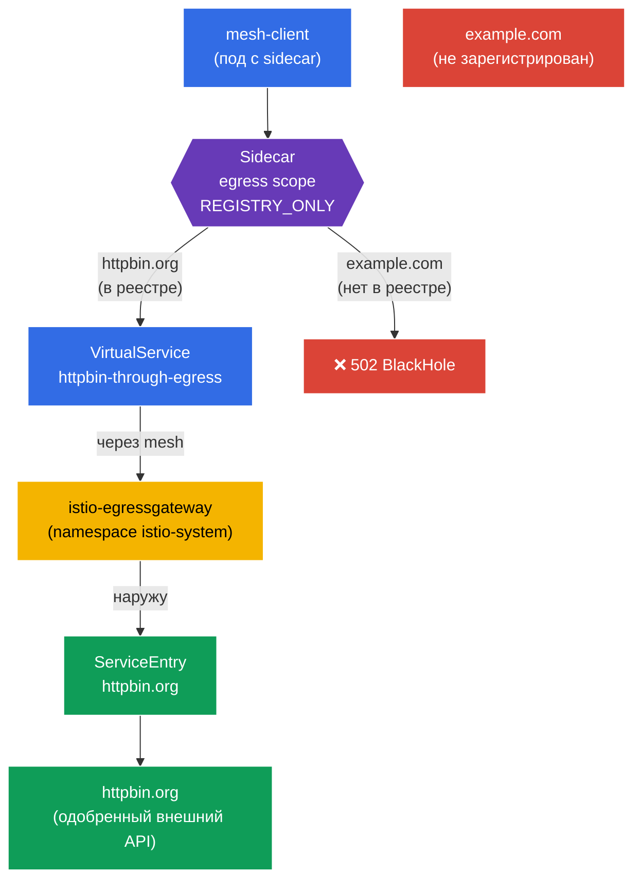

[Eng version](README.MD)

# Lab 05 — Контролируемый egress: ServiceEntry + Egress Gateway + Sidecar scope

Представьте: внутри кластера живёт сервис, которому нужно обращаться к внешнему API (`httpbin.org`). По умолчанию Istio работает в режиме `ALLOW_ANY` — любой под может стучаться куда угодно в интернет. С точки зрения безопасности это плохо: скомпрометированный под сможет «слить» данные на любой внешний адрес. Нам нужен **контролируемый выход** наружу: разрешить только одобренный внешний сервис, пропустить его трафик через единую точку (egress gateway) и запретить всё остальное.

В этой лабораторной мы разберём три механизма Istio для работы с исходящим трафиком:
- **ServiceEntry** — регистрация внешнего сервиса в реестре mesh, чтобы Istio «знал» о нём и мог применять к нему политики.
- **Egress Gateway** — выделенная точка выхода: весь внешний трафик проходит через отдельный Envoy-шлюз (удобно для аудита, мониторинга и фильтрации).
- **Sidecar (egress scope)** — ресурс `Sidecar`, который ограничивает, к каким хостам и namespace может обращаться sidecar, и переключает namespace в режим `REGISTRY_ONLY`.

### Как это работает (общая схема)



## Цель

Понять, как Istio управляет **исходящим** трафиком, и собрать полную цепочку контроля egress:
1. зарегистрировать внешний сервис (`ServiceEntry`);
2. направить его трафик через `Egress Gateway`;
3. закрыть namespace для всего лишнего через `Sidecar` + `REGISTRY_ONLY`.

## Шаг 1. Включение sidecar-инъекции

```bash
kubectl label namespace default istio-injection=enabled --overwrite
```

**Что это делает:** на namespace вешается лейбл, и в каждый под добавляется sidecar `istio-proxy` (Envoy). Именно Envoy перехватывает **исходящий** трафик пода — без этого ни ServiceEntry, ни egress gateway, ни Sidecar-политики работать не будут.

## Шаг 2. Установка приложения

Разворачиваем `mesh-client` — обычный под с `curl` внутри mesh. С него мы будем делать внешние запросы.

```bash
kubectl apply -f https://raw.githubusercontent.com/ViktorUJ/cks/refs/heads/AG-147/tasks/ica/labs/05/k8s-1/scripts/1.yaml
kubectl rollout restart deployment -n default
```

Проверяем, что под поднялся с sidecar (`2/2`):

```bash
kubectl get pods -n default
```

```
NAME                           READY   STATUS    RESTARTS   AGE
mesh-client-7d9c8b6f4d-xy12z   2/2     Running   0          20s
```

## Шаг 3. Базовая проверка (режим ALLOW_ANY)

По умолчанию у Istio `outboundTrafficPolicy.mode = ALLOW_ANY` — наружу можно ходить куда угодно. Убедимся в этом:

```bash
# одобренный хост
kubectl exec -n default deploy/mesh-client -c curl -- \
  curl -s -o /dev/null -w "%{http_code}\n" http://httpbin.org/status/200
```
```
200
```

```bash
# любой другой хост — тоже доступен
kubectl exec -n default deploy/mesh-client -c curl -- \
  curl -s -o /dev/null -w "%{http_code}\n" http://example.com/
```
```
200
```

Оба запроса проходят. Никакого контроля egress нет — это и есть проблема, которую будем решать.

## Шаг 4. ServiceEntry — регистрируем внешний сервис

`ServiceEntry` добавляет внешний хост во внутренний реестр сервисов Istio. Это нужно для двух вещей: чтобы внешний сервис можно было маршрутизировать (через egress gateway), и чтобы он считался «известным» при включении `REGISTRY_ONLY`.

```bash
vim service-entry.yaml
```

```yaml
apiVersion: networking.istio.io/v1
kind: ServiceEntry
metadata:
  name: httpbin-ext
  namespace: default
spec:
  hosts:
  - httpbin.org
  ports:
  - number: 80
    name: http
    protocol: HTTP
  resolution: DNS          # резолвить имя через DNS
  location: MESH_EXTERNAL  # сервис находится ВНЕ mesh
```

```bash
kubectl apply -f service-entry.yaml
```

**Разбор:**
- **`hosts`** — внешнее DNS-имя, которое мы регистрируем.
- **`ports`** — порт и протокол. Указываем `HTTP/80`, чтобы Istio понимал L7-протокол и мог маршрутизировать по нему.
- **`resolution: DNS`** — Envoy сам резолвит имя `httpbin.org` через DNS. Альтернатива — `STATIC` (фиксированные IP) или `NONE`.
- **`location: MESH_EXTERNAL`** — сервис снаружи mesh (на нём нет sidecar, mTLS к нему не применяется).

## Шаг 5. Egress Gateway — единая точка выхода

Сейчас трафик к `httpbin.org` уходит напрямую из sidecar пода. Мы хотим, чтобы он шёл через выделенный шлюз `istio-egressgateway` (он уже развёрнут в namespace `istio-system` профилем `demo`). Это даёт единую точку для логирования и контроля исходящего трафика.

Нужно три ресурса: `Gateway` (настройка egress-шлюза), `DestinationRule` (subset шлюза) и `VirtualService` (двухэтапная маршрутизация: mesh → шлюз → внешний хост).

```bash
vim egress-gateway.yaml
```

```yaml
apiVersion: networking.istio.io/v1
kind: Gateway
metadata:
  name: istio-egressgateway
  namespace: default
spec:
  selector:
    istio: egressgateway   # применяем к поду egress-шлюза
  servers:
  - port:
      number: 80
      name: http
      protocol: HTTP
    hosts:
    - httpbin.org
---
apiVersion: networking.istio.io/v1
kind: DestinationRule
metadata:
  name: egressgateway-for-httpbin
  namespace: default
spec:
  host: istio-egressgateway.istio-system.svc.cluster.local
  subsets:
  - name: httpbin
---
apiVersion: networking.istio.io/v1
kind: VirtualService
metadata:
  name: httpbin-through-egress
  namespace: default
spec:
  hosts:
  - httpbin.org
  gateways:
  - mesh                  # трафик внутри mesh (от подов)
  - istio-egressgateway   # трафик, пришедший на egress-шлюз
  http:
  # ЭТАП 1: из mesh -> направляем на egress gateway
  - match:
    - gateways:
      - mesh
      port: 80
    route:
    - destination:
        host: istio-egressgateway.istio-system.svc.cluster.local
        subset: httpbin
        port:
          number: 80
      weight: 100
  # ЭТАП 2: с egress gateway -> наружу, на реальный хост
  - match:
    - gateways:
      - istio-egressgateway
      port: 80
    route:
    - destination:
        host: httpbin.org
        port:
          number: 80
      weight: 100
```

```bash
kubectl apply -f egress-gateway.yaml
```

**Как читать `VirtualService`:** он описывает два «прыжка» одного и того же запроса:
- **Этап 1** — запрос рождается внутри mesh (`gateways: [mesh]`). Вместо того чтобы уйти напрямую в интернет, он направляется на сервис `istio-egressgateway` в `istio-system`.
- **Этап 2** — тот же запрос приходит уже на egress-шлюз (`gateways: [istio-egressgateway]`), и шлюз отправляет его наружу на `httpbin.org`.

Проверяем, что трафик реально идёт через шлюз:

```bash
kubectl exec -n default deploy/mesh-client -c curl -- \
  curl -s -o /dev/null -w "%{http_code}\n" http://httpbin.org/status/200   # 200

kubectl logs -n istio-system -l istio=egressgateway --tail=20 | grep httpbin.org
```

В логах egress-шлюза должна появиться запись о запросе к `httpbin.org` — значит трафик прошёл именно через него.

## Шаг 6. Sidecar — ограничиваем egress namespace

Финальный шаг — закрыть namespace `default` так, чтобы из него был разрешён выход **только** к зарегистрированным сервисам. Для этого используем ресурс `Sidecar`: он и ограничивает список видимых хостов (`egress.hosts`), и включает режим `REGISTRY_ONLY`.

```bash
vim sidecar.yaml
```

```yaml
apiVersion: networking.istio.io/v1
kind: Sidecar
metadata:
  name: default            # имя default + отсутствие workloadSelector = на весь namespace
  namespace: default
spec:
  egress:
  - hosts:
    - "istio-system/*"     # доступ к egress-шлюзу (он в istio-system)
    - "./*"                # доступ к сервисам своего namespace (включая ServiceEntry)
  outboundTrafficPolicy:
    mode: REGISTRY_ONLY    # наружу можно только к тому, что есть в реестре
```

```bash
kubectl apply -f sidecar.yaml
```

**Разбор:**
- **`egress.hosts`** — список того, что «видит» sidecar. Формат `namespace/dnsName`:
  - `"istio-system/*"` — нужен, потому что трафик идёт через egress-шлюз в `istio-system`;
  - `"./*"` — сервисы текущего namespace, включая наш `ServiceEntry` для `httpbin.org`.
  Ограничивая этот список, мы уменьшаем объём конфигурации, которую Istio рассылает в каждый sidecar, и сужаем зону видимости пода.
- **`outboundTrafficPolicy.mode: REGISTRY_ONLY`** — ключевой переключатель. Теперь Envoy выпускает наружу только трафик к хостам из реестра (то есть к тем, для кого есть `ServiceEntry` или внутрикластерный сервис). Всё остальное блокируется и возвращает `502`.

## Шаг 7. Финальная проверка

```bash
# Одобренный хост (зарегистрирован + идёт через egress gateway) -> 200
kubectl exec -n default deploy/mesh-client -c curl -- \
  curl -s -o /dev/null -w "%{http_code}\n" http://httpbin.org/status/200
```
```
200
```

```bash
# Незарегистрированный хост -> заблокирован режимом REGISTRY_ONLY
kubectl exec -n default deploy/mesh-client -c curl -- \
  curl -s -o /dev/null -w "%{http_code}\n" http://example.com/
```
```
502      # BlackHoleCluster — выход запрещён
```

## Итог

| Шаг | Ресурс | Что сделали | Результат |
|-----|--------|-------------|-----------|
| Регистрация | `ServiceEntry` | Добавили `httpbin.org` в реестр mesh | внешний сервис стал «известным» |
| Маршрутизация | `Gateway` + `DestinationRule` + `VirtualService` | Завернули трафик через `istio-egressgateway` | единая точка выхода + аудит |
| Ограничение | `Sidecar` (`REGISTRY_ONLY`) | Закрыли namespace для всего лишнего | `httpbin.org` доступен, `example.com` — нет |

**Ключевой вывод:** контроль egress в Istio собирается из трёх дополняющих друг друга кирпичиков:
- **ServiceEntry** делает внешний сервис «видимым» для mesh — без этого его нельзя ни маршрутизировать, ни разрешить в режиме `REGISTRY_ONLY`.
- **Egress Gateway** даёт единую управляемую точку выхода: весь внешний трафик проходит через один шлюз, где его удобно логировать и фильтровать.
- **Sidecar + REGISTRY_ONLY** реализует принцип «запрещено всё, что не разрешено явно» для исходящего трафика — это egress-аналог default-deny из лабы про безопасность.

Вместе они превращают «плоский» неконтролируемый выход в интернет в строго ограниченный и наблюдаемый канал — и всё это на уровне инфраструктуры, без изменения кода приложения.
