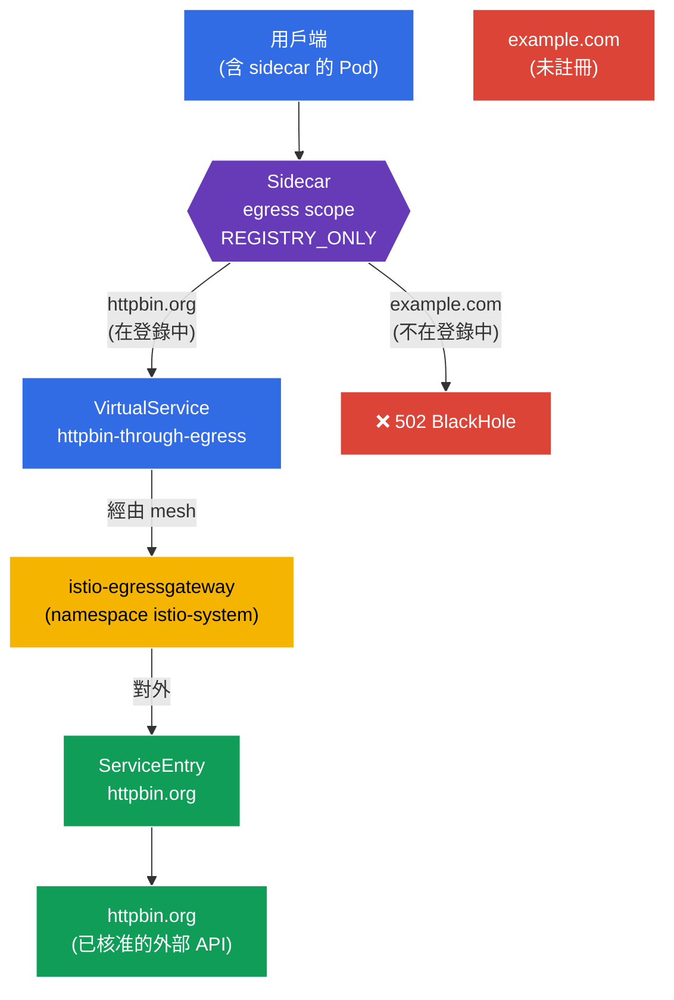

[Русская версия](README_RU.MD) · [Eng version](README.MD) · [Versión en español](README_ES.MD) · [Version française](README_FR.MD) · [Deutsche Version](README_DE.MD) · [ქართული ვერსია](README_GE.MD) · [日本語版](README_JP.MD)

# Lab 05 - 受控 egress：ServiceEntry + Egress Gateway + Sidecar scope

> [參考解答](worker/files/solutions/1_TW.MD)

想像一下：叢集中有一個服務需要存取外部 API（`httpbin.org`）。預設情況下，Istio 以 `ALLOW_ANY` 模式運作--任何 Pod 都可以連線至網際網路上的任何位置。從安全角度來看，這很糟：遭入侵的 Pod 可以將資料「外洩」至任何外部位址。我們需要**受控的對外輸出**：只允許已核准的外部服務，讓其流量通過單一節點（egress gateway），並禁止其他一切。

在本實驗中，我們將探討 Istio 用於處理輸出流量的三項機制：
- **ServiceEntry**：在 mesh 的服務登錄中註冊外部服務，讓 Istio「知道」它，並可對其套用政策。
- **Egress Gateway**：專用的出口節點：所有外部流量都會通過獨立的 Envoy gateway（便於稽核、監控及過濾）。
- **Sidecar（egress scope）**：`Sidecar` 資源，用來限制 sidecar 可存取的主機及 namespace，並將 namespace 切換為 `REGISTRY_ONLY` 模式。

### 運作方式（整體架構）



## 基礎架構

環境透過 Terragrunt 部署於 AWS（`eu-north-1`），包含：

| 元件 | 說明 |
|------------|---------------------------------------------------|
| `vpc` | VPC `10.10.0.0/16`，包含公有子網路 |
| `ssh-keys` | 用於存取節點的 SSH 金鑰 |
| `k8s-1` | Kubernetes `1.35.2`（kubeadm），已安裝 Istio |
| `worker` | 具備 `kubectl` 與叢集存取權的工作機器 |

執行個體：`t4g.medium`（master），Ubuntu `22.04`

## 部署

```bash
TASK=05 make run_ica_task
```

## 目標

了解 Istio 如何管理**輸出**流量，並建立完整的 egress 控制鏈：
1. 註冊外部服務（`ServiceEntry`）；
2. 將其流量導向 `Egress Gateway`；
3. 透過 `Sidecar` + `REGISTRY_ONLY` 關閉 namespace 中所有不必要的存取。

## 步驟 1：啟用 sidecar 注入

```bash
kubectl label namespace default istio-injection=enabled --overwrite
```

**這會做什麼：**為 namespace 加上 label，並在每個 Pod 中加入 `istio-proxy`（Envoy）sidecar。正是 Envoy 攔截 Pod 的**輸出**流量--沒有它，ServiceEntry、egress gateway 及 Sidecar 政策都無法運作。

## 步驟 2：安裝應用程式

部署 `mesh-client`--mesh 中一個內含 `curl` 的普通 Pod。我們將從它發出外部請求。

```bash
kubectl apply -f https://raw.githubusercontent.com/ViktorUJ/cks/refs/heads/master/tasks/ica/labs/05/k8s-1/scripts/1.yaml
kubectl rollout restart deployment -n default
```

確認 Pod 已連同 sidecar 啟動（`2/2`）：

```bash
kubectl get pods -n default
```

```
NAME                           READY   STATUS    RESTARTS   AGE
mesh-client-7d9c8b6f4d-xy12z   2/2     Running   0          20s
```

## 步驟 3：基本驗證（ALLOW_ANY 模式）

預設情況下，Istio 的 `outboundTrafficPolicy.mode = ALLOW_ANY`--可以對外存取任何位置。讓我們確認這點：

```bash
# 已核准的主機
kubectl exec -n default deploy/mesh-client -c curl -- \
  curl -s -o /dev/null -w "%{http_code}\n" http://httpbin.org/status/200
```
```
200
```

```bash
# 任何其他主機 - 同樣可存取
kubectl exec -n default deploy/mesh-client -c curl -- \
  curl -s -o /dev/null -w "%{http_code}\n" http://example.com/
```
```
200
```

兩個請求都能通過。完全沒有 egress 控制--這正是我們要解決的問題。

## 步驟 4：ServiceEntry--註冊外部服務

`ServiceEntry` 會將外部主機新增至 Istio 的內部服務登錄。這有兩個用途：讓外部服務可被路由（經由 egress gateway），並在啟用 `REGISTRY_ONLY` 時被視為「已知」。

```bash
vim service-entry.yaml
```

```yaml
apiVersion: networking.istio.io/v1
kind: ServiceEntry
metadata:
  name: httpbin-ext
  namespace: default
spec:
  hosts:
  - httpbin.org
  ports:
  - number: 80
    name: http
    protocol: HTTP
  resolution: DNS          # 透過 DNS 解析名稱
  location: MESH_EXTERNAL  # 服務位於 mesh 之外
```

```bash
kubectl apply -f service-entry.yaml
```

**說明：**
- **`hosts`**：要註冊的外部 DNS 名稱。
- **`ports`**：連接埠及協定。指定 `HTTP/80`，讓 Istio 理解 L7 協定並可依此進行路由。
- **`resolution: DNS`**：Envoy 會自行透過 DNS 解析 `httpbin.org` 名稱。替代選項為 `STATIC`（固定 IP）或 `NONE`。
- **`location: MESH_EXTERNAL`**：服務位於 mesh 外部（其上沒有 sidecar，且不對其套用 mTLS）。

## 步驟 5：Egress Gateway--單一出口節點

目前流量會從 Pod 的 sidecar 直接傳往 `httpbin.org`。我們希望它經由專用 gateway `istio-egressgateway`（已由 `demo` profile 部署在 namespace `istio-system` 中）。這可為輸出流量提供單一的記錄與控管節點。

需要三項資源：`Gateway`（egress gateway 設定）、`DestinationRule`（gateway 的 subset）及 `VirtualService`（兩階段路由：mesh → gateway → 外部主機）。

```bash
vim egress-gateway.yaml
```

```yaml
apiVersion: networking.istio.io/v1
kind: Gateway
metadata:
  name: istio-egressgateway
  namespace: default
spec:
  selector:
    istio: egressgateway   # 套用到 egress 閘道的 Pod
  servers:
  - port:
      number: 80
      name: http
      protocol: HTTP
    hosts:
    - httpbin.org
---
apiVersion: networking.istio.io/v1
kind: DestinationRule
metadata:
  name: egressgateway-for-httpbin
  namespace: default
spec:
  host: istio-egressgateway.istio-system.svc.cluster.local
  subsets:
  - name: httpbin
---
apiVersion: networking.istio.io/v1
kind: VirtualService
metadata:
  name: httpbin-through-egress
  namespace: default
spec:
  hosts:
  - httpbin.org
  gateways:
  - mesh                  # mesh 內部流量 (來自 Pod)
  - istio-egressgateway   # 抵達 egress 閘道的流量
  http:
  # 階段 1：從 mesh -> 導向 egress gateway
  - match:
    - gateways:
      - mesh
      port: 80
    route:
    - destination:
        host: istio-egressgateway.istio-system.svc.cluster.local
        subset: httpbin
        port:
          number: 80
      weight: 100
  # 階段 2：從 egress gateway -> 對外，導向真實主機
  - match:
    - gateways:
      - istio-egressgateway
      port: 80
    route:
    - destination:
        host: httpbin.org
        port:
          number: 80
      weight: 100
```

```bash
kubectl apply -f egress-gateway.yaml
```

**如何閱讀 `VirtualService`：**它描述同一個請求的兩次「跳轉」：
- **階段 1**：請求在 mesh 內部產生（`gateways: [mesh]`）。它不會直接前往網際網路，而是被導向 `istio-system` 中的 `istio-egressgateway` 服務。
- **階段 2**：同一請求會抵達 egress gateway（`gateways: [istio-egressgateway]`），gateway 再將其對外傳送至 `httpbin.org`。

確認流量確實經由 gateway：

```bash
kubectl exec -n default deploy/mesh-client -c curl -- \
  curl -s -o /dev/null -w "%{http_code}\n" http://httpbin.org/status/200   # 200

kubectl logs -n istio-system -l istio=egressgateway --tail=20 | grep httpbin.org
```

egress gateway 的日誌中應出現對 `httpbin.org` 的請求記錄--這表示流量確實通過它。

## 步驟 6：Sidecar--限制 namespace egress

最後一步是關閉 namespace `default`，使其僅允許存取**已註冊**的服務。為此使用 `Sidecar` 資源：它同時限制可見主機清單（`egress.hosts`），並啟用 `REGISTRY_ONLY` 模式。

```bash
vim sidecar.yaml
```

```yaml
apiVersion: networking.istio.io/v1
kind: Sidecar
metadata:
  name: default            # 名稱 default + 沒有 workloadSelector = 對整個 namespace 生效
  namespace: default
spec:
  egress:
  - hosts:
    - "istio-system/*"     # 存取 egress 閘道 (它位於 istio-system)
    - "./*"                # 存取自身 namespace 的服務 (包含 ServiceEntry)
  outboundTrafficPolicy:
    mode: REGISTRY_ONLY    # 對外僅能連線到登錄在註冊表中的目標
```

```bash
kubectl apply -f sidecar.yaml
```

**說明：**
- **`egress.hosts`**：sidecar「看得到」的項目清單。格式為 `namespace/dnsName`：
  - `"istio-system/*"`：此項為必要，因為流量會經由位於 `istio-system` 的 egress gateway；
  - `"./*"`：目前 namespace 的服務，包括我們用於 `httpbin.org` 的 `ServiceEntry`。
  限制此清單可減少 Istio 發送至每個 sidecar 的設定量，並縮小 Pod 的可見範圍。
- **`outboundTrafficPolicy.mode: REGISTRY_ONLY`**：關鍵切換項。現在 Envoy 僅允許登錄中主機的流量對外傳送（亦即具有 `ServiceEntry` 或叢集內服務的主機）。其他一切都會被封鎖並回傳 `502`。

## 步驟 7：最終驗證

```bash
# 已核准的主機 (已註冊 + 透過 egress gateway) -> 200
kubectl exec -n default deploy/mesh-client -c curl -- \
  curl -s -o /dev/null -w "%{http_code}\n" http://httpbin.org/status/200
```
```
200
```

```bash
# 未註冊的主機 -> 被 REGISTRY_ONLY 模式阻擋
kubectl exec -n default deploy/mesh-client -c curl -- \
  curl -s -o /dev/null -w "%{http_code}\n" http://example.com/
```
```
502      # BlackHoleCluster - 出口被拒絕
```

## 總結

| 步驟 | 資源 | 執行內容 | 結果 |
|-----|--------|-------------|-----------|
| 註冊 | `ServiceEntry` | 將 `httpbin.org` 新增至 mesh 登錄 | 外部服務成為「已知」服務 |
| 路由 | `Gateway` + `DestinationRule` + `VirtualService` | 將流量導向 `istio-egressgateway` | 單一出口節點 + 稽核 |
| 限制 | `Sidecar`（`REGISTRY_ONLY`） | 關閉 namespace 中所有不必要的存取 | `httpbin.org` 可用，`example.com` 不可用 |

**核心結論：**Istio 的 egress 控制由三個互相補足的基石組成：
- **ServiceEntry** 讓外部服務對 mesh「可見」--沒有它，就無法對其進行路由，也無法在 `REGISTRY_ONLY` 模式中允許它。
- **Egress Gateway** 提供單一可控的出口節點：所有外部流量通過同一 gateway，便於在其中記錄及過濾。
- **Sidecar + REGISTRY_ONLY** 將「凡未明確允許者一律禁止」的原則套用至輸出流量--這是安全實驗中 default-deny 的 egress 對應機制。

它們共同將「扁平」、不受控的網際網路出口，轉換為嚴格限制且可觀測的通道--全部都在基礎架構層級完成，無須修改應用程式碼。