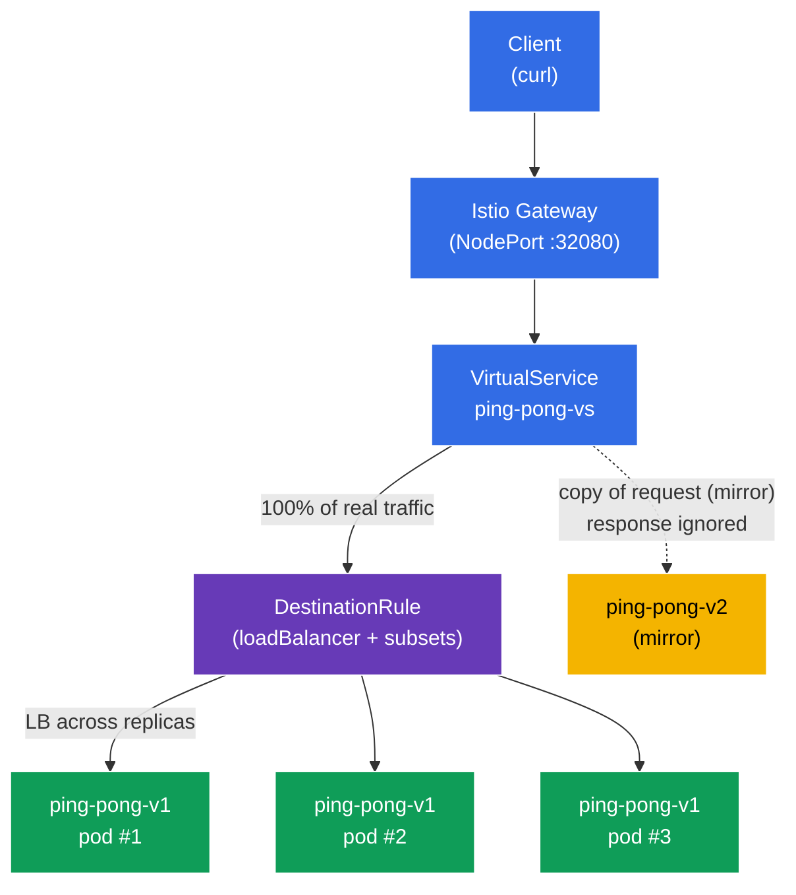

[RU version](README_RU.MD)

# Lab 06 — Load Balancing + Traffic Mirroring

Imagine you have a `ping-pong` service with three replicas of the stable version **v1** and a new version **v2** you want to try out. Two questions arise. First — **how exactly** is traffic distributed across replicas, and can you tune it (round-robin, least-loaded, etc.)? Second — how do you test **v2** against real production traffic **without risking** your users?

Istio solves both at the infrastructure level:
- **Load Balancing** (`DestinationRule`) — choose the load-balancing algorithm across a service's endpoints, including a per-port override.
- **Traffic Mirroring** (shadowing) — Envoy sends a **copy** of each request to a second version (v2), while its response is ignored. The client always gets v1's response, and v2 "sees" real traffic in a shadow-launch mode.

### How It Works (High-Level Overview)



## Objective

- Configure the load-balancing algorithm via `DestinationRule`, including a per-port override.
- Mirror production traffic to the new version `v2` via `VirtualService` (`mirror`), without affecting the client's responses.

## Step 1. Enable Sidecar Injection

```bash
kubectl label namespace default istio-injection=enabled --overwrite
```

The `istio-proxy` (Envoy) sidecar in each pod is what implements both load balancing and mirroring. Without it, `DestinationRule` and `mirror` would have no effect.

## Step 2. Deploy the Application

Deploy one `ping-pong` Service and two Deployments: **v1** (3 replicas, stable) and **v2** (1 replica, new).

```bash
kubectl apply -f https://raw.githubusercontent.com/ViktorUJ/cks/refs/heads/AG-148/tasks/ica/labs/06/k8s-1/scripts/1.yaml
kubectl rollout restart deployment -n default
```

**Important detail:** each pod's `SERVER_NAME` is taken from the pod name (via the downward API), so the service response's `Server Name` field reveals **which replica** handled the request. This lets us clearly observe both load balancing (different v1 pods) and mirroring (v2 never appears in the client's responses).

```bash
kubectl get pods -n default -l app=ping-pong
```

```
NAME                            READY   STATUS    RESTARTS   AGE
ping-pong-v1-6c8f...-aaaaa      2/2     Running   0          30s
ping-pong-v1-6c8f...-bbbbb      2/2     Running   0          30s
ping-pong-v1-6c8f...-ccccc      2/2     Running   0          30s
ping-pong-v2-7d9a...-ddddd      2/2     Running   0          30s
```

## Step 3. Entry Point: Gateway and VirtualService

Create the entry point and route all traffic to subset `v1`.

```bash
vim gateway.yaml
```

```yaml
apiVersion: networking.istio.io/v1
kind: Gateway
metadata:
  name: main-gateway
  namespace: default
spec:
  selector:
    istio: ingressgateway
  servers:
  - port:
      number: 80
      name: http
      protocol: HTTP
    hosts:
    - "myapp.local"
---
apiVersion: networking.istio.io/v1
kind: VirtualService
metadata:
  name: ping-pong-vs
  namespace: default
spec:
  hosts:
  - "myapp.local"
  - "ping-pong"
  gateways:
  - main-gateway
  - mesh
  http:
  - route:
    - destination:
        host: ping-pong
        subset: v1
```

```bash
kubectl apply -f gateway.yaml
```

## Step 4. Load Balancing — Distribute Across Replicas

A `DestinationRule` defines how traffic is distributed across a service's endpoints (pods). The `trafficPolicy.loadBalancer.simple` field selects the algorithm, and `portLevelSettings` lets you override it for a specific port.

```bash
vim destination-rule.yaml
```

```yaml
apiVersion: networking.istio.io/v1
kind: DestinationRule
metadata:
  name: ping-pong-dr
  namespace: default
spec:
  host: ping-pong
  trafficPolicy:
    loadBalancer:
      simple: ROUND_ROBIN       # global algorithm for the service
    portLevelSettings:
    - port:
        number: 8080
      loadBalancer:
        simple: LEAST_REQUEST   # override for port 8080
  subsets:
  - name: v1
    labels:
      version: v1
  - name: v2
    labels:
      version: v2
```

```bash
kubectl apply -f destination-rule.yaml
```

**Breakdown:**
- **`loadBalancer.simple`** — the built-in balancing algorithms:
  - `ROUND_ROBIN` — round the ring, one after another (the default);
  - `LEAST_REQUEST` — to the replica with the fewest active requests (often more efficient than round-robin);
  - `RANDOM` — random choice;
  - `PASSTHROUGH` — no balancing, to the original destination address.
- **`portLevelSettings`** — overrides the policy for a specific port. Here the global setting is `ROUND_ROBIN`, but port `8080` uses `LEAST_REQUEST`. This is useful when a service has multiple ports with different needs (e.g., the exam task: global `ROUND_ROBIN`, `LEAST_CONN` for `443`).
- **`subsets`** — logical groups of pods (`v1`, `v2`) by the `version` label; the `VirtualService` references them (route and mirror).

Observe the distribution across the three v1 replicas:

```bash
for i in $(seq 12); do curl -s http://myapp.local:32080 | grep 'Server Name'; done | sort | uniq -c
```

```
      4 Server Name   : ping-pong-v1-6c8f...-aaaaa
      4 Server Name   : ping-pong-v1-6c8f...-bbbbb
      4 Server Name   : ping-pong-v1-6c8f...-ccccc
```

Traffic is spread evenly across the three v1 pods. Version v2 never appears in the responses — nothing is routed to it yet.

## Step 5. Traffic Mirroring — Shadow Traffic to v2

Now enable a shadow launch: v1 still serves 100% of real requests, but Envoy additionally sends a **copy** of each request to v2. The v2 response is **discarded** — the client never sees it.

Update the `VirtualService`, adding a `mirror` block:

```bash
vim mirror-vs.yaml
```

```yaml
apiVersion: networking.istio.io/v1
kind: VirtualService
metadata:
  name: ping-pong-vs
  namespace: default
spec:
  hosts:
  - "myapp.local"
  - "ping-pong"
  gateways:
  - main-gateway
  - mesh
  http:
  - route:
    - destination:
        host: ping-pong
        subset: v1          # 100% of client responses come from v1
    mirror:
      host: ping-pong
      subset: v2            # a copy of every request is sent to v2
    mirrorPercentage:
      value: 100.0          # the fraction of traffic to mirror
```

```bash
kubectl apply -f mirror-vs.yaml
```

**Breaking down the `mirror` block:**
- **`route.destination`** — the primary route. The client gets a response **only** from here (subset v1).
- **`mirror`** — where to send the copy of the request (subset v2). This is fire-and-forget: Envoy neither waits for nor uses the mirror's response.
- **`mirrorPercentage.value`** — what fraction of requests is mirrored (here 100%). You could set, say, `25.0` to duplicate only a quarter of production traffic.

**Why it's useful:** you push real load through v2 and watch its metrics, logs, and errors — with zero risk to users. If v2 crashes or starts erroring, clients won't notice.

## Step 6. Verification

### The client always gets v1

```bash
for i in $(seq 10); do curl -s http://myapp.local:32080 | grep 'Server Name'; done
```

```
Server Name   : ping-pong-v1-6c8f...-aaaaa
Server Name   : ping-pong-v1-6c8f...-bbbbb
...
```

Only `v1` pods appear in the responses. Version `v2` never shows up, even though traffic is being sent to it.

### Confirm that v2 actually receives the mirrored traffic

Inspect the inbound request counter on the Envoy proxy inside the v2 pod:

```bash
kubectl exec -n default deploy/ping-pong-v2 -c istio-proxy -- \
  pilot-agent request GET stats | grep -E 'inbound\|8080.*rq_total'
```

The counter grows as requests arrive — proof that the mirrored traffic really reaches v2, even though the client has no idea.

## Summary

| Mechanism | Resource | What we did | Result |
|-----------|----------|-------------|--------|
| Load Balancing | `DestinationRule` (`loadBalancer.simple`) | Set the algorithm + a per-port override | controlled distribution across replicas |
| Traffic Mirroring | `VirtualService` (`mirror` + `mirrorPercentage`) | Mirror production traffic to v2 | v2 tested under real load with no risk |

**Key takeaway:**
- **DestinationRule** defines the balancing policy: which algorithm and (optionally) a per-port override — this is about **how** traffic is split across endpoints.
- **Traffic Mirroring** gives a safe way to validate a new version against production traffic: the client always talks to the stable v1, while v2 receives a "shadow" of the real requests with its response discarded.

Both mechanisms operate entirely at the Envoy layer — without a single line of change in the application code.
