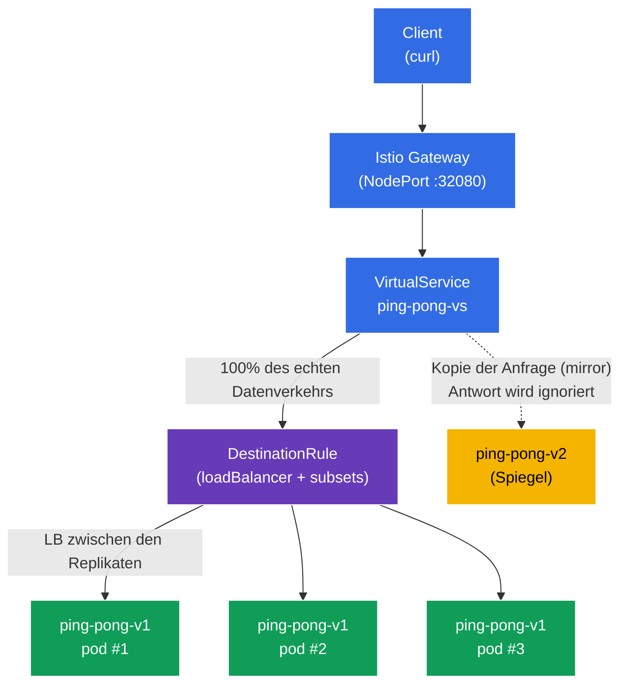

[RU version](README_RU.MD) · [Eng version](README.MD) · [Versión en español](README_ES.MD) · [Version française](README_FR.MD)

# Lab 06 - Load Balancing + Traffic Mirroring

Stellen Sie sich vor: Sie haben einen Service `ping-pong` mit drei Replikaten der stabilen Version **v1** und einer neuen Version **v2**, die Sie erproben möchten. Es entstehen zwei Fragen. Die erste - **wie genau** wird der Datenverkehr zwischen den Replikaten verteilt und lässt sich das konfigurieren (round-robin, am wenigsten ausgelastet usw.). Die zweite - wie testet man **v2** mit echtem "produktivem" Datenverkehr, **ohne** dabei die Benutzer zu gefährden.

Istio löst beide Aufgaben auf Infrastrukturebene:
- **Load Balancing** (`DestinationRule`) - Auswahl des Balancing-Algorithmus zwischen den Endpoints des Service, auch mit Überschreibung auf Ebene eines einzelnen Ports.
- **Traffic Mirroring** (Spiegelung) - Envoy sendet eine **Kopie** der Anfrage an die zweite Version (v2), wobei die Antwort von ihr ignoriert wird. Der Client erhält immer die Antwort von v1, während v2 den echten Datenverkehr im Schattenstart-Modus "sieht".

### Wie es funktioniert (Gesamtschema)



## Ziel

- Den Load-Balancing-Algorithmus über `DestinationRule` konfigurieren, inklusive Überschreibung auf Port-Ebene.
- Produktiven Datenverkehr über `VirtualService` (`mirror`) auf die neue Version `v2` spiegeln, ohne die Antworten an den Client zu beeinträchtigen.

## Schritt 1. Aktivierung der Sidecar-Injektion

```bash
kubectl label namespace default istio-injection=enabled --overwrite
```

Der Sidecar `istio-proxy` (Envoy) in jedem Pod ist das, was sowohl das Balancing als auch die Spiegelung umsetzt. Ohne ihn würden `DestinationRule` und `mirror` nicht funktionieren.

## Schritt 2. Installation der Anwendung

Wir stellen einen Service `ping-pong` und zwei Deployments bereit: **v1** (3 Replikate, stabil) und **v2** (1 Replikat, neu).

```bash
kubectl apply -f https://raw.githubusercontent.com/ViktorUJ/cks/refs/heads/master/tasks/ica/labs/06/k8s-1/scripts/1.yaml
kubectl rollout restart deployment -n default
```

**Wichtiges Detail:** Bei jedem Pod wird die Variable `SERVER_NAME` aus dem Pod-Namen übernommen (über die Downward API), daher ist in der Antwort des Service im Feld `Server Name` der **Name des konkreten Replikats** sichtbar. Das erlaubt es, sowohl das Balancing (verschiedene v1-Pods) als auch die Spiegelung (v2 erscheint nicht in den Antworten an den Client) anschaulich zu beobachten.

```bash
kubectl get pods -n default -l app=ping-pong
```

```
NAME                            READY   STATUS    RESTARTS   AGE
ping-pong-v1-6c8f...-aaaaa      2/2     Running   0          30s
ping-pong-v1-6c8f...-bbbbb      2/2     Running   0          30s
ping-pong-v1-6c8f...-ccccc      2/2     Running   0          30s
ping-pong-v2-7d9a...-ddddd      2/2     Running   0          30s
```

## Schritt 3. Eintrittspunkt: Gateway und VirtualService

Wir erstellen einen Eingang und leiten den gesamten Datenverkehr auf das Subset `v1`.

```bash
vim gateway.yaml
```

```yaml
apiVersion: networking.istio.io/v1
kind: Gateway
metadata:
  name: main-gateway
  namespace: default
spec:
  selector:
    istio: ingressgateway
  servers:
  - port:
      number: 80
      name: http
      protocol: HTTP
    hosts:
    - "myapp.local"
---
apiVersion: networking.istio.io/v1
kind: VirtualService
metadata:
  name: ping-pong-vs
  namespace: default
spec:
  hosts:
  - "myapp.local"
  - "ping-pong"
  gateways:
  - main-gateway
  - mesh
  http:
  - route:
    - destination:
        host: ping-pong
        subset: v1
```

```bash
kubectl apply -f gateway.yaml
```

## Schritt 4. Load Balancing - Algorithmus ROUND_ROBIN

Die `DestinationRule` legt fest, wie der Datenverkehr zwischen den Endpoints (Pods) des Service verteilt wird. Das Feld `trafficPolicy.loadBalancer.simple` wählt den Algorithmus. Wir beginnen mit `ROUND_ROBIN`.

```bash
vim destination-rule.yaml
```

```yaml
apiVersion: networking.istio.io/v1
kind: DestinationRule
metadata:
  name: ping-pong-dr
  namespace: default
spec:
  host: ping-pong
  trafficPolicy:
    loadBalancer:
      simple: ROUND_ROBIN       # globaler Algorithmus für den Service
  subsets:
  - name: v1
    labels:
      version: v1
  - name: v2
    labels:
      version: v2
```

```bash
kubectl apply -f destination-rule.yaml
```

**Analyse:**
- **`loadBalancer.simple`** - integrierte Balancing-Algorithmen:
  - `ROUND_ROBIN` - der Reihe nach im Kreis (Standard);
  - `LEAST_REQUEST` - an das Replikat mit der geringsten Anzahl aktiver Anfragen (oft effizienter als round-robin);
  - `RANDOM` - zufällige Auswahl;
  - `PASSTHROUGH` - ohne Balancing, an die ursprüngliche Adresse.
- **`subsets`** - logische Gruppen von Pods (`v1`, `v2`) nach dem Label `version`; auf sie verweist der `VirtualService` (Route und mirror).

Wir betrachten die Verteilung über die drei Replikate von v1:

```bash
for i in $(seq 12); do curl -s http://myapp.local:32080 | grep 'Server Name'; done | sort | uniq -c
```

```
      4 Server Name: ping-pong-v1-6c8f...-aaaaa
      4 Server Name: ping-pong-v1-6c8f...-bbbbb
      4 Server Name: ping-pong-v1-6c8f...-ccccc
```

Bei `ROUND_ROBIN` wird der Datenverkehr etwa gleichmäßig zwischen den drei v1-Pods verteilt. Die Version v2 erscheint nicht in den Antworten - auf sie ist noch nichts geleitet.

## Schritt 5. Port-level override - Balancing auf Port-Ebene

`portLevelSettings` erlaubt es, den Balancing-Algorithmus für einen bestimmten Port zu überschreiben. Das ist nützlich, wenn ein Service mehrere Ports mit unterschiedlichen Anforderungen hat (zum Beispiel in der Prüfungsaufgabe: global `ROUND_ROBIN`, für `443` jedoch `LEAST_CONN`).

Wir aktualisieren die `DestinationRule` und fügen eine Überschreibung für den Port `8080` auf `LEAST_REQUEST` hinzu:

```yaml
apiVersion: networking.istio.io/v1
kind: DestinationRule
metadata:
  name: ping-pong-dr
  namespace: default
spec:
  host: ping-pong
  trafficPolicy:
    loadBalancer:
      simple: ROUND_ROBIN       # globaler Algorithmus (für alle anderen Ports)
    portLevelSettings:
    - port:
        number: 8080
      loadBalancer:
        simple: LEAST_REQUEST   # Überschreibung speziell für Port 8080
  subsets:
  - name: v1
    labels:
      version: v1
  - name: v2
    labels:
      version: v2
```

```bash
kubectl apply -f destination-rule.yaml
```

**Was sich geändert hat:** Für den Port `8080` (das ist unser HTTP-Port) gilt jetzt `LEAST_REQUEST` - Envoy sendet die Anfrage an das Replikat mit der geringsten Anzahl aktiver Anfragen. Das globale `ROUND_ROBIN` bleibt für alle übrigen Ports. Daher ist die Verteilung bei einer erneuten Überprüfung nicht mehr zwingend genau `4/4/4` - sie passt sich der Auslastung der Replikate an:

```bash
for i in $(seq 12); do curl -s http://myapp.local:32080 | grep 'Server Name'; done | sort | uniq -c
```

```
      3 Server Name: ping-pong-v1-6c8f...-aaaaa
      2 Server Name: ping-pong-v1-6c8f...-bbbbb
      7 Server Name: ping-pong-v1-6c8f...-ccccc
```

Das Wichtigste - die Überschreibung wird genau auf den angegebenen Port angewendet, nicht auf den gesamten Service.

## Schritt 6. Traffic Mirroring - wir spiegeln den Datenverkehr auf v2

Jetzt aktivieren wir den Schattenstart: 100% der echten Anfragen bedient nach wie vor v1, aber Envoy sendet zusätzlich eine **Kopie** jeder Anfrage an v2. Die Antwort von v2 wird **verworfen** - der Client sieht sie nie.

Wir aktualisieren den `VirtualService` und fügen den Block `mirror` hinzu:

```bash
vim mirror-vs.yaml
```

```yaml
apiVersion: networking.istio.io/v1
kind: VirtualService
metadata:
  name: ping-pong-vs
  namespace: default
spec:
  hosts:
  - "myapp.local"
  - "ping-pong"
  gateways:
  - main-gateway
  - mesh
  http:
  - route:
    - destination:
        host: ping-pong
        subset: v1          # 100% der Antworten an den Client - von v1
    mirror:
      host: ping-pong
      subset: v2            # eine Kopie jeder Anfrage geht an v2
    mirrorPercentage:
      value: 100.0          # Anteil des gespiegelten Datenverkehrs
```

```bash
kubectl apply -f mirror-vs.yaml
```

**Analyse des Blocks `mirror`:**
- **`route.destination`** - die Hauptroute. Der Client erhält die Antwort **nur** von hier (Subset v1).
- **`mirror`** - wohin die Kopie der Anfrage gesendet wird (Subset v2). Das ist "fire-and-forget": Envoy wartet nicht auf die Antwort des Spiegels und verwendet sie nicht.
- **`mirrorPercentage.value`** - welcher Anteil der Anfragen gespiegelt wird (hier 100%). Man kann zum Beispiel `25.0` setzen, um nur ein Viertel des produktiven Datenverkehrs zu duplizieren.

**Wozu das dient:** Sie führen echte Last durch v2 und betrachten deren Metriken, Logs, Fehler - aber ohne jedes Risiko für die Benutzer. Wenn v2 abstürzt oder anfängt Fehler zu produzieren, bemerken die Clients das nicht.

## Schritt 7. Überprüfung

### Der Client erhält immer v1

```bash
for i in $(seq 10); do curl -s http://myapp.local:32080 | grep 'Server Name'; done
```

```
Server Name   : ping-pong-v1-6c8f...-aaaaa
Server Name   : ping-pong-v1-6c8f...-bbbbb
...
```

In den Antworten sind nur `v1`-Pods. Die Version `v2` erscheint kein einziges Mal, obwohl Datenverkehr an sie geht.

### Wir vergewissern uns, dass v2 tatsächlich gespiegelten Datenverkehr erhält

Wir betrachten den Zähler der eingehenden Anfragen am Envoy-Proxy im v2-Pod:

```bash
kubectl exec -n default deploy/ping-pong-v2 -c istio-proxy -- \
  pilot-agent request GET stats | grep istio_requests_total | grep destination_workload.ping-pong-v2
```

```
istiocustom.istio_requests_total.<...>.destination_workload.ping-pong-v2.<...>.response_code.200<...>: 40
```

Der Zähler wächst mit dem Eingang der Anfragen - das bedeutet, der gespiegelte Datenverkehr erreicht tatsächlich v2, obwohl der Client nichts davon ahnt.

## Fazit

| Mechanismus | Ressource | Was wir gemacht haben | Ergebnis |
|----------|--------|-------------|-----------|
| Load Balancing | `DestinationRule` (`loadBalancer.simple`) | Algorithmus + Überschreibung pro Port festgelegt | kontrollierte Verteilung über die Replikate |
| Traffic Mirroring | `VirtualService` (`mirror` + `mirrorPercentage`) | Produktiven Datenverkehr auf v2 gespiegelt | v2 wird ohne Risiko unter echter Last getestet |

**Zentrale Erkenntnis:**
- **DestinationRule** definiert die Balancing-Policy: welcher Algorithmus und (bei Bedarf) mit Überschreibung auf Port-Ebene - es geht darum, **wie** der Datenverkehr zwischen den Endpoints aufgeteilt wird.
- **Traffic Mirroring** ergibt eine sichere Möglichkeit, eine neue Version mit produktivem Datenverkehr zu überprüfen: Der Client arbeitet immer mit dem stabilen v1, während v2 einen "Schatten" der echten Anfragen mit verworfener Antwort erhält.

Beide Mechanismen arbeiten ausschließlich auf Ebene von Envoy - ohne eine einzige Zeile an Änderungen im Anwendungscode.
