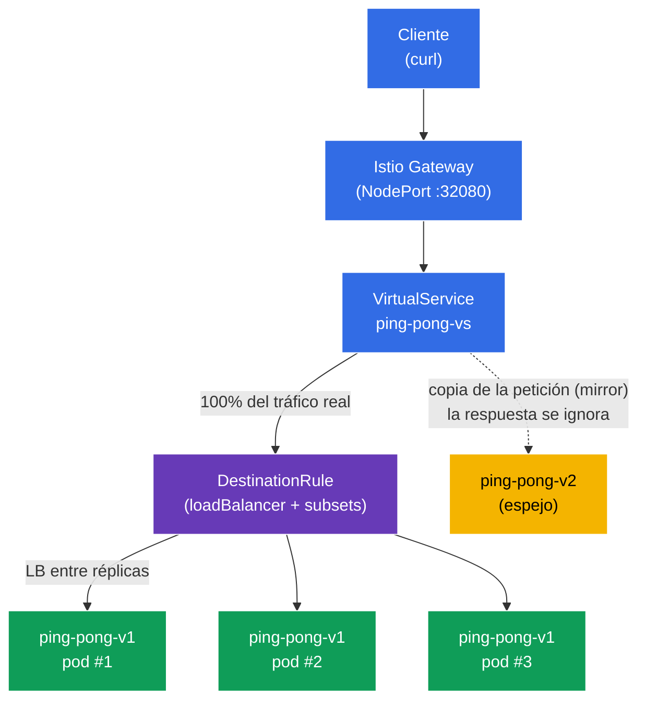

[RU version](README_RU.MD) · [Eng version](README.MD) · [Version française](README_FR.MD) · [Deutsche Version](README_DE.MD)

# Lab 06 - Load Balancing + Traffic Mirroring

Imagina lo siguiente: tienes un servicio `ping-pong` con tres réplicas de la versión estable **v1** y una nueva versión **v2** que quieres poner a prueba. Surgen dos preguntas. La primera: **cómo exactamente** se distribuye el tráfico entre las réplicas y si esto se puede configurar (round-robin, la menos cargada, etc.). La segunda: cómo probar **v2** con tráfico real de «producción» **sin arriesgar** a los usuarios.

Istio resuelve ambas tareas a nivel de infraestructura:
- **Load Balancing** (`DestinationRule`) - elección del algoritmo de balanceo entre los endpoints del servicio, incluida la posibilidad de sobrescribirlo a nivel de un puerto concreto.
- **Traffic Mirroring** (reflejo de tráfico) - Envoy envía una **copia** de la petición a la segunda versión (v2), mientras que la respuesta de esta se ignora. El cliente siempre recibe la respuesta de v1, y v2 «ve» el tráfico real en modo de ejecución en la sombra.

### Cómo funciona (esquema general)



## Objetivo

- Configurar el algoritmo de balanceo de carga mediante `DestinationRule`, incluida la sobrescritura a nivel de puerto.
- Reflejar el tráfico de producción hacia la nueva versión `v2` mediante `VirtualService` (`mirror`), sin afectar las respuestas al cliente.

## Paso 1. Activación de la inyección de sidecar

```bash
kubectl label namespace default istio-injection=enabled --overwrite
```

El sidecar `istio-proxy` (Envoy) en cada pod es lo que implementa tanto el balanceo como el reflejo. Sin él, `DestinationRule` y `mirror` no funcionarán.

## Paso 2. Instalación de la aplicación

Desplegamos un único Service `ping-pong` y dos Deployment: **v1** (3 réplicas, estable) y **v2** (1 réplica, nueva).

```bash
kubectl apply -f https://raw.githubusercontent.com/ViktorUJ/cks/refs/heads/master/tasks/ica/labs/06/k8s-1/scripts/1.yaml
kubectl rollout restart deployment -n default
```

**Detalle importante:** en cada pod la variable `SERVER_NAME` se toma del nombre del pod (mediante la downward API), por lo que en la respuesta del servicio, en el campo `Server Name`, se verá el **nombre de la réplica concreta**. Esto permitirá observar de forma clara tanto el balanceo (distintos pods de v1) como el reflejo (v2 no aparece en las respuestas al cliente).

```bash
kubectl get pods -n default -l app=ping-pong
```

```
NAME                            READY   STATUS    RESTARTS   AGE
ping-pong-v1-6c8f...-aaaaa      2/2     Running   0          30s
ping-pong-v1-6c8f...-bbbbb      2/2     Running   0          30s
ping-pong-v1-6c8f...-ccccc      2/2     Running   0          30s
ping-pong-v2-7d9a...-ddddd      2/2     Running   0          30s
```

## Paso 3. Punto de entrada: Gateway y VirtualService

Creamos la entrada y dirigimos todo el tráfico al subset `v1`.

```bash
vim gateway.yaml
```

```yaml
apiVersion: networking.istio.io/v1
kind: Gateway
metadata:
  name: main-gateway
  namespace: default
spec:
  selector:
    istio: ingressgateway
  servers:
  - port:
      number: 80
      name: http
      protocol: HTTP
    hosts:
    - "myapp.local"
---
apiVersion: networking.istio.io/v1
kind: VirtualService
metadata:
  name: ping-pong-vs
  namespace: default
spec:
  hosts:
  - "myapp.local"
  - "ping-pong"
  gateways:
  - main-gateway
  - mesh
  http:
  - route:
    - destination:
        host: ping-pong
        subset: v1
```

```bash
kubectl apply -f gateway.yaml
```

## Paso 4. Load Balancing - algoritmo ROUND_ROBIN

`DestinationRule` define cómo se distribuye el tráfico entre los endpoints (pods) del servicio. El campo `trafficPolicy.loadBalancer.simple` selecciona el algoritmo. Empezamos con `ROUND_ROBIN`.

```bash
vim destination-rule.yaml
```

```yaml
apiVersion: networking.istio.io/v1
kind: DestinationRule
metadata:
  name: ping-pong-dr
  namespace: default
spec:
  host: ping-pong
  trafficPolicy:
    loadBalancer:
      simple: ROUND_ROBIN       # algoritmo global para el servicio
  subsets:
  - name: v1
    labels:
      version: v1
  - name: v2
    labels:
      version: v2
```

```bash
kubectl apply -f destination-rule.yaml
```

**Análisis:**
- **`loadBalancer.simple`** - algoritmos de balanceo integrados:
  - `ROUND_ROBIN` - por turnos en círculo (por defecto);
  - `LEAST_REQUEST` - hacia la réplica con menor número de peticiones activas (a menudo más eficiente que round-robin);
  - `RANDOM` - elección aleatoria;
  - `PASSTHROUGH` - sin balanceo, hacia la dirección original.
- **`subsets`** - grupos lógicos de pods (`v1`, `v2`) por la etiqueta `version`; a ellos hacen referencia el `VirtualService` (ruta y mirror).

Observamos la distribución entre las tres réplicas de v1:

```bash
for i in $(seq 12); do curl -s http://myapp.local:32080 | grep 'Server Name'; done | sort | uniq -c
```

```
      4 Server Name: ping-pong-v1-6c8f...-aaaaa
      4 Server Name: ping-pong-v1-6c8f...-bbbbb
      4 Server Name: ping-pong-v1-6c8f...-ccccc
```

Con `ROUND_ROBIN` el tráfico se distribuye aproximadamente por igual entre los tres pods de v1. La versión v2 no aparece en las respuestas: por ahora no se dirige nada hacia ella.

## Paso 5. Port-level override - balanceo a nivel de puerto

`portLevelSettings` permite sobrescribir el algoritmo de balanceo para un puerto concreto. Es útil cuando un servicio tiene varios puertos con requisitos distintos (por ejemplo, en una tarea de examen: globalmente `ROUND_ROBIN`, y para `443` - `LEAST_CONN`).

Actualizamos el `DestinationRule` añadiendo la sobrescritura para el puerto `8080` a `LEAST_REQUEST`:

```yaml
apiVersion: networking.istio.io/v1
kind: DestinationRule
metadata:
  name: ping-pong-dr
  namespace: default
spec:
  host: ping-pong
  trafficPolicy:
    loadBalancer:
      simple: ROUND_ROBIN       # algoritmo global (para todos los demás puertos)
    portLevelSettings:
    - port:
        number: 8080
      loadBalancer:
        simple: LEAST_REQUEST   # sobrescritura exclusiva para el puerto 8080
  subsets:
  - name: v1
    labels:
      version: v1
  - name: v2
    labels:
      version: v2
```

```bash
kubectl apply -f destination-rule.yaml
```

**Qué cambió:** para el puerto `8080` (que es nuestro puerto HTTP) ahora rige `LEAST_REQUEST` - Envoy envía la petición a la réplica con menor número de peticiones activas. El `ROUND_ROBIN` global se mantiene para todos los demás puertos. Por eso, al repetir la comprobación, la distribución ya no es necesariamente exactamente `4/4/4` - se ajusta a la carga de las réplicas:

```bash
for i in $(seq 12); do curl -s http://myapp.local:32080 | grep 'Server Name'; done | sort | uniq -c
```

```
      3 Server Name: ping-pong-v1-6c8f...-aaaaa
      2 Server Name: ping-pong-v1-6c8f...-bbbbb
      7 Server Name: ping-pong-v1-6c8f...-ccccc
```

Lo principal es que la sobrescritura se aplica precisamente al puerto indicado, y no a todo el servicio.

## Paso 6. Traffic Mirroring - reflejamos el tráfico hacia v2

Ahora activaremos la ejecución en la sombra: el 100% de las peticiones reales sigue atendiéndolo v1, pero Envoy adicionalmente envía una **copia** de cada petición a v2. La respuesta de v2 se **descarta** - el cliente nunca la ve.

Actualizamos el `VirtualService` añadiendo el bloque `mirror`:

```bash
vim mirror-vs.yaml
```

```yaml
apiVersion: networking.istio.io/v1
kind: VirtualService
metadata:
  name: ping-pong-vs
  namespace: default
spec:
  hosts:
  - "myapp.local"
  - "ping-pong"
  gateways:
  - main-gateway
  - mesh
  http:
  - route:
    - destination:
        host: ping-pong
        subset: v1          # 100% de las respuestas al cliente - desde v1
    mirror:
      host: ping-pong
      subset: v2            # una copia de cada petición se va a v2
    mirrorPercentage:
      value: 100.0          # porcentaje de tráfico reflejado
```

```bash
kubectl apply -f mirror-vs.yaml
```

**Análisis del bloque `mirror`:**
- **`route.destination`** - la ruta principal. El cliente recibe la respuesta **solo** de aquí (subset v1).
- **`mirror`** - a dónde enviar la copia de la petición (subset v2). Es un «fire-and-forget»: Envoy no espera ni utiliza la respuesta del espejo.
- **`mirrorPercentage.value`** - qué porcentaje de las peticiones se refleja (aquí 100%). Se puede poner, por ejemplo, `25.0` para duplicar solo una cuarta parte del tráfico de producción.

**Para qué sirve esto:** ejecutas la carga real a través de v2 y observas sus métricas, logs y errores, pero sin ningún riesgo para los usuarios. Si v2 se cae o empieza a fallar, los clientes no lo notarán.

## Paso 7. Comprobación

### El cliente siempre recibe v1

```bash
for i in $(seq 10); do curl -s http://myapp.local:32080 | grep 'Server Name'; done
```

```
Server Name   : ping-pong-v1-6c8f...-aaaaa
Server Name   : ping-pong-v1-6c8f...-bbbbb
...
```

En las respuestas solo hay pods `v1`. La versión `v2` no aparece ni una sola vez, aunque el tráfico llega a ella.

### Confirmamos que v2 realmente recibe el tráfico reflejado

Observamos el contador de peticiones entrantes en el proxy Envoy dentro del pod de v2:

```bash
kubectl exec -n default deploy/ping-pong-v2 -c istio-proxy -- \
  pilot-agent request GET stats | grep istio_requests_total | grep destination_workload.ping-pong-v2
```

```
istiocustom.istio_requests_total.<...>.destination_workload.ping-pong-v2.<...>.response_code.200<...>: 40
```

El contador crece a medida que llegan peticiones - lo que significa que el tráfico reflejado realmente llega a v2, aunque el cliente no lo sospeche.

## Resumen

| Mecanismo | Recurso | Qué hicimos | Resultado |
|----------|--------|-------------|-----------|
| Load Balancing | `DestinationRule` (`loadBalancer.simple`) | Definimos el algoritmo + sobrescritura por puerto | distribución controlada entre réplicas |
| Traffic Mirroring | `VirtualService` (`mirror` + `mirrorPercentage`) | Reflejamos el tráfico de producción hacia v2 | v2 se prueba con carga real sin riesgo |

**Conclusión clave:**
- **DestinationRule** define la política de balanceo: qué algoritmo y (si es necesario) con sobrescritura a nivel de puerto - se trata de **cómo** se reparte el tráfico entre los endpoints.
- **Traffic Mirroring** ofrece una forma segura de comprobar una nueva versión con tráfico de producción: el cliente siempre trabaja con la v1 estable, mientras que v2 recibe la «sombra» de las peticiones reales con la respuesta descartada.

Ambos mecanismos funcionan exclusivamente a nivel de Envoy - sin una sola línea de cambios en el código de la aplicación.
