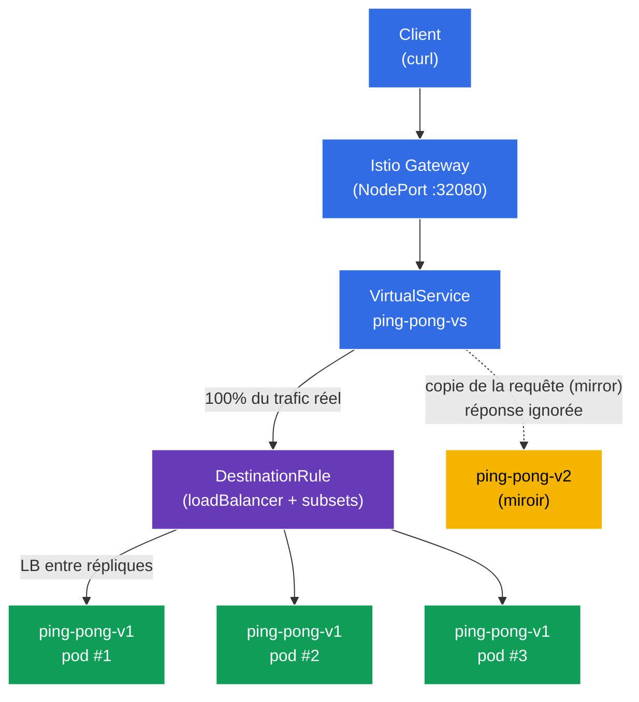

[RU version](README_RU.MD) · [Eng version](README.MD) · [Versión en español](README_ES.MD) · [Deutsche Version](README_DE.MD)

# Lab 06 - Load Balancing + Traffic Mirroring

Imaginez : vous avez un service `ping-pong` avec trois répliques de la version stable **v1** et une nouvelle version **v2** que vous voulez roder. Deux questions se posent. La première - **comment exactement** le trafic est réparti entre les répliques et peut-on le configurer (round-robin, le moins chargé, etc.). La seconde - comment tester **v2** sur du trafic réel « de production », **sans risquer** de gêner les utilisateurs.

Istio résout les deux problèmes au niveau de l'infrastructure :
- **Load Balancing** (`DestinationRule`) - choix de l'algorithme de répartition de charge entre les endpoints du service, y compris avec une surcharge au niveau d'un port particulier.
- **Traffic Mirroring** (miroir) - Envoy envoie une **copie** de la requête vers la seconde version (v2), tout en ignorant sa réponse. Le client reçoit toujours la réponse de v1, et v2 « voit » le trafic réel en mode lancement fantôme.

### Comment ça marche (schéma général)



## Infrastructure

L'environnement est déployé dans AWS (`eu-north-1`) via Terragrunt et se compose de :

| Composant  | Description                                          |
|------------|---------------------------------------------------|
| `vpc`      | VPC `10.10.0.0/16` avec des sous-réseaux publics          |
| `ssh-keys` | Clés SSH pour l'accès aux nœuds                      |
| `k8s-1`    | Kubernetes `1.35.2` (kubeadm) avec Istio installé |
| `worker`   | Machine de travail avec `kubectl` et accès au cluster   |

Instances : `t4g.medium` (master) Ubuntu `22.04`

## Déploiement

```bash
TASK=06 make run_ica_task
```

## Objectif

- Configurer l'algorithme de répartition de charge via `DestinationRule`, y compris la surcharge au niveau du port.
- Mettre en miroir le trafic de production vers la nouvelle version `v2` via `VirtualService` (`mirror`), sans affecter les réponses au client.

## Étape 1. Activation de l'injection de sidecar

```bash
kubectl label namespace default istio-injection=enabled --overwrite
```

Le sidecar `istio-proxy` (Envoy) dans chaque pod est ce qui réalise à la fois la répartition de charge et le miroir. Sans lui, `DestinationRule` et `mirror` ne fonctionneront pas.

## Étape 2. Installation de l'application

On déploie un seul Service `ping-pong` et deux Deployment : **v1** (3 répliques, stable) et **v2** (1 réplique, nouvelle).

```bash
kubectl apply -f https://raw.githubusercontent.com/ViktorUJ/cks/refs/heads/master/tasks/ica/labs/06/k8s-1/scripts/1.yaml
kubectl rollout restart deployment -n default
```

**Détail important :** pour chaque pod, la variable `SERVER_NAME` est tirée du nom du pod (via la downward API), c'est pourquoi dans la réponse du service, le champ `Server Name` affichera **le nom de la réplique concrète**. Cela permettra d'observer concrètement à la fois la répartition de charge (différents pods v1) et le miroir (v2 n'apparaît pas dans les réponses au client).

```bash
kubectl get pods -n default -l app=ping-pong
```

```
NAME                            READY   STATUS    RESTARTS   AGE
ping-pong-v1-6c8f...-aaaaa      2/2     Running   0          30s
ping-pong-v1-6c8f...-bbbbb      2/2     Running   0          30s
ping-pong-v1-6c8f...-ccccc      2/2     Running   0          30s
ping-pong-v2-7d9a...-ddddd      2/2     Running   0          30s
```

## Étape 3. Point d'entrée : Gateway et VirtualService

On crée l'entrée et on dirige tout le trafic vers le subset `v1`.

```bash
vim gateway.yaml
```

```yaml
apiVersion: networking.istio.io/v1
kind: Gateway
metadata:
  name: main-gateway
  namespace: default
spec:
  selector:
    istio: ingressgateway
  servers:
  - port:
      number: 80
      name: http
      protocol: HTTP
    hosts:
    - "myapp.local"
---
apiVersion: networking.istio.io/v1
kind: VirtualService
metadata:
  name: ping-pong-vs
  namespace: default
spec:
  hosts:
  - "myapp.local"
  - "ping-pong"
  gateways:
  - main-gateway
  - mesh
  http:
  - route:
    - destination:
        host: ping-pong
        subset: v1
```

```bash
kubectl apply -f gateway.yaml
```

## Étape 4. Load Balancing - algorithme ROUND_ROBIN

`DestinationRule` définit comment le trafic est réparti entre les endpoints (pods) du service. Le champ `trafficPolicy.loadBalancer.simple` choisit l'algorithme. Commençons par `ROUND_ROBIN`.

```bash
vim destination-rule.yaml
```

```yaml
apiVersion: networking.istio.io/v1
kind: DestinationRule
metadata:
  name: ping-pong-dr
  namespace: default
spec:
  host: ping-pong
  trafficPolicy:
    loadBalancer:
      simple: ROUND_ROBIN       # algorithme global pour le service
  subsets:
  - name: v1
    labels:
      version: v1
  - name: v2
    labels:
      version: v2
```

```bash
kubectl apply -f destination-rule.yaml
```

**Analyse :**
- **`loadBalancer.simple`** - algorithmes de répartition de charge intégrés :
  - `ROUND_ROBIN` - à tour de rôle, en boucle (par défaut) ;
  - `LEAST_REQUEST` - vers la réplique avec le moins de requêtes actives (souvent plus efficace que round-robin) ;
  - `RANDOM` - choix aléatoire ;
  - `PASSTHROUGH` - sans répartition, vers l'adresse d'origine.
- **`subsets`** - groupes logiques de pods (`v1`, `v2`) par le label `version` ; le `VirtualService` y fait référence (route et mirror).

On regarde la répartition entre les trois répliques v1 :

```bash
for i in $(seq 12); do curl -s http://myapp.local:32080 | grep 'Server Name'; done | sort | uniq -c
```

```
      4 Server Name: ping-pong-v1-6c8f...-aaaaa
      4 Server Name: ping-pong-v1-6c8f...-bbbbb
      4 Server Name: ping-pong-v1-6c8f...-ccccc
```

Avec `ROUND_ROBIN`, le trafic se répartit à peu près également entre les trois pods v1. La version v2 n'apparaît pas dans les réponses - rien n'y est encore dirigé.

## Étape 5. Port-level override - répartition au niveau du port

`portLevelSettings` permet de surcharger l'algorithme de répartition de charge pour un port concret. C'est utile lorsqu'un service a plusieurs ports aux exigences différentes (par exemple, dans la tâche d'examen : globalement `ROUND_ROBIN`, mais pour le `443` - `LEAST_CONN`).

On met à jour le `DestinationRule` en ajoutant une surcharge pour le port `8080` en `LEAST_REQUEST` :

```yaml
apiVersion: networking.istio.io/v1
kind: DestinationRule
metadata:
  name: ping-pong-dr
  namespace: default
spec:
  host: ping-pong
  trafficPolicy:
    loadBalancer:
      simple: ROUND_ROBIN       # algorithme global (pour tous les autres ports)
    portLevelSettings:
    - port:
        number: 8080
      loadBalancer:
        simple: LEAST_REQUEST   # surcharge spécifiquement pour le port 8080
  subsets:
  - name: v1
    labels:
      version: v1
  - name: v2
    labels:
      version: v2
```

```bash
kubectl apply -f destination-rule.yaml
```

**Ce qui a changé :** pour le port `8080` (qui est notre port HTTP), c'est désormais `LEAST_REQUEST` qui s'applique - Envoy envoie la requête vers la réplique avec le moins de requêtes actives. Le `ROUND_ROBIN` global reste pour tous les autres ports. C'est pourquoi, lors d'une nouvelle vérification, la répartition n'est plus forcément exactement `4/4/4` - elle s'ajuste à la charge des répliques :

```bash
for i in $(seq 12); do curl -s http://myapp.local:32080 | grep 'Server Name'; done | sort | uniq -c
```

```
      3 Server Name: ping-pong-v1-6c8f...-aaaaa
      2 Server Name: ping-pong-v1-6c8f...-bbbbb
      7 Server Name: ping-pong-v1-6c8f...-ccccc
```

L'essentiel - la surcharge s'applique précisément au port indiqué, et non à tout le service.

## Étape 6. Traffic Mirroring - on met le trafic en miroir vers v2

Activons maintenant le lancement fantôme : 100% des requêtes réelles sont toujours servies par v1, mais Envoy envoie en plus une **copie** de chaque requête vers v2. La réponse de v2 est **jetée** - le client ne la voit jamais.

On met à jour le `VirtualService` en ajoutant le bloc `mirror` :

```bash
vim mirror-vs.yaml
```

```yaml
apiVersion: networking.istio.io/v1
kind: VirtualService
metadata:
  name: ping-pong-vs
  namespace: default
spec:
  hosts:
  - "myapp.local"
  - "ping-pong"
  gateways:
  - main-gateway
  - mesh
  http:
  - route:
    - destination:
        host: ping-pong
        subset: v1          # 100% des réponses au client - depuis v1
    mirror:
      host: ping-pong
      subset: v2            # une copie de chaque requête part vers v2
    mirrorPercentage:
      value: 100.0          # part du trafic mis en miroir
```

```bash
kubectl apply -f mirror-vs.yaml
```

**Analyse du bloc `mirror` :**
- **`route.destination`** - route principale. Le client reçoit sa réponse **uniquement** d'ici (subset v1).
- **`mirror`** - où envoyer la copie de la requête (subset v2). C'est du « fire-and-forget » : Envoy n'attend pas et n'utilise pas la réponse du miroir.
- **`mirrorPercentage.value`** - quelle part des requêtes est mise en miroir (ici 100%). On peut mettre, par exemple, `25.0`, pour ne dupliquer qu'un quart du trafic de production.

**À quoi ça sert :** vous faites passer une charge réelle à travers v2 et vous observez ses métriques, logs, erreurs - mais sans aucun risque pour les utilisateurs. Si v2 tombe ou commence à renvoyer des erreurs, les clients ne le remarqueront pas.

## Étape 7. Vérification

### Le client reçoit toujours v1

```bash
for i in $(seq 10); do curl -s http://myapp.local:32080 | grep 'Server Name'; done
```

```
Server Name   : ping-pong-v1-6c8f...-aaaaa
Server Name   : ping-pong-v1-6c8f...-bbbbb
...
```

Dans les réponses - uniquement des pods `v1`. La version `v2` n'apparaît jamais, bien que du trafic lui soit envoyé.

### On s'assure que v2 reçoit réellement le trafic miroir

On regarde le compteur de requêtes entrantes sur le proxy Envoy à l'intérieur du pod v2 :

```bash
kubectl exec -n default deploy/ping-pong-v2 -c istio-proxy -- \
  pilot-agent request GET stats | grep istio_requests_total | grep destination_workload.ping-pong-v2
```

```
istiocustom.istio_requests_total.<...>.destination_workload.ping-pong-v2.<...>.response_code.200<...>: 40
```

Le compteur augmente au fur et à mesure de l'arrivée des requêtes - cela signifie que le trafic miroir atteint bien v2, sans que le client ne s'en doute.

## Bilan

| Mécanisme | Ressource | Ce que l'on a fait | Résultat |
|----------|--------|-------------|-----------|
| Load Balancing | `DestinationRule` (`loadBalancer.simple`) | Défini l'algorithme + surcharge sur un port | répartition contrôlée entre les répliques |
| Traffic Mirroring | `VirtualService` (`mirror` + `mirrorPercentage`) | Mis en miroir le trafic de production vers v2 | v2 est testée sous charge réelle sans risque |

**Conclusion clé :**
- **DestinationRule** définit la politique de répartition de charge : quel algorithme et (si nécessaire) avec une surcharge au niveau du port - c'est le **comment** le trafic se répartit entre les endpoints.
- **Traffic Mirroring** offre un moyen sûr de tester une nouvelle version sur du trafic de production : le client travaille toujours avec la v1 stable, tandis que v2 reçoit une « ombre » des requêtes réelles avec réponse jetée.

Les deux mécanismes fonctionnent exclusivement au niveau d'Envoy - sans une seule ligne de modification dans le code de l'application.
