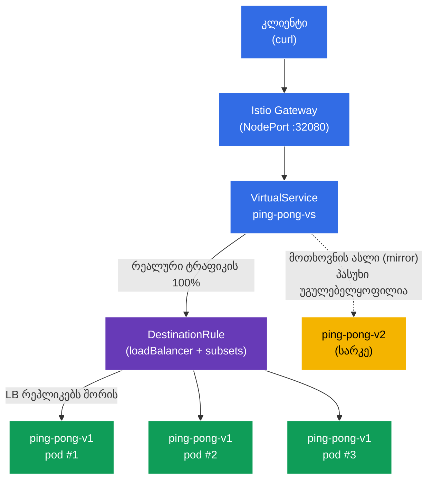

[Русская версия](README_RU.MD) · [Eng version](README.MD) · [Versión en español](README_ES.MD) · [Version française](README_FR.MD) · [Deutsche Version](README_DE.MD) · [繁體中文版](README_TW.MD) · [日本語版](README_JP.MD)

# Lab 06 - დატვირთვის დაბალანსება + ტრაფიკის სარკისებური ასახვა

> [საცნობარო გადაწყვეტა](worker/files/solutions/1_GE.MD)

წარმოიდგინეთ: გაქვთ სერვისი `ping-pong` სტაბილური **v1** ვერსიის სამი რეპლიკით და ახალი **v2** ვერსიით, რომლის გამოცდაც გსურთ. ჩნდება ორი კითხვა. პირველი - **ზუსტად როგორ** ნაწილდება ტრაფიკი რეპლიკებს შორის და შესაძლებელია თუ არა ამის კონფიგურაცია (round-robin, ყველაზე ნაკლებად დატვირთული და ა.შ.). მეორე - როგორ გამოვცადოთ **v2** რეალურ „საბრძოლო“ ტრაფიკზე ისე, რომ მომხმარებლები **რისკის ქვეშ არ დავაყენოთ**.

Istio ორივე ამოცანას ინფრასტრუქტურის დონეზე წყვეტს:
- **Load Balancing** (`DestinationRule`) - სერვისის endpoint-ებს შორის დაბალანსების ალგორითმის არჩევა, მათ შორის ცალკეული პორტის დონეზე გადაწერით.
- **Traffic Mirroring** (სარკისებური ასახვა) - Envoy მოთხოვნის **ასლს** მეორე ვერსიაზე (v2) აგზავნის, ხოლო მის პასუხს უგულებელყოფს. კლიენტი ყოველთვის v1-ის პასუხს იღებს, v2 კი ჩრდილოვანი გაშვების რეჟიმში რეალურ ტრაფიკს „ხედავს“.

### როგორ მუშაობს ეს (ზოგადი სქემა)



## ინფრასტრუქტურა

გარემო AWS-ში (`eu-north-1`) Terragrunt-ის საშუალებით იშლება და შედგება შემდეგი კომპონენტებისგან:

| კომპონენტი | აღწერა |
|------------|--------|
| `vpc`      | VPC `10.10.0.0/16` საჯარო ქვექსელებით |
| `ssh-keys` | SSH-გასაღებები ნოდებზე წვდომისთვის |
| `k8s-1`    | Kubernetes `1.35.2` (kubeadm) დაყენებული Istio-თი |
| `worker`   | სამუშაო მანქანა `kubectl`-ითა და კლასტერზე წვდომით |

ინსტანსები: `t4g.medium` (master) Ubuntu `22.04`

## გაშლა

```bash
TASK=06 make run_ica_task
```

## მიზანი

- `DestinationRule`-ის საშუალებით დატვირთვის დაბალანსების ალგორითმის კონფიგურაცია, პორტის დონეზე გადაწერის ჩათვლით.
- `VirtualService`-ის (`mirror`) საშუალებით საბრძოლო ტრაფიკის ახალ `v2` ვერსიაზე სარკისებურად ასახვა ისე, რომ კლიენტისთვის დაბრუნებულ პასუხებზე გავლენა არ მოვახდინოთ.

## ნაბიჯი 1. sidecar-ინექციის ჩართვა

```bash
kubectl label namespace default istio-injection=enabled --overwrite
```

თითოეულ პოდში არსებული sidecar `istio-proxy` (Envoy) ახორციელებს როგორც დაბალანსებას, ისე სარკისებურ ასახვას. მის გარეშე `DestinationRule` და `mirror` არ იმუშავებს.

## ნაბიჯი 2. აპლიკაციის დაყენება

ვაყენებთ ერთ Service-ს `ping-pong` და ორ Deployment-ს: **v1** (3 რეპლიკა, სტაბილური) და **v2** (1 რეპლიკა, ახალი).

```bash
kubectl apply -f https://raw.githubusercontent.com/ViktorUJ/cks/refs/heads/master/tasks/ica/labs/06/k8s-1/scripts/1.yaml
kubectl rollout restart deployment -n default
```

**მნიშვნელოვანი დეტალი:** თითოეულ პოდში ცვლადი `SERVER_NAME` პოდის სახელიდან მიიღება (downward API-ის საშუალებით), ამიტომ სერვისის პასუხის `Server Name` ველში **კონკრეტული რეპლიკის სახელი** გამოჩნდება. ეს საშუალებას მოგვცემს თვალსაჩინოდ დავაკვირდეთ როგორც დაბალანსებას (სხვადასხვა v1 პოდი), ისე სარკისებურ ასახვას (v2 კლიენტის პასუხებში არ გამოჩნდება).

```bash
kubectl get pods -n default -l app=ping-pong
```

```
NAME                            READY   STATUS    RESTARTS   AGE
ping-pong-v1-6c8f...-aaaaa      2/2     Running   0          30s
ping-pong-v1-6c8f...-bbbbb      2/2     Running   0          30s
ping-pong-v1-6c8f...-ccccc      2/2     Running   0          30s
ping-pong-v2-7d9a...-ddddd      2/2     Running   0          30s
```

## ნაბიჯი 3. შესვლის წერტილი: Gateway და VirtualService

ვქმნით შესასვლელს და მთელ ტრაფიკს `v1` subset-ზე ვამისამართებთ.

```bash
vim gateway.yaml
```

```yaml
apiVersion: networking.istio.io/v1
kind: Gateway
metadata:
  name: main-gateway
  namespace: default
spec:
  selector:
    istio: ingressgateway
  servers:
  - port:
      number: 80
      name: http
      protocol: HTTP
    hosts:
    - "myapp.local"
---
apiVersion: networking.istio.io/v1
kind: VirtualService
metadata:
  name: ping-pong-vs
  namespace: default
spec:
  hosts:
  - "myapp.local"
  - "ping-pong"
  gateways:
  - main-gateway
  - mesh
  http:
  - route:
    - destination:
        host: ping-pong
        subset: v1
```

```bash
kubectl apply -f gateway.yaml
```

## ნაბიჯი 4. Load Balancing - ROUND_ROBIN ალგორითმი

`DestinationRule` განსაზღვრავს, როგორ ნაწილდება ტრაფიკი სერვისის endpoint-ებს (პოდებს) შორის. ველი `trafficPolicy.loadBalancer.simple` ალგორითმს ირჩევს. დავიწყოთ `ROUND_ROBIN`-ით.

```bash
vim destination-rule.yaml
```

```yaml
apiVersion: networking.istio.io/v1
kind: DestinationRule
metadata:
  name: ping-pong-dr
  namespace: default
spec:
  host: ping-pong
  trafficPolicy:
    loadBalancer:
      simple: ROUND_ROBIN       # გლობალური ალგორითმი სერვისისთვის
  subsets:
  - name: v1
    labels:
      version: v1
  - name: v2
    labels:
      version: v2
```

```bash
kubectl apply -f destination-rule.yaml
```

**განმარტება:**
- **`loadBalancer.simple`** - ჩაშენებული დაბალანსების ალგორითმები:
  - `ROUND_ROBIN` - რიგრიგობით, წრიულად (ნაგულისხმევი);
  - `LEAST_REQUEST` - რეპლიკაზე, რომელსაც აქტიური მოთხოვნების უმცირესი რაოდენობა აქვს (ხშირად round-robin-ზე ეფექტიანია);
  - `RANDOM` - შემთხვევითი არჩევანი;
  - `PASSTHROUGH` - დაბალანსების გარეშე, საწყის მისამართზე.
- **`subsets`** - პოდების ლოგიკური ჯგუფები (`v1`, `v2`) `version` ლეიბლის მიხედვით; მათზე `VirtualService` მიუთითებს (მარშრუტი და mirror).

ვაკვირდებით განაწილებას v1-ის სამ რეპლიკაზე:

```bash
for i in $(seq 12); do curl -s http://myapp.local:32080 | grep 'Server Name'; done | sort | uniq -c
```

```
      4 Server Name: ping-pong-v1-6c8f...-aaaaa
      4 Server Name: ping-pong-v1-6c8f...-bbbbb
      4 Server Name: ping-pong-v1-6c8f...-ccccc
```

`ROUND_ROBIN`-ის გამოყენებისას ტრაფიკი დაახლოებით თანაბრად ნაწილდება v1-ის სამ პოდს შორის. v2 ვერსია პასუხებში არ ჩნდება - მასზე ჯერ არაფერი მიგვიმართავს.

## ნაბიჯი 5. Port-level override - დაბალანსება პორტის დონეზე

`portLevelSettings` კონკრეტული პორტისთვის დაბალანსების ალგორითმის გადაწერის საშუალებას იძლევა. ეს სასარგებლოა, როდესაც სერვისს განსხვავებული მოთხოვნების მქონე რამდენიმე პორტი აქვს (მაგალითად, საგამოცდო ამოცანაში: გლობალურად `ROUND_ROBIN`, ხოლო `443`-ისთვის - `LEAST_CONN`).

ვაახლებთ `DestinationRule`-ს და `8080` პორტისთვის ვამატებთ `LEAST_REQUEST`-ზე გადაწერას:

```yaml
apiVersion: networking.istio.io/v1
kind: DestinationRule
metadata:
  name: ping-pong-dr
  namespace: default
spec:
  host: ping-pong
  trafficPolicy:
    loadBalancer:
      simple: ROUND_ROBIN       # გლობალური ალგორითმი (ყველა დანარჩენი პორტისთვის)
    portLevelSettings:
    - port:
        number: 8080
      loadBalancer:
        simple: LEAST_REQUEST   # გადაწერა კონკრეტულად 8080 პორტისთვის
  subsets:
  - name: v1
    labels:
      version: v1
  - name: v2
    labels:
      version: v2
```

```bash
kubectl apply -f destination-rule.yaml
```

**რა შეიცვალა:** `8080` პორტისთვის (ეს ჩვენი HTTP-პორტია) ახლა `LEAST_REQUEST` მოქმედებს - Envoy მოთხოვნას აქტიური მოთხოვნების უმცირესი რაოდენობის მქონე რეპლიკაზე აგზავნის. გლობალური `ROUND_ROBIN` ყველა სხვა პორტისთვის რჩება. ამიტომ ხელახალი შემოწმებისას განაწილება აღარ იქნება აუცილებლად ზუსტად `4/4/4` - ის რეპლიკების დატვირთვას ერგება:

```bash
for i in $(seq 12); do curl -s http://myapp.local:32080 | grep 'Server Name'; done | sort | uniq -c
```

```
      3 Server Name: ping-pong-v1-6c8f...-aaaaa
      2 Server Name: ping-pong-v1-6c8f...-bbbbb
      7 Server Name: ping-pong-v1-6c8f...-ccccc
```

მთავარია, გადაწერა სწორედ მითითებულ პორტზე ვრცელდება და არა მთელ სერვისზე.

## ნაბიჯი 6. Traffic Mirroring - ტრაფიკის სარკისებური ასახვა v2-ზე

ახლა ჩავრთოთ ჩრდილოვანი გაშვება: რეალური მოთხოვნების 100%-ს კვლავ v1 ამუშავებს, თუმცა Envoy დამატებით თითოეული მოთხოვნის **ასლს** v2-ზე აგზავნის. v2-ის პასუხი **უგულებელყოფილია** - კლიენტი მას ვერასდროს ხედავს.

ვაახლებთ `VirtualService`-ს და ვამატებთ `mirror` ბლოკს:

```bash
vim mirror-vs.yaml
```

```yaml
apiVersion: networking.istio.io/v1
kind: VirtualService
metadata:
  name: ping-pong-vs
  namespace: default
spec:
  hosts:
  - "myapp.local"
  - "ping-pong"
  gateways:
  - main-gateway
  - mesh
  http:
  - route:
    - destination:
        host: ping-pong
        subset: v1          # კლიენტისთვის პასუხების 100% - v1-იდან
    mirror:
      host: ping-pong
      subset: v2            # თითოეული მოთხოვნის ასლი მიდის v2-ზე
    mirrorPercentage:
      value: 100.0          # სარკისებურად ასახული ტრაფიკის წილი
```

```bash
kubectl apply -f mirror-vs.yaml
```

**`mirror` ბლოკის განმარტება:**
- **`route.destination`** - ძირითადი მარშრუტი. კლიენტი პასუხს **მხოლოდ** აქედან იღებს (subset v1).
- **`mirror`** - სად გაიგზავნოს მოთხოვნის ასლი (subset v2). ეს არის „fire-and-forget“: Envoy სარკის პასუხს არ ელოდება და არ იყენებს.
- **`mirrorPercentage.value`** - მოთხოვნების რა წილი აისახება სარკისებურად (აქ 100%). შეგიძლიათ, მაგალითად, მიუთითოთ `25.0`, რათა საბრძოლო ტრაფიკის მხოლოდ მეოთხედი დაკოპირდეს.

**რატომ არის ეს საჭირო:** რეალურ დატვირთვას v2-ის გავლით ატარებთ და აკვირდებით მის მეტრიკებს, ლოგებსა და შეცდომებს - თუმცა მომხმარებლებისთვის ყოველგვარი რისკის გარეშე. თუ v2 გაითიშება ან შეცდომებს დააბრუნებს, კლიენტები ამას ვერ შეამჩნევენ.

## ნაბიჯი 7. შემოწმება

### კლიენტი ყოველთვის v1-ს იღებს

```bash
for i in $(seq 10); do curl -s http://myapp.local:32080 | grep 'Server Name'; done
```

```
Server Name   : ping-pong-v1-6c8f...-aaaaa
Server Name   : ping-pong-v1-6c8f...-bbbbb
...
```

პასუხებში მხოლოდ `v1` პოდებია. `v2` ვერსია არც ერთხელ არ ჩნდება, მიუხედავად იმისა, რომ მასზე ტრაფიკი მიდის.

### ვრწმუნდებით, რომ v2 ნამდვილად იღებს სარკისებურ ტრაფიკს

ვაკვირდებით შემომავალი მოთხოვნების მრიცხველს Envoy-პროქსიზე v2 პოდის შიგნით:

```bash
kubectl exec -n default deploy/ping-pong-v2 -c istio-proxy -- \
  pilot-agent request GET stats | grep istio_requests_total | grep destination_workload.ping-pong-v2
```

```
istiocustom.istio_requests_total.<...>.destination_workload.ping-pong-v2.<...>.response_code.200<...>: 40
```

მოთხოვნების მიღებასთან ერთად მრიცხველი იზრდება - ეს ნიშნავს, რომ სარკისებური ტრაფიკი ნამდვილად აღწევს v2-მდე, თუმცა კლიენტმა ამის შესახებ არაფერი იცის.

## შეჯამება

| მექანიზმი | რესურსი | რა გავაკეთეთ | შედეგი |
|-----------|---------|----------------|--------|
| Load Balancing | `DestinationRule` (`loadBalancer.simple`) | განვსაზღვრეთ ალგორითმი და პორტისთვის გადაწერა | რეპლიკებს შორის კონტროლირებადი განაწილება |
| Traffic Mirroring | `VirtualService` (`mirror` + `mirrorPercentage`) | საბრძოლო ტრაფიკს v2-ზე სარკისებურად ვასახავთ | v2 რეალურ დატვირთვაზე რისკის გარეშე გამოიცდება |

**მთავარი დასკვნა:**
- **DestinationRule** განსაზღვრავს დაბალანსების პოლიტიკას: რომელ ალგორითმს ვიყენებთ და, საჭიროების შემთხვევაში, როგორ გადავწერთ მას პორტის დონეზე - ანუ, **როგორ** ნაწილდება ტრაფიკი endpoint-ებს შორის.
- **Traffic Mirroring** ახალი ვერსიის საბრძოლო ტრაფიკზე შემოწმების უსაფრთხო საშუალებას გვაძლევს: კლიენტი ყოველთვის სტაბილურ v1-თან მუშაობს, ხოლო v2 რეალური მოთხოვნების „ჩრდილს“ იღებს და მისი პასუხი უგულებელყოფილია.

ორივე მექანიზმი მხოლოდ Envoy-ის დონეზე მუშაობს - აპლიკაციის კოდში არც ერთი სტრიქონის შეცვლის გარეშე.
