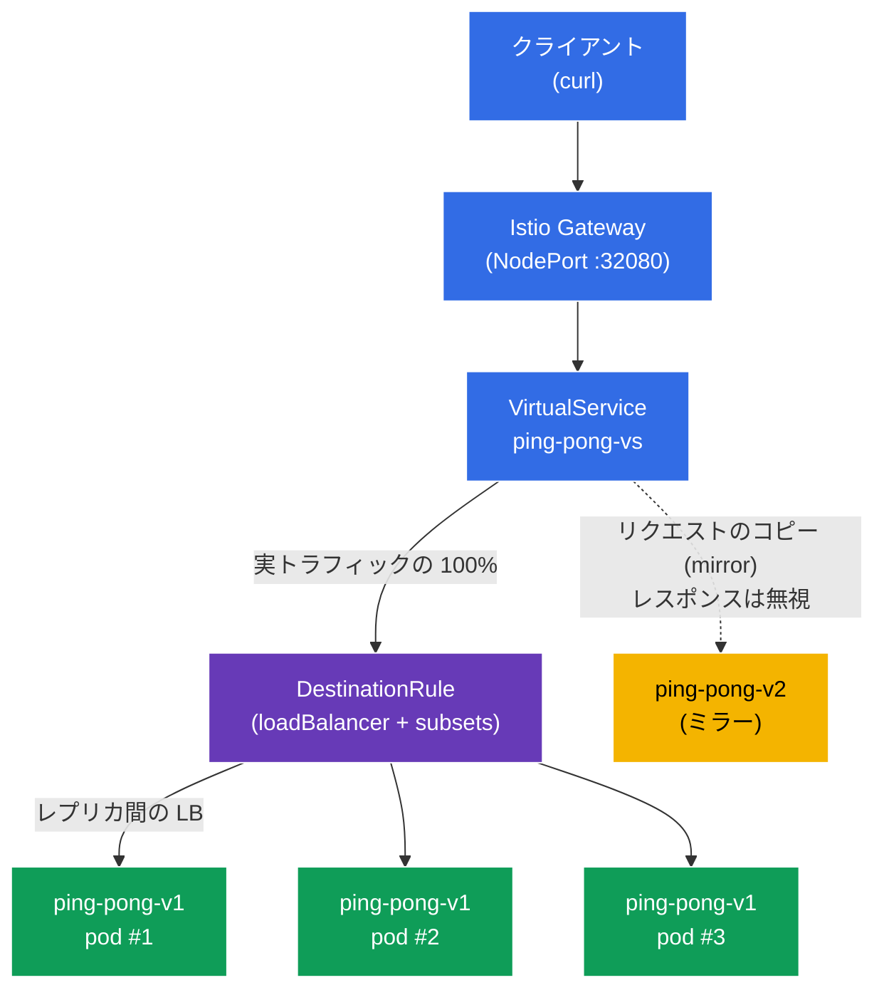

[Русская версия](README_RU.MD) · [Eng version](README.MD) · [Versión en español](README_ES.MD) · [Version française](README_FR.MD) · [Deutsche Version](README_DE.MD) · [ქართული ვერსია](README_GE.MD) · [繁體中文版](README_TW.MD)

# Lab 06 - ロードバランシング + トラフィックミラーリング

> [リファレンス解答](worker/files/solutions/1_JP.MD)

想像してみてください。安定版 **v1** の 3 つのレプリカと、試験運用したい新バージョン **v2** を持つ `ping-pong` サービスがあります。ここで 2 つの疑問が生じます。1 つ目は、トラフィックがレプリカ間で**どのように**分散され、設定可能かどうかです（ラウンドロビン、最小負荷など）。2 つ目は、ユーザーに**リスクを与えずに**、実際の「本番」トラフィックで **v2** をテストする方法です。

Istio はインフラストラクチャ層で両方の課題を解決します。
- **Load Balancing** (`DestinationRule`) - サービスエンドポイント間の負荷分散アルゴリズムを選択します。個別ポート単位でのオーバーライドも可能です。
- **Traffic Mirroring**（ミラーリング）- Envoy はリクエストの**コピー**を第 2 バージョン（v2）へ送信し、そのレスポンスを無視します。クライアントは常に v1 からレスポンスを受け取り、v2 はシャドー実行モードで実際のトラフィックを「確認」します。

### 仕組み（全体図）



## インフラストラクチャ

環境は Terragrunt を使用して AWS（`eu-north-1`）にデプロイされ、以下で構成されます。

| コンポーネント | 説明 |
|------------|---------------------------------------------------|
| `vpc`      | パブリックサブネットを持つ VPC `10.10.0.0/16` |
| `ssh-keys` | ノードへのアクセス用 SSH キー |
| `k8s-1`    | Istio がインストールされた Kubernetes `1.35.2`（kubeadm） |
| `worker`   | `kubectl` とクラスターへのアクセスを備えた作業マシン |

インスタンス: `t4g.medium`（master）、Ubuntu `22.04`

## デプロイ

```bash
TASK=06 make run_ica_task
```

## 目標

- ポート単位のオーバーライドを含め、`DestinationRule` で負荷分散アルゴリズムを設定する。
- クライアントへのレスポンスに影響を与えず、`VirtualService`（`mirror`）で本番トラフィックを新バージョン `v2` にミラーリングする。

## ステップ 1. sidecar インジェクションの有効化

```bash
kubectl label namespace default istio-injection=enabled --overwrite
```

各 Pod 内の sidecar `istio-proxy`（Envoy）が、負荷分散とミラーリングの両方を実装します。これがなければ、`DestinationRule` と `mirror` は動作しません。

## ステップ 2. アプリケーションのインストール

1 つの Service `ping-pong` と 2 つの Deployment をデプロイします。**v1**（3 レプリカ、安定版）と **v2**（1 レプリカ、新版）です。

```bash
kubectl apply -f https://raw.githubusercontent.com/ViktorUJ/cks/refs/heads/master/tasks/ica/labs/06/k8s-1/scripts/1.yaml
kubectl rollout restart deployment -n default
```

**重要な詳細:** 各 Pod の `SERVER_NAME` 変数は、downward API を介して Pod 名から取得されます。そのためサービスレスポンスの `Server Name` フィールドには、**特定のレプリカ名**が表示されます。これにより、負荷分散（異なる v1 Pod）とミラーリング（v2 はクライアントレスポンスに現れない）の両方を明確に観察できます。

```bash
kubectl get pods -n default -l app=ping-pong
```

```
NAME                            READY   STATUS    RESTARTS   AGE
ping-pong-v1-6c8f...-aaaaa      2/2     Running   0          30s
ping-pong-v1-6c8f...-bbbbb      2/2     Running   0          30s
ping-pong-v1-6c8f...-ccccc      2/2     Running   0          30s
ping-pong-v2-7d9a...-ddddd      2/2     Running   0          30s
```

## ステップ 3. エントリーポイント: Gateway と VirtualService

エントリーポイントを作成し、すべてのトラフィックを subset `v1` に送ります。

```bash
vim gateway.yaml
```

```yaml
apiVersion: networking.istio.io/v1
kind: Gateway
metadata:
  name: main-gateway
  namespace: default
spec:
  selector:
    istio: ingressgateway
  servers:
  - port:
      number: 80
      name: http
      protocol: HTTP
    hosts:
    - "myapp.local"
---
apiVersion: networking.istio.io/v1
kind: VirtualService
metadata:
  name: ping-pong-vs
  namespace: default
spec:
  hosts:
  - "myapp.local"
  - "ping-pong"
  gateways:
  - main-gateway
  - mesh
  http:
  - route:
    - destination:
        host: ping-pong
        subset: v1
```

```bash
kubectl apply -f gateway.yaml
```

## ステップ 4. Load Balancing - ROUND_ROBIN アルゴリズム

`DestinationRule` は、トラフィックをサービスのエンドポイント（Pod）間でどのように分散するかを定義します。`trafficPolicy.loadBalancer.simple` フィールドでアルゴリズムを選択します。まずは `ROUND_ROBIN` から始めます。

```bash
vim destination-rule.yaml
```

```yaml
apiVersion: networking.istio.io/v1
kind: DestinationRule
metadata:
  name: ping-pong-dr
  namespace: default
spec:
  host: ping-pong
  trafficPolicy:
    loadBalancer:
      simple: ROUND_ROBIN       # サービス全体のグローバルアルゴリズム
  subsets:
  - name: v1
    labels:
      version: v1
  - name: v2
    labels:
      version: v2
```

```bash
kubectl apply -f destination-rule.yaml
```

**詳細:**
- **`loadBalancer.simple`** - 組み込みの負荷分散アルゴリズム:
  - `ROUND_ROBIN` - 順番に循環（デフォルト）;
  - `LEAST_REQUEST` - アクティブなリクエスト数が最も少ないレプリカへ（多くの場合、ラウンドロビンより効率的）;
  - `RANDOM` - ランダムに選択;
  - `PASSTHROUGH` - 負荷分散せず、元のアドレスへ送信。
- **`subsets`** - `version` ラベルに基づく Pod の論理グループ（`v1`、`v2`）です。これらは `VirtualService`（ルートおよび mirror）から参照されます。

3 つの v1 レプリカへの分散を確認します。

```bash
for i in $(seq 12); do curl -s http://myapp.local:32080 | grep 'Server Name'; done | sort | uniq -c
```

```
      4 Server Name: ping-pong-v1-6c8f...-aaaaa
      4 Server Name: ping-pong-v1-6c8f...-bbbbb
      4 Server Name: ping-pong-v1-6c8f...-ccccc
```

`ROUND_ROBIN` では、トラフィックは 3 つの v1 Pod にほぼ均等に分散されます。v2 はまだ何もルーティングされていないため、レスポンスには現れません。

## ステップ 5. Port-level override - ポート単位の負荷分散

`portLevelSettings` では、特定のポートに対して負荷分散アルゴリズムをオーバーライドできます。これは、異なる要件を持つ複数のポートをサービスが持つ場合に有用です（たとえば試験問題では、グローバルに `ROUND_ROBIN`、`443` には `LEAST_CONN`）。

`DestinationRule` を更新し、ポート `8080` に対する `LEAST_REQUEST` のオーバーライドを追加します。

```yaml
apiVersion: networking.istio.io/v1
kind: DestinationRule
metadata:
  name: ping-pong-dr
  namespace: default
spec:
  host: ping-pong
  trafficPolicy:
    loadBalancer:
      simple: ROUND_ROBIN       # グローバルアルゴリズム (残りすべてのポート用)
    portLevelSettings:
    - port:
        number: 8080
      loadBalancer:
        simple: LEAST_REQUEST   # ポート 8080 に特化したオーバーライド
  subsets:
  - name: v1
    labels:
      version: v1
  - name: v2
    labels:
      version: v2
```

```bash
kubectl apply -f destination-rule.yaml
```

**変更点:** ポート `8080`（この HTTP ポート）には `LEAST_REQUEST` が適用されます。つまり Envoy は、アクティブなリクエスト数が最も少ないレプリカにリクエストを送ります。グローバルな `ROUND_ROBIN` は、他のすべてのポートに適用されたままです。そのため、再度分散を確認したときには `4/4/4` と正確に均等になるとは限らず、レプリカの負荷に応じて変化します。

```bash
for i in $(seq 12); do curl -s http://myapp.local:32080 | grep 'Server Name'; done | sort | uniq -c
```

```
      3 Server Name: ping-pong-v1-6c8f...-aaaaa
      2 Server Name: ping-pong-v1-6c8f...-bbbbb
      7 Server Name: ping-pong-v1-6c8f...-ccccc
```

重要なのは、オーバーライドがサービス全体ではなく、指定されたポートだけに適用されることです。

## ステップ 6. Traffic Mirroring - v2 へのトラフィックミラーリング

ここでシャドー実行を有効にします。実際のリクエストの 100% は引き続き v1 によって処理されますが、Envoy は各リクエストの**コピー**を追加で v2 に送信します。v2 からのレスポンスは**破棄され**、クライアントがそれを見ることはありません。

`mirror` ブロックを追加して `VirtualService` を更新します。

```bash
vim mirror-vs.yaml
```

```yaml
apiVersion: networking.istio.io/v1
kind: VirtualService
metadata:
  name: ping-pong-vs
  namespace: default
spec:
  hosts:
  - "myapp.local"
  - "ping-pong"
  gateways:
  - main-gateway
  - mesh
  http:
  - route:
    - destination:
        host: ping-pong
        subset: v1          # クライアントへの応答の 100% - v1 から
    mirror:
      host: ping-pong
      subset: v2            # 各リクエストのコピーが v2 へ送られる
    mirrorPercentage:
      value: 100.0          # ミラーリングするトラフィックの割合
```

```bash
kubectl apply -f mirror-vs.yaml
```

**`mirror` ブロックの詳細:**
- **`route.destination`** - メインルートです。クライアントは**ここからのみ**レスポンスを受け取ります（subset v1）。
- **`mirror`** - リクエストのコピーを送る先（subset v2）です。これは「fire-and-forget」です。Envoy はミラーからのレスポンスを待機せず、使用もしません。
- **`mirrorPercentage.value`** - ミラーリングするリクエストの割合です（ここでは 100%）。たとえば `25.0` を指定すれば、本番トラフィックの 4 分の 1 だけを複製できます。

**必要な理由:** 実際の負荷を v2 に流し、そのメトリクス、ログ、エラーを確認できます。しかもユーザーにリスクはありません。v2 が停止したりエラーを起こし始めても、クライアントはそれに気付きません。

## ステップ 7. 検証

### クライアントは常に v1 を受け取る

```bash
for i in $(seq 10); do curl -s http://myapp.local:32080 | grep 'Server Name'; done
```

```
Server Name   : ping-pong-v1-6c8f...-aaaaa
Server Name   : ping-pong-v1-6c8f...-bbbbb
...
```

レスポンスに含まれるのは `v1` Pod のみです。トラフィックは v2 にも送られていますが、v2 が現れることはありません。

### v2 が実際にミラートラフィックを受信していることを確認する

v2 Pod 内の Envoy プロキシにおける受信リクエストカウンターを確認します。

```bash
kubectl exec -n default deploy/ping-pong-v2 -c istio-proxy -- \
  pilot-agent request GET stats | grep istio_requests_total | grep destination_workload.ping-pong-v2
```

```
istiocustom.istio_requests_total.<...>.destination_workload.ping-pong-v2.<...>.response_code.200<...>: 40
```

リクエストの到着に応じてカウンターが増加します。つまり、クライアントが認識していなくても、ミラートラフィックは実際に v2 に到達しています。

## まとめ

| メカニズム | リソース | 実施内容 | 結果 |
|----------|--------|-------------|-----------|
| Load Balancing | `DestinationRule` (`loadBalancer.simple`) | アルゴリズムとポートへのオーバーライドを設定 | レプリカ間で制御された分散 |
| Traffic Mirroring | `VirtualService` (`mirror` + `mirrorPercentage`) | 本番トラフィックを v2 にミラーリング | リスクなしに実際の負荷で v2 をテスト |

**重要なポイント:**
- **DestinationRule** は負荷分散ポリシーを定義します。どのアルゴリズムを使用するか、必要に応じてポート単位でオーバーライドするかを決めます。つまり、トラフィックをエンドポイント間で**どのように**分割するかです。
- **Traffic Mirroring** は、新バージョンを本番トラフィックで安全に確認する方法を提供します。クライアントは常に安定版 v1 と通信し、v2 は実際のリクエストの「影」を受信しますが、そのレスポンスは破棄されます。

両方のメカニズムは、アプリケーションコードを 1 行も変更せず、Envoy レベルだけで動作します。
