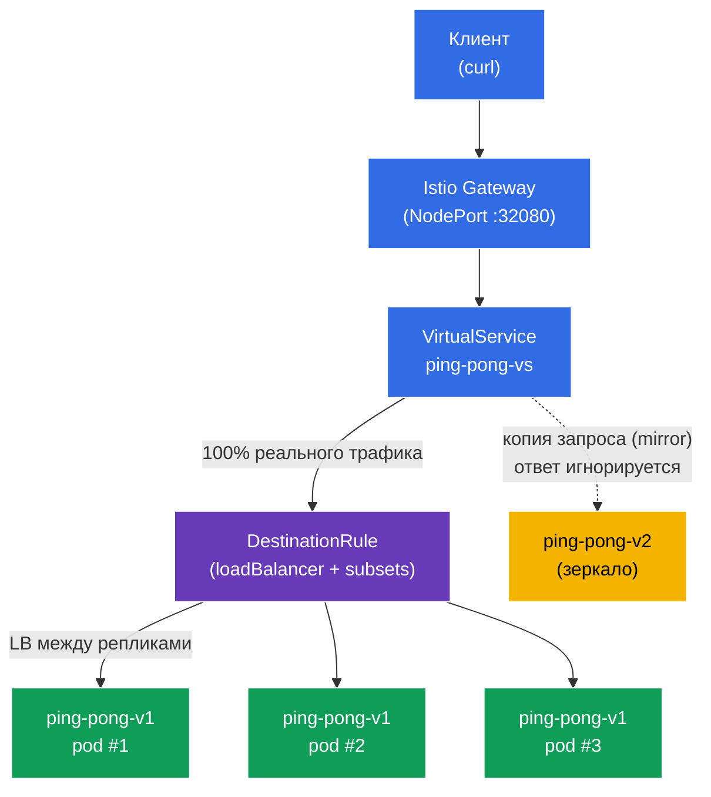

[Eng version](README.MD) · [Versión en español](README_ES.MD) · [Version française](README_FR.MD) · [Deutsche Version](README_DE.MD)

# Lab 06 - Load Balancing + Traffic Mirroring

Представьте: у вас есть сервис `ping-pong` с тремя репликами стабильной версии **v1** и новой версией **v2**, которую вы хотите обкатать. Возникают два вопроса. Первый - **как именно** трафик распределяется между репликами и можно ли это настроить (round-robin, наименее загруженный и т.д.). Второй - как протестировать **v2** на реальном «боевом» трафике, **не рискуя** при этом пользователями.

Istio решает обе задачи на уровне инфраструктуры:
- **Load Balancing** (`DestinationRule`) - выбор алгоритма балансировки между эндпоинтами сервиса, в том числе с переопределением на уровне отдельного порта.
- **Traffic Mirroring** (зеркалирование) - Envoy отправляет **копию** запроса на вторую версию (v2), при этом ответ от неё игнорируется. Клиент всегда получает ответ от v1, а v2 «видит» реальный трафик в режиме теневого запуска.

### Как это работает (общая схема)



## Цель

- Настроить алгоритм балансировки нагрузки через `DestinationRule`, включая переопределение на уровне порта.
- Зеркалировать боевой трафик на новую версию `v2` через `VirtualService` (`mirror`), не затрагивая ответы клиенту.

## Шаг 1. Включение sidecar-инъекции

```bash
kubectl label namespace default istio-injection=enabled --overwrite
```

Sidecar `istio-proxy` (Envoy) в каждом поде - это то, что реализует и балансировку, и зеркалирование. Без него `DestinationRule` и `mirror` работать не будут.

## Шаг 2. Установка приложения

Разворачиваем один Service `ping-pong` и два Deployment: **v1** (3 реплики, стабильная) и **v2** (1 реплика, новая).

```bash
kubectl apply -f https://raw.githubusercontent.com/ViktorUJ/cks/refs/heads/master/tasks/ica/labs/06/k8s-1/scripts/1.yaml
kubectl rollout restart deployment -n default
```

**Важная деталь:** у каждого пода переменная `SERVER_NAME` берётся из имени пода (через downward API), поэтому в ответе сервиса в поле `Server Name` будет видно **имя конкретной реплики**. Это позволит наглядно наблюдать и балансировку (разные поды v1), и зеркалирование (v2 не появляется в ответах клиенту).

```bash
kubectl get pods -n default -l app=ping-pong
```

```
NAME                            READY   STATUS    RESTARTS   AGE
ping-pong-v1-6c8f...-aaaaa      2/2     Running   0          30s
ping-pong-v1-6c8f...-bbbbb      2/2     Running   0          30s
ping-pong-v1-6c8f...-ccccc      2/2     Running   0          30s
ping-pong-v2-7d9a...-ddddd      2/2     Running   0          30s
```

## Шаг 3. Точка входа: Gateway и VirtualService

Создаём вход и направляем весь трафик на subset `v1`.

```bash
vim gateway.yaml
```

```yaml
apiVersion: networking.istio.io/v1
kind: Gateway
metadata:
  name: main-gateway
  namespace: default
spec:
  selector:
    istio: ingressgateway
  servers:
  - port:
      number: 80
      name: http
      protocol: HTTP
    hosts:
    - "myapp.local"
---
apiVersion: networking.istio.io/v1
kind: VirtualService
metadata:
  name: ping-pong-vs
  namespace: default
spec:
  hosts:
  - "myapp.local"
  - "ping-pong"
  gateways:
  - main-gateway
  - mesh
  http:
  - route:
    - destination:
        host: ping-pong
        subset: v1
```

```bash
kubectl apply -f gateway.yaml
```

## Шаг 4. Load Balancing - алгоритм ROUND_ROBIN

`DestinationRule` задаёт, как трафик распределяется между эндпоинтами (подами) сервиса. Поле `trafficPolicy.loadBalancer.simple` выбирает алгоритм. Начнём с `ROUND_ROBIN`.

```bash
vim destination-rule.yaml
```

```yaml
apiVersion: networking.istio.io/v1
kind: DestinationRule
metadata:
  name: ping-pong-dr
  namespace: default
spec:
  host: ping-pong
  trafficPolicy:
    loadBalancer:
      simple: ROUND_ROBIN       # глобальный алгоритм для сервиса
  subsets:
  - name: v1
    labels:
      version: v1
  - name: v2
    labels:
      version: v2
```

```bash
kubectl apply -f destination-rule.yaml
```

**Разбор:**
- **`loadBalancer.simple`** - встроенные алгоритмы балансировки:
  - `ROUND_ROBIN` - по очереди по кругу (по умолчанию);
  - `LEAST_REQUEST` - на реплику с наименьшим числом активных запросов (часто эффективнее round-robin);
  - `RANDOM` - случайный выбор;
  - `PASSTHROUGH` - без балансировки, на исходный адрес.
- **`subsets`** - логические группы подов (`v1`, `v2`) по лейблу `version`; на них ссылаются `VirtualService` (маршрут и mirror).

Смотрим распределение по трём репликам v1:

```bash
for i in $(seq 12); do curl -s http://myapp.local:32080 | grep 'Server Name'; done | sort | uniq -c
```

```
      4 Server Name: ping-pong-v1-6c8f...-aaaaa
      4 Server Name: ping-pong-v1-6c8f...-bbbbb
      4 Server Name: ping-pong-v1-6c8f...-ccccc
```

При `ROUND_ROBIN` трафик распределяется примерно поровну между тремя подами v1. Версия v2 в ответах не появляется - на неё пока ничего не направлено.

## Шаг 5. Port-level override - балансировка на уровне порта

`portLevelSettings` позволяет переопределить алгоритм балансировки для конкретного порта. Это полезно, когда у сервиса несколько портов с разными требованиями (например, в задаче экзамена: глобально `ROUND_ROBIN`, а для `443` - `LEAST_CONN`).

Обновляем `DestinationRule`, добавляя переопределение для порта `8080` на `LEAST_REQUEST`:

```yaml
apiVersion: networking.istio.io/v1
kind: DestinationRule
metadata:
  name: ping-pong-dr
  namespace: default
spec:
  host: ping-pong
  trafficPolicy:
    loadBalancer:
      simple: ROUND_ROBIN       # глобальный алгоритм (для всех остальных портов)
    portLevelSettings:
    - port:
        number: 8080
      loadBalancer:
        simple: LEAST_REQUEST   # переопределение именно для порта 8080
  subsets:
  - name: v1
    labels:
      version: v1
  - name: v2
    labels:
      version: v2
```

```bash
kubectl apply -f destination-rule.yaml
```

**Что изменилось:** для порта `8080` (а это наш HTTP-порт) теперь действует `LEAST_REQUEST` - Envoy отправляет запрос на реплику с наименьшим числом активных запросов. Глобальный `ROUND_ROBIN` остаётся для всех прочих портов. Поэтому при повторной проверке распределение уже не обязательно ровно `4/4/4` - оно подстраивается под загрузку реплик:

```bash
for i in $(seq 12); do curl -s http://myapp.local:32080 | grep 'Server Name'; done | sort | uniq -c
```

```
      3 Server Name: ping-pong-v1-6c8f...-aaaaa
      2 Server Name: ping-pong-v1-6c8f...-bbbbb
      7 Server Name: ping-pong-v1-6c8f...-ccccc
```

Главное - переопределение применяется именно к указанному порту, а не ко всему сервису.

## Шаг 6. Traffic Mirroring - зеркалируем трафик на v2

Теперь включим теневой запуск: 100% реальных запросов по-прежнему обслуживает v1, но Envoy дополнительно отправляет **копию** каждого запроса на v2. Ответ от v2 **отбрасывается** - клиент его никогда не видит.

Обновляем `VirtualService`, добавляя блок `mirror`:

```bash
vim mirror-vs.yaml
```

```yaml
apiVersion: networking.istio.io/v1
kind: VirtualService
metadata:
  name: ping-pong-vs
  namespace: default
spec:
  hosts:
  - "myapp.local"
  - "ping-pong"
  gateways:
  - main-gateway
  - mesh
  http:
  - route:
    - destination:
        host: ping-pong
        subset: v1          # 100% ответов клиенту - от v1
    mirror:
      host: ping-pong
      subset: v2            # копия каждого запроса уходит на v2
    mirrorPercentage:
      value: 100.0          # доля зеркалируемого трафика
```

```bash
kubectl apply -f mirror-vs.yaml
```

**Разбор блока `mirror`:**
- **`route.destination`** - основной маршрут. Клиент получает ответ **только** отсюда (subset v1).
- **`mirror`** - куда отправлять копию запроса (subset v2). Это «fire-and-forget»: Envoy не ждёт и не использует ответ зеркала.
- **`mirrorPercentage.value`** - какая доля запросов зеркалируется (здесь 100%). Можно поставить, например, `25.0`, чтобы дублировать лишь четверть боевого трафика.

**Зачем это нужно:** вы прогоняете реальную нагрузку через v2 и смотрите её метрики, логи, ошибки - но без какого-либо риска для пользователей. Если v2 упадёт или начнёт ошибаться, клиенты этого не заметят.

## Шаг 7. Проверка

### Клиент всегда получает v1

```bash
for i in $(seq 10); do curl -s http://myapp.local:32080 | grep 'Server Name'; done
```

```
Server Name   : ping-pong-v1-6c8f...-aaaaa
Server Name   : ping-pong-v1-6c8f...-bbbbb
...
```

В ответах - только поды `v1`. Версия `v2` не появляется ни разу, хотя трафик на неё идёт.

### Убеждаемся, что v2 реально получает зеркальный трафик

Смотрим счётчик входящих запросов на Envoy-прокси внутри пода v2:

```bash
kubectl exec -n default deploy/ping-pong-v2 -c istio-proxy -- \
  pilot-agent request GET stats | grep istio_requests_total | grep destination_workload.ping-pong-v2
```

```
istiocustom.istio_requests_total.<...>.destination_workload.ping-pong-v2.<...>.response_code.200<...>: 40
```

Счётчик растёт по мере поступления запросов - значит зеркальный трафик действительно доходит до v2, хотя клиент об этом не подозревает.

## Итог

| Механизм | Ресурс | Что сделали | Результат |
|----------|--------|-------------|-----------|
| Load Balancing | `DestinationRule` (`loadBalancer.simple`) | Задали алгоритм + переопределение на порт | контролируемое распределение по репликам |
| Traffic Mirroring | `VirtualService` (`mirror` + `mirrorPercentage`) | Зеркалируем боевой трафик на v2 | v2 тестируется на реальной нагрузке без риска |

**Ключевой вывод:**
- **DestinationRule** определяет политику балансировки: какой алгоритм и (при необходимости) с переопределением на уровне порта - это про то, **как** трафик делится между эндпоинтами.
- **Traffic Mirroring** даёт безопасный способ проверить новую версию на боевом трафике: клиент всегда работает со стабильной v1, а v2 получает «тень» реальных запросов с отброшенным ответом.

Оба механизма работают исключительно на уровне Envoy - без единой строчки изменений в коде приложения.
