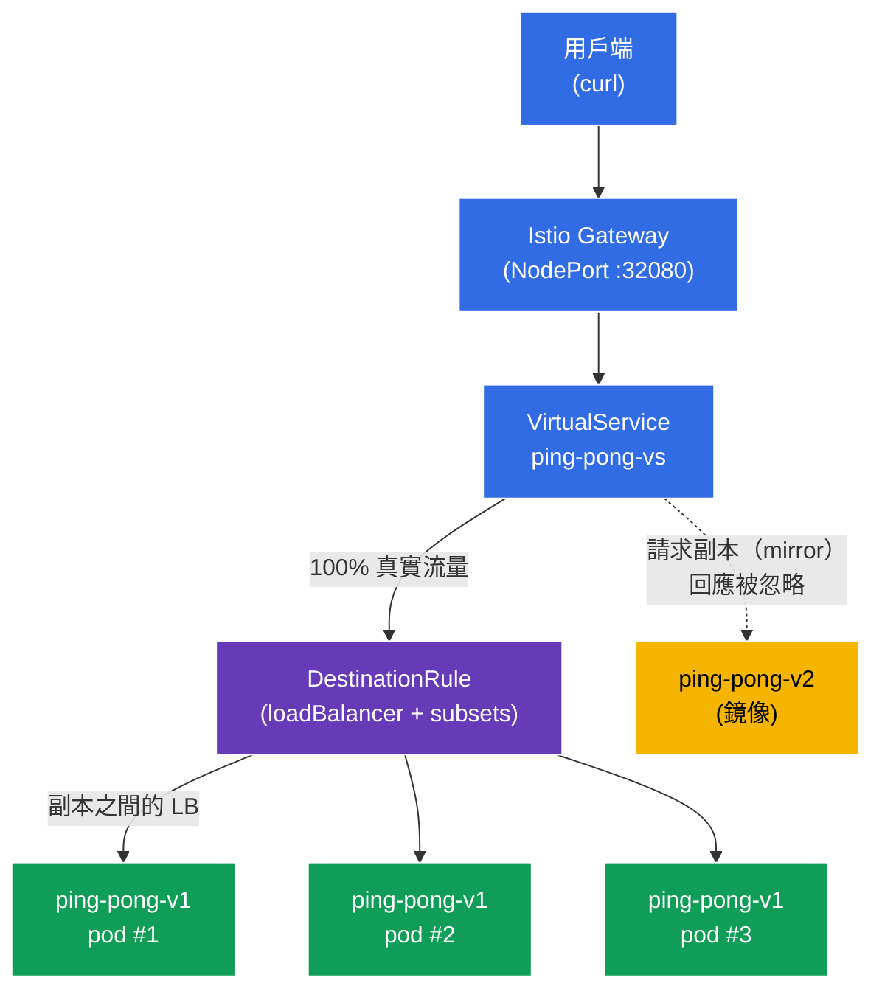

[Русская версия](README_RU.MD) · [Eng version](README.MD) · [Versión en español](README_ES.MD) · [Version française](README_FR.MD) · [Deutsche Version](README_DE.MD) · [ქართული ვერსია](README_GE.MD) · [日本語版](README_JP.MD)

# Lab 06 - 負載平衡 + 流量鏡像

> [參考解答](worker/files/solutions/1_TW.MD)

想像一下：您有一個服務 `ping-pong`，其中包含三個穩定版本 **v1** 的副本，以及一個想要逐步測試的新版本 **v2**。這會產生兩個問題。第一，流量**具體如何**在副本間分配，以及是否能設定它（round-robin、最少負載等）。第二，如何在**不讓**使用者承擔風險的前提下，以真實的「正式環境」流量測試 **v2**。

Istio 在基礎設施層面解決這兩項問題：
- **負載平衡** (`DestinationRule`)：選擇服務端點間的平衡演算法，也能在個別連接埠層級覆寫。
- **流量鏡像**（mirroring）：Envoy 將請求的**副本**傳送至第二個版本（v2），並忽略其回應。用戶端始終收到來自 v1 的回應，而 v2 則以影子執行模式「看到」真實流量。

### 運作方式（整體架構）



## 基礎設施

環境透過 Terragrunt 在 AWS (`eu-north-1`) 中部署，包含：

| 元件 | 說明 |
|------|------|
| `vpc` | 含公有子網路的 VPC `10.10.0.0/16` |
| `ssh-keys` | 用於存取節點的 SSH 金鑰 |
| `k8s-1` | 已安裝 Istio 的 Kubernetes `1.35.2` (kubeadm) |
| `worker` | 配備 `kubectl` 並可存取叢集的工作機器 |

執行個體：`t4g.medium`（master）Ubuntu `22.04`

## 部署

```bash
TASK=06 make run_ica_task
```

## 目標

- 透過 `DestinationRule` 設定負載平衡演算法，包括連接埠層級覆寫。
- 透過 `VirtualService` (`mirror`) 將正式流量鏡像至新版本 `v2`，而不影響用戶端回應。

## 步驟 1：啟用 sidecar 注入

```bash
kubectl label namespace default istio-injection=enabled --overwrite
```

每個 pod 中的 sidecar `istio-proxy` (Envoy) 負責實作負載平衡與鏡像。沒有它，`DestinationRule` 和 `mirror` 都不會運作。

## 步驟 2：安裝應用程式

部署一個 Service `ping-pong` 和兩個 Deployment：**v1**（3 個副本，穩定版）及 **v2**（1 個副本，新版）。

```bash
kubectl apply -f https://raw.githubusercontent.com/ViktorUJ/cks/refs/heads/master/tasks/ica/labs/06/k8s-1/scripts/1.yaml
kubectl rollout restart deployment -n default
```

**重要細節：**每個 pod 的 `SERVER_NAME` 變數皆取自 pod 名稱（透過 downward API），因此服務回應的 `Server Name` 欄位會顯示**特定副本的名稱**。這可讓您清楚觀察負載平衡（不同的 v1 pod）與鏡像（v2 不會出現在用戶端回應中）。

```bash
kubectl get pods -n default -l app=ping-pong
```

```
NAME                            READY   STATUS    RESTARTS   AGE
ping-pong-v1-6c8f...-aaaaa      2/2     Running   0          30s
ping-pong-v1-6c8f...-bbbbb      2/2     Running   0          30s
ping-pong-v1-6c8f...-ccccc      2/2     Running   0          30s
ping-pong-v2-7d9a...-ddddd      2/2     Running   0          30s
```

## 步驟 3：進入點：Gateway 與 VirtualService

建立入口，並將所有流量導向 subset `v1`。

```bash
vim gateway.yaml
```

```yaml
apiVersion: networking.istio.io/v1
kind: Gateway
metadata:
  name: main-gateway
  namespace: default
spec:
  selector:
    istio: ingressgateway
  servers:
  - port:
      number: 80
      name: http
      protocol: HTTP
    hosts:
    - "myapp.local"
---
apiVersion: networking.istio.io/v1
kind: VirtualService
metadata:
  name: ping-pong-vs
  namespace: default
spec:
  hosts:
  - "myapp.local"
  - "ping-pong"
  gateways:
  - main-gateway
  - mesh
  http:
  - route:
    - destination:
        host: ping-pong
        subset: v1
```

```bash
kubectl apply -f gateway.yaml
```

## 步驟 4：負載平衡：ROUND_ROBIN 演算法

`DestinationRule` 定義流量如何在服務端點（pod）間分配。`trafficPolicy.loadBalancer.simple` 欄位選擇演算法。先從 `ROUND_ROBIN` 開始。

```bash
vim destination-rule.yaml
```

```yaml
apiVersion: networking.istio.io/v1
kind: DestinationRule
metadata:
  name: ping-pong-dr
  namespace: default
spec:
  host: ping-pong
  trafficPolicy:
    loadBalancer:
      simple: ROUND_ROBIN       # 服務的全域演算法
  subsets:
  - name: v1
    labels:
      version: v1
  - name: v2
    labels:
      version: v2
```

```bash
kubectl apply -f destination-rule.yaml
```

**說明：**
- **`loadBalancer.simple`**：內建負載平衡演算法：
  - `ROUND_ROBIN`：依序循環（預設）；
  - `LEAST_REQUEST`：傳送至作用中請求數最少的副本（通常比 round-robin 更有效）；
  - `RANDOM`：隨機選擇；
  - `PASSTHROUGH`：不進行負載平衡，傳送至原始位址。
- **`subsets`**：依 `version` 標籤區分的 pod 邏輯群組（`v1`、`v2`）；`VirtualService` 會參照它們（路由和 mirror）。

查看 v1 三個副本之間的分配：

```bash
for i in $(seq 12); do curl -s http://myapp.local:32080 | grep 'Server Name'; done | sort | uniq -c
```

```
      4 Server Name: ping-pong-v1-6c8f...-aaaaa
      4 Server Name: ping-pong-v1-6c8f...-bbbbb
      4 Server Name: ping-pong-v1-6c8f...-ccccc
```

使用 `ROUND_ROBIN` 時，流量會大致平均分配至三個 v1 pod。v2 版本不會出現在回應中，因為目前尚未有任何流量被導向它。

## 步驟 5：Port-level override：連接埠層級的負載平衡

`portLevelSettings` 可針對特定連接埠覆寫負載平衡演算法。當服務有多個連接埠且各自有不同需求時，這很有用（例如考試題目：全域使用 `ROUND_ROBIN`，但 `443` 使用 `LEAST_CONN`）。

更新 `DestinationRule`，為連接埠 `8080` 新增 `LEAST_REQUEST` 覆寫：

```yaml
apiVersion: networking.istio.io/v1
kind: DestinationRule
metadata:
  name: ping-pong-dr
  namespace: default
spec:
  host: ping-pong
  trafficPolicy:
    loadBalancer:
      simple: ROUND_ROBIN       # 全域演算法 (適用於其餘所有連接埠)
    portLevelSettings:
    - port:
        number: 8080
      loadBalancer:
        simple: LEAST_REQUEST   # 專門針對連接埠 8080 的覆寫
  subsets:
  - name: v1
    labels:
      version: v1
  - name: v2
    labels:
      version: v2
```

```bash
kubectl apply -f destination-rule.yaml
```

**變更內容：**連接埠 `8080`（即我們的 HTTP 連接埠）現在使用 `LEAST_REQUEST`：Envoy 會將請求傳送至作用中請求數最少的副本。全域 `ROUND_ROBIN` 仍適用於其他所有連接埠。因此，重複檢查時，分配不一定恰好是 `4/4/4`，而會根據副本負載調整：

```bash
for i in $(seq 12); do curl -s http://myapp.local:32080 | grep 'Server Name'; done | sort | uniq -c
```

```
      3 Server Name: ping-pong-v1-6c8f...-aaaaa
      2 Server Name: ping-pong-v1-6c8f...-bbbbb
      7 Server Name: ping-pong-v1-6c8f...-ccccc
```

重點是，覆寫僅套用至指定連接埠，而不是整個服務。

## 步驟 6：流量鏡像：將流量鏡像至 v2

現在啟用影子執行：100% 的真實請求仍由 v1 處理，但 Envoy 會額外將每個請求的**副本**傳送至 v2。來自 v2 的回應會被**丟棄**，用戶端永遠不會看到它。

更新 `VirtualService`，新增 `mirror` 區塊：

```bash
vim mirror-vs.yaml
```

```yaml
apiVersion: networking.istio.io/v1
kind: VirtualService
metadata:
  name: ping-pong-vs
  namespace: default
spec:
  hosts:
  - "myapp.local"
  - "ping-pong"
  gateways:
  - main-gateway
  - mesh
  http:
  - route:
    - destination:
        host: ping-pong
        subset: v1          # 回應用戶端的 100% 來自 v1
    mirror:
      host: ping-pong
      subset: v2            # 每個請求的複本會送往 v2
    mirrorPercentage:
      value: 100.0          # 鏡像流量的比例
```

```bash
kubectl apply -f mirror-vs.yaml
```

**`mirror` 區塊說明：**
- **`route.destination`**：主要路由。用戶端**僅**從此處取得回應（subset v1）。
- **`mirror`**：傳送請求副本的位置（subset v2）。這是「fire-and-forget」：Envoy 不會等待或使用鏡像的回應。
- **`mirrorPercentage.value`**：要鏡像的請求比例（此處為 100%）。例如可設為 `25.0`，僅複製四分之一的正式流量。

**用途：**您讓 v2 處理真實負載，並查看其指標、日誌和錯誤，但不會對使用者造成任何風險。若 v2 當機或開始出錯，用戶端不會察覺。

## 步驟 7：驗證

### 用戶端始終取得 v1

```bash
for i in $(seq 10); do curl -s http://myapp.local:32080 | grep 'Server Name'; done
```

```
Server Name   : ping-pong-v1-6c8f...-aaaaa
Server Name   : ping-pong-v1-6c8f...-bbbbb
...
```

回應中僅有 `v1` pod。雖然流量會傳送至 `v2`，但 v2 一次也不會出現。

### 確認 v2 確實收到鏡像流量

查看 v2 pod 內 Envoy proxy 的傳入請求計數器：

```bash
kubectl exec -n default deploy/ping-pong-v2 -c istio-proxy -- \
  pilot-agent request GET stats | grep istio_requests_total | grep destination_workload.ping-pong-v2
```

```
istiocustom.istio_requests_total.<...>.destination_workload.ping-pong-v2.<...>.response_code.200<...>: 40
```

此計數器會隨著請求到達而增加，代表鏡像流量確實抵達 v2，儘管用戶端並不知情。

## 總結

| 機制 | 資源 | 執行內容 | 結果 |
|------|------|----------|------|
| 負載平衡 | `DestinationRule` (`loadBalancer.simple`) | 設定演算法 + 連接埠覆寫 | 可控的副本間分配 |
| 流量鏡像 | `VirtualService` (`mirror` + `mirrorPercentage`) | 將正式流量鏡像至 v2 | 在無風險下以真實負載測試 v2 |

**關鍵結論：**
- **DestinationRule** 定義負載平衡策略：使用何種演算法，以及（必要時）連接埠層級覆寫；也就是流量**如何**在端點間分配。
- **Traffic Mirroring** 提供安全的方法，使用正式流量驗證新版本：用戶端始終使用穩定的 v1，而 v2 會收到真實請求的「影子」，且其回應會被丟棄。

兩種機制都完全在 Envoy 層級運作，不需要對應用程式碼做任何修改。