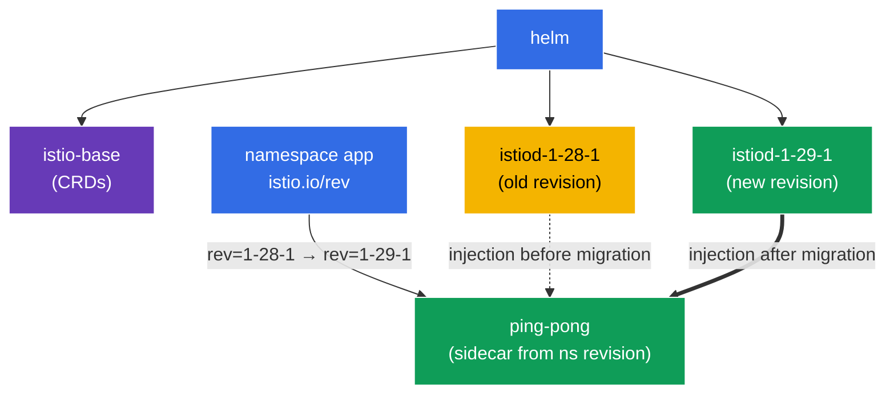

[RU version](README_RU.MD) · [Versión en español](README_ES.MD)

# Lab 07 - Helm install + Canary upgrade with revisions

Imagine you own a production cluster already running Istio. A new version is released and you need to upgrade the control plane **with no downtime and with a way to roll back**. Just "delete the old one and install the new" is too risky: if the new istiod turns out to be incompatible, the whole mesh goes down. The right approach is a **canary upgrade**: a new control plane (a different *revision*) is deployed alongside the old one, then namespaces are moved to it one by one with a pod restart. If something goes wrong - just flip the label back.

In this lab we:
1. install Istio **via Helm** (not istioctl), specifying a revision;
2. perform a **canary upgrade** to a new version: deploy a second istiod revision next to the old one and migrate the application, without touching any code.

> Unlike the previous labs, Istio is **not pre-installed** here - installing it is the task.

### How It Works (High-Level Overview)



## Objective

- Install Istio via the Helm charts (`istio/base` + `istio/istiod`), specifying a revision.
- Perform a canary upgrade: deploy a second istiod revision and migrate the namespace to it via the `istio.io/rev` label.

Versions used in this lab:
- **old**: Istio `1.28.1`, revision `1-28-1`;
- **new**: Istio `1.29.1`, revision `1-29-1`.

## What is a revision?

A **revision** is a named instance of the control plane (istiod). Each revision has its own `istiod-<revision>` Deployment and its own mutating webhook for sidecar injection. A namespace chooses which revision injects its pods via the `istio.io/rev=<revision>` label. This is exactly what lets you run **two Istio versions at once** and shift workloads between them - the foundation of a canary upgrade.

## Step 1. Add the Istio Helm Repository

```bash
helm repo add istio https://istio-release.storage.googleapis.com/charts
helm repo update
```

## Step 2. Install Istio via Helm (old revision)

Istio in Helm consists of two core charts:
- **`istio/base`** - CRDs and cluster-wide resources (installed once, shared by all revisions);
- **`istio/istiod`** - the control plane itself; the `--set revision=<rev>` flag creates a revisioned istiod.

```bash
kubectl create namespace istio-system

helm install istio-base istio/base -n istio-system --version 1.28.1 --set defaultRevision=1-28-1

helm install istiod-1-28-1 istio/istiod -n istio-system --version 1.28.1 --set revision=1-28-1 --wait
```

Verify the control plane came up:

```bash
kubectl get pods -n istio-system
```

```
NAME                              READY   STATUS    RESTARTS   AGE
istiod-1-28-1-xxxxxxxxxx-xxxxx    1/1     Running   0          40s
```

**What to notice:** the Deployment is named `istiod-1-28-1` - the name carries the revision. That's what distinguishes a revisioned install from a "plain" one (where istiod is just `istiod`).

## Step 3. Deploy the App on the Old Revision

With a revisioned install, the namespace is labelled with `istio.io/rev=<revision>` rather than `istio-injection=enabled` - this explicitly says which control plane injects the sidecar.

```bash
kubectl create namespace app
kubectl label namespace app istio.io/rev=1-28-1

kubectl apply -f https://raw.githubusercontent.com/ViktorUJ/cks/refs/heads/master/tasks/ica/labs/07/k8s-1/scripts/1.yaml
kubectl rollout restart deployment -n app
```

Confirm the sidecar was injected by revision `1-28-1` - check the `istio-proxy` image version:

```bash
kubectl get pods -n app -o jsonpath='{range .items[*]}{.metadata.name}{"  "}{.spec.initContainers[*].image}{"\n"}{end}'
```

```
ping-pong-xxxx  docker.io/istio/proxyv2:1.28.1
ping-pong-yyyy  docker.io/istio/proxyv2:1.28.1
```

The proxy version is `1.28.1`. The application runs on the old revision.

## Step 4. Canary - Install the New Revision Alongside the Old One

Now the heart of a canary upgrade: the new control plane is deployed **next to** the old one, leaving it untouched. First upgrade the shared CRDs (`istio-base`) to the new version, then install the second istiod revision.

```bash
# upgrade the shared CRDs to the new version first
helm upgrade istio-base istio/base -n istio-system --version 1.29.1 --set defaultRevision=1-28-1

# install the new istiod revision (the old one keeps running)
helm install istiod-1-29-1 istio/istiod -n istio-system --version 1.29.1 --set revision=1-29-1 --wait
```

Now the cluster runs **two control-plane revisions** at once:

```bash
kubectl get pods -n istio-system
```

```
NAME                              READY   STATUS    RESTARTS   AGE
istiod-1-28-1-xxxxxxxxxx-xxxxx    1/1     Running   0          5m
istiod-1-29-1-yyyyyyyyyy-yyyyy    1/1     Running   0          30s
```

**Important:** the application in namespace `app` is **untouched** so far - its pods still use the `1-28-1` sidecar. Installing a new revision does not migrate anything on its own. That's the safety of canary: the new control plane is ready, but no traffic has moved to it yet.

## Step 5. Migrate the App to the New Revision

Switch the namespace to the new revision (change the label) and restart the pods - on recreation they get a sidecar from `1-29-1`.

```bash
kubectl label namespace app istio.io/rev=1-29-1 --overwrite
kubectl rollout restart deployment -n app
```

Check the proxy version after migration:

```bash
kubectl get pods -n app -o jsonpath='{range .items[*]}{.metadata.name}{"  "}{.spec.initContainers[*].image}{"\n"}{end}'
```

```
ping-pong-aaaa  docker.io/istio/proxyv2:1.29.1
ping-pong-bbbb  docker.io/istio/proxyv2:1.29.1
```

The proxy version is now `1.29.1` - the application has successfully moved to the new control plane. If the new version misbehaved, we'd simply set the label back to `istio.io/rev=1-28-1` and restart the pods - an instant rollback.

## Step 6. (optional) Remove the Old Revision

Once you've confirmed everything works on the new revision, the old control plane can be removed:

```bash
helm uninstall istiod-1-28-1 -n istio-system
```

## Step 7. Verification

```bash
helm list -n istio-system
kubectl get ns app --show-labels | grep 1-29-1
kubectl get pods -n app -o jsonpath='{range .items[*]}{.spec.initContainers[*].image}{"\n"}{end}' | grep 1.29.1
```

## Step 8. Alternative - In-Place upgrade

Canary upgrades via revisions are the safest path, but Istio also supports an **in-place upgrade**: upgrading the same istiod "in place", **without** a second revision. The trade-off: all proxies switch to the new version at once (after pods restart), and rollback is via `helm rollback` rather than flipping a label.

An in-place upgrade is a `helm upgrade` of the same istiod release (installed **without** `revision`; the namespace uses the plain `istio-injection=enabled` label):

```bash
# base install without a revision
helm install istio-base istio/base -n istio-system --version 1.28.1
helm install istiod istio/istiod -n istio-system --version 1.28.1 --wait
kubectl label namespace app istio-injection=enabled --overwrite

# ... later: upgrade the CRDs and istiod IN PLACE to the new version
helm upgrade istio-base istio/base -n istio-system --version 1.29.1
helm upgrade istiod    istio/istiod -n istio-system --version 1.29.1 --wait

# restart the data plane so pods pick up the new sidecar
kubectl rollout restart deployment -n app
```

**Canary vs In-Place:**

| | Canary (revisions) | In-Place |
|---|---|---|
| Second control plane | yes, alongside | no |
| Traffic cutover | per namespace, gradual | all at once |
| Rollback | flip the `istio.io/rev` label | `helm rollback` |
| Risk | lower | higher |

istioctl equivalent: `istioctl upgrade` - upgrades a non-revisioned installation in place.

## Summary

| Step | What we did | Tool |
|------|-------------|------|
| Install | `istio/base` + `istiod` revision `1-28-1` | Helm |
| Deploy | namespace `app` labelled `istio.io/rev=1-28-1` | kubectl |
| Canary | second revision `1-29-1` alongside the old one | Helm |
| Migrate | change the namespace label + `rollout restart` | kubectl |

**Key takeaway:**
- **Helm** gives a declarative, versioned install of Istio: `base` (CRDs) separately, `istiod` separately, with an explicit chart version and revision.
- **Revisions** (`revision` + the `istio.io/rev` label) are the canary-upgrade mechanism: two control planes coexist, and namespaces are switched between them one at a time. Installing a new revision is safe (nothing migrates automatically), and rolling back is just flipping the label and restarting the pods.
