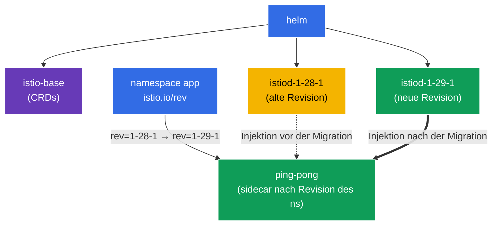

[RU version](README_RU.MD) · [Eng version](README.MD) · [Versión en español](README_ES.MD) · [Version française](README_FR.MD)

# Lab 07 - Installation von Istio über Helm + Canary-Upgrade mit Revisionen

Stellen Sie sich vor: Sie sind für einen Production-Cluster verantwortlich, in dem Istio bereits läuft. Es erscheint eine neue Version, und Sie müssen den Control Plane **ohne Ausfallzeit und mit Rollback-Möglichkeit** aktualisieren. Einfach "abreißen und den neuen aufsetzen" ist zu riskant: Wenn der neue istiod inkompatibel ist, fällt das gesamte mesh aus. Der richtige Ansatz ist ein **Canary-Upgrade**: Neben dem alten Control Plane wird ein neuer bereitgestellt (eine andere *Revision*), anschließend werden die Namespaces einer nach dem anderen mit einem Neustart der Pods auf ihn umgestellt. Wenn etwas schiefgeht - setzen wir das Label einfach zurück.

In dieser Übung werden wir:
1. Istio **über Helm** (und nicht istioctl) mit Angabe einer Revision installieren;
2. ein **Canary-Upgrade** auf eine neue Version durchführen: eine zweite istiod-Revision neben der alten bereitstellen und die Anwendung migrieren, ohne den Code anzufassen.

> Im Unterschied zu den vorherigen Labs ist Istio hier im Cluster **nicht vorinstalliert** - die Installation ist Teil der Aufgabe.

### Wie es funktioniert (Gesamtschema)



## Ziel

- Istio über Helm-Charts (`istio/base` + `istio/istiod`) mit Angabe einer Revision installieren.
- Ein Canary-Upgrade durchführen: eine zweite istiod-Revision bereitstellen und den Namespace über das Label `istio.io/rev` auf sie umstellen.

In der Lab werden folgende Versionen verwendet:
- **alt**: Istio `1.28.1`, Revision `1-28-1`;
- **neu**: Istio `1.29.1`, Revision `1-29-1`.

## Was eine Revision (revision) ist

Eine **Revision** ist eine benannte Instanz des Control Plane (istiod). Jede Revision hat ihr eigenes Deployment `istiod-<revision>` und ihren eigenen Mutating Webhook für die Sidecar-Injektion. Der Namespace wählt über das Label `istio.io/rev=<revision>` aus, mit welcher Revision seine Pods "verdrahtet" werden. Genau das erlaubt es, **zwei Istio-Versionen gleichzeitig** zu betreiben und die Last zwischen ihnen umzuschalten - die Grundlage des Canary-Upgrades.

## Schritt 1. Wir fügen das Helm-Repository von Istio hinzu

```bash
helm repo add istio https://istio-release.storage.googleapis.com/charts
helm repo update
```

## Schritt 2. Installation von Istio über Helm (alte Revision)

Istio besteht in Helm aus zwei Basis-Charts:
- **`istio/base`** - CRDs und Cluster-Ressourcen (wird einmal installiert, gemeinsam für alle Revisionen);
- **`istio/istiod`** - der Control Plane selbst; mit dem Flag `--set revision=<rev>` wird ein revisioniertes istiod erstellt.

```bash
kubectl create namespace istio-system

helm install istio-base istio/base -n istio-system --version 1.28.1 --set defaultRevision=1-28-1

helm install istiod-1-28-1 istio/istiod -n istio-system --version 1.28.1 --set revision=1-28-1 --wait
```

Wir überprüfen, dass der Control Plane gestartet ist:

```bash
kubectl get pods -n istio-system
```

```
NAME                              READY   STATUS    RESTARTS   AGE
istiod-1-28-1-xxxxxxxxxx-xxxxx    1/1     Running   0          40s
```

**Worauf zu achten ist:** Das Deployment heißt `istiod-1-28-1` - der Name enthält die Revision. Das unterscheidet die revisionierte Installation von der "gewöhnlichen" (bei der istiod einfach `istiod` heißt).

## Schritt 3. Wir stellen die Anwendung auf der alten Revision bereit

Bei einer revisionierten Installation wird der Namespace nicht mit `istio-injection=enabled`, sondern mit `istio.io/rev=<revision>` gekennzeichnet - so geben wir explizit an, welcher Control Plane den Sidecar injiziert.

```bash
kubectl create namespace app
kubectl label namespace app istio.io/rev=1-28-1

kubectl apply -f https://raw.githubusercontent.com/ViktorUJ/cks/refs/heads/master/tasks/ica/labs/07/k8s-1/scripts/1.yaml
kubectl rollout restart deployment -n app
```

Wir vergewissern uns, dass der Sidecar von der Revision `1-28-1` injiziert wurde - wir betrachten die Image-Version von `istio-proxy`:

```bash
kubectl get pods -n app -o jsonpath='{range .items[*]}{.metadata.name}{"  "}{.spec.initContainers[*].image}{"\n"}{end}'
```

```
ping-pong-xxxx  docker.io/istio/proxyv2:1.28.1
ping-pong-yyyy  docker.io/istio/proxyv2:1.28.1
```

Die Version des Proxys ist `1.28.1`. Die Anwendung läuft auf der alten Revision.

## Schritt 4. Canary - wir stellen die neue Revision neben die alte

Jetzt das Wichtigste beim Canary-Upgrade: Der neue Control Plane wird **neben** dem alten bereitgestellt, ohne ihn zu beeinträchtigen. Zuerst aktualisieren wir die gemeinsamen CRDs (`istio-base`) auf die neue Version, dann stellen wir die zweite istiod-Revision auf.

```bash
# Zuerst aktualisieren wir die gemeinsamen CRDs auf die neue Version
helm upgrade istio-base istio/base -n istio-system --version 1.29.1 --set defaultRevision=1-28-1

# Wir stellen die neue istiod-Revision auf (die alte läuft weiter)
helm install istiod-1-29-1 istio/istiod -n istio-system --version 1.29.1 --set revision=1-29-1 --wait
```

Jetzt sind im Cluster **zwei Control-Plane-Revisionen** gleichzeitig:

```bash
kubectl get pods -n istio-system
```

```
NAME                              READY   STATUS    RESTARTS   AGE
istiod-1-28-1-xxxxxxxxxx-xxxxx    1/1     Running   0          5m
istiod-1-29-1-yyyyyyyyyy-yyyyy    1/1     Running   0          30s
```

**Wichtig:** Die Anwendung im Namespace `app` ist bislang **nicht betroffen** - ihre Pods verwenden nach wie vor den Sidecar von `1-28-1`. Die Installation der neuen Revision migriert von sich aus nichts. Genau das ist die Sicherheit von Canary: Der neue Control Plane ist bereits bereit, aber die Last ist noch nicht auf ihn umgestellt.

## Schritt 5. Migration der Anwendung auf die neue Revision

Wir schalten den Namespace auf die neue Revision um (ändern das Label) und starten die Pods neu - bei der Neuerstellung erhalten sie den Sidecar bereits von `1-29-1`.

```bash
kubectl label namespace app istio.io/rev=1-29-1 --overwrite
kubectl rollout restart deployment -n app
```

Wir überprüfen die Version des Proxys nach der Migration:

```bash
kubectl get pods -n app -o jsonpath='{range .items[*]}{.metadata.name}{"  "}{.spec.initContainers[*].image}{"\n"}{end}'
```

```
ping-pong-aaaa  docker.io/istio/proxyv2:1.29.1
ping-pong-bbbb  docker.io/istio/proxyv2:1.29.1
```

Die Version des Proxys ist jetzt `1.29.1` - die Anwendung ist erfolgreich auf den neuen Control Plane umgezogen. Hätte sich die neue Version schlecht verhalten, würden wir einfach das Label `istio.io/rev=1-28-1` zurücksetzen und die Pods neu starten - ein sofortiges Rollback.

## Schritt 6. (optional) Löschen der alten Revision

Wenn Sie sich vergewissert haben, dass alles auf der neuen Revision funktioniert, kann der alte Control Plane gelöscht werden:

```bash
helm uninstall istiod-1-28-1 -n istio-system
```

## Schritt 7. Überprüfung

```bash
helm list -n istio-system
kubectl get ns app --show-labels | grep 1-29-1
kubectl get pods -n app -o jsonpath='{range .items[*]}{.spec.initContainers[*].image}{"\n"}{end}' | grep 1.29.1
```

## Schritt 8. Alternative - In-Place-Upgrade

Das Canary-Upgrade über Revisionen ist der sicherste Weg, aber Istio unterstützt auch ein **In-Place-Upgrade**: die Aktualisierung desselben istiod "vor Ort", **ohne** zweite Revision. Nachteil: Alle Proxies werden sofort auf die neue Version umgeschaltet (nach dem Neustart der Pods), und das Rollback erfolgt nicht durch einen Labelwechsel, sondern über `helm rollback`.

Ein In-Place-Upgrade erfolgt über `helm upgrade` desselben istiod-Release (wird **ohne** `revision` installiert, der Namespace wird mit dem gewöhnlichen `istio-injection=enabled` gekennzeichnet):

```bash
# Basisinstallation ohne Revision
helm install istio-base istio/base -n istio-system --version 1.28.1
helm install istiod istio/istiod -n istio-system --version 1.28.1 --wait
kubectl label namespace app istio-injection=enabled --overwrite

# ... später: wir aktualisieren CRDs und istiod VOR ORT auf die neue Version
helm upgrade istio-base istio/base -n istio-system --version 1.29.1
helm upgrade istiod    istio/istiod -n istio-system --version 1.29.1 --wait

# wir starten den data plane neu, damit die Pods den neuen sidecar erhalten
kubectl rollout restart deployment -n app
```

**Canary vs. In-Place:**

| | Canary (Revisionen) | In-Place |
|---|---|---|
| Zweiter Control Plane | ja, daneben | nein |
| Umschalten der Last | pro Namespace, schrittweise | sofort für alle |
| Rollback | Label `istio.io/rev` ändern | `helm rollback` |
| Risiko | geringer | höher |

Äquivalent über istioctl: `istioctl upgrade` - aktualisiert die Installation ohne Revision "vor Ort".

## Fazit

| Schritt | Was wir gemacht haben | Werkzeug |
|-----|-------------|-----------|
| Installation | `istio/base` + `istiod` der Revision `1-28-1` | Helm |
| Deployment | Namespace `app` mit dem Label `istio.io/rev=1-28-1` | kubectl |
| Canary | zweite Revision `1-29-1` neben der alten | Helm |
| Migration | Wechsel des Namespace-Labels + `rollout restart` | kubectl |

**Zentrale Erkenntnis:**
- **Helm** ergibt eine deklarative, versionierbare Installation von Istio: `base` (CRDs) separat, `istiod` separat, mit expliziter Angabe der Chart-Version und der Revision.
- **Revisionen** (`revision` + Label `istio.io/rev`) sind der Mechanismus des Canary-Upgrades: Zwei Control Planes koexistieren, und die Namespaces werden einer nach dem anderen zwischen ihnen umgeschaltet. Die Installation einer neuen Revision ist sicher (es wird nichts automatisch migriert), und das Rollback ist einfach das Zurücksetzen des Labels und ein Neustart der Pods.
