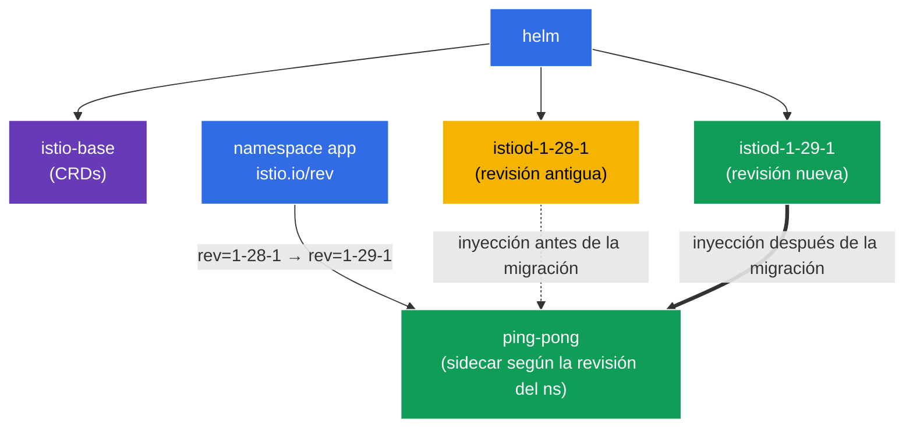

[RU version](README_RU.MD) · [Eng version](README.MD) · [Version française](README_FR.MD) · [Deutsche Version](README_DE.MD)

# Lab 07 - Instalación de Istio con Helm + Canary upgrade con revisiones

Imagina lo siguiente: eres responsable de un clúster de producción en el que ya funciona Istio. Sale una nueva versión y necesitas actualizar el control plane **sin tiempo de inactividad y con posibilidad de revertir**. Simplemente «tirarlo abajo y poner el nuevo» es demasiado arriesgado: si el nuevo istiod resulta incompatible, se cae toda la malla. El enfoque correcto es el **canary upgrade**: junto al control plane antiguo se despliega uno nuevo (otra *revisión*), y luego los namespaces se van pasando de uno en uno a él, reiniciando los pods. Si algo sale mal, simplemente devolvemos la etiqueta a su valor anterior.

En esta práctica vamos a:
1. instalar Istio **con Helm** (y no con istioctl) indicando la revisión;
2. realizar una **actualización canary** a una nueva versión: desplegar una segunda revisión de istiod junto a la antigua y migrar la aplicación, sin tocar el código.

> A diferencia de las prácticas anteriores, aquí Istio **no está preinstalado** en el clúster - la instalación es precisamente la tarea.

### Cómo funciona (esquema general)



## Objetivo

- Instalar Istio mediante los charts de Helm (`istio/base` + `istio/istiod`) indicando la revisión.
- Realizar un canary-upgrade: desplegar una segunda revisión de istiod y pasar el namespace a ella mediante la etiqueta `istio.io/rev`.

En la práctica se utilizan las versiones:
- **antigua**: Istio `1.28.1`, revisión `1-28-1`;
- **nueva**: Istio `1.29.1`, revisión `1-29-1`.

## Qué es una revisión (revision)

Una **revisión** es una instancia nombrada del control plane (istiod). Cada revisión tiene su propio Deployment `istiod-<revision>` y su propio mutating webhook para la inyección de sidecar. El namespace elige con qué revisión se «coserán» sus pods mediante la etiqueta `istio.io/rev=<revision>`. Precisamente esto permite mantener **dos versiones de Istio simultáneamente** y conmutar la carga entre ellas - la base de la actualización canary.

## Paso 1. Añadimos el repositorio de Helm de Istio

```bash
helm repo add istio https://istio-release.storage.googleapis.com/charts
helm repo update
```

## Paso 2. Instalación de Istio con Helm (revisión antigua)

Istio en Helm consta de dos charts básicos:
- **`istio/base`** - CRD y recursos del clúster (se instala una sola vez, común para todas las revisiones);
- **`istio/istiod`** - el propio control plane; con el flag `--set revision=<rev>` se crea un istiod por revisión.

```bash
kubectl create namespace istio-system

helm install istio-base istio/base -n istio-system --version 1.28.1 --set defaultRevision=1-28-1

helm install istiod-1-28-1 istio/istiod -n istio-system --version 1.28.1 --set revision=1-28-1 --wait
```

Comprobamos que el control plane ha arrancado:

```bash
kubectl get pods -n istio-system
```

```
NAME                              READY   STATUS    RESTARTS   AGE
istiod-1-28-1-xxxxxxxxxx-xxxxx    1/1     Running   0          40s
```

**A qué prestar atención:** el Deployment se llama `istiod-1-28-1` - el nombre contiene la revisión. Esto es lo que distingue una instalación por revisión de la «normal» (donde istiod es simplemente `istiod`).

## Paso 3. Desplegamos la aplicación en la revisión antigua

En una instalación por revisión el namespace se marca no con `istio-injection=enabled`, sino con `istio.io/rev=<revision>` - así indicamos explícitamente qué control plane inyecta el sidecar.

```bash
kubectl create namespace app
kubectl label namespace app istio.io/rev=1-28-1

kubectl apply -f https://raw.githubusercontent.com/ViktorUJ/cks/refs/heads/master/tasks/ica/labs/07/k8s-1/scripts/1.yaml
kubectl rollout restart deployment -n app
```

Confirmamos que el sidecar fue inyectado por la revisión `1-28-1` - observamos la versión de la imagen `istio-proxy`:

```bash
kubectl get pods -n app -o jsonpath='{range .items[*]}{.metadata.name}{"  "}{.spec.initContainers[*].image}{"\n"}{end}'
```

```
ping-pong-xxxx  docker.io/istio/proxyv2:1.28.1
ping-pong-yyyy  docker.io/istio/proxyv2:1.28.1
```

La versión del proxy es `1.28.1`. La aplicación funciona en la revisión antigua.

## Paso 4. Canary - instalamos la nueva revisión junto a la antigua

Ahora lo principal de la actualización canary: el nuevo control plane se despliega **junto** al antiguo, sin afectarlo. Primero actualizamos los CRD comunes (`istio-base`) a la nueva versión y luego instalamos la segunda revisión de istiod.

```bash
# Primero actualizamos los CRD comunes a la nueva versión
helm upgrade istio-base istio/base -n istio-system --version 1.29.1 --set defaultRevision=1-28-1

# Instalamos la nueva revisión de istiod (la antigua sigue funcionando)
helm install istiod-1-29-1 istio/istiod -n istio-system --version 1.29.1 --set revision=1-29-1 --wait
```

Ahora en el clúster hay **dos revisiones del control plane** simultáneamente:

```bash
kubectl get pods -n istio-system
```

```
NAME                              READY   STATUS    RESTARTS   AGE
istiod-1-28-1-xxxxxxxxxx-xxxxx    1/1     Running   0          5m
istiod-1-29-1-yyyyyyyyyy-yyyyy    1/1     Running   0          30s
```

**Importante:** la aplicación en el namespace `app` de momento **no se ve afectada** - sus pods siguen usando el sidecar de `1-28-1`. La instalación de la nueva revisión por sí sola no migra nada. En esto consiste la seguridad del canary: el nuevo control plane ya está listo, pero la carga aún no se ha pasado a él.

## Paso 5. Migración de la aplicación a la nueva revisión

Conmutamos el namespace a la nueva revisión (cambiamos la etiqueta) y reiniciamos los pods - al recrearse recibirán el sidecar ya de `1-29-1`.

```bash
kubectl label namespace app istio.io/rev=1-29-1 --overwrite
kubectl rollout restart deployment -n app
```

Comprobamos la versión del proxy tras la migración:

```bash
kubectl get pods -n app -o jsonpath='{range .items[*]}{.metadata.name}{"  "}{.spec.initContainers[*].image}{"\n"}{end}'
```

```
ping-pong-aaaa  docker.io/istio/proxyv2:1.29.1
ping-pong-bbbb  docker.io/istio/proxyv2:1.29.1
```

La versión del proxy ahora es `1.29.1` - la aplicación se ha trasladado con éxito al nuevo control plane. Si la nueva versión se hubiera comportado mal, simplemente habríamos devuelto la etiqueta `istio.io/rev=1-28-1` y reiniciado los pods - una reversión instantánea.

## Paso 6. (opcional) Eliminación de la revisión antigua

Cuando te has asegurado de que todo funciona en la nueva revisión, el control plane antiguo se puede eliminar:

```bash
helm uninstall istiod-1-28-1 -n istio-system
```

## Paso 7. Comprobación

```bash
helm list -n istio-system
kubectl get ns app --show-labels | grep 1-29-1
kubectl get pods -n app -o jsonpath='{range .items[*]}{.spec.initContainers[*].image}{"\n"}{end}' | grep 1.29.1
```

## Paso 8. Alternativa - In-Place upgrade

La actualización canary mediante revisiones es la vía más segura, pero Istio también soporta el **in-place upgrade**: actualizar el mismo istiod «en el sitio», **sin** una segunda revisión. Desventaja: todos los proxies se conmutan a la nueva versión de golpe (tras reiniciar los pods), y la reversión no es un cambio de etiqueta, sino mediante `helm rollback`.

El in-place se hace mediante `helm upgrade` del mismo release de istiod (se instala **sin** `revision`, el namespace se marca con el habitual `istio-injection=enabled`):

```bash
# instalación base sin revisión
helm install istio-base istio/base -n istio-system --version 1.28.1
helm install istiod istio/istiod -n istio-system --version 1.28.1 --wait
kubectl label namespace app istio-injection=enabled --overwrite

# ... más tarde: actualizamos los CRD e istiod EN EL SITIO a la nueva versión
helm upgrade istio-base istio/base -n istio-system --version 1.29.1
helm upgrade istiod    istio/istiod -n istio-system --version 1.29.1 --wait

# reiniciamos el data plane para que los pods reciban el nuevo sidecar
kubectl rollout restart deployment -n app
```

**Canary vs In-Place:**

| | Canary (revisiones) | In-Place |
|---|---|---|
| Segundo control plane | sí, en paralelo | no |
| Conmutación de la carga | por namespace, de forma gradual | de golpe para todos |
| Reversión | cambiar la etiqueta `istio.io/rev` | `helm rollback` |
| Riesgo | menor | mayor |

Equivalente mediante istioctl: `istioctl upgrade` - actualiza la instalación sin revisión «en el sitio».

## Resumen

| Paso | Qué hicimos | Herramienta |
|-----|-------------|-----------|
| Instalación | `istio/base` + `istiod` revisión `1-28-1` | Helm |
| Despliegue | namespace `app` con la etiqueta `istio.io/rev=1-28-1` | kubectl |
| Canary | segunda revisión `1-29-1` junto a la antigua | Helm |
| Migración | cambio de etiqueta del namespace + `rollout restart` | kubectl |

**Conclusión clave:**
- **Helm** ofrece una instalación de Istio declarativa y versionable: `base` (CRD) por separado, `istiod` por separado, con indicación explícita de la versión del chart y de la revisión.
- Las **revisiones** (`revision` + la etiqueta `istio.io/rev`) son el mecanismo de la actualización canary: dos control plane coexisten y los namespaces se conmutan entre ellos de uno en uno. La instalación de una nueva revisión es segura (no migra nada automáticamente), y la reversión no es más que devolver la etiqueta y reiniciar los pods.
