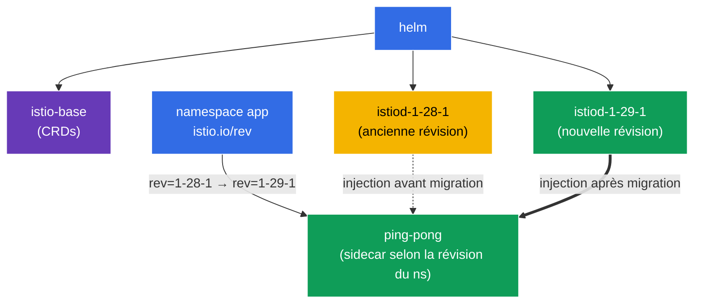

[RU version](README_RU.MD) · [Eng version](README.MD) · [Versión en español](README_ES.MD) · [Deutsche Version](README_DE.MD)

# Lab 07 - Installation d'Istio via Helm + Canary upgrade avec révisions

Imaginez : vous êtes responsable d'un cluster de production dans lequel Istio fonctionne déjà. Une nouvelle version sort, et vous devez mettre à jour le control plane **sans interruption et avec possibilité de rollback**. Se contenter de « tout supprimer et installer le nouveau » est trop risqué : si le nouvel istiod s'avère incompatible, tout le maillage tombera. La bonne approche est le **canary upgrade** : à côté de l'ancien control plane, on déploie un nouveau (une autre *révision*), puis les namespaces sont basculés un par un dessus avec redémarrage des pods. Si quelque chose se passe mal - on remet simplement le label en arrière.

Dans ce travail pratique, nous allons :
1. installer Istio **via Helm** (et non istioctl) en indiquant une révision ;
2. réaliser une **mise à jour canary** vers une nouvelle version : déployer une seconde révision d'istiod à côté de l'ancienne et migrer l'application, sans toucher au code.

> Contrairement aux labs précédents, ici Istio **n'est pas préinstallé** dans le cluster - l'installation est justement la tâche.

### Comment ça marche (schéma général)



## Objectif

- Installer Istio via les charts Helm (`istio/base` + `istio/istiod`) en indiquant une révision.
- Réaliser un canary-upgrade : déployer une seconde révision d'istiod et basculer le namespace dessus via le label `istio.io/rev`.

Dans le lab sont utilisées les versions :
- **ancienne** : Istio `1.28.1`, révision `1-28-1` ;
- **nouvelle** : Istio `1.29.1`, révision `1-29-1`.

## Qu'est-ce qu'une révision (revision)

Une **révision** est une instance nommée du control plane (istiod). Chaque révision a son propre Deployment `istiod-<revision>` et son propre mutating webhook pour l'injection de sidecar. Le namespace choisit par quelle révision ses pods seront « cousus », via le label `istio.io/rev=<revision>`. C'est justement ce qui permet de garder **deux versions d'Istio simultanément** et de basculer la charge entre elles - la base de la mise à jour canary.

## Infrastructure

L'environnement est déployé dans AWS (`eu-central-1`) via Terragrunt et se compose de :

| Composant  | Description                                          |
|------------|---------------------------------------------------|
| `vpc`      | VPC `10.10.0.0/16` avec des sous-réseaux publics          |
| `ssh-keys` | Clés SSH pour l'accès aux nœuds                      |
| `k8s-1`    | Kubernetes `1.35.2` (kubeadm)                      |
| `worker`   | Machine de travail avec `kubectl` et accès au cluster   |

Instances : `t3.medium` (master) Ubuntu `22.04`

## Déploiement

```bash
TASK=07 make run_ica_task
```

## Étape 1. On ajoute le dépôt Helm d'Istio

```bash
helm repo add istio https://istio-release.storage.googleapis.com/charts
helm repo update
```

## Étape 2. Installation d'Istio via Helm (ancienne révision)

Istio dans Helm se compose de deux charts de base :
- **`istio/base`** - CRD et ressources de cluster (installé une seule fois, commun à toutes les révisions) ;
- **`istio/istiod`** - le control plane lui-même ; avec le flag `--set revision=<rev>` on crée un istiod de révision.

```bash
kubectl create namespace istio-system

helm install istio-base istio/base -n istio-system --version 1.28.1 --set defaultRevision=1-28-1

helm install istiod-1-28-1 istio/istiod -n istio-system --version 1.28.1 --set revision=1-28-1 --wait
```

On vérifie que le control plane est démarré :

```bash
kubectl get pods -n istio-system
```

```
NAME                              READY   STATUS    RESTARTS   AGE
istiod-1-28-1-xxxxxxxxxx-xxxxx    1/1     Running   0          40s
```

**À noter :** le Deployment s'appelle `istiod-1-28-1` - le nom contient la révision. C'est ce qui distingue une installation par révision d'une installation « ordinaire » (où istiod s'appelle simplement `istiod`).

## Étape 3. On déploie l'application sur l'ancienne révision

Dans une installation par révision, le namespace est marqué non pas avec `istio-injection=enabled`, mais avec `istio.io/rev=<revision>` - ainsi nous indiquons explicitement quel control plane injecte le sidecar.

```bash
kubectl create namespace app
kubectl label namespace app istio.io/rev=1-28-1

kubectl apply -f https://raw.githubusercontent.com/ViktorUJ/cks/refs/heads/master/tasks/ica/labs/07/k8s-1/scripts/1.yaml
kubectl rollout restart deployment -n app
```

On s'assure que le sidecar est injecté par la révision `1-28-1` - on regarde la version de l'image `istio-proxy` :

```bash
kubectl get pods -n app -o jsonpath='{range .items[*]}{.metadata.name}{"  "}{.spec.initContainers[*].image}{"\n"}{end}'
```

```
ping-pong-xxxx  docker.io/istio/proxyv2:1.28.1
ping-pong-yyyy  docker.io/istio/proxyv2:1.28.1
```

La version du proxy est `1.28.1`. L'application fonctionne sur l'ancienne révision.

## Étape 4. Canary - on installe la nouvelle révision à côté de l'ancienne

Maintenant, le point essentiel de la mise à jour canary : le nouveau control plane se déploie **à côté** de l'ancien, sans l'affecter. On met d'abord à jour les CRD communs (`istio-base`) vers la nouvelle version, puis on installe la seconde révision d'istiod.

```bash
# On met d'abord à jour les CRD communs vers la nouvelle version
helm upgrade istio-base istio/base -n istio-system --version 1.29.1 --set defaultRevision=1-28-1

# On installe la nouvelle révision d'istiod (l'ancienne continue de fonctionner)
helm install istiod-1-29-1 istio/istiod -n istio-system --version 1.29.1 --set revision=1-29-1 --wait
```

Maintenant, il y a dans le cluster **deux révisions du control plane** simultanément :

```bash
kubectl get pods -n istio-system
```

```
NAME                              READY   STATUS    RESTARTS   AGE
istiod-1-28-1-xxxxxxxxxx-xxxxx    1/1     Running   0          5m
istiod-1-29-1-yyyyyyyyyy-yyyyy    1/1     Running   0          30s
```

**Important :** l'application dans le namespace `app` n'est pour l'instant **pas affectée** - ses pods utilisent toujours le sidecar de `1-28-1`. L'installation de la nouvelle révision ne migre rien en soi. C'est cela la sécurité du canary : le nouveau control plane est déjà prêt, mais la charge n'y est pas encore basculée.

## Étape 5. Migration de l'application vers la nouvelle révision

On bascule le namespace vers la nouvelle révision (on change le label) et on redémarre les pods - à la recréation, ils recevront un sidecar déjà issu de `1-29-1`.

```bash
kubectl label namespace app istio.io/rev=1-29-1 --overwrite
kubectl rollout restart deployment -n app
```

On vérifie la version du proxy après migration :

```bash
kubectl get pods -n app -o jsonpath='{range .items[*]}{.metadata.name}{"  "}{.spec.initContainers[*].image}{"\n"}{end}'
```

```
ping-pong-aaaa  docker.io/istio/proxyv2:1.29.1
ping-pong-bbbb  docker.io/istio/proxyv2:1.29.1
```

La version du proxy est maintenant `1.29.1` - l'application a migré avec succès vers le nouveau control plane. Si la nouvelle version s'était mal comportée, nous aurions simplement remis le label `istio.io/rev=1-28-1` et redémarré les pods - un rollback instantané.

## Étape 6. (facultatif) Suppression de l'ancienne révision

Une fois que vous êtes sûr que tout fonctionne sur la nouvelle révision, l'ancien control plane peut être supprimé :

```bash
helm uninstall istiod-1-28-1 -n istio-system
```

## Étape 7. Vérification

```bash
helm list -n istio-system
kubectl get ns app --show-labels | grep 1-29-1
kubectl get pods -n app -o jsonpath='{range .items[*]}{.spec.initContainers[*].image}{"\n"}{end}' | grep 1.29.1
```

## Étape 8. Alternative - In-Place upgrade

La mise à jour canary via les révisions est la voie la plus sûre, mais Istio prend aussi en charge l'**in-place upgrade** : la mise à jour du même istiod « sur place », **sans** seconde révision. Inconvénient : tous les proxys basculent sur la nouvelle version d'un coup (après redémarrage des pods), et le rollback se fait non pas en changeant le label, mais via `helm rollback`.

L'in-place se fait via `helm upgrade` de la même release istiod (installée **sans** `revision`, le namespace est marqué avec le classique `istio-injection=enabled`) :

```bash
# installation de base sans révision
helm install istio-base istio/base -n istio-system --version 1.28.1
helm install istiod istio/istiod -n istio-system --version 1.28.1 --wait
kubectl label namespace app istio-injection=enabled --overwrite

# ... plus tard : on met à jour les CRD et istiod SUR PLACE vers la nouvelle version
helm upgrade istio-base istio/base -n istio-system --version 1.29.1
helm upgrade istiod    istio/istiod -n istio-system --version 1.29.1 --wait

# on redémarre le data plane, pour que les pods reçoivent le nouveau sidecar
kubectl rollout restart deployment -n app
```

**Canary vs In-Place :**

| | Canary (révisions) | In-Place |
|---|---|---|
| Second control plane | oui, à côté | non |
| Bascule de la charge | par namespace, progressivement | d'un coup pour tous |
| Rollback | changer le label `istio.io/rev` | `helm rollback` |
| Risque | plus faible | plus élevé |

Équivalent via istioctl : `istioctl upgrade` - met à jour l'installation sans révision « sur place ».

## Bilan

| Étape | Ce que l'on a fait | Outil |
|-----|-------------|-----------|
| Installation | `istio/base` + `istiod` révision `1-28-1` | Helm |
| Déploiement | namespace `app` avec le label `istio.io/rev=1-28-1` | kubectl |
| Canary | seconde révision `1-29-1` à côté de l'ancienne | Helm |
| Migration | changement du label du namespace + `rollout restart` | kubectl |

**Conclusion clé :**
- **Helm** offre une installation d'Istio déclarative et versionnable : `base` (CRD) séparément, `istiod` séparément, avec indication explicite de la version du chart et de la révision.
- Les **révisions** (`revision` + label `istio.io/rev`) sont le mécanisme de mise à jour canary : deux control plane coexistent, et les namespaces basculent entre eux un par un. L'installation d'une nouvelle révision est sûre (rien n'est migré automatiquement), et le rollback n'est qu'un retour du label et un redémarrage des pods.
