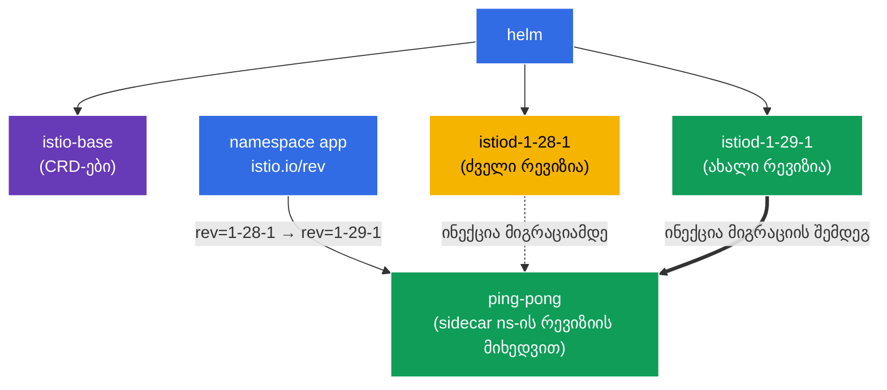

[Русская версия](README_RU.MD) · [Eng version](README.MD) · [Versión en español](README_ES.MD) · [Version française](README_FR.MD) · [Deutsche Version](README_DE.MD) · [繁體中文版](README_TW.MD) · [日本語版](README_JP.MD)

# Lab 07 - Istio-ს ინსტალაცია Helm-ის საშუალებით + Canary განახლება რევიზიებით

> [საცნობარო გადაწყვეტა](worker/files/solutions/1_GE.MD)

წარმოიდგინეთ: პასუხისმგებელი ხართ production-კლასტერზე, რომელშიც Istio უკვე მუშაობს. გამოდის ახალი ვერსია და control plane უნდა განაახლოთ **შეფერხების გარეშე და უკან დაბრუნების შესაძლებლობით**. უბრალოდ „ძველის წაშლა და ახლის დაყენება“ მეტისმეტად სარისკოა: თუ ახალი istiod შეუთავსებელი აღმოჩნდება, მთელი mesh გაითიშება. სწორი მიდგომაა **canary upgrade**: ძველი control plane-ის გვერდით იშლება ახალი (სხვა *რევიზია*), შემდეგ კი namespace-ები სათითაოდ გადადის მასზე პოდების გადატვირთვით. თუ რამე არასწორად წავა - უბრალოდ იარლიყს ძველ მნიშვნელობაზე ვაბრუნებთ.

ამ ლაბორატორიაში ჩვენ:
1. დავაყენებთ Istio-ს **Helm-ის საშუალებით** (და არა istioctl-ით) რევიზიის მითითებით;
2. შევასრულებთ **canary-განახლებას** ახალ ვერსიაზე: ძველის გვერდით გავშლით istiod-ის მეორე რევიზიას და აპლიკაციას კოდის შეცვლის გარეშე გადავიტანთ.

> წინა ლაბორატორიებისგან განსხვავებით, აქ Istio კლასტერში **წინასწარ დაყენებული არ არის** - მისი ინსტალაცია თავად არის დავალება.

### როგორ მუშაობს ეს (ზოგადი სქემა)



## მიზანი

- Istio-ს დაყენება Helm-ჩარტებით (`istio/base` + `istio/istiod`) რევიზიის მითითებით.
- Canary-upgrade-ის შესრულება: istiod-ის მეორე რევიზიის გაშლა და namespace-ის მასზე გადაყვანა `istio.io/rev` იარლიყის საშუალებით.

ლაბორატორიაში გამოიყენება ვერსიები:
- **ძველი**: Istio `1.28.1`, რევიზია `1-28-1`;
- **ახალი**: Istio `1.29.1`, რევიზია `1-29-1`.

## რა არის რევიზია (revision)

**რევიზია** - control plane-ის (istiod) სახელდებული ეგზემპლარია. თითოეულ რევიზიას აქვს საკუთარი Deployment `istiod-<revision>` და sidecar-ის ინექციის საკუთარი mutating webhook. Namespace `istio.io/rev=<revision>` იარლიყით ირჩევს, რომელი რევიზია „ჩაუშენებს“ მის პოდებს sidecar-ს. სწორედ ეს იძლევა **Istio-ს ორი ვერსიის ერთდროულად** გაშვებისა და მათ შორის დატვირთვის გადართვის შესაძლებლობას - canary-განახლების საფუძველს.

## ინფრასტრუქტურა

გარემო AWS-ში (`eu-central-1`) Terragrunt-ის საშუალებით იშლება და შედგება შემდეგი კომპონენტებისგან:

| კომპონენტი | აღწერა |
|------------|--------|
| `vpc`      | VPC `10.10.0.0/16` საჯარო ქვექსელებით |
| `ssh-keys` | SSH-გასაღებები ნოდებზე წვდომისთვის |
| `k8s-1`    | Kubernetes `1.35.2` (kubeadm) |
| `worker`   | სამუშაო მანქანა `kubectl`-ითა და კლასტერზე წვდომით |

ინსტანსები: `t3.medium` (master) Ubuntu `22.04`

## გაშლა

```bash
TASK=07 make run_ica_task
```

## ნაბიჯი 1. Istio-ს Helm-რეპოზიტორიის დამატება

```bash
helm repo add istio https://istio-release.storage.googleapis.com/charts
helm repo update
```

## ნაბიჯი 2. Istio-ს ინსტალაცია Helm-ის საშუალებით (ძველი რევიზია)

Helm-ში Istio ორი საბაზისო ჩარტისგან შედგება:
- **`istio/base`** - CRD-ები და კლასტერული რესურსები (ერთხელ ყენდება და ყველა რევიზიისთვის საერთოა);
- **`istio/istiod`** - თავად control plane; `--set revision=<rev>` ფლაგით იქმნება რევიზიული istiod.

```bash
kubectl create namespace istio-system

helm install istio-base istio/base -n istio-system --version 1.28.1 --set defaultRevision=1-28-1

helm install istiod-1-28-1 istio/istiod -n istio-system --version 1.28.1 --set revision=1-28-1 --wait
```

ვამოწმებთ, რომ control plane გაეშვა:

```bash
kubectl get pods -n istio-system
```

```
NAME                              READY   STATUS    RESTARTS   AGE
istiod-1-28-1-xxxxxxxxxx-xxxxx    1/1     Running   0          40s
```

**რას უნდა მივაქციოთ ყურადღება:** Deployment-ს ეწოდება `istiod-1-28-1` - სახელი რევიზიას შეიცავს. სწორედ ეს განასხვავებს რევიზიულ ინსტალაციას „ჩვეულებრივისგან“ (სადაც istiod-ს უბრალოდ `istiod` ეწოდება).

## ნაბიჯი 3. აპლიკაციის გაშლა ძველ რევიზიაზე

რევიზიული ინსტალაციისას namespace-ს ენიჭება არა `istio-injection=enabled`, არამედ `istio.io/rev=<revision>` - ამით პირდაპირ მივუთითებთ, რომელმა control plane-მა უნდა მოახდინოს sidecar-ის ინექცია.

```bash
kubectl create namespace app
kubectl label namespace app istio.io/rev=1-28-1

kubectl apply -f https://raw.githubusercontent.com/ViktorUJ/cks/refs/heads/master/tasks/ica/labs/07/k8s-1/scripts/1.yaml
kubectl rollout restart deployment -n app
```

ვრწმუნდებით, რომ sidecar `1-28-1` რევიზიამ ჩააინექცია - ვამოწმებთ `istio-proxy` იმიჯის ვერსიას:

```bash
kubectl get pods -n app -o jsonpath='{range .items[*]}{.metadata.name}{"  "}{.spec.initContainers[*].image}{"\n"}{end}'
```

```
ping-pong-xxxx  docker.io/istio/proxyv2:1.28.1
ping-pong-yyyy  docker.io/istio/proxyv2:1.28.1
```

პროქსის ვერსიაა `1.28.1`. აპლიკაცია ძველ რევიზიაზე მუშაობს.

## ნაბიჯი 4. Canary - ახალი რევიზიის დაყენება ძველის გვერდით

ახლა canary-განახლების მთავარი ნაწილი: ახალი control plane იშლება ძველის **გვერდით** და მასზე გავლენას არ ახდენს. ჯერ საერთო CRD-ებს (`istio-base`) ახალ ვერსიამდე ვაახლებთ, შემდეგ კი istiod-ის მეორე რევიზიას ვაყენებთ.

```bash
# ჯერ ვაახლებთ საერთო CRD-ებს ახალ ვერსიამდე
helm upgrade istio-base istio/base -n istio-system --version 1.29.1 --set defaultRevision=1-28-1

# ვაყენებთ istiod-ის ახალ რევიზიას (ძველი აგრძელებს მუშაობას)
helm install istiod-1-29-1 istio/istiod -n istio-system --version 1.29.1 --set revision=1-29-1 --wait
```

ახლა კლასტერში ერთდროულად არის **control plane-ის ორი რევიზია**:

```bash
kubectl get pods -n istio-system
```

```
NAME                              READY   STATUS    RESTARTS   AGE
istiod-1-28-1-xxxxxxxxxx-xxxxx    1/1     Running   0          5m
istiod-1-29-1-yyyyyyyyyy-yyyyy    1/1     Running   0          30s
```

**მნიშვნელოვანია:** `app` namespace-ში არსებული აპლიკაცია ჯერ **არ შეცვლილა** - მისი პოდები კვლავ `1-28-1`-ის sidecar-ს იყენებენ. ახალი რევიზიის დაყენება თავისთავად არაფერს უკეთებს მიგრაციას. სწორედ ეს არის canary-ის უსაფრთხოება: ახალი control plane უკვე მზადაა, მაგრამ დატვირთვა მასზე ჯერ არ გადატანილა.

## ნაბიჯი 5. აპლიკაციის მიგრაცია ახალ რევიზიაზე

Namespace-ს ახალ რევიზიაზე გადავრთავთ (იარლიყს ვცვლით) და პოდებს გადავტვირთავთ - ხელახლა შექმნისას ისინი sidecar-ს უკვე `1-29-1`-ისგან მიიღებენ.

```bash
kubectl label namespace app istio.io/rev=1-29-1 --overwrite
kubectl rollout restart deployment -n app
```

მიგრაციის შემდეგ ვამოწმებთ პროქსის ვერსიას:

```bash
kubectl get pods -n app -o jsonpath='{range .items[*]}{.metadata.name}{"  "}{.spec.initContainers[*].image}{"\n"}{end}'
```

```
ping-pong-aaaa  docker.io/istio/proxyv2:1.29.1
ping-pong-bbbb  docker.io/istio/proxyv2:1.29.1
```

პროქსის ვერსია ახლა `1.29.1`-ია - აპლიკაცია წარმატებით გადავიდა ახალ control plane-ზე. ახალი ვერსია ცუდად რომ მოქცეულიყო, უბრალოდ დავაბრუნებდით `istio.io/rev=1-28-1` იარლიყს და პოდებს გადავტვირთავდით - მყისიერი უკან დაბრუნება.

## ნაბიჯი 6. (არასავალდებულო) ძველი რევიზიის წაშლა

როდესაც დარწმუნდებით, რომ ახალ რევიზიაზე ყველაფერი მუშაობს, ძველი control plane შეგიძლიათ წაშალოთ:

```bash
helm uninstall istiod-1-28-1 -n istio-system
```

## ნაბიჯი 7. შემოწმება

```bash
helm list -n istio-system
kubectl get ns app --show-labels | grep 1-29-1
kubectl get pods -n app -o jsonpath='{range .items[*]}{.spec.initContainers[*].image}{"\n"}{end}' | grep 1.29.1
```

## ნაბიჯი 8. ალტერნატივა - In-Place upgrade

Canary-განახლება რევიზიების საშუალებით ყველაზე უსაფრთხო გზაა, თუმცა Istio-ს **in-place upgrade**-ის მხარდაჭერაც აქვს: იმავე istiod-ის „ადგილზე“ განახლება, მეორე რევიზიის **გარეშე**. ნაკლი: ყველა პროქსი ახალ ვერსიაზე ერთდროულად გადადის (პოდების გადატვირთვის შემდეგ), ხოლო უკან დაბრუნება იარლიყის შეცვლით კი არა, `helm rollback`-ით ხდება.

In-place სრულდება istiod-ის იმავე რელიზის `helm upgrade`-ით (იგი ყენდება `revision`-ის **გარეშე**, ხოლო namespace ჩვეულებრივი `istio-injection=enabled` იარლიყით ინიშნება):

```bash
# საბაზისო ინსტალაცია რევიზიის გარეშე
helm install istio-base istio/base -n istio-system --version 1.28.1
helm install istiod istio/istiod -n istio-system --version 1.28.1 --wait
kubectl label namespace app istio-injection=enabled --overwrite

# ... მოგვიანებით: ვაახლებთ CRD-სა და istiod-ს ადგილზე ახალ ვერსიამდე
helm upgrade istio-base istio/base -n istio-system --version 1.29.1
helm upgrade istiod    istio/istiod -n istio-system --version 1.29.1 --wait

# გადავტვირთავთ data plane-ს, რათა პოდებმა ახალი sidecar მიიღონ
kubectl rollout restart deployment -n app
```

**Canary და In-Place:**

| | Canary (რევიზიები) | In-Place |
|---|---|---|
| მეორე control plane | დიახ, გვერდიგვერდ | არა |
| დატვირთვის გადართვა | namespace-ების მიხედვით, ეტაპობრივად | ერთდროულად ყველასთვის |
| უკან დაბრუნება | `istio.io/rev` იარლიყის შეცვლა | `helm rollback` |
| რისკი | დაბალი | მაღალი |

Istioctl-ის ეკვივალენტი: `istioctl upgrade` - არარევიზიულ ინსტალაციას „ადგილზე“ აახლებს.

## შეჯამება

| ნაბიჯი | რა გავაკეთეთ | ინსტრუმენტი |
|--------|--------------|-------------|
| ინსტალაცია | `istio/base` + `istiod` რევიზია `1-28-1` | Helm |
| გაშლა | namespace `app` იარლიყით `istio.io/rev=1-28-1` | kubectl |
| Canary | მეორე რევიზია `1-29-1` ძველის გვერდით | Helm |
| მიგრაცია | namespace-ის იარლიყის შეცვლა + `rollout restart` | kubectl |

**ძირითადი დასკვნა:**
- **Helm** უზრუნველყოფს Istio-ს დეკლარაციულ, ვერსირებად ინსტალაციას: `base` (CRD) ცალკე, `istiod` ცალკე, ჩარტის ვერსიისა და რევიზიის მკაფიო მითითებით.
- **რევიზიები** (`revision` + იარლიყი `istio.io/rev`) canary-განახლების მექანიზმია: ორი control plane თანაარსებობს, ხოლო namespace-ები მათ შორის სათითაოდ გადადის. ახალი რევიზიის დაყენება უსაფრთხოა (ავტომატურად არაფერს უკეთებს მიგრაციას), უკან დაბრუნება კი უბრალოდ იარლიყის ძველი მნიშვნელობის აღდგენა და პოდების გადატვირთვაა.
