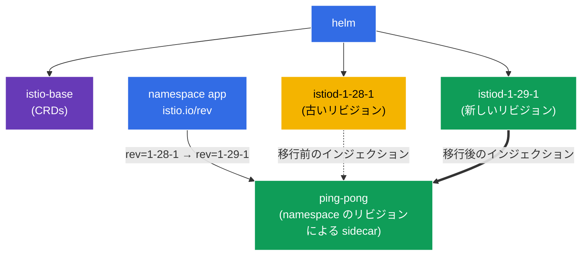

[Русская версия](README_RU.MD) · [Eng version](README.MD) · [Versión en español](README_ES.MD) · [Version française](README_FR.MD) · [Deutsche Version](README_DE.MD) · [ქართული ვერსია](README_GE.MD) · [繁體中文版](README_TW.MD)

# Lab 07 - Helm による Istio のインストール + リビジョンを使用した Canary upgrade

> [リファレンス解答](worker/files/solutions/1_JP.MD)

想像してみてください。あなたは、すでに Istio が稼働している production クラスターを担当しています。新しいバージョンがリリースされ、control plane を**ダウンタイムなしで、かつロールバック可能な状態で**更新する必要があります。単に「古いものを削除して新しいものをインストールする」のは危険すぎます。新しい istiod に互換性がなければ、mesh 全体が停止します。正しいアプローチは **canary upgrade** です。古い control plane と並行して新しい control plane（別の *リビジョン*）をデプロイし、その後 namespace を 1 つずつ、Pod の再起動とともに移行します。何か問題があれば、ラベルを元に戻すだけです。

このラボでは以下を行います。
1. リビジョンを指定して、Istio を **Helm 経由で**（istioctl ではなく）インストールします。
2. 新バージョンへの **canary 更新**を実行します。古い istiod の横に 2 つ目のリビジョンをデプロイし、コードに手を加えずにアプリケーションを移行します。

> これまでのラボと異なり、このラボではクラスターに Istio は**事前インストールされていません**。インストール自体が課題です。

### 仕組み（全体図）



## 目的

- リビジョンを指定して、Helm チャート（`istio/base` + `istio/istiod`）で Istio をインストールする。
- canary upgrade を実行する。2 つ目の istiod リビジョンをデプロイし、`istio.io/rev` ラベルを通じて namespace をそちらに切り替える。

このラボでは以下のバージョンを使用します。
- **旧バージョン**: Istio `1.28.1`、リビジョン `1-28-1`
- **新バージョン**: Istio `1.29.1`、リビジョン `1-29-1`

## リビジョン（revision）とは

**リビジョン**は、名前付きの control plane（istiod）インスタンスです。各リビジョンには独自の Deployment `istiod-<revision>` と sidecar インジェクション用の独自の mutating webhook があります。namespace は `istio.io/rev=<revision>` ラベルを通じて、どのリビジョンで自身の Pod を「組み込む」かを選択します。これにより、**2 つの Istio バージョンを同時に稼働**させ、その間でトラフィックを切り替えられます。これが canary upgrade の基盤です。

## インフラストラクチャ

環境は Terragrunt を使用して AWS（`eu-central-1`）にデプロイされ、以下で構成されます。

| コンポーネント | 説明 |
|------------|---------------------------------------------------|
| `vpc`      | パブリックサブネットを持つ VPC `10.10.0.0/16` |
| `ssh-keys` | ノードへのアクセス用 SSH キー |
| `k8s-1`    | Kubernetes `1.35.2`（kubeadm） |
| `worker`   | `kubectl` とクラスターへのアクセスを備えた作業マシン |

インスタンス: `t3.medium`（master）、Ubuntu `22.04`

## デプロイ

```bash
TASK=07 make run_ica_task
```

## ステップ 1. Istio の Helm リポジトリを追加する

```bash
helm repo add istio https://istio-release.storage.googleapis.com/charts
helm repo update
```

## ステップ 2. Helm による Istio のインストール（古いリビジョン）

Helm での Istio は、2 つの基本チャートで構成されます。
- **`istio/base`**: CRD とクラスターリソース（1 回だけインストールし、すべてのリビジョンで共有）
- **`istio/istiod`**: control plane 本体。`--set revision=<rev>` フラグにより、リビジョン付き istiod が作成される。

```bash
kubectl create namespace istio-system

helm install istio-base istio/base -n istio-system --version 1.28.1 --set defaultRevision=1-28-1

helm install istiod-1-28-1 istio/istiod -n istio-system --version 1.28.1 --set revision=1-28-1 --wait
```

control plane が起動したことを確認します。

```bash
kubectl get pods -n istio-system
```

```
NAME                              READY   STATUS    RESTARTS   AGE
istiod-1-28-1-xxxxxxxxxx-xxxxx    1/1     Running   0          40s
```

**注目点:** Deployment の名前は `istiod-1-28-1` です。名前にリビジョンが含まれています。これが、istiod が単に `istiod` となる「通常の」インストールとの違いです。

## ステップ 3. 古いリビジョンにアプリケーションをデプロイする

リビジョンを使用したインストールでは、namespace に `istio-injection=enabled` ではなく `istio.io/rev=<revision>` をラベル付けします。これにより、どの control plane が sidecar をインジェクションするかを明示的に指定します。

```bash
kubectl create namespace app
kubectl label namespace app istio.io/rev=1-28-1

kubectl apply -f https://raw.githubusercontent.com/ViktorUJ/cks/refs/heads/master/tasks/ica/labs/07/k8s-1/scripts/1.yaml
kubectl rollout restart deployment -n app
```

sidecar がリビジョン `1-28-1` によってインジェクションされたことを確認します。`istio-proxy` イメージのバージョンを確認します。

```bash
kubectl get pods -n app -o jsonpath='{range .items[*]}{.metadata.name}{"  "}{.spec.initContainers[*].image}{"\n"}{end}'
```

```
ping-pong-xxxx  docker.io/istio/proxyv2:1.28.1
ping-pong-yyyy  docker.io/istio/proxyv2:1.28.1
```

プロキシのバージョンは `1.28.1` です。アプリケーションは古いリビジョンで稼働しています。

## ステップ 4. Canary: 古いリビジョンと並行して新しいリビジョンをインストールする

ここが canary upgrade の要点です。新しい control plane は、古いものに影響を与えず**並行して**デプロイされます。まず共有 CRD（`istio-base`）を新バージョンへ更新し、その後 2 つ目の istiod リビジョンをインストールします。

```bash
# まず共通の CRD を新しいバージョンに更新する
helm upgrade istio-base istio/base -n istio-system --version 1.29.1 --set defaultRevision=1-28-1

# istiod の新しいリビジョンをインストールする (古いものは動作し続ける)
helm install istiod-1-29-1 istio/istiod -n istio-system --version 1.29.1 --set revision=1-29-1 --wait
```

これでクラスターには**2 つの control plane リビジョン**が同時に存在します。

```bash
kubectl get pods -n istio-system
```

```
NAME                              READY   STATUS    RESTARTS   AGE
istiod-1-28-1-xxxxxxxxxx-xxxxx    1/1     Running   0          5m
istiod-1-29-1-yyyyyyyyyy-yyyyy    1/1     Running   0          30s
```

**重要:** namespace `app` のアプリケーションはまだ**影響を受けていません**。その Pod は引き続き `1-28-1` の sidecar を使用しています。新しいリビジョンをインストールするだけでは何も移行されません。これが canary の安全性です。新しい control plane はすでに準備できていますが、まだトラフィックは移行されていません。

## ステップ 5. アプリケーションを新しいリビジョンへ移行する

namespace を新しいリビジョンに切り替え（ラベルを変更）、Pod を再起動します。再作成時に `1-29-1` の sidecar がインジェクションされます。

```bash
kubectl label namespace app istio.io/rev=1-29-1 --overwrite
kubectl rollout restart deployment -n app
```

移行後のプロキシバージョンを確認します。

```bash
kubectl get pods -n app -o jsonpath='{range .items[*]}{.metadata.name}{"  "}{.spec.initContainers[*].image}{"\n"}{end}'
```

```
ping-pong-aaaa  docker.io/istio/proxyv2:1.29.1
ping-pong-bbbb  docker.io/istio/proxyv2:1.29.1
```

プロキシのバージョンは `1.29.1` になりました。アプリケーションは新しい control plane へ正常に移行しました。新バージョンの挙動に問題があった場合は、ラベルを `istio.io/rev=1-28-1` に戻して Pod を再起動するだけです。即座にロールバックできます。

## ステップ 6. （任意）古いリビジョンを削除する

すべてが新しいリビジョンで動作していることを確認したら、古い control plane を削除できます。

```bash
helm uninstall istiod-1-28-1 -n istio-system
```

## ステップ 7. 確認

```bash
helm list -n istio-system
kubectl get ns app --show-labels | grep 1-29-1
kubectl get pods -n app -o jsonpath='{range .items[*]}{.spec.initContainers[*].image}{"\n"}{end}' | grep 1.29.1
```

## ステップ 8. 代替案: In-Place upgrade

リビジョンによる canary upgrade が最も安全な方法ですが、Istio は **in-place upgrade** もサポートしています。同じ istiod を 2 つ目のリビジョン**なしで**「その場で」更新します。欠点は、すべてのプロキシが一度に新バージョンへ切り替わることです（Pod の再起動後）。また、ロールバックはラベルの変更ではなく `helm rollback` によって行います。

in-place は、同じ istiod リリースに対する `helm upgrade` で実行します（`revision` **なしで**インストールし、namespace には通常の `istio-injection=enabled` を設定します）。

```bash
# リビジョンなしの基本インストール
helm install istio-base istio/base -n istio-system --version 1.28.1
helm install istiod istio/istiod -n istio-system --version 1.28.1 --wait
kubectl label namespace app istio-injection=enabled --overwrite

# ... 後で: CRD と istiod をその場で新しいバージョンに更新する
helm upgrade istio-base istio/base -n istio-system --version 1.29.1
helm upgrade istiod    istio/istiod -n istio-system --version 1.29.1 --wait

# data plane を再起動して、Pod が新しい sidecar を受け取るようにする
kubectl rollout restart deployment -n app
```

**Canary と In-Place の比較:**

| | Canary（リビジョン） | In-Place |
|---|---|---|
| 2 つ目の control plane | あり、並行して稼働 | なし |
| トラフィックの切り替え | namespace ごとに段階的 | 全体を一度に |
| ロールバック | `istio.io/rev` ラベルを変更 | `helm rollback` |
| リスク | 低い | 高い |

istioctl での同等操作: `istioctl upgrade` は、リビジョンなしのインストールを「その場で」更新します。

## まとめ

| ステップ | 実施内容 | ツール |
|-----|-------------|-----------|
| インストール | `istio/base` + リビジョン `1-28-1` の `istiod` | Helm |
| デプロイ | ラベル `istio.io/rev=1-28-1` を持つ namespace `app` | kubectl |
| Canary | 古いリビジョンと並行した 2 つ目のリビジョン `1-29-1` | Helm |
| 移行 | namespace ラベルの変更 + `rollout restart` | kubectl |

**重要なポイント:**
- **Helm** は、宣言的かつバージョン管理可能な Istio インストールを提供します。`base`（CRD）と `istiod` を分離し、チャートのバージョンとリビジョンを明示的に指定します。
- **リビジョン**（`revision` + `istio.io/rev` ラベル）は canary upgrade の仕組みです。2 つの control plane が共存し、namespace はそれらの間を 1 つずつ切り替えられます。新しいリビジョンのインストールは安全です（自動的に何も移行しません）。ロールバックはラベルを戻して Pod を再起動するだけです。