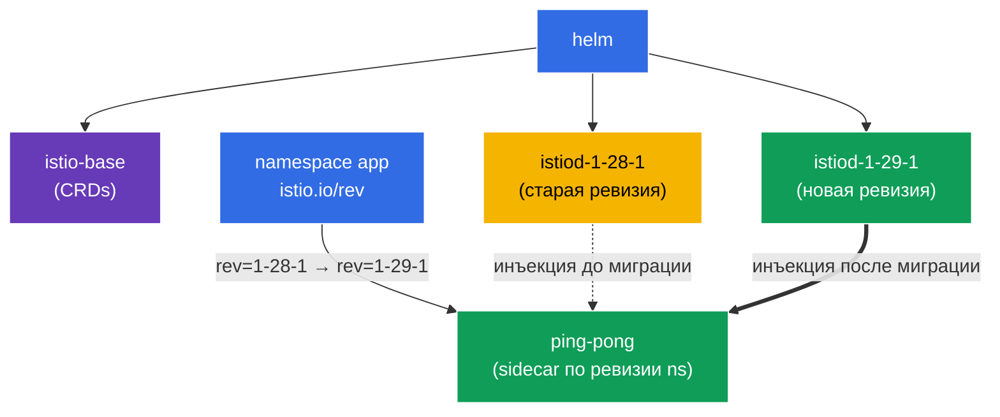

[Eng version](README.MD)

# Lab 07 — Установка Istio через Helm + Canary upgrade с ревизиями

Представьте: вы отвечаете за production-кластер, в котором уже работает Istio. Выходит новая версия, и вам нужно обновить control plane **без простоя и с возможностью отката**. Просто «снести и поставить новый» — слишком рискованно: если новый istiod окажется несовместим, упадёт весь mesh. Правильный подход — **canary upgrade**: рядом со старым control plane разворачивается новый (другая *ревизия*), затем namespace'ы по одному переводятся на него с перезапуском подов. Если что-то идёт не так — просто возвращаем метку обратно.

В этой лабораторной мы:
1. установим Istio **через Helm** (а не istioctl) с указанием ревизии;
2. выполним **canary-обновление** на новую версию: развернём вторую ревизию istiod рядом со старой и мигрируем приложение, не трогая код.

> В отличие от предыдущих лаб, здесь Istio в кластере **не предустановлен** — установка это и есть задача.

### Как это работает (общая схема)



## Цель

- Установить Istio через Helm-чарты (`istio/base` + `istio/istiod`) с указанием ревизии.
- Выполнить canary-upgrade: развернуть вторую ревизию istiod и перевести namespace на неё через метку `istio.io/rev`.

В лабе используются версии:
- **старая**: Istio `1.28.1`, ревизия `1-28-1`;
- **новая**: Istio `1.29.1`, ревизия `1-29-1`.

## Что такое ревизия (revision)

**Ревизия** — это именованный экземпляр control plane (istiod). У каждой ревизии свой Deployment `istiod-<revision>` и свой mutating webhook для инъекции sidecar. Namespace выбирает, какой ревизией его поды будут «прошиты», через метку `istio.io/rev=<revision>`. Именно это позволяет держать **две версии Istio одновременно** и переключать нагрузку между ними — основа canary-обновления.

## Шаг 1. Добавляем Helm-репозиторий Istio

```bash
helm repo add istio https://istio-release.storage.googleapis.com/charts
helm repo update
```

## Шаг 2. Установка Istio через Helm (старая ревизия)

Istio в Helm состоит из двух базовых чартов:
- **`istio/base`** — CRD и кластерные ресурсы (ставится один раз, общий для всех ревизий);
- **`istio/istiod`** — сам control plane; с флагом `--set revision=<rev>` создаётся ревизионный istiod.

```bash
kubectl create namespace istio-system

helm install istio-base istio/base -n istio-system --version 1.28.1 --set defaultRevision=1-28-1

helm install istiod-1-28-1 istio/istiod -n istio-system --version 1.28.1 --set revision=1-28-1 --wait
```

Проверяем, что control plane поднялся:

```bash
kubectl get pods -n istio-system
```

```
NAME                              READY   STATUS    RESTARTS   AGE
istiod-1-28-1-xxxxxxxxxx-xxxxx    1/1     Running   0          40s
```

**На что обратить внимание:** Deployment называется `istiod-1-28-1` — имя содержит ревизию. Это и отличает ревизионную установку от «обычной» (где istiod просто `istiod`).

## Шаг 3. Разворачиваем приложение на старой ревизии

При ревизионной установке namespace помечается не `istio-injection=enabled`, а `istio.io/rev=<revision>` — так мы явно указываем, какой control plane инжектит sidecar.

```bash
kubectl create namespace app
kubectl label namespace app istio.io/rev=1-28-1

kubectl apply -f https://raw.githubusercontent.com/ViktorUJ/cks/refs/heads/master/tasks/ica/labs/07/k8s-1/scripts/1.yaml
kubectl rollout restart deployment -n app
```

Убеждаемся, что sidecar инжектирован ревизией `1-28-1` — смотрим версию образа `istio-proxy`:

```bash
kubectl get pods -n app -o jsonpath='{range .items[*]}{.metadata.name}{"  "}{.spec.initContainers[*].image}{"\n"}{end}'
```

```
ping-pong-xxxx  docker.io/istio/proxyv2:1.28.1
ping-pong-yyyy  docker.io/istio/proxyv2:1.28.1
```

Версия прокси — `1.28.1`. Приложение работает на старой ревизии.

## Шаг 4. Canary — ставим новую ревизию рядом со старой

Теперь главное в canary-обновлении: новый control plane разворачивается **рядом** со старым, не затрагивая его. Сначала обновляем общие CRD (`istio-base`) до новой версии, затем ставим вторую ревизию istiod.

```bash
# Сначала обновляем общие CRD до новой версии
helm upgrade istio-base istio/base -n istio-system --version 1.29.1 --set defaultRevision=1-28-1

# Ставим новую ревизию istiod (старая продолжает работать)
helm install istiod-1-29-1 istio/istiod -n istio-system --version 1.29.1 --set revision=1-29-1 --wait
```

Теперь в кластере **две ревизии control plane** одновременно:

```bash
kubectl get pods -n istio-system
```

```
NAME                              READY   STATUS    RESTARTS   AGE
istiod-1-28-1-xxxxxxxxxx-xxxxx    1/1     Running   0          5m
istiod-1-29-1-yyyyyyyyyy-yyyyy    1/1     Running   0          30s
```

**Важно:** приложение в namespace `app` пока **не затронуто** — его поды по-прежнему используют sidecar от `1-28-1`. Установка новой ревизии сама по себе ничего не мигрирует. Это и есть безопасность canary: новый control plane уже готов, но нагрузка на него ещё не переведена.

## Шаг 5. Миграция приложения на новую ревизию

Переключаем namespace на новую ревизию (меняем метку) и перезапускаем поды — при пересоздании они получат sidecar уже от `1-29-1`.

```bash
kubectl label namespace app istio.io/rev=1-29-1 --overwrite
kubectl rollout restart deployment -n app
```

Проверяем версию прокси после миграции:

```bash
kubectl get pods -n app -o jsonpath='{range .items[*]}{.metadata.name}{"  "}{.spec.initContainers[*].image}{"\n"}{end}'
```

```
ping-pong-aaaa  docker.io/istio/proxyv2:1.29.1
ping-pong-bbbb  docker.io/istio/proxyv2:1.29.1
```

Версия прокси теперь `1.29.1` — приложение успешно переехало на новый control plane. Если бы новая версия повела себя плохо, мы бы просто вернули метку `istio.io/rev=1-28-1` и перезапустили поды — мгновенный откат.

## Шаг 6. (опционально) Удаление старой ревизии

Когда вы убедились, что всё работает на новой ревизии, старый control plane можно удалить:

```bash
helm uninstall istiod-1-28-1 -n istio-system
```

## Шаг 7. Проверка

```bash
helm list -n istio-system
kubectl get ns app --show-labels | grep 1-29-1
kubectl get pods -n app -o jsonpath='{range .items[*]}{.spec.initContainers[*].image}{"\n"}{end}' | grep 1.29.1
```

## Шаг 8. Альтернатива — In-Place upgrade

Canary-обновление через ревизии — самый безопасный путь, но Istio поддерживает и **in-place upgrade**: обновление того же istiod «на месте», **без** второй ревизии. Минус: все прокси переключаются на новую версию сразу (после перезапуска подов), а откат — не сменой метки, а через `helm rollback`.

In-place делается через `helm upgrade` того же релиза istiod (устанавливается **без** `revision`, namespace размечается обычным `istio-injection=enabled`):

```bash
# базовая установка без ревизии
helm install istio-base istio/base -n istio-system --version 1.28.1
helm install istiod istio/istiod -n istio-system --version 1.28.1 --wait
kubectl label namespace app istio-injection=enabled --overwrite

# ... позже: обновляем CRD и istiod НА МЕСТЕ до новой версии
helm upgrade istio-base istio/base -n istio-system --version 1.29.1
helm upgrade istiod    istio/istiod -n istio-system --version 1.29.1 --wait

# перезапускаем data plane, чтобы поды получили новый sidecar
kubectl rollout restart deployment -n app
```

**Canary vs In-Place:**

| | Canary (ревизии) | In-Place |
|---|---|---|
| Второй control plane | да, рядом | нет |
| Переключение нагрузки | по namespace, постепенно | сразу для всех |
| Откат | сменить метку `istio.io/rev` | `helm rollback` |
| Риск | ниже | выше |

Эквивалент через istioctl: `istioctl upgrade` — обновляет установку без ревизии «на месте».

## Итог

| Шаг | Что сделали | Инструмент |
|-----|-------------|-----------|
| Установка | `istio/base` + `istiod` ревизии `1-28-1` | Helm |
| Деплой | namespace `app` с меткой `istio.io/rev=1-28-1` | kubectl |
| Canary | вторая ревизия `1-29-1` рядом со старой | Helm |
| Миграция | смена метки namespace + `rollout restart` | kubectl |

**Ключевой вывод:**
- **Helm** даёт декларативную, версионируемую установку Istio: `base` (CRD) отдельно, `istiod` отдельно, с явным указанием версии чарта и ревизии.
- **Ревизии** (`revision` + метка `istio.io/rev`) — это механизм canary-обновления: два control plane сосуществуют, а namespace'ы переключаются между ними по одному. Установка новой ревизии безопасна (ничего не мигрирует автоматически), а откат — это просто возврат метки и перезапуск подов.
