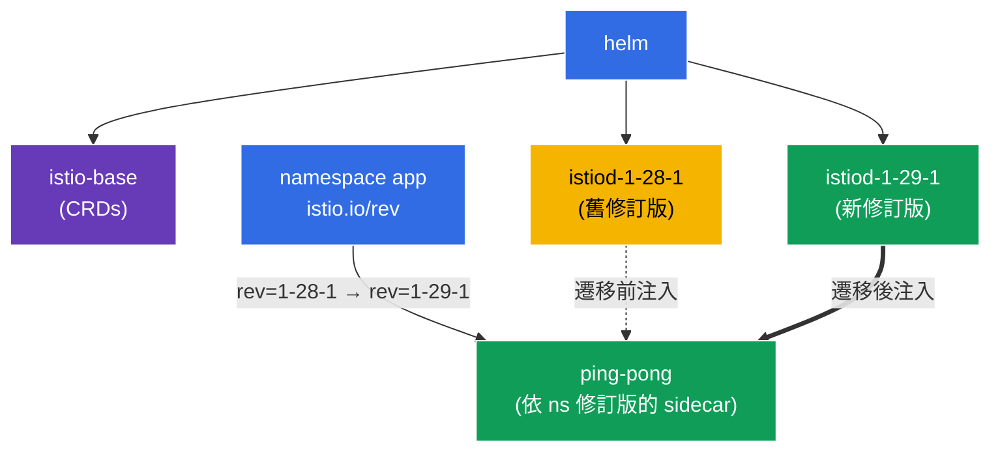

[Русская версия](README_RU.MD) · [Eng version](README.MD) · [Versión en español](README_ES.MD) · [Version française](README_FR.MD) · [Deutsche Version](README_DE.MD) · [ქართული ვერსია](README_GE.MD) · [日本語版](README_JP.MD)

# Lab 07 - 透過 Helm 安裝 Istio + 使用修訂版進行 Canary 升級

> [參考解答](worker/files/solutions/1_TW.MD)

想像一下：您負責一個已在執行 Istio 的正式環境叢集。新版本發布後，您必須在**不中斷服務且可回滾**的情況下更新 control plane。單純「移除後再安裝新版本」風險太高：若新的 istiod 不相容，整個 mesh 都會失效。正確的方法是 **canary 升級**：在舊 control plane 旁部署新的（不同的*修訂版*），然後逐一將 namespace 轉移至它，並重新啟動 Pod。若出現問題，只需將標籤改回原值。

在本實驗中，我們將：
1. 透過 **Helm**（而非 istioctl）安裝 Istio，並指定修訂版；
2. 執行 **canary 升級**至新版本：在舊版本旁部署第二個 istiod 修訂版，並遷移應用程式，無須修改程式碼。

> 與前幾個實驗不同，此處叢集**未預先安裝** Istio--安裝本身就是任務。

### 運作方式（整體架構）



## 目標

- 使用 Helm charts（`istio/base` + `istio/istiod`）安裝 Istio，並指定修訂版。
- 執行 canary 升級：部署第二個 istiod 修訂版，並透過 `istio.io/rev` 標籤將 namespace 轉移至該修訂版。

本實驗使用以下版本：
- **舊版**：Istio `1.28.1`，修訂版 `1-28-1`；
- **新版**：Istio `1.29.1`，修訂版 `1-29-1`。

## 什麼是修訂版（revision）

**修訂版**是 control plane（istiod）的具名執行個體。每個修訂版都有自己的 Deployment `istiod-<revision>`，以及用於注入 sidecar 的 mutating webhook。Namespace 透過 `istio.io/rev=<revision>` 標籤選擇要由哪個修訂版「植入」其 Pod。這正是能夠**同時維持兩個 Istio 版本**並在其間切換流量的原因--也是 canary 升級的基礎。

## 基礎設施

環境會透過 Terragrunt 部署在 AWS（`eu-central-1`），並包含：

| 元件 | 說明 |
|------------|---------------------------------------------------|
| `vpc` | 具有公有子網路的 VPC `10.10.0.0/16` |
| `ssh-keys` | 用於存取節點的 SSH 金鑰 |
| `k8s-1` | Kubernetes `1.35.2`（kubeadm） |
| `worker` | 具有 `kubectl` 且可存取叢集的工作機器 |

執行個體：`t3.medium`（master）Ubuntu `22.04`

## 部署

```bash
TASK=07 make run_ica_task
```

## 步驟 1：新增 Istio Helm 儲存庫

```bash
helm repo add istio https://istio-release.storage.googleapis.com/charts
helm repo update
```

## 步驟 2：透過 Helm 安裝 Istio（舊修訂版）

Helm 中的 Istio 由兩個基礎 chart 組成：
- **`istio/base`**--CRD 與叢集資源（僅安裝一次，供所有修訂版共用）；
- **`istio/istiod`**--control plane 本身；使用旗標 `--set revision=<rev>` 可建立具修訂版的 istiod。

```bash
kubectl create namespace istio-system

helm install istio-base istio/base -n istio-system --version 1.28.1 --set defaultRevision=1-28-1

helm install istiod-1-28-1 istio/istiod -n istio-system --version 1.28.1 --set revision=1-28-1 --wait
```

確認 control plane 已啟動：

```bash
kubectl get pods -n istio-system
```

```
NAME                              READY   STATUS    RESTARTS   AGE
istiod-1-28-1-xxxxxxxxxx-xxxxx    1/1     Running   0          40s
```

**注意事項：**Deployment 名稱為 `istiod-1-28-1`--名稱中包含修訂版。這正是它與「一般」安裝（其中 istiod 僅為 `istiod`）的差異。

## 步驟 3：在舊修訂版上部署應用程式

採用修訂版安裝時，namespace 標記的不是 `istio-injection=enabled`，而是 `istio.io/rev=<revision>`--如此可明確指定由哪個 control plane 注入 sidecar。

```bash
kubectl create namespace app
kubectl label namespace app istio.io/rev=1-28-1

kubectl apply -f https://raw.githubusercontent.com/ViktorUJ/cks/refs/heads/master/tasks/ica/labs/07/k8s-1/scripts/1.yaml
kubectl rollout restart deployment -n app
```

確認 sidecar 是由修訂版 `1-28-1` 注入--查看 `istio-proxy` 映像檔的版本：

```bash
kubectl get pods -n app -o jsonpath='{range .items[*]}{.metadata.name}{"  "}{.spec.initContainers[*].image}{"\n"}{end}'
```

```
ping-pong-xxxx  docker.io/istio/proxyv2:1.28.1
ping-pong-yyyy  docker.io/istio/proxyv2:1.28.1
```

Proxy 版本為 `1.28.1`。應用程式正在舊修訂版上執行。

## 步驟 4：Canary--在舊修訂版旁安裝新修訂版

現在是 canary 升級最關鍵的部分：新的 control plane 會部署在舊版本**旁邊**，不會影響舊版本。先將共用 CRD（`istio-base`）更新至新版本，接著安裝第二個 istiod 修訂版。

```bash
# 先將共用的 CRD 更新到新版本
helm upgrade istio-base istio/base -n istio-system --version 1.29.1 --set defaultRevision=1-28-1

# 安裝新的 istiod 修訂版 (舊版持續運作)
helm install istiod-1-29-1 istio/istiod -n istio-system --version 1.29.1 --set revision=1-29-1 --wait
```

現在叢集中同時有**兩個 control plane 修訂版**：

```bash
kubectl get pods -n istio-system
```

```
NAME                              READY   STATUS    RESTARTS   AGE
istiod-1-28-1-xxxxxxxxxx-xxxxx    1/1     Running   0          5m
istiod-1-29-1-yyyyyyyyyy-yyyyy    1/1     Running   0          30s
```

**重要：**`app` namespace 中的應用程式目前**未受影響**--其 Pod 仍使用來自 `1-28-1` 的 sidecar。安裝新修訂版本身不會遷移任何內容。這正是 canary 的安全性所在：新 control plane 已準備就緒，但尚未將流量轉移至它。

## 步驟 5：將應用程式遷移至新修訂版

將 namespace 切換至新修訂版（變更標籤）並重新啟動 Pod--重新建立時，它們將取得來自 `1-29-1` 的 sidecar。

```bash
kubectl label namespace app istio.io/rev=1-29-1 --overwrite
kubectl rollout restart deployment -n app
```

檢查遷移後的 proxy 版本：

```bash
kubectl get pods -n app -o jsonpath='{range .items[*]}{.metadata.name}{"  "}{.spec.initContainers[*].image}{"\n"}{end}'
```

```
ping-pong-aaaa  docker.io/istio/proxyv2:1.29.1
ping-pong-bbbb  docker.io/istio/proxyv2:1.29.1
```

Proxy 版本現在為 `1.29.1`--應用程式已成功移至新的 control plane。若新版本表現不佳，只需將標籤改回 `istio.io/rev=1-28-1` 並重新啟動 Pod--即可立即回滾。

## 步驟 6：（選用）移除舊修訂版

當您確認所有內容都在新修訂版上正常運作後，即可移除舊 control plane：

```bash
helm uninstall istiod-1-28-1 -n istio-system
```

## 步驟 7：驗證

```bash
helm list -n istio-system
kubectl get ns app --show-labels | grep 1-29-1
kubectl get pods -n app -o jsonpath='{range .items[*]}{.spec.initContainers[*].image}{"\n"}{end}' | grep 1.29.1
```

## 步驟 8：替代方案--In-Place 升級

透過修訂版進行的 canary 升級是最安全的方式，但 Istio 也支援 **in-place 升級**：在**不使用**第二個修訂版的情況下，原地升級同一個 istiod。缺點是所有 proxy 都會立即切換至新版本（重新啟動 Pod 後），而回滾並非改變標籤，而是透過 `helm rollback`。

In-place 是透過對同一 istiod release 執行 `helm upgrade` 完成（安裝時**不使用** `revision`，namespace 使用一般的 `istio-injection=enabled` 標記）：

```bash
# 不帶修訂版的基本安裝
helm install istio-base istio/base -n istio-system --version 1.28.1
helm install istiod istio/istiod -n istio-system --version 1.28.1 --wait
kubectl label namespace app istio-injection=enabled --overwrite

# ... 稍後：就地將 CRD 和 istiod 更新到新版本
helm upgrade istio-base istio/base -n istio-system --version 1.29.1
helm upgrade istiod    istio/istiod -n istio-system --version 1.29.1 --wait

# 重新啟動 data plane，讓 Pod 取得新的 sidecar
kubectl rollout restart deployment -n app
```

**Canary 與 In-Place：**

| | Canary（修訂版） | In-Place |
|---|---|---|
| 第二個 control plane | 是，並行 | 否 |
| 流量切換 | 依 namespace，逐步進行 | 所有人立即切換 |
| 回滾 | 變更 `istio.io/rev` 標籤 | `helm rollback` |
| 風險 | 較低 | 較高 |

透過 istioctl 的等效方式：`istioctl upgrade`--原地更新未使用修訂版的安裝。

## 總結

| 步驟 | 執行內容 | 工具 |
|-----|-------------|-----------|
| 安裝 | `istio/base` + 修訂版 `1-28-1` 的 `istiod` | Helm |
| 部署 | 帶有 `istio.io/rev=1-28-1` 標籤的 `app` namespace | kubectl |
| Canary | 在舊版旁建立第二個修訂版 `1-29-1` | Helm |
| 遷移 | 變更 namespace 標籤 + `rollout restart` | kubectl |

**關鍵結論：**
- **Helm** 提供宣告式且可版本化的 Istio 安裝：`base`（CRD）與 `istiod` 分別安裝，並明確指定 chart 版本與修訂版。
- **修訂版**（`revision` + `istio.io/rev` 標籤）是 canary 升級機制：兩個 control plane 可並存，而 namespace 可逐一在它們之間切換。安裝新修訂版很安全（不會自動遷移任何內容），而回滾只需還原標籤並重新啟動 Pod。