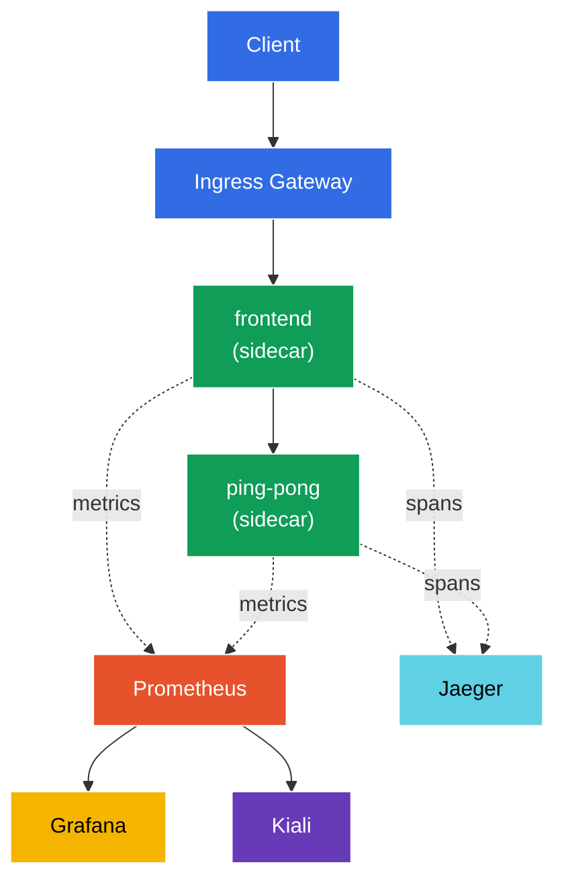

[RU version](README_RU.MD) · [Versión en español](README_ES.MD)

# Lab 08 - Observability: Prometheus / Jaeger / Kiali

Imagine several services running in the cluster and suddenly something is "slow". Where exactly? Which service calls which, how many errors, what latency? Istio collects all this telemetry automatically (the sidecar proxy sees every request), but to actually see it you need tools:
- **Prometheus** - collects and stores metrics (RPS, response codes, latency).
- **Jaeger** - distributed tracing: the path of a single request through all services.
- **Kiali** - mesh visualization: service graph, health, traffic flows.
- **Grafana** - dashboards on top of Prometheus metrics.

In this lab we deploy this stack, generate traffic, and confirm that metrics, traces, and the service graph are actually collected - without any instrumentation of the application code.

### How It Works (High-Level Overview)



## Objective

- Deploy the Istio observability addons: Prometheus, Grafana, Jaeger, Kiali.
- Enable 100% trace sampling via the Telemetry API.
- Generate traffic and verify metrics (Prometheus), traces (Jaeger), and the service graph (Kiali).

> Istio is already installed here (demo profile), with tracing configured to send spans to `zipkin.istio-system:9411` (the endpoint provided by the Jaeger addon).

## Step 1. Enable Sidecar Injection

```bash
kubectl label namespace default istio-injection=enabled --overwrite
```

All telemetry originates in the sidecar proxy: Envoy counts metrics for every request and generates tracing spans. No sidecar, no observability.

## Step 2. Deploy the App and the Entry Point

Deploy a two-tier app: `frontend` calls `ping-pong` on every request. That call produces a two-span trace (frontend → ping-pong) and metrics for both services. A `curl-client` is also deployed - we'll use it to query the Prometheus API from inside the mesh.

```bash
kubectl apply -f https://raw.githubusercontent.com/ViktorUJ/cks/refs/heads/master/tasks/ica/labs/08/k8s-1/scripts/1.yaml
kubectl rollout restart deployment -n default
```

Create the entry point via a Gateway:

```bash
vim gateway.yaml
```

```yaml
apiVersion: networking.istio.io/v1
kind: Gateway
metadata:
  name: main-gateway
  namespace: default
spec:
  selector:
    istio: ingressgateway
  servers:
  - port:
      number: 80
      name: http
      protocol: HTTP
    hosts:
    - "myapp.local"
---
apiVersion: networking.istio.io/v1
kind: VirtualService
metadata:
  name: frontend-vs
  namespace: default
spec:
  hosts:
  - "myapp.local"
  gateways:
  - main-gateway
  http:
  - route:
    - destination:
        host: frontend
        port:
          number: 8080
```

```bash
kubectl apply -f gateway.yaml
```

## Step 3. Install the Observability Addons

Istio ships ready-made addon manifests in `samples/addons`. Install all four:

```bash
REL=release-1.29
kubectl apply -f https://raw.githubusercontent.com/istio/istio/$REL/samples/addons/prometheus.yaml
kubectl apply -f https://raw.githubusercontent.com/istio/istio/$REL/samples/addons/grafana.yaml
kubectl apply -f https://raw.githubusercontent.com/istio/istio/$REL/samples/addons/jaeger.yaml
kubectl apply -f https://raw.githubusercontent.com/istio/istio/$REL/samples/addons/kiali.yaml
```

Wait until they're ready:

```bash
kubectl get pods -n istio-system | grep -E 'prometheus|grafana|jaeger|kiali'
```

```
grafana-xxxx        1/1   Running
jaeger-xxxx         1/1   Running
kiali-xxxx          1/1   Running
prometheus-xxxx     2/2   Running
```

**What gets installed:**
- **prometheus.yaml** - Prometheus configured to scrape Istio metrics (`istio_requests_total`, `istio_request_duration_milliseconds`, etc.).
- **jaeger.yaml** - Jaeger all-in-one; besides the UI it stands up a `zipkin` service in `istio-system` (that's where meshConfig sends spans).
- **kiali.yaml** - Kiali, which reads metrics from Prometheus and builds the service graph.
- **grafana.yaml** - Grafana with pre-built Istio dashboards.

## Step 4. Enable Tracing (100% sampling)

By default Istio samples only ~1% of requests into traces. For the lab we crank it to 100% via the **Telemetry API**, pointing at the `zipkin` provider (configured in meshConfig at Istio install time).

```bash
vim telemetry.yaml
```

```yaml
apiVersion: telemetry.istio.io/v1
kind: Telemetry
metadata:
  name: mesh-default
  namespace: istio-system   # in the mesh root namespace = applies mesh-wide
spec:
  tracing:
  - providers:
    - name: zipkin
    randomSamplingPercentage: 100.0
```

```bash
kubectl apply -f telemetry.yaml
```

**Breakdown:** a `Telemetry` in the `istio-system` namespace with no `selector` is the default policy for the whole mesh. `providers.name: zipkin` references the `extensionProvider` defined at Istio install time. `randomSamplingPercentage: 100` means every request is traced (handy for a demo; production typically uses 1–5%).

## Step 5. Generate Traffic

To have something to show in metrics and traces, fire some requests:

```bash
for i in $(seq 50); do curl -s -o /dev/null http://myapp.local:32080; done
```

## Step 6. Metrics (Prometheus)

Query the request counter for `ping-pong` via the Prometheus HTTP API (from the `curl-client` pod inside the mesh):

```bash
kubectl exec -n default deploy/curl-client -c curl -- \
  curl -s 'http://prometheus.istio-system:9090/api/v1/query?query=istio_requests_total{destination_service_name="ping-pong"}' | jq '.data.result | length'
```

A non-zero result means Prometheus is collecting Istio metrics. Each `istio_requests_total` series is labelled with `source_workload`, `destination_workload`, `response_code`, etc. - these are the mesh's "golden signals".

Browser (optional):

```bash
kubectl -n istio-system port-forward svc/prometheus 9090:9090
# open http://localhost:9090
```

## Step 7. Tracing (Jaeger)

Check that Jaeger knows about our services:

```bash
kubectl exec -n default deploy/curl-client -c curl -- \
  curl -s 'http://tracing.istio-system/jaeger/api/services' | jq .
```

The list should include `frontend` and `ping-pong`. Opening a trace in the UI shows the span chain `ingressgateway → frontend → ping-pong` with the latency of each hop.

Browser (optional):

```bash
kubectl -n istio-system port-forward svc/tracing 8080:80
# open http://localhost:8080/jaeger
```

## Step 8. Service Graph (Kiali)

Kiali builds a visual mesh graph on top of Prometheus metrics:

```bash
kubectl -n istio-system port-forward svc/kiali 20001:20001
# open http://localhost:20001  ->  Graph  ->  namespace "default"
```

You'll see the `ingressgateway → frontend → ping-pong` graph with edges showing real-time RPS, error rate, and latency.

## Summary

| Tool | What it gives | How we verified |
|------|---------------|-----------------|
| Prometheus | metrics (RPS, codes, latency) | API query for `istio_requests_total` |
| Jaeger | distributed traces | service list + span chain |
| Kiali | mesh service graph | visual namespace graph |
| Grafana | dashboards on top of metrics | pre-built Istio dashboards |

**Key takeaway:** Istio gives you observability out of the box - the sidecar proxy automatically exports metrics and spans for **every** request, with no application code changes. The addons (Prometheus/Jaeger/Kiali/Grafana) just collect and visualize that data. The Telemetry API lets you fine-tune what is collected (e.g., the trace sampling rate).
