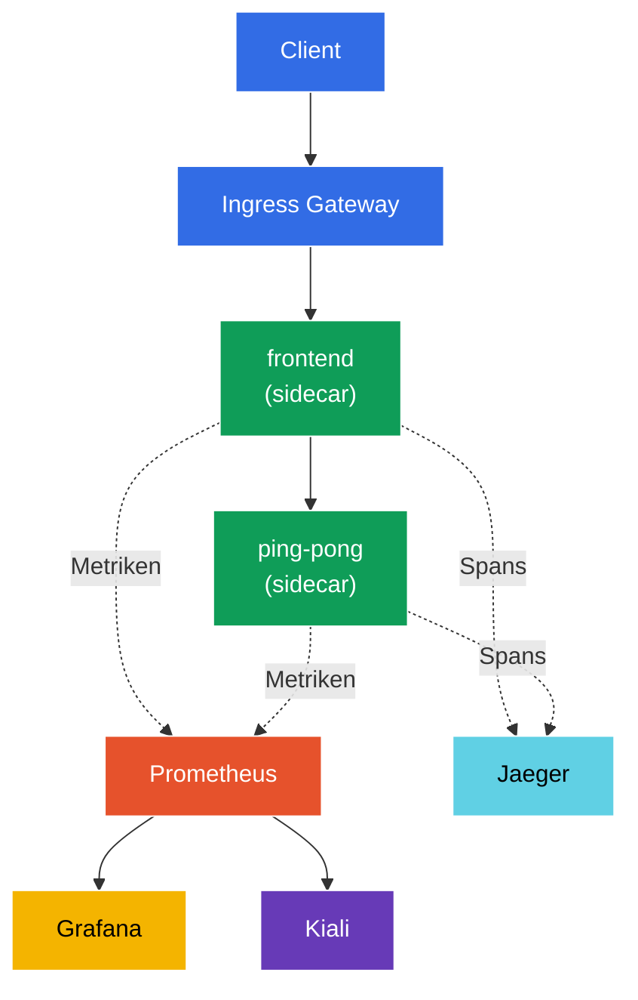

[RU version](README_RU.MD) · [Eng version](README.MD) · [Versión en español](README_ES.MD) · [Version française](README_FR.MD)

# Lab 08 - Observability: Prometheus / Jaeger / Kiali

Stellen Sie sich vor: Im Cluster laufen mehrere Services, und plötzlich „hakt" etwas. Wo genau? Welcher Service ruft wen auf, wie viele Fehler treten auf, welche Latenz gibt es? Istio sammelt diese gesamte Telemetrie automatisch (der Sidecar-Proxy sieht jede Anfrage), aber um sie zu sehen, braucht man Werkzeuge:
- **Prometheus** - Erfassung und Speicherung von Metriken (RPS, Antwortcodes, Latenzen).
- **Jaeger** - verteiltes Tracing: der Weg einer einzelnen Anfrage durch alle Services.
- **Kiali** - Visualisierung des Mesh: Service-Graph, Zustand, Traffic-Flüsse.
- **Grafana** - Dashboards auf Basis der Prometheus-Metriken.

In diesem Lab stellen wir diesen Stack bereit, erzeugen Traffic und überzeugen uns davon, dass Metriken, Traces und Service-Graph tatsächlich gesammelt werden - ganz ohne Instrumentierung des Anwendungscodes.

### Wie das funktioniert (Gesamtschema)



## Ziel

- Die Observability-Addons von Istio bereitstellen: Prometheus, Grafana, Jaeger, Kiali.
- 100 % Trace-Sampling über die Telemetry API aktivieren.
- Traffic erzeugen und Metriken (Prometheus), Traces (Jaeger) und Service-Graph (Kiali) prüfen.

> Istio ist hier bereits installiert (Demo-Profil), und das Tracing ist so konfiguriert, dass Spans an `zipkin.istio-system:9411` gesendet werden (diesen Endpoint stellt das Jaeger-Addon bereit).

## Schritt 1. Aktivierung der Sidecar-Injektion

```bash
kubectl label namespace default istio-injection=enabled --overwrite
```

Die gesamte Telemetrie entsteht im Sidecar-Proxy: Envoy zählt die Metriken jeder Anfrage und erzeugt Tracing-Spans. Ohne Sidecar gibt es keine Observability.

## Schritt 2. Installation der Anwendung und des Eingangspunkts

Wir stellen eine zweistufige Anwendung bereit: `frontend` ruft bei jeder Anfrage `ping-pong` auf. Ein solcher Aufruf liefert einen „zweigliedrigen" Trace (frontend → ping-pong) sowie Metriken für beide Services. Außerdem wird `curl-client` gestartet - von ihm aus fragen wir die Prometheus-API innerhalb des Mesh ab.

```bash
kubectl apply -f https://raw.githubusercontent.com/ViktorUJ/cks/refs/heads/master/tasks/ica/labs/08/k8s-1/scripts/1.yaml
kubectl rollout restart deployment -n default
```

Wir erstellen den Eingang über das Gateway:

```bash
vim gateway.yaml
```

```yaml
apiVersion: networking.istio.io/v1
kind: Gateway
metadata:
  name: main-gateway
  namespace: default
spec:
  selector:
    istio: ingressgateway
  servers:
  - port:
      number: 80
      name: http
      protocol: HTTP
    hosts:
    - "myapp.local"
---
apiVersion: networking.istio.io/v1
kind: VirtualService
metadata:
  name: frontend-vs
  namespace: default
spec:
  hosts:
  - "myapp.local"
  gateways:
  - main-gateway
  http:
  - route:
    - destination:
        host: frontend
        port:
          number: 8080
```

```bash
kubectl apply -f gateway.yaml
```

## Schritt 3. Installation der Observability-Addons

Istio liefert fertige Addon-Manifeste in `samples/addons`. Wir installieren alle vier:

```bash
REL=release-1.29
kubectl apply -f https://raw.githubusercontent.com/istio/istio/$REL/samples/addons/prometheus.yaml
kubectl apply -f https://raw.githubusercontent.com/istio/istio/$REL/samples/addons/grafana.yaml
kubectl apply -f https://raw.githubusercontent.com/istio/istio/$REL/samples/addons/jaeger.yaml
kubectl apply -f https://raw.githubusercontent.com/istio/istio/$REL/samples/addons/kiali.yaml
```

Wir warten auf die Bereitschaft:

```bash
kubectl get pods -n istio-system | grep -E 'prometheus|grafana|jaeger|kiali'
```

```
grafana-xxxx        1/1   Running
jaeger-xxxx         1/1   Running
kiali-xxxx          1/1   Running
prometheus-xxxx     2/2   Running
```

**Was installiert wird:**
- **prometheus.yaml** - Prometheus, konfiguriert zum Scrapen der Istio-Metriken (`istio_requests_total`, `istio_request_duration_milliseconds` u. a.).
- **jaeger.yaml** - Jaeger all-in-one; zusätzlich zur UI startet es den Service `zipkin` in `istio-system` (genau dorthin sendet meshConfig die Spans).
- **kiali.yaml** - Kiali, das die Metriken aus Prometheus liest und den Service-Graph erstellt.
- **grafana.yaml** - Grafana mit vorkonfigurierten Istio-Dashboards.

## Schritt 4. Aktivierung des Tracings (100 % Sampling)

Standardmäßig sampelt Istio nur ~1 % der Anfragen in Traces. Für dieses Lab drehen wir über die **Telemetry API** auf 100 % und geben den Provider `zipkin` an (er ist in meshConfig bei der Istio-Installation konfiguriert).

```bash
vim telemetry.yaml
```

```yaml
apiVersion: telemetry.istio.io/v1
kind: Telemetry
metadata:
  name: mesh-default
  namespace: istio-system   # im Root-Namespace des Mesh = gilt für das gesamte Mesh
spec:
  tracing:
  - providers:
    - name: zipkin
    randomSamplingPercentage: 100.0
```

```bash
kubectl apply -f telemetry.yaml
```

**Erläuterung:** `Telemetry` im Namespace `istio-system` ohne `selector` ist die Standardrichtlinie für das gesamte Mesh. `providers.name: zipkin` verweist auf den `extensionProvider`, der bei der Istio-Installation festgelegt wurde. `randomSamplingPercentage: 100` bedeutet, dass jede Anfrage in die Traces gelangt (praktisch für Demos; in Produktion setzt man 1–5 %).

## Schritt 5. Wir erzeugen Traffic

Damit es in den Metriken und Traces etwas zu zeigen gibt, schicken wir Anfragen durch:

```bash
for i in $(seq 50); do curl -s -o /dev/null http://myapp.local:32080; done
```

## Schritt 6. Metriken (Prometheus)

Wir fragen den Zähler der Anfragen an `ping-pong` über die HTTP-API von Prometheus ab (vom Pod `curl-client` innerhalb des Mesh):

```bash
kubectl exec -n default deploy/curl-client -c curl -- \
  curl -s 'http://prometheus.istio-system:9090/api/v1/query?query=istio_requests_total{destination_service_name="ping-pong"}' | jq '.data.result | length'
```

Ein Ergebnis ungleich null bedeutet, dass Prometheus die Istio-Metriken sammelt. Jede Serie `istio_requests_total` ist mit Labels wie `source_workload`, `destination_workload`, `response_code` usw. versehen - das sind die „goldenen Signale" des Mesh.

Für den Browser (optional):

```bash
kubectl -n istio-system port-forward svc/prometheus 9090:9090
# öffnen: http://localhost:9090
```

## Schritt 7. Tracing (Jaeger)

Wir prüfen, dass Jaeger unsere Services kennt:

```bash
kubectl exec -n default deploy/curl-client -c curl -- \
  curl -s 'http://tracing.istio-system/jaeger/api/services' | jq .
```

In der Liste sollten `frontend` und `ping-pong` erscheinen. Wenn Sie einen Trace in der UI öffnen, sehen Sie die Span-Kette `ingressgateway → frontend → ping-pong` mit der Latenz auf jedem Abschnitt.

Für den Browser (optional):

```bash
kubectl -n istio-system port-forward svc/tracing 8080:80
# öffnen: http://localhost:8080/jaeger
```

## Schritt 8. Service-Graph (Kiali)

Kiali erstellt einen anschaulichen Graph des Mesh auf Basis der Prometheus-Metriken:

```bash
kubectl -n istio-system port-forward svc/kiali 20001:20001
# öffnen: http://localhost:20001  ->  Graph  ->  Namespace "default"
```

Sie sehen den Graph `ingressgateway → frontend → ping-pong` mit Pfeilen, auf denen RPS, Fehleranteil und Latenzen in Echtzeit angezeigt werden.

## Fazit

| Werkzeug | Was es liefert | Wie wir es geprüft haben |
|-----------|----------|---------------|
| Prometheus | Metriken (RPS, Codes, Latenzen) | API-Abfrage `istio_requests_total` |
| Jaeger | verteilte Traces | Liste der Services + Span-Kette |
| Kiali | Service-Graph des Mesh | visueller Graph des Namespace |
| Grafana | Dashboards auf Basis der Metriken | vorkonfigurierte Istio-Dashboards |

**Zentrale Erkenntnis:** Istio liefert Observability „out of the box" - der Sidecar-Proxy exportiert automatisch Metriken und Spans für **jede** Anfrage, ohne Änderung des Anwendungscodes. Die Addons (Prometheus/Jaeger/Kiali/Grafana) sammeln und visualisieren diese Daten lediglich. Die Telemetry API ermöglicht eine feine Einstellung, was genau gesammelt wird (zum Beispiel den Prozentsatz des Trace-Samplings).
