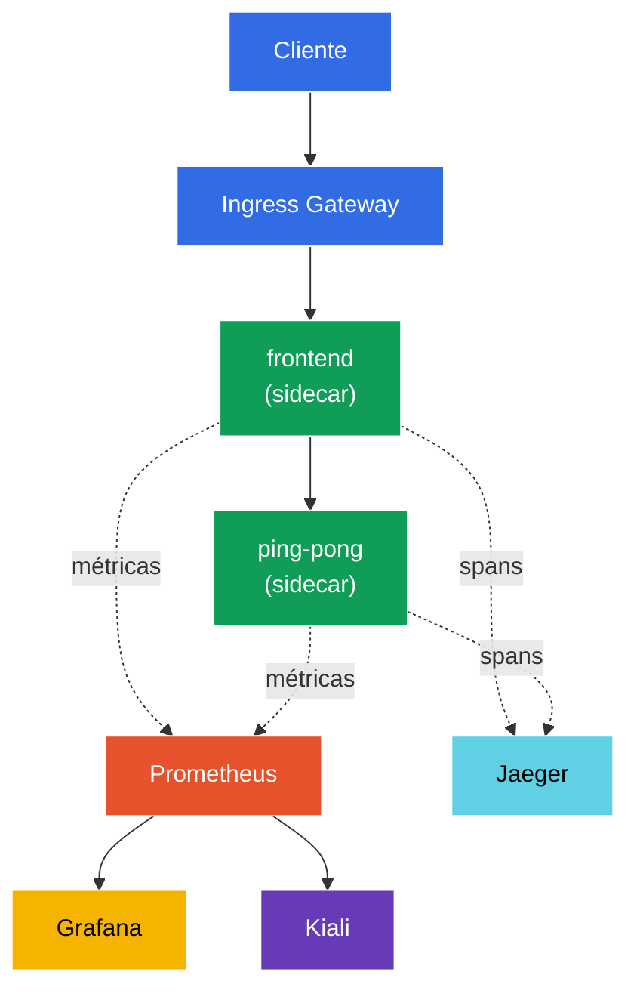

[RU version](README_RU.MD) · [Eng version](README.MD) · [Version française](README_FR.MD) · [Deutsche Version](README_DE.MD)

# Lab 08 - Observability: Prometheus / Jaeger / Kiali

Imagina lo siguiente: en el clúster funcionan varios servicios y, de repente, algo «va lento». ¿Dónde exactamente? ¿Qué servicio llama a cuál, cuántos errores hay, qué latencia? Istio recopila toda esta telemetría automáticamente (el proxy sidecar ve cada petición), pero para poder verla se necesitan herramientas:
- **Prometheus** - recopilación y almacenamiento de métricas (RPS, códigos de respuesta, latencias).
- **Jaeger** - trazado distribuido: el recorrido de una petición a través de todos los servicios.
- **Kiali** - visualización de la malla: grafo de servicios, salud, flujos de tráfico.
- **Grafana** - dashboards sobre las métricas de Prometheus.

En esta práctica desplegaremos esta pila, generaremos tráfico y comprobaremos que las métricas, trazas y el grafo de servicios se recopilan realmente - sin instrumentar en absoluto el código de la aplicación.

### Cómo funciona (esquema general)



## Objetivo

- Desplegar los addons de observabilidad de Istio: Prometheus, Grafana, Jaeger, Kiali.
- Activar el muestreo de trazas al 100% mediante la Telemetry API.
- Generar tráfico y comprobar las métricas (Prometheus), las trazas (Jaeger) y el grafo de servicios (Kiali).

> Istio aquí ya está instalado (perfil demo), y el trazado está configurado para enviar spans a `zipkin.istio-system:9411` (este endpoint lo proporciona el addon Jaeger).

## Paso 1. Activación de la inyección de sidecar

```bash
kubectl label namespace default istio-injection=enabled --overwrite
```

Toda la telemetría nace en el proxy sidecar: Envoy cuenta las métricas de cada petición y genera los spans de trazado. Sin sidecar no habrá observabilidad.

## Paso 2. Instalación de la aplicación y del punto de entrada

Desplegamos una aplicación de dos niveles: `frontend` llama a `ping-pong` en cada petición. Tal llamada produce una traza «de dos tramos» (frontend → ping-pong) y métricas de ambos servicios. También se levanta `curl-client`, desde el cual consultaremos la API de Prometheus desde dentro de la malla.

```bash
kubectl apply -f https://raw.githubusercontent.com/ViktorUJ/cks/refs/heads/master/tasks/ica/labs/08/k8s-1/scripts/1.yaml
kubectl rollout restart deployment -n default
```

Creamos la entrada mediante Gateway:

```bash
vim gateway.yaml
```

```yaml
apiVersion: networking.istio.io/v1
kind: Gateway
metadata:
  name: main-gateway
  namespace: default
spec:
  selector:
    istio: ingressgateway
  servers:
  - port:
      number: 80
      name: http
      protocol: HTTP
    hosts:
    - "myapp.local"
---
apiVersion: networking.istio.io/v1
kind: VirtualService
metadata:
  name: frontend-vs
  namespace: default
spec:
  hosts:
  - "myapp.local"
  gateways:
  - main-gateway
  http:
  - route:
    - destination:
        host: frontend
        port:
          number: 8080
```

```bash
kubectl apply -f gateway.yaml
```

## Paso 3. Instalación de los addons de observabilidad

Istio proporciona manifiestos de addons listos para usar en `samples/addons`. Instalamos los cuatro:

```bash
REL=release-1.29
kubectl apply -f https://raw.githubusercontent.com/istio/istio/$REL/samples/addons/prometheus.yaml
kubectl apply -f https://raw.githubusercontent.com/istio/istio/$REL/samples/addons/grafana.yaml
kubectl apply -f https://raw.githubusercontent.com/istio/istio/$REL/samples/addons/jaeger.yaml
kubectl apply -f https://raw.githubusercontent.com/istio/istio/$REL/samples/addons/kiali.yaml
```

Esperamos a que estén listos:

```bash
kubectl get pods -n istio-system | grep -E 'prometheus|grafana|jaeger|kiali'
```

```
grafana-xxxx        1/1   Running
jaeger-xxxx         1/1   Running
kiali-xxxx          1/1   Running
prometheus-xxxx     2/2   Running
```

**Qué se instala:**
- **prometheus.yaml** - Prometheus, configurado para hacer scrape de las métricas de Istio (`istio_requests_total`, `istio_request_duration_milliseconds`, etc.).
- **jaeger.yaml** - Jaeger all-in-one; además de la UI levanta el servicio `zipkin` en `istio-system` (precisamente allí meshConfig envía los spans).
- **kiali.yaml** - Kiali, que lee las métricas de Prometheus y construye el grafo de servicios.
- **grafana.yaml** - Grafana con dashboards de Istio preconfigurados.

## Paso 4. Activación del trazado (muestreo al 100%)

Por defecto Istio muestrea solo ~1% de las peticiones en trazas. Para la práctica lo subiremos al 100% mediante la **Telemetry API**, indicando el proveedor `zipkin` (configurado en meshConfig en la instalación de Istio).

```bash
vim telemetry.yaml
```

```yaml
apiVersion: telemetry.istio.io/v1
kind: Telemetry
metadata:
  name: mesh-default
  namespace: istio-system   # en el namespace raíz de la malla = se aplica a toda la malla
spec:
  tracing:
  - providers:
    - name: zipkin
    randomSamplingPercentage: 100.0
```

```bash
kubectl apply -f telemetry.yaml
```

**Análisis:** `Telemetry` en el namespace `istio-system` sin `selector` es la política por defecto para toda la malla. `providers.name: zipkin` hace referencia al `extensionProvider` definido durante la instalación de Istio. `randomSamplingPercentage: 100` significa que cada petición entrará en las trazas (cómodo para la demo; en producción se pone 1–5%).

## Paso 5. Generamos tráfico

Para que haya algo que mostrar en las métricas y trazas, lanzamos peticiones:

```bash
for i in $(seq 50); do curl -s -o /dev/null http://myapp.local:32080; done
```

## Paso 6. Métricas (Prometheus)

Consultamos el contador de peticiones a `ping-pong` mediante la API HTTP de Prometheus (desde el pod `curl-client` dentro de la malla):

```bash
kubectl exec -n default deploy/curl-client -c curl -- \
  curl -s 'http://prometheus.istio-system:9090/api/v1/query?query=istio_requests_total{destination_service_name="ping-pong"}' | jq '.data.result | length'
```

Un resultado distinto de cero significa que Prometheus recopila las métricas de Istio. Cada serie `istio_requests_total` está etiquetada con `source_workload`, `destination_workload`, `response_code`, etc. - estas son las «señales de oro» de la malla.

Para el navegador (opcional):

```bash
kubectl -n istio-system port-forward svc/prometheus 9090:9090
# abrir http://localhost:9090
```

## Paso 7. Trazado (Jaeger)

Comprobamos que Jaeger conoce nuestros servicios:

```bash
kubectl exec -n default deploy/curl-client -c curl -- \
  curl -s 'http://tracing.istio-system/jaeger/api/services' | jq .
```

En la lista deberían aparecer `frontend` y `ping-pong`. Al abrir una traza en la UI, verás la cadena de spans `ingressgateway → frontend → ping-pong` con la latencia de cada tramo.

Para el navegador (opcional):

```bash
kubectl -n istio-system port-forward svc/tracing 8080:80
# abrir http://localhost:8080/jaeger
```

## Paso 8. Grafo de servicios (Kiali)

Kiali construye un grafo visual de la malla sobre las métricas de Prometheus:

```bash
kubectl -n istio-system port-forward svc/kiali 20001:20001
# abrir http://localhost:20001  ->  Graph  ->  namespace "default"
```

Verás el grafo `ingressgateway → frontend → ping-pong` con flechas en las que se muestran RPS, porcentaje de errores y latencias en tiempo real.

## Resumen

| Herramienta | Qué aporta | Cómo lo comprobamos |
|-----------|----------|---------------|
| Prometheus | métricas (RPS, códigos, latencias) | consulta a la API `istio_requests_total` |
| Jaeger | trazas distribuidas | lista de servicios + cadena de spans |
| Kiali | grafo de servicios de la malla | grafo visual del namespace |
| Grafana | dashboards sobre las métricas | dashboards de Istio preconfigurados |

**Conclusión clave:** Istio ofrece observabilidad «de fábrica» - el proxy sidecar exporta automáticamente métricas y spans de **cada** petición, sin cambiar el código de la aplicación. Los addons (Prometheus/Jaeger/Kiali/Grafana) solo recopilan y visualizan estos datos. La Telemetry API permite ajustar con precisión qué recopilar exactamente (por ejemplo, el porcentaje de muestreo de trazas).
