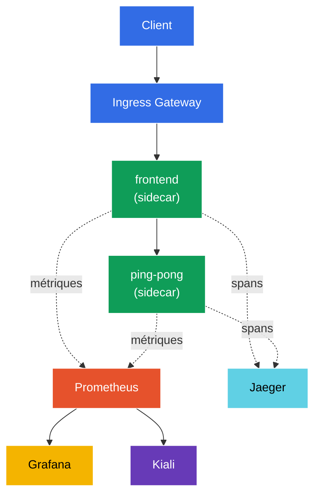

[RU version](README_RU.MD) · [Eng version](README.MD) · [Versión en español](README_ES.MD) · [Deutsche Version](README_DE.MD)

# Lab 08 - Observability: Prometheus / Jaeger / Kiali

Imaginez : plusieurs services tournent dans le cluster et soudain, quelque chose « rame ». Où exactement ? Quel service appelle qui, combien d'erreurs, quelle latence ? Istio collecte toute cette télémétrie automatiquement (le proxy sidecar voit chaque requête), mais pour la visualiser, il faut des outils :
- **Prometheus** - collecte et stockage des métriques (RPS, codes de réponse, latences).
- **Jaeger** - tracing distribué : le parcours d'une requête à travers tous les services.
- **Kiali** - visualisation du maillage : graphe des services, santé, flux de trafic.
- **Grafana** - tableaux de bord au-dessus des métriques Prometheus.

Dans ce lab, nous allons déployer cette stack, générer du trafic et vérifier que les métriques, les traces et le graphe des services sont réellement collectés - sans aucune instrumentation du code de l'application.

### Comment ça marche (schéma général)



## Objectif

- Déployer les add-ons d'observabilité d'Istio : Prometheus, Grafana, Jaeger, Kiali.
- Activer l'échantillonnage des traces à 100 % via l'API Telemetry.
- Générer du trafic et vérifier les métriques (Prometheus), les traces (Jaeger) et le graphe des services (Kiali).

> Istio est déjà installé ici (profil demo), et le tracing est configuré pour envoyer les spans vers `zipkin.istio-system:9411` (cet endpoint est fourni par l'add-on Jaeger).

## Infrastructure

L'environnement est déployé dans AWS (`eu-central-1`) via Terragrunt et se compose de :

| Composant  | Description                                          |
|------------|---------------------------------------------------|
| `vpc`      | VPC `10.10.0.0/16` avec des sous-réseaux publics          |
| `ssh-keys` | Clés SSH pour l'accès aux nœuds                      |
| `k8s-1`    | Kubernetes `1.35.2` (kubeadm) avec Istio installé (profil demo) |
| `worker`   | Machine de travail avec `kubectl` et accès au cluster   |

Instances : `t4g.medium` (master) Ubuntu `22.04`

## Déploiement

```bash
TASK=08 make run_ica_task
```

## Étape 1. Activation de l'injection du sidecar

```bash
kubectl label namespace default istio-injection=enabled --overwrite
```

Toute la télémétrie naît dans le proxy sidecar : Envoy compte les métriques de chaque requête et génère les spans de tracing. Sans sidecar, pas d'observabilité.

## Étape 2. Installation de l'application et du point d'entrée

On déploie une application à deux niveaux : `frontend` appelle `ping-pong` à chaque requête. Cet appel produit une trace « à deux maillons » (frontend → ping-pong) et des métriques sur les deux services. On lance aussi `curl-client` - depuis lequel on interrogera l'API de Prometheus à l'intérieur du maillage.

```bash
kubectl apply -f https://raw.githubusercontent.com/ViktorUJ/cks/refs/heads/master/tasks/ica/labs/08/k8s-1/scripts/1.yaml
kubectl rollout restart deployment -n default
```

On crée l'entrée via un Gateway :

```bash
vim gateway.yaml
```

```yaml
apiVersion: networking.istio.io/v1
kind: Gateway
metadata:
  name: main-gateway
  namespace: default
spec:
  selector:
    istio: ingressgateway
  servers:
  - port:
      number: 80
      name: http
      protocol: HTTP
    hosts:
    - "myapp.local"
---
apiVersion: networking.istio.io/v1
kind: VirtualService
metadata:
  name: frontend-vs
  namespace: default
spec:
  hosts:
  - "myapp.local"
  gateways:
  - main-gateway
  http:
  - route:
    - destination:
        host: frontend
        port:
          number: 8080
```

```bash
kubectl apply -f gateway.yaml
```

## Étape 3. Installation des add-ons d'observabilité

Istio fournit des manifestes d'add-ons prêts à l'emploi dans `samples/addons`. On installe les quatre :

```bash
REL=release-1.29
kubectl apply -f https://raw.githubusercontent.com/istio/istio/$REL/samples/addons/prometheus.yaml
kubectl apply -f https://raw.githubusercontent.com/istio/istio/$REL/samples/addons/grafana.yaml
kubectl apply -f https://raw.githubusercontent.com/istio/istio/$REL/samples/addons/jaeger.yaml
kubectl apply -f https://raw.githubusercontent.com/istio/istio/$REL/samples/addons/kiali.yaml
```

On attend que tout soit prêt :

```bash
kubectl get pods -n istio-system | grep -E 'prometheus|grafana|jaeger|kiali'
```

```
grafana-xxxx        1/1   Running
jaeger-xxxx         1/1   Running
kiali-xxxx          1/1   Running
prometheus-xxxx     2/2   Running
```

**Ce qui est installé :**
- **prometheus.yaml** - Prometheus, configuré pour scraper les métriques d'Istio (`istio_requests_total`, `istio_request_duration_milliseconds`, etc.).
- **jaeger.yaml** - Jaeger all-in-one ; en plus de l'UI, il lance le service `zipkin` dans `istio-system` (c'est précisément là que meshConfig envoie les spans).
- **kiali.yaml** - Kiali, qui lit les métriques de Prometheus et construit le graphe des services.
- **grafana.yaml** - Grafana avec des tableaux de bord Istio préconfigurés.

## Étape 4. Activation du tracing (échantillonnage à 100 %)

Par défaut, Istio n'échantillonne qu'environ 1 % des requêtes dans les traces. Pour ce lab, on pousse à 100 % via l'**API Telemetry**, en indiquant le fournisseur `zipkin` (configuré dans meshConfig lors de l'installation d'Istio).

```bash
vim telemetry.yaml
```

```yaml
apiVersion: telemetry.istio.io/v1
kind: Telemetry
metadata:
  name: mesh-default
  namespace: istio-system   # dans le namespace racine du mesh = s'applique à tout le mesh
spec:
  tracing:
  - providers:
    - name: zipkin
    randomSamplingPercentage: 100.0
```

```bash
kubectl apply -f telemetry.yaml
```

**Décryptage :** un `Telemetry` dans le namespace `istio-system` sans `selector` est la politique par défaut pour tout le maillage. `providers.name: zipkin` référence l'`extensionProvider` défini lors de l'installation d'Istio. `randomSamplingPercentage: 100` signifie que chaque requête finira dans les traces (pratique pour une démo ; en production on met 1 à 5 %).

## Étape 5. Génération de trafic

Pour avoir quelque chose à afficher dans les métriques et les traces, on lance des requêtes :

```bash
for i in $(seq 50); do curl -s -o /dev/null http://myapp.local:32080; done
```

## Étape 6. Métriques (Prometheus)

On interroge le compteur de requêtes vers `ping-pong` via l'API HTTP de Prometheus (depuis le pod `curl-client` à l'intérieur du maillage) :

```bash
kubectl exec -n default deploy/curl-client -c curl -- \
  curl -s 'http://prometheus.istio-system:9090/api/v1/query?query=istio_requests_total{destination_service_name="ping-pong"}' | jq '.data.result | length'
```

Un résultat non nul signifie que Prometheus collecte les métriques d'Istio. Chaque série `istio_requests_total` est étiquetée avec les labels `source_workload`, `destination_workload`, `response_code`, etc. - ce sont les « golden signals » du maillage.

Pour le navigateur (optionnel) :

```bash
kubectl -n istio-system port-forward svc/prometheus 9090:9090
# ouvrir http://localhost:9090
```

## Étape 7. Tracing (Jaeger)

On vérifie que Jaeger connaît nos services :

```bash
kubectl exec -n default deploy/curl-client -c curl -- \
  curl -s 'http://tracing.istio-system/jaeger/api/services' | jq .
```

`frontend` et `ping-pong` doivent apparaître dans la liste. En ouvrant une trace dans l'UI, vous verrez la chaîne de spans `ingressgateway → frontend → ping-pong` avec la latence de chaque segment.

Pour le navigateur (optionnel) :

```bash
kubectl -n istio-system port-forward svc/tracing 8080:80
# ouvrir http://localhost:8080/jaeger
```

## Étape 8. Graphe des services (Kiali)

Kiali construit un graphe visuel du maillage au-dessus des métriques Prometheus :

```bash
kubectl -n istio-system port-forward svc/kiali 20001:20001
# ouvrir http://localhost:20001  ->  Graph  ->  namespace "default"
```

Vous verrez le graphe `ingressgateway → frontend → ping-pong` avec des flèches affichant le RPS, le taux d'erreurs et les latences en temps réel.

## Bilan

| Outil | Ce qu'il apporte | Comment on l'a vérifié |
|-----------|----------|---------------|
| Prometheus | métriques (RPS, codes, latences) | requête API `istio_requests_total` |
| Jaeger | traces distribuées | liste des services + chaîne de spans |
| Kiali | graphe des services du maillage | graphe visuel du namespace |
| Grafana | tableaux de bord au-dessus des métriques | tableaux de bord Istio préconfigurés |

**À retenir :** Istio offre l'observabilité « clé en main » - le proxy sidecar exporte automatiquement les métriques et les spans pour **chaque** requête, sans modifier le code de l'application. Les add-ons (Prometheus/Jaeger/Kiali/Grafana) ne font que collecter et visualiser ces données. L'API Telemetry permet de régler finement ce qui est collecté (par exemple le pourcentage d'échantillonnage des traces).
