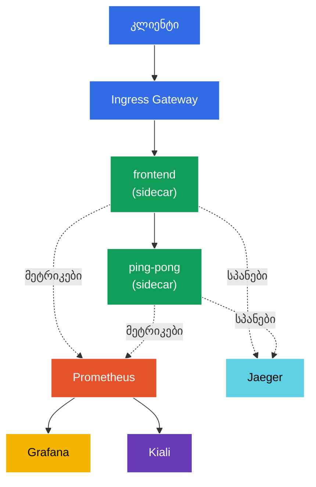

[Русская версия](README_RU.MD) · [Eng version](README.MD) · [Versión en español](README_ES.MD) · [Version française](README_FR.MD) · [Deutsche Version](README_DE.MD) · [繁體中文版](README_TW.MD) · [日本語版](README_JP.MD)

# Lab 08 - დაკვირვებადობა: Prometheus / Jaeger / Kiali

> [საცნობარო გადაწყვეტა](worker/files/solutions/1_GE.MD)

წარმოიდგინეთ: კლასტერში რამდენიმე სერვისი მუშაობს და მოულოდნელად რაღაც „ნელდება“. კონკრეტულად სად? რომელი სერვისი რომელს მიმართავს, რამდენი შეცდომაა, როგორია დაყოვნება? Istio მთელ ამ ტელემეტრიას ავტომატურად აგროვებს (sidecar-პროქსი თითოეულ მოთხოვნას ხედავს), მაგრამ მის სანახავად ინსტრუმენტებია საჭირო:
- **Prometheus** - მეტრიკების შეგროვება და შენახვა (RPS, პასუხის კოდები, დაყოვნებები).
- **Jaeger** - განაწილებული ტრეისინგი: ერთი მოთხოვნის გზა ყველა სერვისის გავლით.
- **Kiali** - mesh-ის ვიზუალიზაცია: სერვისების გრაფი, მდგომარეობა, ტრაფიკის ნაკადები.
- **Grafana** - Prometheus-ის მეტრიკებზე დაფუძნებული დეშბორდები.

ამ ლაბორატორიაში ჩვენ გავშლით ამ სტეკს, დავაგენერირებთ ტრაფიკს და დავრწმუნდებით, რომ მეტრიკები, ტრეისები და სერვისების გრაფი მართლაც გროვდება - აპლიკაციის კოდში რაიმე ინსტრუმენტირების გარეშე.

### როგორ მუშაობს ეს (ზოგადი სქემა)



## მიზანი

- Istio-ს დაკვირვებადობის ადონების გაშლა: Prometheus, Grafana, Jaeger, Kiali.
- Telemetry API-ის საშუალებით ტრეისების 100%-იანი სემპლირების ჩართვა.
- ტრაფიკის დაგენერირება და მეტრიკების (Prometheus), ტრეისების (Jaeger) და სერვისების გრაფის (Kiali) შემოწმება.

> აქ Istio უკვე დაინსტალირებულია (demo-პროფილი), ხოლო ტრეისინგი კონფიგურირებულია სპანების `zipkin.istio-system:9411`-ზე გასაგზავნად (ამ endpoint-ს Jaeger-ის ადონი უზრუნველყოფს).

## ინფრასტრუქტურა

გარემო Terragrunt-ის საშუალებით AWS-ში (`eu-central-1`) იშლება და შედგება შემდეგი კომპონენტებისგან:

| კომპონენტი  | აღწერა                                          |
|------------|---------------------------------------------------|
| `vpc`      | VPC `10.10.0.0/16` საჯარო ქვექსელებით          |
| `ssh-keys` | SSH-გასაღებები ნოდებზე წვდომისთვის                      |
| `k8s-1`    | Kubernetes `1.35.2` (kubeadm) დაინსტალირებული Istio-თი (demo-პროფილი) |
| `worker`   | სამუშაო მანქანა `kubectl`-ით და კლასტერზე წვდომით   |

ინსტანსები: `t4g.medium` (master) Ubuntu `22.04`

## გაშლა

```bash
TASK=08 make run_ica_task
```

## ნაბიჯი 1. sidecar-ინექციის ჩართვა

```bash
kubectl label namespace default istio-injection=enabled --overwrite
```

მთელი ტელემეტრია sidecar-პროქსიში წარმოიქმნება: Envoy თითოეული მოთხოვნის მეტრიკებს ითვლის და ტრეისინგის სპანებს აგენერირებს. sidecar-ის გარეშე დაკვირვებადობა არ იქნება.

## ნაბიჯი 2. აპლიკაციისა და შესასვლელი წერტილის ინსტალაცია

ვშლით ორდონიან აპლიკაციას: თითოეულ მოთხოვნაზე `frontend` იძახებს `ping-pong`-ს. ასეთი გამოძახება ქმნის „ორგოლიან“ ტრეისს (frontend → ping-pong) და მეტრიკებს ორივე სერვისისთვის. ასევე გაეშვება `curl-client` - მისი საშუალებით mesh-ის შიგნიდან Prometheus-ის API-ს გამოვკითხავთ.

```bash
kubectl apply -f https://raw.githubusercontent.com/ViktorUJ/cks/refs/heads/master/tasks/ica/labs/08/k8s-1/scripts/1.yaml
kubectl rollout restart deployment -n default
```

Gateway-ის საშუალებით ვქმნით შესასვლელს:

```bash
vim gateway.yaml
```

```yaml
apiVersion: networking.istio.io/v1
kind: Gateway
metadata:
  name: main-gateway
  namespace: default
spec:
  selector:
    istio: ingressgateway
  servers:
  - port:
      number: 80
      name: http
      protocol: HTTP
    hosts:
    - "myapp.local"
---
apiVersion: networking.istio.io/v1
kind: VirtualService
metadata:
  name: frontend-vs
  namespace: default
spec:
  hosts:
  - "myapp.local"
  gateways:
  - main-gateway
  http:
  - route:
    - destination:
        host: frontend
        port:
          number: 8080
```

```bash
kubectl apply -f gateway.yaml
```

## ნაბიჯი 3. დაკვირვებადობის ადონების ინსტალაცია

Istio `samples/addons`-ში ადონების მზა მანიფესტებს გვთავაზობს. ვაყენებთ ოთხივეს:

```bash
REL=release-1.29
kubectl apply -f https://raw.githubusercontent.com/istio/istio/$REL/samples/addons/prometheus.yaml
kubectl apply -f https://raw.githubusercontent.com/istio/istio/$REL/samples/addons/grafana.yaml
kubectl apply -f https://raw.githubusercontent.com/istio/istio/$REL/samples/addons/jaeger.yaml
kubectl apply -f https://raw.githubusercontent.com/istio/istio/$REL/samples/addons/kiali.yaml
```

ველოდებით მზადყოფნას:

```bash
kubectl get pods -n istio-system | grep -E 'prometheus|grafana|jaeger|kiali'
```

```
grafana-xxxx        1/1   Running
jaeger-xxxx         1/1   Running
kiali-xxxx          1/1   Running
prometheus-xxxx     2/2   Running
```

**რა ინსტალირდება:**
- **prometheus.yaml** - Prometheus, რომელიც Istio-ს მეტრიკების (`istio_requests_total`, `istio_request_duration_milliseconds` და სხვ.) scrape-ისთვისაა კონფიგურირებული.
- **jaeger.yaml** - Jaeger all-in-one; UI-ს გარდა `istio-system`-ში უშვებს `zipkin` სერვისს (meshConfig სპანებს სწორედ იქ აგზავნის).
- **kiali.yaml** - Kiali, რომელიც Prometheus-იდან მეტრიკებს კითხულობს და სერვისების გრაფს აგებს.
- **grafana.yaml** - Grafana Istio-ს წინასწარ კონფიგურირებული დეშბორდებით.

## ნაბიჯი 4. ტრეისინგის ჩართვა (100%-იანი სემპლირება)

ნაგულისხმევად Istio მოთხოვნების მხოლოდ ~1%-ს არჩევს ტრეისებისთვის. ლაბორატორიისთვის **Telemetry API**-ის საშუალებით მაჩვენებელს 100%-მდე გავზრდით და მივუთითებთ `zipkin` პროვაიდერს (Istio-ს ინსტალაციისას ის meshConfig-ში კონფიგურირდა).

```bash
vim telemetry.yaml
```

```yaml
apiVersion: telemetry.istio.io/v1
kind: Telemetry
metadata:
  name: mesh-default
  namespace: istio-system   # mesh-ის ძირეულ namespace-ში = გამოიყენება მთელ mesh-ზე
spec:
  tracing:
  - providers:
    - name: zipkin
    randomSamplingPercentage: 100.0
```

```bash
kubectl apply -f telemetry.yaml
```

**განხილვა:** `Telemetry` `istio-system` namespace-ში `selector`-ის გარეშე მთელი mesh-ის ნაგულისხმევი პოლიტიკაა. `providers.name: zipkin` მიუთითებს Istio-ს ინსტალაციისას განსაზღვრულ `extensionProvider`-ზე. `randomSamplingPercentage: 100` ნიშნავს, რომ თითოეული მოთხოვნა მოხვდება ტრეისებში (მოსახერხებელია დემოსთვის; production-ში 1–5%-ს აყენებენ).

## ნაბიჯი 5. ტრაფიკის გენერირება

მეტრიკებსა და ტრეისებში საჩვენებელი მონაცემების შესაქმნელად მოთხოვნებს ვუშვებთ:

```bash
for i in $(seq 50); do curl -s -o /dev/null http://myapp.local:32080; done
```

## ნაბიჯი 6. მეტრიკები (Prometheus)

Prometheus-ის HTTP API-ის საშუალებით `ping-pong`-ის მოთხოვნების მთვლელს ვკითხულობთ (mesh-ის შიგნით არსებული `curl-client` პოდიდან):

```bash
kubectl exec -n default deploy/curl-client -c curl -- \
  curl -s 'http://prometheus.istio-system:9090/api/v1/query?query=istio_requests_total{destination_service_name="ping-pong"}' | jq '.data.result | length'
```

ნულისგან განსხვავებული შედეგი ნიშნავს, რომ Prometheus Istio-ს მეტრიკებს აგროვებს. თითოეულ `istio_requests_total` სერიას აქვს `source_workload`, `destination_workload`, `response_code` და სხვა იარლიყები - სწორედ ეს არის mesh-ის „ოქროს სიგნალები“.

ბრაუზერისთვის (არასავალდებულო):

```bash
kubectl -n istio-system port-forward svc/prometheus 9090:9090
# გახსენით http://localhost:9090
```

## ნაბიჯი 7. ტრეისინგი (Jaeger)

ვამოწმებთ, იცნობს თუ არა Jaeger ჩვენს სერვისებს:

```bash
kubectl exec -n default deploy/curl-client -c curl -- \
  curl -s 'http://tracing.istio-system/jaeger/api/services' | jq .
```

სიაში უნდა გამოჩნდეს `frontend` და `ping-pong`. UI-ში ტრეისის გახსნისას დაინახავთ სპანების ჯაჭვს `ingressgateway → frontend → ping-pong`, თითოეულ მონაკვეთზე დაყოვნების მითითებით.

ბრაუზერისთვის (არასავალდებულო):

```bash
kubectl -n istio-system port-forward svc/tracing 8080:80
# გახსენით http://localhost:8080/jaeger
```

## ნაბიჯი 8. სერვისების გრაფი (Kiali)

Kiali Prometheus-ის მეტრიკებზე დაყრდნობით mesh-ის თვალსაჩინო გრაფს აგებს:

```bash
kubectl -n istio-system port-forward svc/kiali 20001:20001
# გახსენით http://localhost:20001  ->  Graph  ->  namespace "default"
```

დაინახავთ გრაფს `ingressgateway → frontend → ping-pong` ისრებით, რომლებზეც რეალურ დროში აისახება RPS, შეცდომების წილი და დაყოვნებები.

## შედეგი

| ინსტრუმენტი | რას გვაძლევს | როგორ შევამოწმეთ |
|-----------|----------|---------------|
| Prometheus | მეტრიკები (RPS, კოდები, დაყოვნებები) | API-მოთხოვნა `istio_requests_total` |
| Jaeger | განაწილებული ტრეისები | სერვისების სია + სპანების ჯაჭვი |
| Kiali | mesh-ის სერვისების გრაფი | namespace-ის ვიზუალური გრაფი |
| Grafana | მეტრიკებზე დაფუძნებული დეშბორდები | Istio-ს წინასწარ კონფიგურირებული დეშბორდები |

**მთავარი დასკვნა:** Istio დაკვირვებადობას „მზა სახით“ გვთავაზობს - sidecar-პროქსი აპლიკაციის კოდის შეცვლის გარეშე ავტომატურად ახდენს მეტრიკებისა და სპანების ექსპორტს **თითოეული** მოთხოვნისთვის. ადონები (Prometheus/Jaeger/Kiali/Grafana) მხოლოდ აგროვებენ და ვიზუალურად წარმოადგენენ ამ მონაცემებს. Telemetry API საშუალებას გვაძლევს ზუსტად დავაკონფიგურიროთ, კონკრეტულად რა შეგროვდეს (მაგალითად, ტრეისების სემპლირების პროცენტი).
