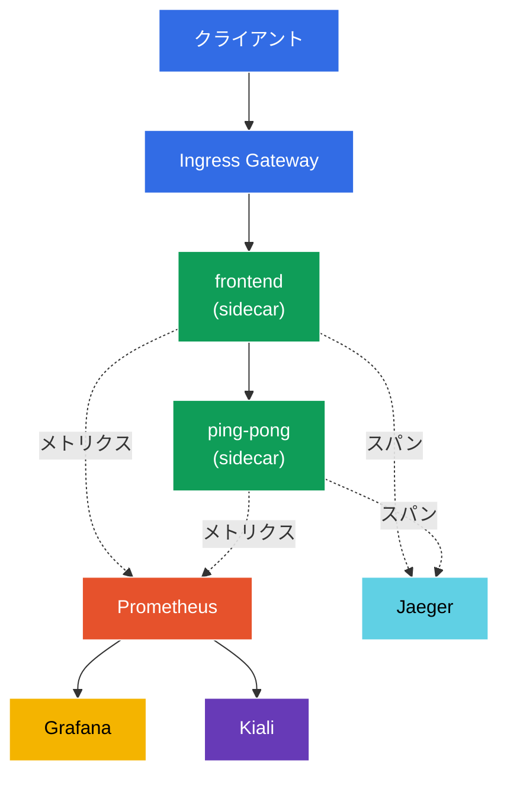

[Русская версия](README_RU.MD) · [Eng version](README.MD) · [Versión en español](README_ES.MD) · [Version française](README_FR.MD) · [Deutsche Version](README_DE.MD) · [ქართული ვერსია](README_GE.MD) · [繁體中文版](README_TW.MD)

# Lab 08 - 可観測性: Prometheus / Jaeger / Kiali

> [リファレンス解答](worker/files/solutions/1_JP.MD)

想像してください。クラスター内で複数のサービスが稼働していて、突然どこかが「遅く」なりました。どこで起きているのでしょうか？どのサービスがどこを呼び出し、エラーはいくつあり、遅延はどのくらいでしょうか？Istio はこのテレメトリーを自動的に収集します（sidecar プロキシがすべてのリクエストを確認します）が、これを確認するにはツールが必要です。
- **Prometheus** - メトリクス（RPS、レスポンスコード、遅延）の収集と保存。
- **Jaeger** - 分散トレーシング: 1つのリクエストがすべてのサービスを通過する経路。
- **Kiali** - mesh の可視化: サービスグラフ、ヘルス、トラフィックフロー。
- **Grafana** - Prometheus メトリクス上のダッシュボード。

このラボでは、このスタックをデプロイし、トラフィックを生成して、アプリケーションコードを一切計装せずに、メトリクス、トレース、サービスグラフが実際に収集されることを確認します。

### 仕組み（全体像）



## 目的

- Istio の可観測性アドオン（Prometheus、Grafana、Jaeger、Kiali）をデプロイする。
- Telemetry API を通じてトレースのサンプリングを 100% に設定する。
- トラフィックを生成し、メトリクス（Prometheus）、トレース（Jaeger）、サービスグラフ（Kiali）を確認する。

> Istio はすでにインストール済み（demo プロファイル）であり、トレーシングはスパンを `zipkin.istio-system:9411` に送信するよう設定されています（この endpoint は Jaeger アドオンが提供します）。

## インフラストラクチャ

環境は Terragrunt 経由で AWS（`eu-central-1`）にデプロイされ、次で構成されています。

| コンポーネント | 説明 |
|------------|---------------------------------------------------|
| `vpc`      | パブリックサブネットを持つ VPC `10.10.0.0/16` |
| `ssh-keys` | ノードへアクセスするための SSH キー |
| `k8s-1`    | Istio（demo プロファイル）がインストールされた Kubernetes `1.35.2`（kubeadm） |
| `worker`   | `kubectl` とクラスターへのアクセスを備えた作業マシン |

インスタンス: `t4g.medium`（master）Ubuntu `22.04`

## デプロイ

```bash
TASK=08 make run_ica_task
```

## ステップ 1. sidecar インジェクションの有効化

```bash
kubectl label namespace default istio-injection=enabled --overwrite
```

すべてのテレメトリーは sidecar プロキシで生成されます。Envoy は各リクエストのメトリクスを計測し、トレーシングスパンを生成します。sidecar がなければ可観測性は得られません。

## ステップ 2. アプリケーションとエントリーポイントのインストール

2層のアプリケーションをデプロイします。`frontend` は各リクエストで `ping-pong` を呼び出します。この呼び出しにより、「2区間」のトレース（frontend → ping-pong）と両サービスのメトリクスが得られます。また、`curl-client` も起動します。これを使用して mesh 内部から Prometheus API を問い合わせます。

```bash
kubectl apply -f https://raw.githubusercontent.com/ViktorUJ/cks/refs/heads/master/tasks/ica/labs/08/k8s-1/scripts/1.yaml
kubectl rollout restart deployment -n default
```

Gateway 経由のエントリーを作成します。

```bash
vim gateway.yaml
```

```yaml
apiVersion: networking.istio.io/v1
kind: Gateway
metadata:
  name: main-gateway
  namespace: default
spec:
  selector:
    istio: ingressgateway
  servers:
  - port:
      number: 80
      name: http
      protocol: HTTP
    hosts:
    - "myapp.local"
---
apiVersion: networking.istio.io/v1
kind: VirtualService
metadata:
  name: frontend-vs
  namespace: default
spec:
  hosts:
  - "myapp.local"
  gateways:
  - main-gateway
  http:
  - route:
    - destination:
        host: frontend
        port:
          number: 8080
```

```bash
kubectl apply -f gateway.yaml
```

## ステップ 3. 可観測性アドオンのインストール

Istio は `samples/addons` にアドオン用の既製マニフェストを提供しています。4つすべてをインストールします。

```bash
REL=release-1.29
kubectl apply -f https://raw.githubusercontent.com/istio/istio/$REL/samples/addons/prometheus.yaml
kubectl apply -f https://raw.githubusercontent.com/istio/istio/$REL/samples/addons/grafana.yaml
kubectl apply -f https://raw.githubusercontent.com/istio/istio/$REL/samples/addons/jaeger.yaml
kubectl apply -f https://raw.githubusercontent.com/istio/istio/$REL/samples/addons/kiali.yaml
```

準備完了を待ちます。

```bash
kubectl get pods -n istio-system | grep -E 'prometheus|grafana|jaeger|kiali'
```

```
grafana-xxxx        1/1   Running
jaeger-xxxx         1/1   Running
kiali-xxxx          1/1   Running
prometheus-xxxx     2/2   Running
```

**インストールされるもの:**
- **prometheus.yaml** - Istio メトリクス（`istio_requests_total`、`istio_request_duration_milliseconds` など）を scrape するよう設定された Prometheus。
- **jaeger.yaml** - Jaeger all-in-one。UI に加え、`istio-system` 内にサービス `zipkin` を起動します（meshConfig がスパンを送信するのはここです）。
- **kiali.yaml** - Prometheus からメトリクスを読み取り、サービスグラフを構築する Kiali。
- **grafana.yaml** - 事前設定済みの Istio ダッシュボードを備えた Grafana。

## ステップ 4. トレーシングの有効化（100% サンプリング）

デフォルトでは、Istio はトレースに送るリクエストを約 1% だけサンプリングします。このラボでは、Istio のインストール時に meshConfig で設定されているプロバイダー `zipkin` を指定して、**Telemetry API** により 100% に設定します。

```bash
vim telemetry.yaml
```

```yaml
apiVersion: telemetry.istio.io/v1
kind: Telemetry
metadata:
  name: mesh-default
  namespace: istio-system   # mesh のルート namespace = mesh 全体に適用される
spec:
  tracing:
  - providers:
    - name: zipkin
    randomSamplingPercentage: 100.0
```

```bash
kubectl apply -f telemetry.yaml
```

**解説:** `selector` のない namespace `istio-system` の `Telemetry` は、mesh 全体のデフォルトポリシーです。`providers.name: zipkin` は、Istio のインストール時に設定された `extensionProvider` を参照します。`randomSamplingPercentage: 100` は、すべてのリクエストがトレースに含まれることを意味します（デモには便利ですが、本番では 1～5% に設定します）。

## ステップ 5. トラフィックを生成する

メトリクスとトレースに表示するデータを用意するため、リクエストを実行します。

```bash
for i in $(seq 50); do curl -s -o /dev/null http://myapp.local:32080; done
```

## ステップ 6. メトリクス（Prometheus）

mesh 内の `curl-client` ポッドから Prometheus HTTP API を使用し、`ping-pong` へのリクエストカウンターを問い合わせます。

```bash
kubectl exec -n default deploy/curl-client -c curl -- \
  curl -s 'http://prometheus.istio-system:9090/api/v1/query?query=istio_requests_total{destination_service_name="ping-pong"}' | jq '.data.result | length'
```

ゼロ以外の結果は、Prometheus が Istio メトリクスを収集していることを意味します。各 `istio_requests_total` 系列には `source_workload`、`destination_workload`、`response_code` などのラベルが付与されます。これらが mesh の「ゴールデンシグナル」です。

ブラウザ用（任意）:

```bash
kubectl -n istio-system port-forward svc/prometheus 9090:9090
# http://localhost:9090 を開く
```

## ステップ 7. トレーシング（Jaeger）

Jaeger がサービスを認識していることを確認します。

```bash
kubectl exec -n default deploy/curl-client -c curl -- \
  curl -s 'http://tracing.istio-system/jaeger/api/services' | jq .
```

リストには `frontend` と `ping-pong` が表示されるはずです。UI でトレースを開くと、各区間の遅延を伴うスパンの連鎖 `ingressgateway → frontend → ping-pong` が見えます。

ブラウザ用（任意）:

```bash
kubectl -n istio-system port-forward svc/tracing 8080:80
# http://localhost:8080/jaeger を開く
```

## ステップ 8. サービスグラフ（Kiali）

Kiali は Prometheus メトリクスに基づいて分かりやすい mesh グラフを構築します。

```bash
kubectl -n istio-system port-forward svc/kiali 20001:20001
# http://localhost:20001  ->  Graph  ->  namespace "default" を開く
```

リアルタイムに RPS、エラー率、遅延が表示された矢印を持つ、`ingressgateway → frontend → ping-pong` のグラフが見えるでしょう。

## まとめ

| ツール | 提供するもの | 確認方法 |
|-----------|----------|---------------|
| Prometheus | メトリクス（RPS、コード、遅延） | API クエリ `istio_requests_total` |
| Jaeger | 分散トレース | サービス一覧 + スパンの連鎖 |
| Kiali | mesh のサービスグラフ | namespace のビジュアルグラフ |
| Grafana | メトリクス上のダッシュボード | 事前設定済み Istio ダッシュボード |

**重要な結論:** Istio はすぐに使える可観測性を提供します。sidecar プロキシはアプリケーションコードを変更せずに、**すべての**リクエストのメトリクスとスパンを自動的にエクスポートします。アドオン（Prometheus/Jaeger/Kiali/Grafana）はこれらのデータを収集・可視化するだけです。Telemetry API により、収集対象を詳細に設定できます（例: トレースのサンプリング率）。