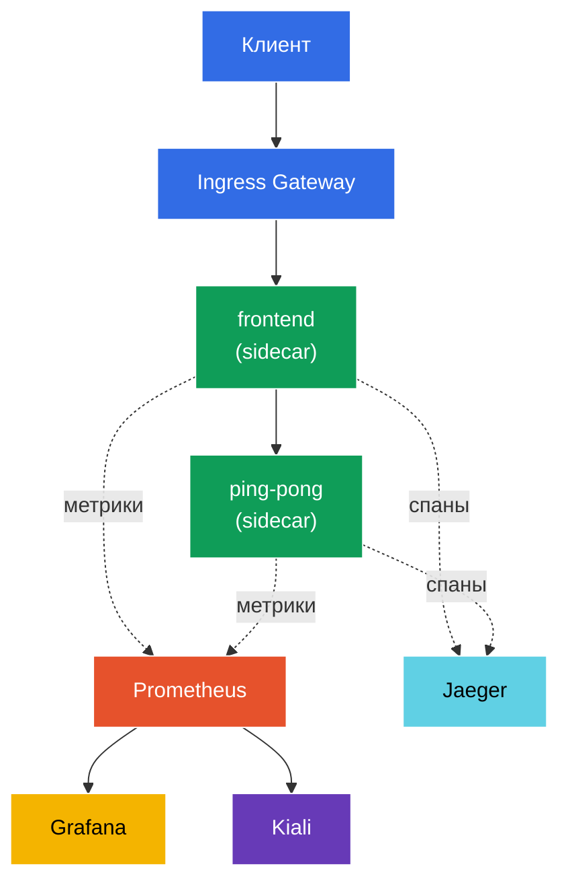

[Eng version](README.MD) · [Versión en español](README_ES.MD) · [Version française](README_FR.MD) · [Deutsche Version](README_DE.MD)

# Lab 08 - Observability: Prometheus / Jaeger / Kiali

Представьте: в кластере крутится несколько сервисов, и вдруг что-то «тормозит». Где именно? Какой сервис кому звонит, сколько ошибок, какая задержка? Istio собирает всю эту телеметрию автоматически (sidecar-прокси видит каждый запрос), но чтобы её увидеть, нужны инструменты:
- **Prometheus** - сбор и хранение метрик (RPS, коды ответов, задержки).
- **Jaeger** - распределённая трассировка: путь одного запроса через все сервисы.
- **Kiali** - визуализация mesh: граф сервисов, здоровье, потоки трафика.
- **Grafana** - дашборды поверх метрик Prometheus.

В этой лабораторной мы развернём этот стек, сгенерируем трафик и убедимся, что метрики, трейсы и граф сервисов реально собираются - без какого-либо инструментирования кода приложения.

### Как это работает (общая схема)



## Цель

- Развернуть аддоны наблюдаемости Istio: Prometheus, Grafana, Jaeger, Kiali.
- Включить 100% сэмплирование трейсов через Telemetry API.
- Сгенерировать трафик и проверить метрики (Prometheus), трейсы (Jaeger) и граф сервисов (Kiali).

> Istio здесь уже установлен (demo-профиль), а трейсинг настроен на отправку спанов в `zipkin.istio-system:9411` (этот endpoint предоставляет аддон Jaeger).

## Шаг 1. Включение sidecar-инъекции

```bash
kubectl label namespace default istio-injection=enabled --overwrite
```

Вся телеметрия рождается в sidecar-прокси: Envoy считает метрики каждого запроса и генерирует спаны трассировки. Без sidecar наблюдаемости не будет.

## Шаг 2. Установка приложения и точки входа

Разворачиваем двухуровневое приложение: `frontend` на каждый запрос вызывает `ping-pong`. Такой вызов даёт «двухзвенный» трейс (frontend → ping-pong) и метрики по обоим сервисам. Также поднимается `curl-client` - с него будем опрашивать API Prometheus изнутри mesh.

```bash
kubectl apply -f https://raw.githubusercontent.com/ViktorUJ/cks/refs/heads/master/tasks/ica/labs/08/k8s-1/scripts/1.yaml
kubectl rollout restart deployment -n default
```

Создаём вход через Gateway:

```bash
vim gateway.yaml
```

```yaml
apiVersion: networking.istio.io/v1
kind: Gateway
metadata:
  name: main-gateway
  namespace: default
spec:
  selector:
    istio: ingressgateway
  servers:
  - port:
      number: 80
      name: http
      protocol: HTTP
    hosts:
    - "myapp.local"
---
apiVersion: networking.istio.io/v1
kind: VirtualService
metadata:
  name: frontend-vs
  namespace: default
spec:
  hosts:
  - "myapp.local"
  gateways:
  - main-gateway
  http:
  - route:
    - destination:
        host: frontend
        port:
          number: 8080
```

```bash
kubectl apply -f gateway.yaml
```

## Шаг 3. Установка аддонов наблюдаемости

Istio поставляет готовые манифесты аддонов в `samples/addons`. Ставим все четыре:

```bash
REL=release-1.29
kubectl apply -f https://raw.githubusercontent.com/istio/istio/$REL/samples/addons/prometheus.yaml
kubectl apply -f https://raw.githubusercontent.com/istio/istio/$REL/samples/addons/grafana.yaml
kubectl apply -f https://raw.githubusercontent.com/istio/istio/$REL/samples/addons/jaeger.yaml
kubectl apply -f https://raw.githubusercontent.com/istio/istio/$REL/samples/addons/kiali.yaml
```

Ждём готовности:

```bash
kubectl get pods -n istio-system | grep -E 'prometheus|grafana|jaeger|kiali'
```

```
grafana-xxxx        1/1   Running
jaeger-xxxx         1/1   Running
kiali-xxxx          1/1   Running
prometheus-xxxx     2/2   Running
```

**Что устанавливается:**
- **prometheus.yaml** - Prometheus, настроенный на scrape метрик Istio (`istio_requests_total`, `istio_request_duration_milliseconds` и др.).
- **jaeger.yaml** - Jaeger all-in-one; помимо UI поднимает сервис `zipkin` в `istio-system` (именно туда meshConfig шлёт спаны).
- **kiali.yaml** - Kiali, который читает метрики из Prometheus и строит граф сервисов.
- **grafana.yaml** - Grafana с преднастроенными дашбордами Istio.

## Шаг 4. Включение трейсинга (100% сэмплирование)

По умолчанию Istio сэмплирует лишь ~1% запросов в трейсы. Для лабы выкрутим на 100% через **Telemetry API**, указав провайдер `zipkin` (он настроен в meshConfig на установке Istio).

```bash
vim telemetry.yaml
```

```yaml
apiVersion: telemetry.istio.io/v1
kind: Telemetry
metadata:
  name: mesh-default
  namespace: istio-system   # в namespace корня mesh = применяется ко всему mesh
spec:
  tracing:
  - providers:
    - name: zipkin
    randomSamplingPercentage: 100.0
```

```bash
kubectl apply -f telemetry.yaml
```

**Разбор:** `Telemetry` в namespace `istio-system` без `selector` - это дефолтная политика для всего mesh. `providers.name: zipkin` ссылается на `extensionProvider`, заданный при установке Istio. `randomSamplingPercentage: 100` означает, что в трейсы попадёт каждый запрос (удобно для демо; в проде ставят 1–5%).

## Шаг 5. Генерируем трафик

Чтобы было что показывать в метриках и трейсах, прогоняем запросы:

```bash
for i in $(seq 50); do curl -s -o /dev/null http://myapp.local:32080; done
```

## Шаг 6. Метрики (Prometheus)

Запрашиваем счётчик запросов к `ping-pong` через HTTP API Prometheus (с пода `curl-client` внутри mesh):

```bash
kubectl exec -n default deploy/curl-client -c curl -- \
  curl -s 'http://prometheus.istio-system:9090/api/v1/query?query=istio_requests_total{destination_service_name="ping-pong"}' | jq '.data.result | length'
```

Ненулевой результат означает, что Prometheus собирает метрики Istio. Каждая серия `istio_requests_total` размечена лейблами `source_workload`, `destination_workload`, `response_code` и т.д. - это и есть «золотые сигналы» mesh.

Для браузера (опционально):

```bash
kubectl -n istio-system port-forward svc/prometheus 9090:9090
# открыть http://localhost:9090
```

## Шаг 7. Трейсинг (Jaeger)

Проверяем, что Jaeger знает о наших сервисах:

```bash
kubectl exec -n default deploy/curl-client -c curl -- \
  curl -s 'http://tracing.istio-system/jaeger/api/services' | jq .
```

В списке должны появиться `frontend` и `ping-pong`. Открыв трейс в UI, вы увидите цепочку спанов `ingressgateway → frontend → ping-pong` с задержкой на каждом участке.

Для браузера (опционально):

```bash
kubectl -n istio-system port-forward svc/tracing 8080:80
# открыть http://localhost:8080/jaeger
```

## Шаг 8. Граф сервисов (Kiali)

Kiali строит наглядный граф mesh поверх метрик Prometheus:

```bash
kubectl -n istio-system port-forward svc/kiali 20001:20001
# открыть http://localhost:20001  ->  Graph  ->  namespace "default"
```

Вы увидите граф `ingressgateway → frontend → ping-pong` со стрелками, на которых отображаются RPS, доля ошибок и задержки в реальном времени.

## Итог

| Инструмент | Что даёт | Как проверили |
|-----------|----------|---------------|
| Prometheus | метрики (RPS, коды, задержки) | API-запрос `istio_requests_total` |
| Jaeger | распределённые трейсы | список сервисов + цепочка спанов |
| Kiali | граф сервисов mesh | визуальный граф namespace |
| Grafana | дашборды поверх метрик | преднастроенные Istio-дашборды |

**Ключевой вывод:** Istio даёт наблюдаемость «из коробки» - sidecar-прокси автоматически экспортирует метрики и спаны для **каждого** запроса, без изменения кода приложения. Аддоны (Prometheus/Jaeger/Kiali/Grafana) лишь собирают и визуализируют эти данные. Telemetry API позволяет тонко настраивать, что именно собирать (например, процент сэмплирования трейсов).
